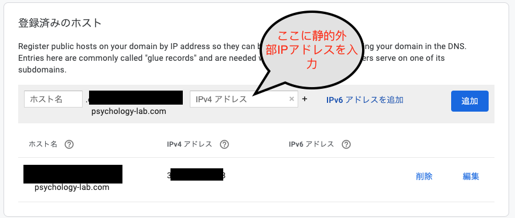
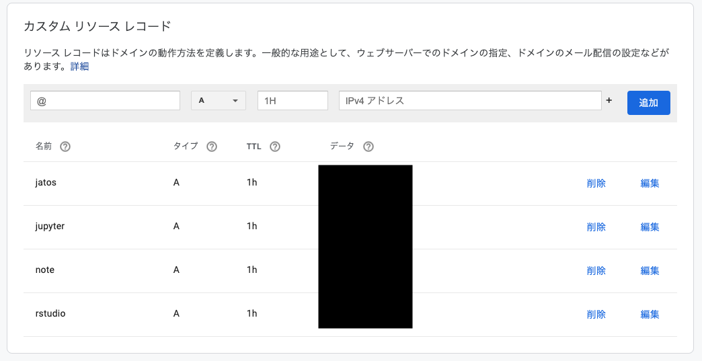

## はじめに

[Docker-composeを使ってGCE上のRstudio serverをHTTPS化する方法](how-to-rstudio-gce-https.html)では，Google Compute Engine上でRocker(RStudio ServerのDocker)をベースにしたDockerでRStudio Serverを使う場合にHTTPS化する方法を解説しています。この場合，１つのサーバーにはRStudio serverしかおけないので，ちょっと不便です。もちろん，手動でいろいろやればできるのですが，毎回だと面倒です。そこで，サブドメインとdocker-composeとtraefikを活用して，一気に複数のサービス(Rstudio, Jupyter notebook, JATOS（ウェブ実験管理）, elabFTW（電子ラボノート）)を1つのサーバーで動かして，HTTPS化してみましょう（１サービス１サーバーだと４つ立ち上げることで負担ですが，これだと１つサーバーで４サーボスが稼働できるので，お得です！）。

なお，国里は，サーバーに関して専門的な教育を受けたことはないので，間違っている部分も多いかと思います（雰囲気で動かしています）。本ページを参考に作業された結果，何らかの問題が生じた場合に，国里は責任を負えません。予めご了承ください（Google Compute Engineを使用すると課金されますので，慎重に作業ください。例えば何度もVMインスタンスを作成し，それを稼働したまま放置していたら，結構な金額になると思います）。また，お詳しい方は，誤りを見つけられましたら，ご指摘いただけましたら幸いです。

## 1. Google Compute Engineを使えるようにする

[公式のドキュメント](https://cloud.google.com/compute/?hl=ja)などを参考にGoogle Compute Engineを使えるように設定します（これは解説資料も多いので省略します）。

## 2. 仮想マシン(VM)の準備

1.名前やマシンの構成は好みで選択してください（マシンの構成によって金額が変わるので，お財布と相談ください）。ブートディスクの設定で変更を押して，Ubuntu 20.04 LTSを選んで，ディスクサイズは30~50GBくらいにしておきます。

2.ファイヤーウォールの設定(「HTTP トラフィックを許可する」と「HTTPS トラフィックを許可する」にチェックをいれる)

※ よく使う仮想マシン構成が決まっている場合は，インスタンステンプレートを使うと便利と思います。

3.VMインスタンスを作成します。勝手に作ったVMが起動します。

4.VMインスタンスは起動している間課金されるので，使わないときは停止しておきます。でも，VMインスタンスは起動のたびに外部IPが変わっちゃうのが困る場合は，[静的外部 IP アドレスの予約](https://cloud.google.com/compute/docs/ip-addresses/reserve-static-external-ip-address?hl=ja)をします（常時起動している場合は，気にしなくても良いと思います）。

5.このまま稼働させると，sshdに攻撃がされます（結構頻繁にアタックされます・・・(;´Д`;)）。SSHポート番号を変更しておきます。ちょっとややこしいですが，以下の手順でSSHポートは変更できます。

- GCPの「VPCネットワーク」→「ファイヤーウォールルール」で「ファイアウォール ルールの作成」を押して新しいSSHポートを設定します。名前やターゲットタグは好きな名前にしてください（私は適当に"ssh-allow-port"って名前にしています）。優先度は```1000```にして，トラフィックの方向は上り，一致した時のアクションは許可，ソースのIP範囲は， ```0.0.0.0/0``` とします。プロトコルは```tcp```でポートに好きなポート番号を入れます。
- 設定した新しいファイアウォールルールを適用するため，VMインスタンスをクリックして，「編集」ボタンを押して，ネットワークタグに上記で決めたターゲットタグを入れて保存します。
- 通常のSSH接続(22portを使用)をします（「Compute Engine」の「VMインスタンス」の当該VMインスタンスの右端にある「SSH」をクリックします）。
- コンソールっぽい画面が出てきたら，以下のコマンドを打って，vimでsshdの設定ファイルを開きます。

```
sudo vim /etc/ssh/sshd_config
```

- バンっと画面に文字が出てきてビビるかもしれませんが，落ち着いて，```# Port 22```を探して，```i```をタイプします（文字が挿入できるようになります）。#をはずして，22の代わりに自分が使いたいポート番号を入れます(```Port 自分の使いたい番号```)。入力ができたら，escキーをタイプしてから，```:wq```とタイプします（保存されます）。

- sshdの設定を反映させるために，以下のコマンドで再起動させます。

```
sudo systemctl restart sshd
```
- ここで今22番portで開いた画面はそのままにして（閉じない），VMインスタンスの右端にある「SSH」の下矢印を押して，「ブラウザウィンドウでカスタムポートを開く」をクリックします。入力欄が出てくるので，そこに先程設定した新しいSSHのポートを入力して開きます。

- 新しいSSHのポートでも開けたら，22番portを閉じます。もう一度，「VPCネットワーク」→「ファイヤーウォールルール」で「ファイアウォール ルールの作成」を押します。名前やターゲットタグは好きな名前にしてください（私は適当に"disallow-ssh22"って名前にしています)。優先度は```1000```にして，トラフィックの方向は上り，一致した時のアクションは```拒否```，ソースのIP範囲は， ```0.0.0.0/0``` とします。プロトコルは```tcp```でポートは```22```にします。

- VMインスタンスをクリックして，「編集」を押し，ネットワークタグに上記で決めたターゲットタグを入れて保存します(これで，httpのタグ，httpsのタグ，新しいsshポートのタグ，22番ポートを閉じるタグの４つがあると思います)。

- 通常のSSH接続(22番ポート)をしても接続できず，「ブラウザウィンドウでカスタムポートを開く」で自分で設定したSSHポートを使って接続できたら成功です。

- ちなみに，SSH接続後に以下を入力するとアクセス状況を見れます（```f```で次の画面に進んで，```q```で閉じます）。

```
sudo less /var/log/auth.log
```

## 3. ドメイン名の入手

色々とサービスがありますが，私は[GoogleのDomainサービス](https://domains.google/)を使いました。少々お金はかかりますが（私の場合は年1400円でした）以下で必要になるます。ドメイン名はお好きなものを設定ください。ドメイン名が入手できたら，以下のように静的外部IPを使ってDNSの登録をします。



次に，サブドメインの設定をします。例えば，私がyoshihiko-kunisato-lab.comって名前のドメインを取得したら，その前に任意の文字を追加してサブドメインとして使えます。例えば，rstudio.yoshihiko-kunisato-lab.comって感じです。それをカスタムリソースレコード（Google domainの場合は）で設定します。＠のところに，rstudioって打ち込んで，IPv4アドレスってところに，上記の静的外部IPをいれて追加します。jupyter, note, jatosも同様に追加します。




## 4. 仮想マシン(VM)にDockerをインストール

Compute EngineのページのVMインスタンスをみると先程設定したVMインスタンスがあると思います。こちらが起動していると接続というところの「SSH」がクリック可能になっていると思います。SSHをクリックしてください。すると，別ウィンドウが起動して，ターミナルが出現します。そこで，[こちら](https://docs.docker.com/install/linux/docker-ce/ubuntu/)を参考に以下を打ち込んでDockerをインストールします。途中何か聞かれると思いますが，質問に従って，Yなどの返事をタイプください。

```
sudo apt update
```

```
sudo apt install \
    apt-transport-https \
    ca-certificates \
    curl \
    gnupg-agent \
    software-properties-common
```

```
curl -fsSL https://download.docker.com/linux/ubuntu/gpg | sudo apt-key add -
```

```
sudo apt-key fingerprint 0EBFCD88
```

```
sudo add-apt-repository \
   "deb [arch=amd64] https://download.docker.com/linux/ubuntu \
   $(lsb_release -cs) \
   stable"
```

```
sudo apt install docker-ce docker-ce-cli containerd.io
```

## 5. docker-composeをインストール

続けて，[こちら](https://docs.docker.com/compose/install/)を参考にして，Docker-composeもインストールします。

```
sudo curl -L "https://github.com/docker/compose/releases/download/1.24.0-rc1/docker-compose-$(uname -s)-$(uname -m)" -o /usr/local/bin/docker-compose

sudo chmod +x /usr/local/bin/docker-compose

sudo ln -s /usr/local/bin/docker-compose /usr/bin/docker-compose
```

これで，Dockerを動かす準備ができました。

## 6. docker-compose用YMLの準備

DockerやDocker-composeについては解説をしませんので，[さくらナレッジのDocker入門](https://knowledge.sakura.ad.jp/13265/)や[「Docker/Kubernetes 実践コンテナ開発入門」](https://www.amazon.co.jp/dp/4297100339/ref=cm_sw_r_tw_dp_U_x_HunBDbSJ25G3S)などで別途学習をされると良いかと思います。今回は，docker-composeを使います。これは，複数のDockerを使う場合に，それらの構成をyamlで定義して，それを元にしてDockerを用意するサービスです。以下では，Https化を実現するリバースプロキシ＆ロードバランサ用[Traefik](https://containo.us/traefik/)の導入と４つのサービスス(Rstudio, Jupyter notebook, JATOS, elabFTW)の導入に分けて説明をします（これは同時にやれますが，Traefikを単独で立ち上げて，あとからサービスの追加・削除ができたほうが便利なので分けています）。

### Traefikの用意

まず，以下をターミナルで実行します。１行目でdocker-composeで使うサーバー外につながるネットワークを用意します。２〜３行目でtraefik用フォルダと設定ファイルを作成します。４行目で，あとで，SSL暗号化の内容を書込み可能なように設定します。

```
sudo docker network create proxy
sudo mkdir -p /opt/traefik
sudo touch /opt/traefik/{traefik.toml,docker-compose.yml,acme.json}
sudo chmod 0600 /opt/traefik/acme.json
```

traefik用のdocker-composeファイルを設定します。以下のコマンドをターミナルに打ち込みます。なんか画面が出てきますが，ほぼ空欄になっていると思います。

```
sudo vim /opt/traefik/docker-compose.yml
```

そこで，以下をコピペして貼り付けします。それから，escキーをタイプしてから，```:wq```とタイプします（保存されます）。

```
version: '2'

networks:
  proxy:
    external: true
  internal:
    external: false

services:
  traefik:
    image: traefik:v1.7.30
    command: --docker
    ports:
      - 80:80
      - 443:443
    networks:
      - proxy
    volumes:
      - /var/run/docker.sock:/var/run/docker.sock
      - /opt/traefik/traefik.toml:/traefik.toml
      - /opt/traefik/acme.json:/acme.json
    container_name: traefik
    restart: always
```


次にtraefik用のtomlファイルを設定します。以下のコマンドをターミナルに打ち込みます。なんか画面が出てきますが，ほぼ空欄になっていると思います。

```
sudo vim /opt/traefik/traefik.toml
```

そこで，以下の内容を一部改変して，コピペして貼り付けします（改変はご自身のエディタですると楽かなと思います）。改変は，(1)[docker]ってところのdomainをご自身のドメイン名に変更する(上記の例だとyoshihiko-kunisato-lab.comです)，(2)[acme]ってところのemailをご自身のメールアドレスにしてください。改変した内容をコピペできたら，escキーをタイプして，```:wq```とタイプします（保存されます）。

```
defaultEntryPoints = ["https","http"]

[entryPoints]
  [entryPoints.http]
  address = ":80"
    [entryPoints.http.redirect]
    entryPoint = "https"
  [entryPoints.https]
  address = ":443"
  [entryPoints.https.tls]

[retry]

[docker]
endpoint = "unix:///var/run/docker.sock"
domain = "ドメイン名"
watch = true
exposedByDefault = false

[acme]
  email = "メールアドレス"
  entryPoint = "https"
  storage = "acme.json"
  caServer = "https://acme-v02.api.letsencrypt.org/directory"
  onHostRule = true
  [acme.httpChallenge]
  entryPoint = "http"
```

では，設定した内容を元にして，traefikを起動してみます。docker-compose upをするわけですが，設定ファイルを/opt/traefik/においていますので，以下のようにします。しばらくして，doneって出てきたら成功です。

```
sudo docker-compose -f /opt/traefik/docker-compose.yml up -d
```

### サーバー上で稼働させる４サービスの用意


では，rstuio, jupyter notebook, JATOS, elabFTWの準備をしてきましょう。上記で設定したproxyという名前のネットワークを使って，traefikと各種サービスをつなげていきます。サーバーの外からHTTPS接続でtraefik経由でやりとりをします。traefikの便利なところは，上の方のやり方でtraefikを設定しておくと，後からサーバー上で動かすサービスの追加と削除ができることです。今回は，以下の４つのサービスを稼働させます。

- [RとRstudio](https://hub.docker.com/r/ykunisato/paper-r): 国里がカスタマイズしたR用コンテナを使います。
- [Jupyter notebook](https://hub.docker.com/r/ykunisato/ccp-lab-j):国里がカスタマイズしたjupyter notebookのコンテナを使います。
- [JATOS](https://hub.docker.com/r/jatos/jatos): JATOSの公式コンテナを使います。
- [elabFTW](https://hub.docker.com/r/elabftw/elabimg)：elabFTWの公式コンテナを使います。

なお，４つのサービスを一気に稼働させることもできます。しかし，多くの場合，「Rstudioだけメンテナンスしたい」，「JATOSだけストップしたい」など，それぞれのサービスを個別に動かしたり，修正したいことが多いです。そこで，以下では，それぞれ稼働させることにします。同じような作業を４回することになり少し手間ですが，メンテナンスは楽になります。

### R Studioの用意

まず，ホームディレクトリ内にdocker-compose.ymlを入れるdir_docker_composeディレクトリとさらにその中にrstudioディレクトリを作ります。そして，その中にvimでrstudio用のdocker-compose.ymlを作ります。以下のコマンドを実行ください。

```
sudo mkdir -p dir_docker_compose/rstudio
sudo vim dir_docker_compose/rstudio/docker-compose.yml
```

vimで開いたdocker-compose.ymlに，以下を変更したその下のコードを貼り付けてください。改変した内容をコピペできたら，escキーをタイプして，```:wq```とタイプします（保存されます）。

- traefik.frontend.ruleのドメイン名を自分のものに変更する。
- rstudioのユーザーIDとパスワードを変更する。
- volumesの左側の./rstudioは，.のところをGCP上でpwdをした時にでてくるカレントディレクトにする必要があるかもしれません。


```
version: '3'

networks:
  proxy:
    external: true
  internal:
    external: false
  
services:
  rstudio:
    image: ykunisato/paper-r:latest
    networks:
      - proxy
    container_name: rstudio
    restart: always
    environment:
      - USER=ユーザー名
      - PASSWORD=パスワード
    volumes:
      - ./rstudio:/home/rstudio
    labels:
      - traefik.docker.network=proxy
      - traefik.enable=true
      - traefik.frontend.rule=Host:rstudio.ドメイン名
      - traefik.port=8787
      - traefik.protocol=http
```

以下を実行して，用意したコンテナを起動します。イメージのダウンロードなどにしばらく時間がかかります。doneとでてきたら，終了です。

```
sudo docker-compose -f dir_docker_compose/rstudio/docker-compose.yml up -d

```

### Jupyter notebookの用意

まず，ホームディレクトリ内のdir_docker_compose内にjupyterディレクトリを作ります。そして，その中にvimでjupyter用のdocker-compose.ymlを作ります。以下のコマンドを実行ください。

```
sudo mkdir dir_docker_compose/jupyter
sudo vim dir_docker_compose/jupyter/docker-compose.yml
```

vimで開いたdocker-compose.ymlに，以下を変更したその下のコードを貼り付けてください。改変した内容をコピペできたら，escキーをタイプして，```:wq```とタイプします（保存されます）。

- traefik.frontend.ruleのドメイン名を自分のものに変更する。
- jupyterのパスワードを変更する。
- volumesの左側の./jupyterは，.のところをGCP上でpwdをした時にでてくるカレントディレクトにする必要があるかもしれません。

```
version: '3'

networks:
  proxy:
    external: true
  internal:
    external: false

services:
  jupyter:
    image: ykunisato/ccp-lab-j:latest
    networks:
      - proxy
    container_name: jupyter
    restart: always
    environment:
      - JUPYTER_ENABLE_LAB=yes
    volumes:
      - ./jupyter:/home/jovyan/work
    command: start-notebook.sh --NotebookApp.token='パスワード'
    labels:
      - traefik.docker.network=proxy
      - traefik.enable=true
      - traefik.frontend.rule=Host:jupyter.ドメイン名
      - traefik.port=8888
      - traefik.protocol=http
```

以下を実行して，用意したコンテナを起動します。イメージのダウンロードなどにしばらく時間がかかります。doneとでてきたら，終了です。

```
sudo docker-compose -f dir_docker_compose/jupyter/docker-compose.yml up -d

```

### JATOSの用意

まず，ホームディレクトリ内のdir_docker_compose内にjatosディレクトリを作ります。そして，その中にvimでjatos用のdocker-compose.ymlを作ります。以下のコマンドを実行ください。

```
sudo mkdir dir_docker_compose/jatos
sudo vim dir_docker_compose/jatos/docker-compose.yml
```

vimで開いたdocker-compose.ymlに，以下を変更したその下のコードを貼り付けてください。改変した内容をコピペできたら，escキーをタイプして，```:wq```とタイプします（保存されます）。

- traefik.frontend.ruleのドメイン名を自分のものに変更する。


```
version: '3'

networks:
  proxy:
    external: true
  internal:
    external: false

services:
  jatos:
    image: jatos/jatos:latest
    networks:
      - internal
      - proxy
    container_name: jatos
    restart: always
    labels:
      - traefik.docker.network=proxy
      - traefik.enable=true
      - traefik.frontend.rule=Host:jatos.ドメイン名
      - traefik.port=9000
      - traefik.protocol=http
```

以下を実行して，用意したコンテナを起動します。イメージのダウンロードなどにしばらく時間がかかります。doneとでてきたら，終了です。

```
sudo docker-compose -f dir_docker_compose/jatos/docker-compose.yml up -d

```

### elabFTWの用意

まず，ホームディレクトリ内のdir_docker_compose内にelabftwディレクトリを作ります。そして，その中にvimでelabftw用のdocker-compose.ymlを作ります。以下のコマンドを実行ください。

```
sudo mkdir dir_docker_compose/elabftw
sudo vim dir_docker_compose/elabftw/docker-compose.yml
```

vimで開いたdocker-compose.ymlに，以下を変更したその下のコードを貼り付けてください。改変した内容をコピペできたら，escキーをタイプして，```:wq```とタイプします（保存されます）。

- traefik.frontend.ruleのドメイン名を自分のものに変更する。
- elabftwのDB_PASSWORDとSECRET_KEYを変更する。
- mysqlのMYSQL_ROOT_PASSWORDとMYSQL_PASSWORDを変更する（MYSQL_PASSWORDとDB_PASSWORDは一致させる）。
- volumesの左側の./elabftw/uploadsと./elabftw/mysqlは，.のところをGCP上でpwdをした時にでてくるカレントディレクトにする必要があるかもしれません。

なお，elabftwとmysqlのDB_PASSWORD，SECRET_KEY，MYSQL_ROOT_PASSWORD，MYSQL_PASSWORDの設定は，```curl -sL -o docker-compose.yml "https://get.elabftw.net/?config"```をローカルのターミナルで実行すると自動で設定したものが得られます（自動だと嫌な場合はご自身で設定ようにと記載されていました）。

```
version: '3'

networks:
  proxy:
    external: true
  internal:
    external: false

services:
  elabftw:
    image: elabftw/elabimg:latest
    networks:
      - proxy
      - internal
    container_name: elabftw
    restart: always
    cap_drop:
      - SYS_ADMIN
      - AUDIT_WRITE
      - MKNOD
      - SYS_CHROOT
      - SETFCAP
      - NET_RAW
      - SYS_PTRACE
    environment:
      - DB_HOST=mysql
      - DB_PORT=3306
      - DB_NAME=elabftw
      - DB_USER=elabftw
      - DB_PASSWORD=パスワード（DB)
      - SECRET_KEY=シークレットキー
      - SERVER_NAME=localhost
      - DISABLE_HTTPS=true
      - ENABLE_LETSENCRYPT=false
      - MAX_PHP_MEMORY=256M
      - MAX_UPLOAD_SIZE=100M
      - PHP_TIMEZONE=Asia/Tokyo
      - TZ=Asia/Tokyo
      - SET_REAL_IP=false
      - PHP_MAX_CHILDREN=50
      - PHP_MAX_EXECUTION_TIME=120
      - USE_REDIS=false
      - ENABLE_IPV6=false
    volumes:
      - ./elabftw/uploads:/elabftw/uploads
    labels:
      - traefik.docker.network=proxy
      - traefik.enable=true
      - traefik.frontend.rule=Host:note.ドメイン名
      - traefik.port=443
      - traefik.protocol=http

  mysql:
    image: mysql:5.7
    networks:
      - proxy
      - internal
    container_name: mysql
    restart: always
    cap_drop:
      - AUDIT_WRITE
      - MKNOD
      - SYS_CHROOT
      - SETFCAP
      - NET_RAW
    environment:
      - MYSQL_ROOT_PASSWORD=パスワード(root)
      - MYSQL_DATABASE=elabftw
      - MYSQL_USER=elabftw
      - MYSQL_PASSWORD=パスワード（DB)
      - TZ=Asia/Tokyo
    volumes:
      - ./elabftw/mysql:/var/lib/mysql
    labels:
      - traefik.port=3306
```

以下を実行して，用意したコンテナを起動します。イメージのダウンロードなどにしばらく時間がかかります。doneとでてきたら，終了です。

```
sudo docker-compose -f dir_docker_compose/elabftw/docker-compose.yml up -d

```

最後に，elbFTWを起動します（これをしないとelabFTWは動きません）。

```
sudo docker exec -it elabftw bin/install start
```


### 動作確認

ブラウザに以下のURLを打ち込んでいって，動作確認をします。jatosはIDがadmin，パスワードがadminになっているので，ログインできたらすぐにadminのパスワードを変更ください。note(elabFTW)は，最初にログインしたユーザーがアドミンになるので，動作確認と同時に登録をなさってください。

- https://jatos.ドメイン名
- https://note.ドメイン名
- https://rstudio.ドメイン名
- https://jupyter.ドメイン名

## Tips: Rstudioのユーザー追加

docker-compose.ymlで設定した以外のユーザーを追加する場合は，VMインスタンスにSSH接続した上で，Dockerコンテナに接続してユーザーアカウントを作ります。まず，以下のコマンドで，Dockerコンテナにssh接続します。

```
sudo docker exec -it rstudio bash
```
次に，以下のコマンドで新規ユーザー登録します。パスワードを聞かれるので打ち込んで，あとはエンターキーやYをタイプします。

```
sudo adduser 新規ユーザー名
```

このままだと，各ユーザーが自由にRパッケージをいれられないので，以下のコマンドで，ユーザーをstaffグループにします。

```
sudo usermod -a -G staff ユーザー名
```

なお，root権限で全てのユーザーにRパッケージをいれたい場合は，Dockerコンテナに接続した状態で，以下のコマンドでRを起動してパッケージをインストールすれば，全ユーザーに当該パッケージがインストールされます。

```
sudo R
```

終わったら，以下を打ち込んで，Dockerコンテナへの接続をやめます。

```
exit
```

もし，ユーザーをそのユーザーのフォルダごと削除したくなったら，以下を打ち込みます。
```
userdel -r ユーザ名
```

### ユーザーの一括追加

上記の方法でもユーザーは追加できますが，人数が多くなると途方にくれてしまいます。そこで，以下ではnewusersを使った一括登録をします。まずは，以下のような感じの情報を表計算ソフトにいれます。ユーザーごとに変更が必要なのは，ユーザー名，ユーザーID（1001から連番にするので良いと思います），パスワード，ホームディレクトリ名（home/rstudioの下にユーザー名をいれる）です。残りの，グループID（50）, フルネーム（空白），ログインシェル（/bin/sh)は全員同じで問題ありません。

|ユーザー名|パスワード|	ユーザーID|	グループID|	フルネーム|	ホームディレクトリ|	ログインシェル|
|---|---|---|---|---|---|---|
|ユーザー1|	ユーザー1のパスワード|	1001|	50|	|	/home/rstudio/ユーザー1|	/bin/sh|
|ユーザー2|	ユーザー2のパスワード|	1002|	50|	|	/home/rstudio/ユーザー2|	/bin/sh|
|ユーザー3|	ユーザー3のパスワード|	1003|	50|	|	/home/rstudio/ユーザー3|	/bin/sh|

なお，上記の情報は，区切りに:を使って保存します。つまりuser1については，ユーザー1:ユーザー1のパスワード:1001:50::/home/rstudio/ユーザー1:/bin/shになります。この作業はいろいろな方法ができますが，上記の情報を表計算ソフトにいれて，それをcsvファイルで出力して，テキストエディタで開いて，カンマを:に変換して，一番上のヘッダー情報は削除して，最後に.txtの拡張子で保存するのが楽じゃないかなと思います。そのファイル名は，user.txtとしておきます（なんでもいいです）。

user.txtが作成できたら，VMにSSH接続して，user.txtをアップロードします（ウィンドウの右上の設定っぽいボタンをクリックするとアップロードの選択肢がでてきます）。アップロードしたuser.txtをrstudioのフォルダに一時的に移動します。

```
sudo mv user.txt rstudio
```

rsutdioのコンテナに入ります。

```
sudo docker exec -it rstudio bash
```

以下を実行して，一括でユーザー登録します。これで終わりです。
```
newusers /home/rstudio/user.txt
```

一応,user.txtを削除してから，コンテナから出ます。

```
rm /home/rstudio/user.txt
exit
```

## バックアップ

各コンテナのフォルダを圧縮して，Google Storageに保存する（gsutilの導入が必要です）。

```
sudo tar czf backup.tar.gz rstudio jatos jupyter elabftw
sudo gsutil cp ./backup.tar.gz gs://バケット名/`TZ=Asia/Tokyo date "+%Y_%m%d_%H%M_%S"`/
sudo rm backup.tar.gz
```

