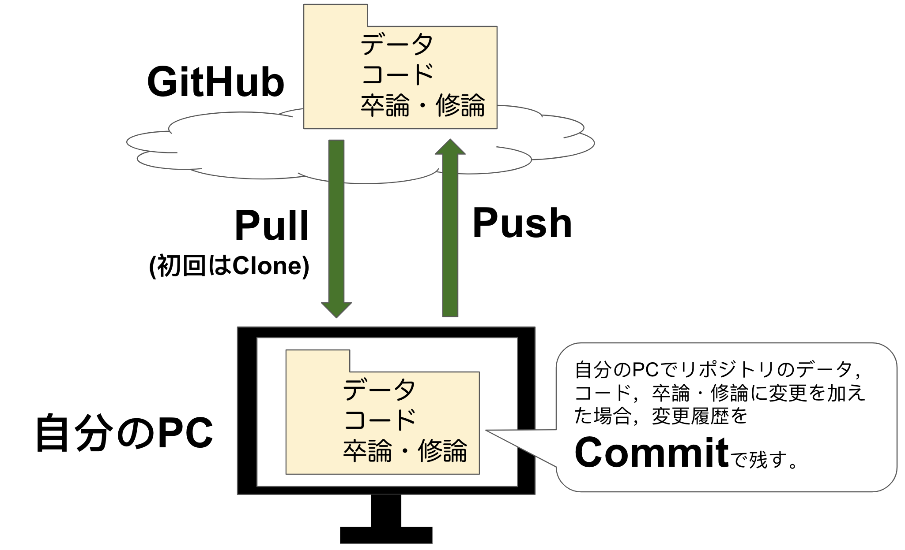
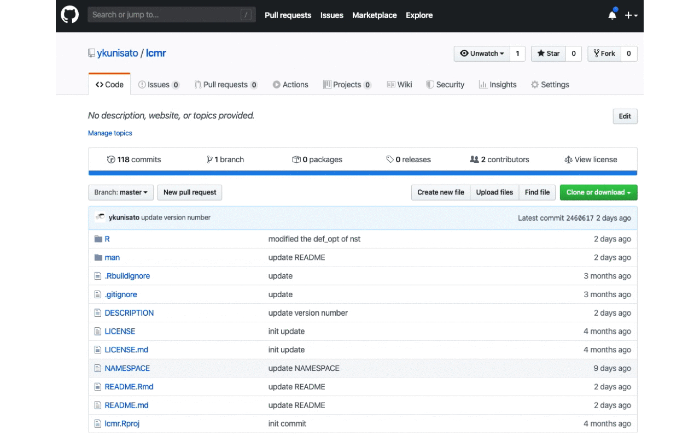
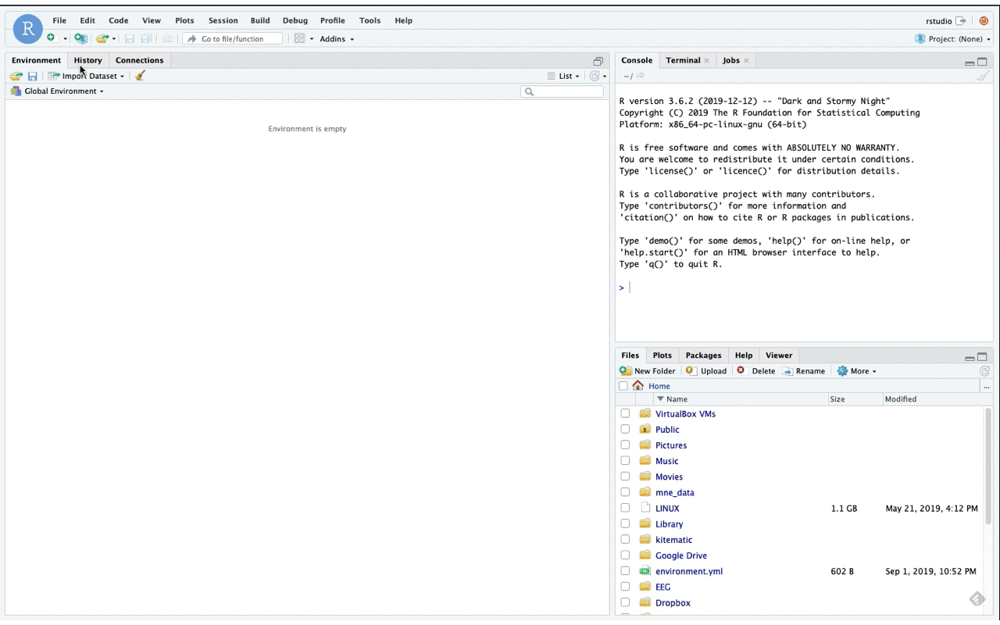
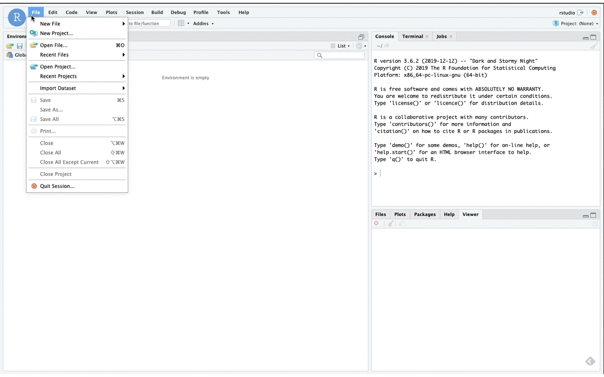
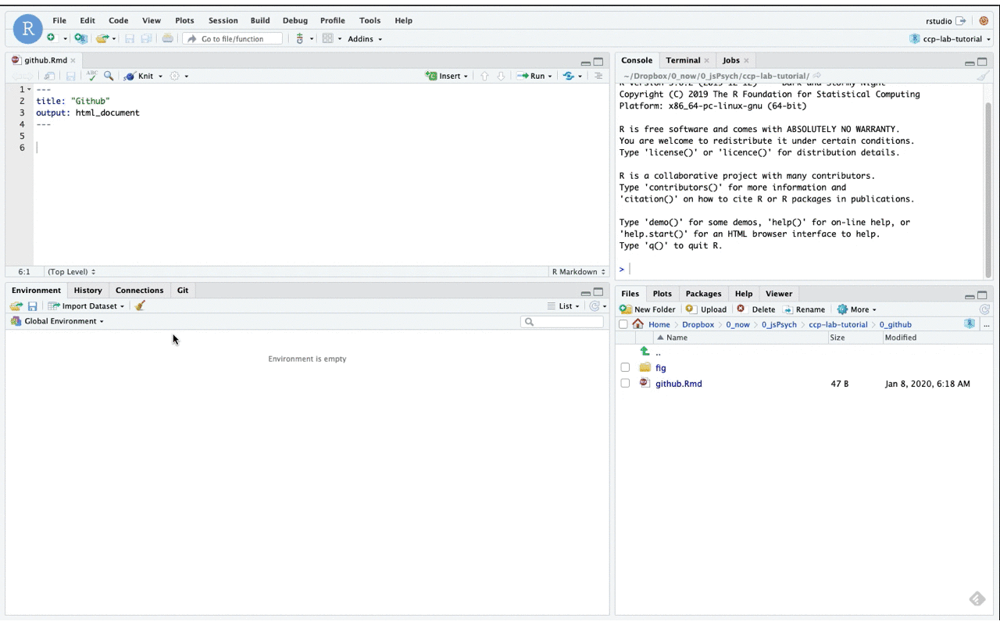
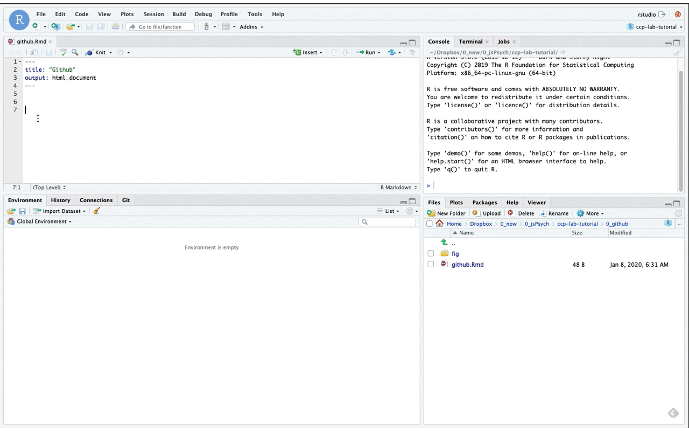
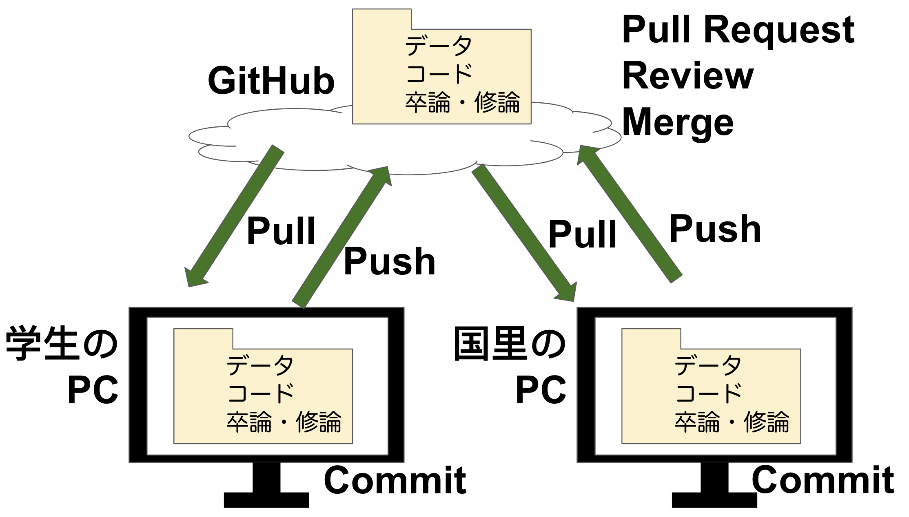

## ゼミでのGitHubの活用

本ゼミでは，GitHubを活用して，以下のことを行います。

- ゼミでの論文報告（「こんな面白い論文読んだよ！」の報告）
- ゼミでの研究進捗報告（「先週からこんなことしたよ！」や「何もせんかったよ！」の報告）
- ゼミでの研究プロジェクト管理（卒論や修論が全体のどこまで進んだか確認する）
- ゼミでの演習課題（jsPsychから認知モデリングなどのゼミの演習課題は各自のGitHubリポジトリで管理する）
- 卒論や修論での実験・調査の準備（jsPsychのプログラミング）
- 卒論や修論でのデータ解析（Rを使う）
- 卒論や修論の執筆とレビュー（R Markdownで執筆，GitHub上で国里がレビューする）

「わお，わけわからん」と思ったかもしれませんが，データ収集以外のゼミでの活動は，ほぼGitHubを介して行われます（データ収集はjsPsychで作ったプログラムを国里のサーバーにアップして収集します）。

以下では，RStudioで使用する上で最低限のGitHubの知識について説明をします。より詳細は，Shinya Uryuさんの[「RStudioではじめるGitによるバージョン管理」](https://qiita.com/uri/items/6b94609f156173ed43ed)や静岡理工科大学の紀ノ定保礼さんの以下のslide shareを参照ください。

<iframe src="//www.slideshare.net/slideshow/embed_code/key/ifIG31dbS7Fbeu?startSlide=55" width="595" height="485" frameborder="0" marginwidth="0" marginheight="0" scrolling="no" style="border:1px solid #CCC; border-width:1px; margin-bottom:5px; max-width: 100%;" allowfullscreen> </iframe> 
 <strong> <a href="//www.slideshare.net/nocchi_airport/r-markdown-111322653" title="R Markdownによるドキュメント生成と バージョン管理入門" target="_blank">R Markdownによるドキュメント生成と バージョン管理入門</a> </strong> from <strong><a href="//www.slideshare.net/nocchi_airport" target="_blank">nocchi_airport</a></strong> 

 
 

## GitHubアカウントの作成

GoogleでGitHubと検索するか，以下のリンクをクリックください。そして，Sign Upしてください。その際に，大学から発行された心理学科のメールアドレスを登録ください（大学のメールアドレスを使えば，教育機関向けの割引が使えます。詳細は[こちら](https://help.github.com/ja/github/teaching-and-learning-with-github-education/about-github-education-for-students)）。

 

### [GitHub](https://github.com/)

 
 

 
 
 

## ざっくりとGitHubの仕組みを知ろう！

ざっくりGitHubについて説明をすると以下のようになります。

まず，クラウド上にGitHubのリポジトリがあって，それとみなさんの手元のPCとでファイルのやり取りするのをイメージしてください。

GitHubのリポジトリには，コード，データ（もちろん，GitHubなどにアップする同意を得た匿名化処理済みのデータです），卒論・修論のファイルを置きます（最初は各自の作成したファイルはないので国里の用意したテンプレートファイルがあります）。

まず，みなさんは，GitHubリポジトリからPull(初回時はClone)して，自分のPC上にリポジトリのファイルを落とします（簡単に言えばダウンロード）。

そのPullしたファイルに加筆修正したり，ファイルを追加したりします（解析したり，論文を執筆したりなどの作業です）。ファイルに変更を加えたら，こまめにCommitをして変更履歴を残します（大きめは変更を加えたらかならずCommitする）。

Commitで記録を残した履歴はみなさんのPCに残っているだけなので，これをPushしてGitHubのリポジトリに反映させます。これで１サイクルが終了です。

日々の研究活動では，GitHubリポジトリからPullして自分のPCを最新の状態にして，作業したらその都度Commitし，Pushしてリポジトリも最新の状態に保つというサイクルを回していくことになります。

なんだか面倒だなあという気もするかもしれませんが，変更履歴を残すことは透明性の高い研究をすすめる上での重要ですし，色々と作業をしたけど前の状態に戻したいときにも便利です。さらに，共同作業をする場合にもGitHubはとても有用です。

 
 
 

それでは，RStudioでの利用方法を説明していきます。

## すでにあるGitHubリポジトリを自分の手元にもってくる

すでにあるGitHubリポジトリを自分の手元にもってくる場合は，Cloneをします（一度Cloneしたら，その後は，Pullになります）。Cloneは以下のように，GitHubリポジトリにいって（ゼミ生は，国里が各自の卒論・修論用リポジトリを用意しています），左側の"Clone or Download"のボタンから，Git用のURLをコピーします。

 
 
 

そして，以下のようにRStudio上でFile → New Project→Version Control→Gitと進んで，コピーしたURLと保存するフォルダの設定します。これで，Clone完了です。

 
 
 

一度，GitHubのプロジェクトを作っておくと，RStudioはそれを記憶しているので，以下のようにFile→Recent Projetsで作成したプロジェクトが出てくるので，それをクリックすれば，GitHubプロジェクトが開けます。

RStudioのプロジェクトは，解析などで使うファイルやフォルダをひとまとめにしてくれるものです（今回の場合は，GitHubリポジトリがプロジェクトになります）。RStudioを使う場合は，必ずプロジェクトファイルを作りましょう。

 
 
 

さて，Cloneができると最初の準備は終わりです。以降では，毎回，プロジェクトを開いたら，Pullで自分のPCのファイルを最新にして，作業したらCommmitで変更履歴を残して，PushでGitHubリポジトリも最新にしておきましょう。

## Pullで手元のPCのファイルを最新の状態にする

以下のように，Git→Pullをクリックすれば，自動的に差分を計算して，手元のPCのファイルを最新にしてくれます。

 
 
 

## 変更履歴をCommitで記録する

ファイルを変更したら，こまめにCommitをしましょう。Git→Commitをクリックして，開いたウインドウでファイルを選択したら，かならずCommit messageを記入しましょう。ずCommit messageにはあとでわかりやすいように行った変更のメモをしておきます（例えば，「方法の参加者を加筆」とか「相関分析を追加」とか）。Commitできたら，Pushをします。Commitはこまめにしますが，Pushはある程度まとめて問題はありません（とはいえ，その日の作業の終わりにはかならずPushしてください）。

 
 
 

## 共同作業としてのGitHub

RStudioでGitHubを活用する上で，最低限の知識を説明してきました。GitHubは1人で使っても便利なものですが，その真価は共同作業において発揮します。例えば，卒論・修論では，指導教員からチェックを受けると思いますが，そのチェックをする際に，指導教員が学生のリポジトリを実際に操作して確認することもできます。そして，もし指導教員がなんらかの変更を加えた場合は，GitHub上でその変更を統合することになります。このようなやりとりをGitHubでは簡単にできます（Mergeを使う）。さらに，卒論・修論のチェック時期になれば，GitHub上に卒論・修論のRMarkdownファイルをおいてけば，それを指導教員がReviewして，コメントをつけ，それをもとに修正・加筆をするなどもできます。

上記のように，GitHubは便利なツールなのでゼミで活用しますが，それ以上に，今後の社会において専門性をもった者が共同作業をするということが今以上に求められるようになります。その際の，基礎となるスキルや考え方として，GitHubに馴染んでおくことは決して無駄にはならないかと思います。

