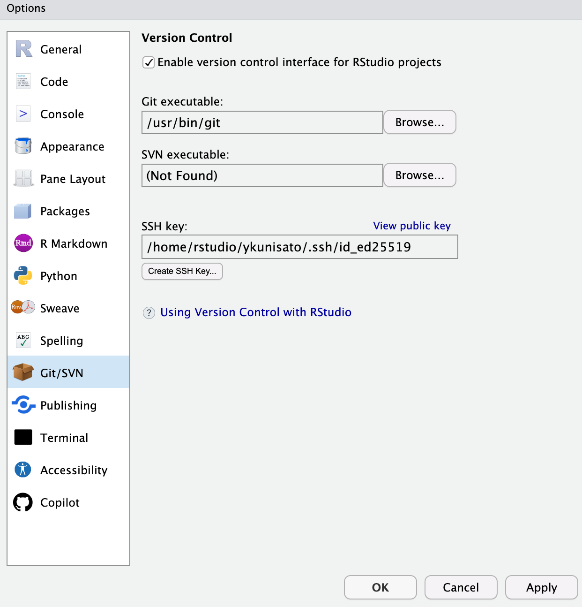
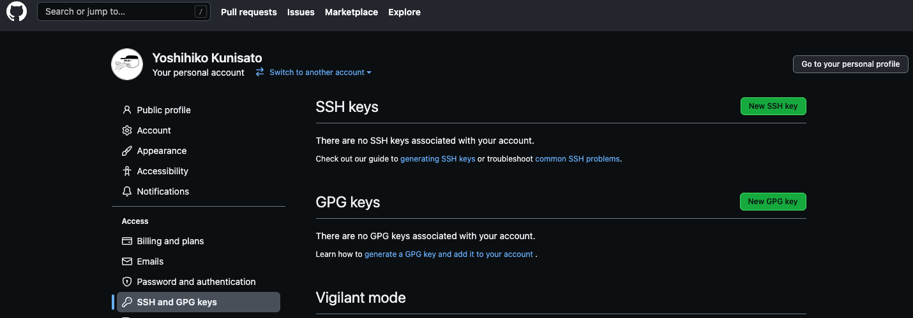

本ゼミでは，GitHubを活用して，ゼミの演習課題や卒論・修論のバージョン管理を行います。

<br />
<br />

## GitHubアカウントの作成

GoogleでGitHubと検索するか，<a href="https://github.com/" target="_blank">GitHub</a>をクリックください。そして，Sign Upをクリックしてください。


<br />
<br />
<br />

以下のような画面になったら，英語でユーザー名，メールアドレス，パスワードをいれてアカウントを作ってください。メールアドレスは大学から発行された**心理学科のメールアドレス**を登録ください。


<br />
<br />

**アカウントの用意ができたら，Discordで国里にアカウント名を知らせてください。**　国里が学生用プライベートリポジトリとゼミ生用マテリアルリポジトリを共有します。

<br />
<br />

## ざっくりとGitHubの仕組みを知ろう！

簡単にいうと，手元のパソコン（もしくは私が用意したRStudioサーバー）で行った作業内容をクラウド上のGitHubのリポジトリと同期させます（バックアップするというイメージでも良いです）。

(1)以降の手順としては，まず国里がGitHub上にプライベート・リポジトリを作っておくので，みなさんは自分のパソコン（もしくは私が用意したRStudioサーバー）にPull(初回時はCloneと言う。ダウンロードと同じ意味)して，リポジトリをもってきます。

(2)そのリポジトリ内で作業をします。作業をすると，コード，データ（データ共有の同意を得た匿名化処理済みのデータ），卒論・修論などのファイルがリポジトリ内に追加されたり，変更が加えられると思います。ファイルに変更を加えたら，こまめにCommitをして変更履歴を残します（大きめは変更を加えたらかならずCommitする）。

(3)変更履歴が残せたら，Pushしてクラウド上のGitHubのリポジトリに反映させます（Psuhはアップロードと同じ意味）。

卒論・修論では，GitHubリポジトリからPullして自分のPCを最新の状態にして，作業したらその都度Commitし，Pushしてリポジトリを最新の状態に保つというサイクルを回していくことになります。なんだか面倒だなあという気もするかもしれませんが，変更履歴を残すことは透明性の高い研究をすすめる上での重要ですし，色々と作業をしたけど前の状態に戻したいときにも便利です。


<br />
<br />
<br />

## GitHubへの公開鍵接続の設定

GitHubへのアクセスは，RStudioで用意されている公開鍵を使ったSSH接続の設定をしましょう。なんだかややこしそうですが，通常のパスワード認証よりも安全性高く接続できると思ってください。

RStudioで「Tools」をクリックして，「Global Options...」をクリックします。「Git/SVN」で「Create SSH Key...」をクリックします。


Passphraseを設定したほうがGitHubへのアクセスに対しては強固ではありますが，ここでは設定をしません。そのままCreateをクリックします(ED25519でいいです)。

 

Keyが作られますが，とりあえず「close」を押して閉じます。「View Public Key」をクリックして，鍵を表示させて，コピーします。



GitHubにログインして，右上のアカウントのアイコンをクリックして，「Settings」をクリックします。そして，以下の画面にあるように「SSH and GPG keys」をクリックし，「New SSH key」をクリックします。




適当にタイトルを決めて(例えば，「lab rstudio server」とか)，上記のPublic Keyをコピペします。これで登録完了です。


<br />
<br />
<br />

## RStudioでGitHubを使う準備をする


以下のコードを修正して（ご自身のユーザー名とメールアドレスに変更），Rstudioの**Console**にコピペしてください。

``` 
usethis::use_git_config(user.name = "GitHubに登録したユーザー名", user.email = "GitHubに登録したメールアドレス")
```

※なお，サーバーの再起動などをするとこの情報が消えることがあるので，もしRStudioからGithubへの接続ができない場合は，RSA Keyの発行からやり直してください。

<br />
<br />

## GitHubリポジトリを自分の手元にもってくる(Clone)

<a href="https://github.com/" target="_blank">GitHub</a>に移動します。どうも自分のリポジトリ(Repositories)が見えないことがあるのですが，以下の画像の左上の赤い枠で囲った部分をクリックすると下にRepositoriesが出てきて，みなさんの名前のリポジトリが見えると思います。そのリポジトリをクリックします。


<br />
<br />
<br />


自分の名前のGitHubリポジトリにいって，下のような画面で，SSHを選択して，右端（赤で囲った部分）をクリックします（以下の画面ではHTTPSが選択されているので注意）。クリックすると，URLがコピーされます。


<br />
<br />
<br />

次に，ゼミのRStudioサーバーに移動します。以下のようにRStudio上でFile → New Project→Version Control→Gitと進んで，コピーしたURLと保存するフォルダの設定します。これで，Clone完了です。

＊ゼミのRstudio serverを使っている場合は，"Create project as subdirectory of:"でBrowseをクリックして，Homeをchooseする必要があるかもしれません。


<br />
<br />
<br />

一度，GitHubのプロジェクトを作っておくと，RStudioはそれを記憶しているので，以下のようにFile→Recent Projetsで作成したプロジェクトが出てくるので，それをクリックすれば，GitHubプロジェクトが開けます。

RStudioのプロジェクトは，解析などで使うファイルやフォルダをひとまとめにしてくれるものです（今回の場合は，GitHubリポジトリがプロジェクトになります）。RStudioを使う場合は，必ずプロジェクトファイルを作りましょう。


<br />
<br />
<br />


さて，Cloneができると最初の準備は終わりです！
