## はじめに

卒論，修論，投稿論文，依頼論文，書籍などの執筆は，基本的には苦しいし，大変なものだと思います。そのような執筆を進めるコツは，以下の２点になります。

1. 一日の中で論文を書く時間を決める（その時間は執筆以外をしない）
2. 目標を設定し，日々の執筆量を記録する

このTipsは，２つ目の内容について扱います。想像すると気づくとおもうのですが，執筆した文字数や語数を毎日カウントして記録するという作業はかなり手がかかります（よほど忍耐のある人しか続かない）。そこで，このTipsでは，２つ目の作業に関して，ほぼ自動化したシステムの構築方法について説明します。

## Googleドキュメントで論文を執筆する

今回説明する自動執筆量記録・報告システムは，Googleドキュメントを使用していることが前提になります。
原稿を書く時にGoogleドキュメントを使わない方もおられるかもしれませんが，Googleドキュメントを使うことで，以下のようなメリットがあります。

- ネットに接続できればどこでも執筆できる
- スマートフォンやタブレットなどでも執筆できる
- 機能がシンプルで執筆に集中できる
- 簡単にWordファイルとして出力できる
- 共著者との共有が簡単
- 共著者と共同執筆が可能

また，以下のアドオンを追加することで，かなり論文執筆が便利になります。是非ともGoogleドキュメントを使って原稿執筆に励みましょう！

- [Table of contents](https://chrome.google.com/webstore/detail/table-of-contents/ickpeaanccmmabadbfiknbobkmkdnnaj?hl=ja): アウトライン機能を追加するアドインです。論文などの長い文章を書く場合は，かならずアウトラインをしっかりつくって書きましょう。

- [Paperpile](https://chrome.google.com/webstore/detail/paperpile/imanmdcibgaflfaibbcmmkifdgllfopm): 文献の引用に使える。いろんな使い方ができるが，私は，Mendeleyで文献を管理しているので，Mendeleyからbibtex形式で文献情報を出力して，Paperpileで読み込んで使っている。APAを始めとする様々なフォーマットに対応しているので，とても便利です。

- [Translate](https://chrome.google.com/webstore/detail/translate/nejfnokhglmkjgpkjooijcddfecjggan): GoogleドキュメントのサイドバーでGoogle翻訳が使える。英文執筆に便利です。

## 自動執筆量記録・報告システムの概要

Googleドキュメントを使った自動執筆量記録・報告システムの概要は以下の図のようになります。一度設定をしておけば，ユーザーはただGoogleドキュメントで執筆をするだけで，１日の執筆量の記録とその日の進捗の報告（+リマインドメール）を受け取ることができます。


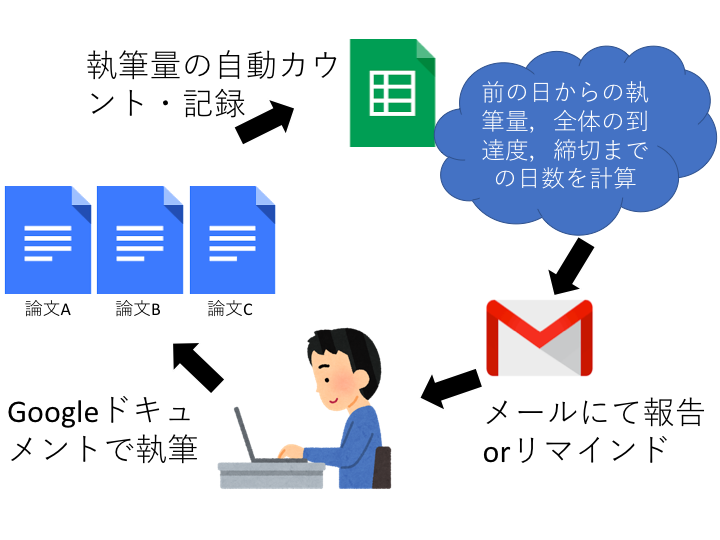


## 自動執筆量記録・報告システムの設定
### 1. 各原稿用のGoogleドキュメントファイルの準備
まずは，各原稿用のGoogleドキュメントファイルを準備します。

### 2. Googleスプレッドシートを準備する

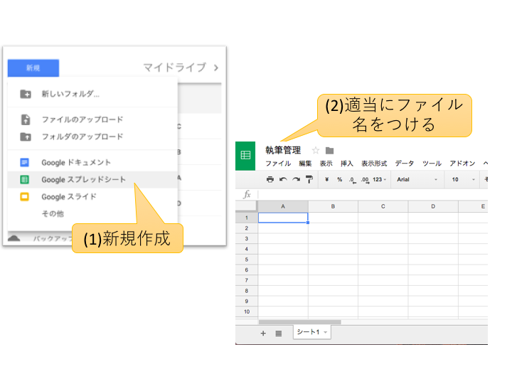


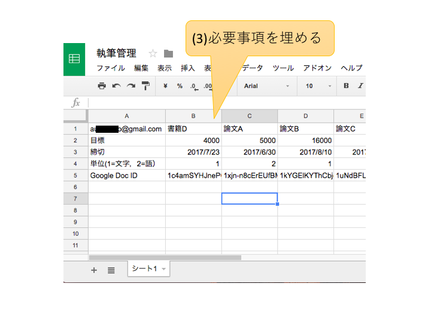


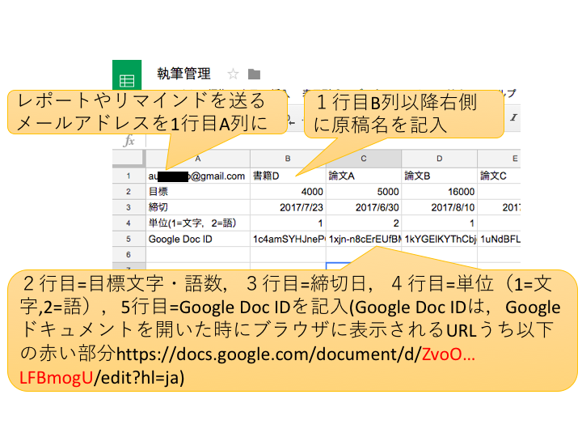

### 3.スプレッドシートにGoogle Apps Scriptを仕込む

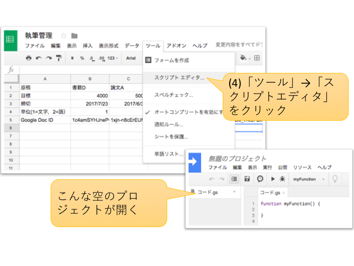

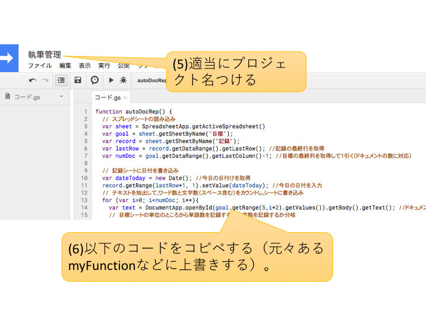


```
function autoDocRep() { 
  // スプレッドシートの読み込み
  var sheet = SpreadsheetApp.getActiveSpreadsheet().getSheetByName("シート1");
  var lastRow = sheet.getDataRange().getLastRow(); //記録の最終行を取得
  var numDoc = sheet.getDataRange().getLastColumn()-1; //目標の最終列を取得して１引く（ドキュメントの数に対応）
  // 本日の記録をシートに書き込み
  var dateToday = new Date(); //今日の日付けを取得
  sheet.getRange(lastRow+1, 1).setValue(dateToday); //今日の日付を入力
  // テキストを抽出して，ワード数と文字数（スペース含む）をカウントし，シートに書き込み
  for (var i=0; i<numDoc; i++){
    var text = DocumentApp.openById(sheet.getRange(5,i+2).getValues()).getBody().getText(); //ドキュメントを読み込む
    // 目標シートの単位のところから単語数を記録するか文字数を記録するか分岐
    if (sheet.getRange(4,i+2).getValues() == 1) {
      var chars = text.length;　//文字数をカウント
      sheet.getRange(lastRow+1, i+2).setValue(chars);
    }
    else {
      var words = text.match(/\S+/g).length;　//単語数をカウント
      sheet.getRange(lastRow+1, i+2).setValue(words);
    }
  } 
  // メールの報告文の作成と送信
  var bodyText = '昨日の執筆の進捗は，以下になります！\n今日も頑張って執筆しましょう！　\n\n'
  for (var i=0; i<numDoc; i++){
    var repDiff = sheet.getRange(lastRow+1,i+2).getValues() - sheet.getRange(lastRow,i+2).getValues();
    var repProp = Math.floor(sheet.getRange(lastRow+1,i+2).getValues() / sheet.getRange(2,i+2).getValues()*100);
    var deadline = new Date(sheet.getRange(3,i+2).getValues());
    var repDay = Math.floor((deadline.getTime() - dateToday.getTime()) / (1000 * 60 * 60 * 24));
    if (sheet.getRange(4,i+2).getValues() == 1) {
      bodyText = bodyText + sheet.getRange(1,i+2).getValues() + '： 昨日は' + repDiff + '字書いて，全体の'+ repProp + '%まで進みました。締切まであと' + repDay + '日です。\n'
     }
    else {
      bodyText = bodyText + sheet.getRange(1,i+2).getValues() + '： 昨日は' + repDiff + '語書いて，全体の'+ repProp + '%まで進みました。締切まであと' + repDay + '日です。\n'
    }
  }  
  GmailApp.sendEmail(sheet.getRange(1,1).getValues(),"昨日の執筆進捗の報告",bodyText);  //メールの送信
}

function remindMail() {
  // スプレッドシートの読み込み
  var sheet = SpreadsheetApp.getActiveSpreadsheet().getSheetByName("シート1");
  var lastRow = sheet.getDataRange().getLastRow(); //記録の最終行を取得
  var numDoc = sheet.getDataRange().getLastColumn()-1; //目標の最終列を取得して１引く（ドキュメントの数に対応）
  // テキストを抽出して，ワード数と文字数（スペース含む）をカウントし，シートに書き込み
  var bodyText = '今日の進捗です。少しでも執筆を進めましょう！　\n\n'
  for (var i=0; i<numDoc; i++){
    var text = DocumentApp.openById(sheet.getRange(5,i+2).getValues()).getBody().getText(); //ドキュメントを読み込む
    // 目標シートの単位のところから単語数を記録するか文字数を記録するか分岐
    if (sheet.getRange(4,i+2).getValues() == 1) {
      var textCount = text.length;　//文字数をカウント
      var repDiff = textCount - sheet.getRange(lastRow,i+2).getValues();
      if (repDiff > 100) {
        bodyText = bodyText + "ヾ(*´∀`*)ﾉ　" + sheet.getRange(1,i+2).getValues() + '：　' + repDiff + '字執筆\n'
      }
      else{
        bodyText = bodyText + "(;´༎ຶД༎ຶ`)　" + sheet.getRange(1,i+2).getValues() + '：　' + repDiff + '字執筆\n'
      }
    }
    else {
      var textCount = text.match(/\S+/g).length;　//単語数をカウント
      var repDiff = textCount - sheet.getRange(lastRow,i+2).getValues();
      if (repDiff > 50) {
        bodyText = bodyText + "ヾ(*´∀`*)ﾉ　" + sheet.getRange(1,i+2).getValues() + '：　' + repDiff + '字執筆\n'
      }
      else{
        bodyText = bodyText + "(;´༎ຶД༎ຶ`)　" + sheet.getRange(1,i+2).getValues() + '：　' + repDiff + '字執筆\n'
      }
    }
  }
  GmailApp.sendEmail(sheet.getRange(1,1).getValues(),"今日の執筆状況",bodyText);  //メールの送信
}
```

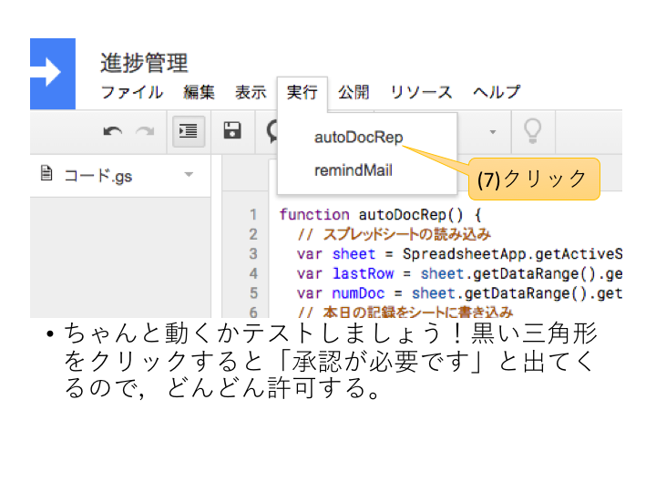

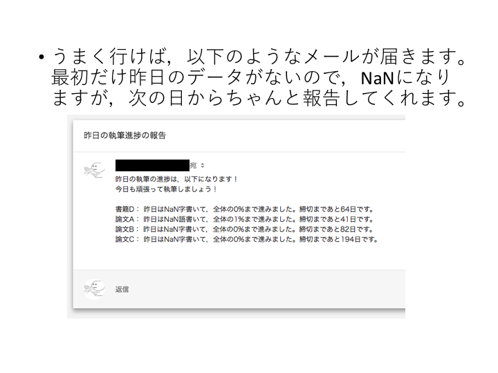


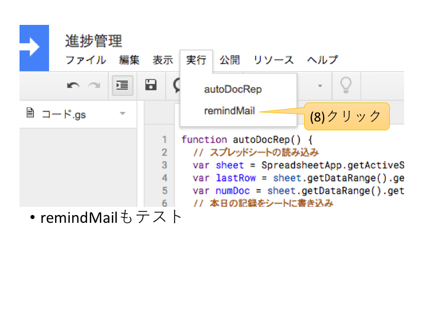

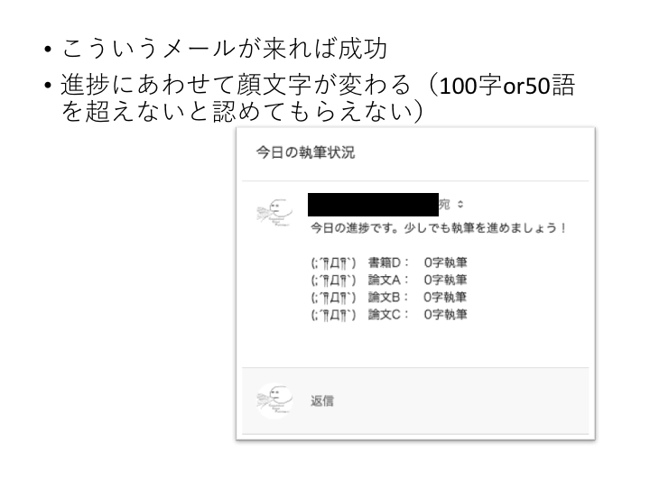


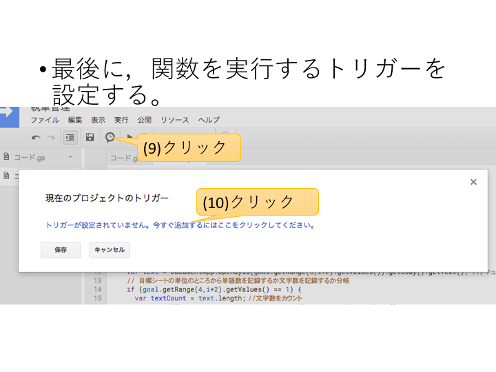

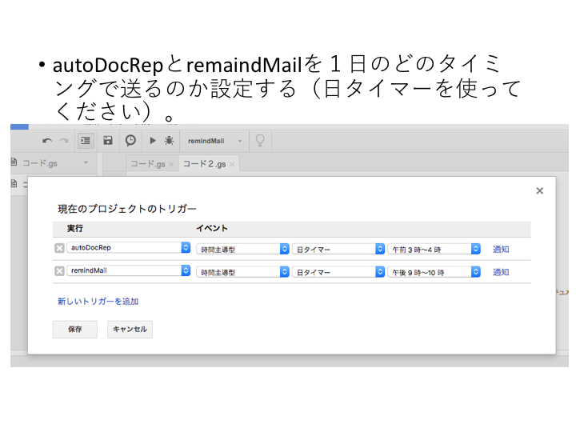

### おまけのバックアップ機能

上記の作業で自動執筆量管理はできるのですが，以下のスクリプトをコピペすれば，バックアップ機能もつけることができます。関数名は，fileBackUp() になります（こちらをコピペする場合は，fileBackUp() に対してもトリガーを設定ください）。fileBackUp() は，Googleドライブ内にBackUpWritingFileというフォルダを作成し，それにファイル名に日付時間を追加して保存します。なお，fileBackUp() は，こちらの[ラスカの実験室](http://rasuka-labo.blogspot.jp/2015/01/blog-post.html)を参考に作成しました。


```
function autoDocRep() { 
  // スプレッドシートの読み込み
  var sheet = SpreadsheetApp.getActiveSpreadsheet().getSheetByName("シート1");
  var lastRow = sheet.getDataRange().getLastRow(); //記録の最終行を取得
  var numDoc = sheet.getDataRange().getLastColumn()-1; //目標の最終列を取得して１引く（ドキュメントの数に対応）
  // 本日の記録をシートに書き込み
  var dateToday = new Date(); //今日の日付けを取得
  sheet.getRange(lastRow+1, 1).setValue(dateToday); //今日の日付を入力
  // テキストを抽出して，ワード数と文字数（スペース含む）をカウントし，シートに書き込み
  for (var i=0; i<numDoc; i++){
    var text = DocumentApp.openById(sheet.getRange(5,i+2).getValues()).getBody().getText(); //ドキュメントを読み込む
    // 目標シートの単位のところから単語数を記録するか文字数を記録するか分岐
    if (sheet.getRange(4,i+2).getValues() == 1) {
      var chars = text.length;　//文字数をカウント
      sheet.getRange(lastRow+1, i+2).setValue(chars);
    }
    else {
      var words = text.match(/\S+/g).length;　//単語数をカウント
      sheet.getRange(lastRow+1, i+2).setValue(words);
    }
  } 
  // メールの報告文の作成と送信
  var bodyText = '昨日の執筆の進捗は，以下になります！\n今日も頑張って執筆しましょう！　\n\n'
  for (var i=0; i<numDoc; i++){
    var repDiff = sheet.getRange(lastRow+1,i+2).getValues() - sheet.getRange(lastRow,i+2).getValues();
    var repProp = Math.floor(sheet.getRange(lastRow+1,i+2).getValues() / sheet.getRange(2,i+2).getValues()*100);
    var deadline = new Date(sheet.getRange(3,i+2).getValues());
    var repDay = Math.floor((deadline.getTime() - dateToday.getTime()) / (1000 * 60 * 60 * 24));
    if (sheet.getRange(4,i+2).getValues() == 1) {
      bodyText = bodyText + sheet.getRange(1,i+2).getValues() + '： 昨日は' + repDiff + '字書いて，全体の'+ repProp + '%まで進みました。締切まであと' + repDay + '日です。\n'
     }
    else {
      bodyText = bodyText + sheet.getRange(1,i+2).getValues() + '： 昨日は' + repDiff + '語書いて，全体の'+ repProp + '%まで進みました。締切まであと' + repDay + '日です。\n'
    }
  }  
  GmailApp.sendEmail(sheet.getRange(1,1).getValues(),"昨日の執筆進捗の報告",bodyText);  //メールの送信
}

function remindMail() {
  // スプレッドシートの読み込み
  var sheet = SpreadsheetApp.getActiveSpreadsheet().getSheetByName("シート1");
  var lastRow = sheet.getDataRange().getLastRow(); //記録の最終行を取得
  var numDoc = sheet.getDataRange().getLastColumn()-1; //目標の最終列を取得して１引く（ドキュメントの数に対応）
  // テキストを抽出して，ワード数と文字数（スペース含む）をカウントし，シートに書き込み
  var bodyText = '今日の進捗です。少しでも執筆を進めましょう！　\n\n'
  for (var i=0; i<numDoc; i++){
    var text = DocumentApp.openById(sheet.getRange(5,i+2).getValues()).getBody().getText(); //ドキュメントを読み込む
    // 目標シートの単位のところから単語数を記録するか文字数を記録するか分岐
    if (sheet.getRange(4,i+2).getValues() == 1) {
      var textCount = text.length;　//文字数をカウント
      var repDiff = textCount - sheet.getRange(lastRow,i+2).getValues();
      if (repDiff > 100) {
        bodyText = bodyText + "ヾ(*´∀`*)ﾉ　" + sheet.getRange(1,i+2).getValues() + '：　' + repDiff + '字執筆\n'
      }
      else{
        bodyText = bodyText + "(;´༎ຶД༎ຶ`)　" + sheet.getRange(1,i+2).getValues() + '：　' + repDiff + '字執筆\n'
      }
    }
    else {
      var textCount = text.match(/\S+/g).length;　//単語数をカウント
      var repDiff = textCount - sheet.getRange(lastRow,i+2).getValues();
      if (repDiff > 50) {
        bodyText = bodyText + "ヾ(*´∀`*)ﾉ　" + sheet.getRange(1,i+2).getValues() + '：　' + repDiff + '字執筆\n'
      }
      else{
        bodyText = bodyText + "(;´༎ຶД༎ຶ`)　" + sheet.getRange(1,i+2).getValues() + '：　' + repDiff + '字執筆\n'
      }
    }
  }
  GmailApp.sendEmail(sheet.getRange(1,1).getValues(),"今日の執筆状況",bodyText);  //メールの送信
}

function fileBackUp() {
  // スプレッドシートの読み込み
  var sheet = SpreadsheetApp.getActiveSpreadsheet().getSheetByName("シート1");
  var lastRow = sheet.getDataRange().getLastRow(); //記録の最終行を取得
  var numDoc = sheet.getDataRange().getLastColumn()-1; //目標の最終列を取得して１引く（ドキュメントの数に対応）
  //バックアップフォルダーの設定
  var backUpFolder = "BackUpWritingFile"
  
  // バックアップフォルダをゲットするor作る
  var folders = DriveApp.getFoldersByName(backUpFolder);
  var folder;
  if (folders.hasNext())
    folder = folders.next();
  else
    folder = DriveApp.createFolder(backUpFolder);
  // ファイルの保存
  for ( var i = 0; i < numDoc; i++ ) {
    var file = DriveApp.getFileById(sheet.getRange(5,i+2).getValues());
    //Backupの日付時間をつけてファイルをコピーする
    var d = new Date();
    var s = Utilities.formatDate(d, "JST", "yyyyMMdd_HHmmss");
    s = "(" + s + ")";
    file.makeCopy(file.getName() + s, folder );
  }   
}
```

### おわりに

これで，Googleドキュメントによる自動執筆量記録・報告システムの設定が終了しました。日々の雑務でついつい後回しにしてしまう執筆について，リマインドメールと進捗報告メールなどをもとにどんどん取り組むようにしましょう！


#### Enjoy writing!

