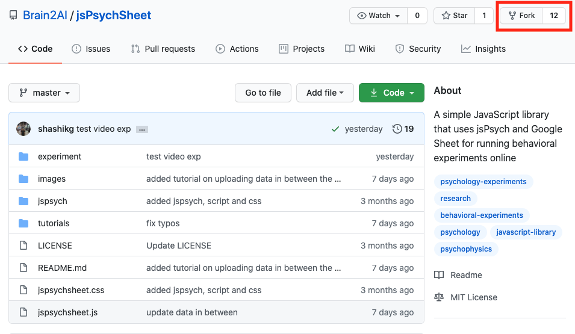
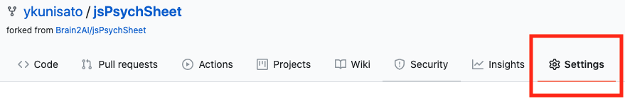
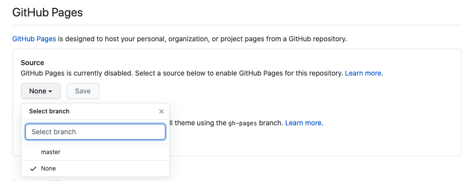

jsPsychはFirebaseやPavloviaを使って実施することができますが，Google Spreadsheet上で実施することもできます。詳しくは，[jsPsychSheet: Running online behavioral experiments using jsPsych and Google Sheet](https://medium.com/@shashikg.iitk/jspsychsheet-running-online-behavioral-experiments-using-jspsych-and-google-sheet-adf29fb4d1a0)を読んでいただけたらとは思いますが，以下では簡単に解説をします。

## 事前準備

- GitHubアカウントを作成する（詳しくは[こちら](https://kunisatolab.github.io/main/how-to-github.html)）。
- RStudioでjsPsychを使えるようにする（詳しくは[こちら](https://kunisatolab.github.io/main/how-to-jspsych1.html)）。

## 1.jsPsychSheetをForkして，GitHub pageを設定する

[jsPsychSheetのGitHubリポジトリ](https://github.com/Brain2AI/jsPsychSheet)に移動して，Forkします(赤で囲った部分をクリックします。)。

自分のGitHubアカウントにjsPsychSheetリポジトリがForkされたら，Settingsタブをクリックします。

 

Settingsタブで下にスクロールして，GitHub Pagesってところにいきます。そこで，masterブランチを選んでください。「save」って出てくるので，それを押します。これで，ForkしたリポジトリのGitHub Pagesが有効になりました。

## 2.jsPsych課題の準備

