<br />

jsPsychはFirebaseやPavloviaを使って実施することができますが，Google Spreadsheet上で実施することもできます。それぞれ一長一短はありますが，Google Spreadsheetは日常的に使っている方もおられるでしょうし，サーバー費用などはかからないので，かなりお手軽に実施できます（ただ，Googleのサービスによって１日に作成可能なスプレッドシートの数には制限があるので，大規模なデータ収集には向かないと思います）。

詳しくは，[jsPsychSheet: Running online behavioral experiments using jsPsych and Google Sheet](https://medium.com/@shashikg.iitk/jspsychsheet-running-online-behavioral-experiments-using-jspsych-and-google-sheet-adf29fb4d1a0)を読んでいただけたらとは思いますが，以下では簡単に解説をします。

<br />

## 事前準備

- GitHubアカウントを作成する（詳しくは[こちら](https://kunisatolab.github.io/main/how-to-github.html)）。
- RStudioでjsPsychを使えるようにする（詳しくは[こちら](https://kunisatolab.github.io/main/how-to-jspsych1.html)）。

<br />

## 1.jsPsychSheetをForkして，GitHub pageを設定する

[jsPsychSheetのGitHubリポジトリ](https://github.com/Brain2AI/jsPsychSheet)に移動して，Forkします(赤で囲った部分をクリックします)。


<br />

自分のGitHubアカウントにjsPsychSheetリポジトリがForkされたら，Settingsタブをクリックします。

 
<br />

Settingsタブで下にスクロールして，GitHub Pagesってところにいきます。そこで，masterブランチを選んでください。「save」って出てくるので，それを押します。これで，ForkしたリポジトリのGitHub Pagesが有効になりました。


<br />

## 2.jsPsych課題の準備

以下の赤線で囲っている部分を押して，「Clone with HTTPS」のURLをコピーする。

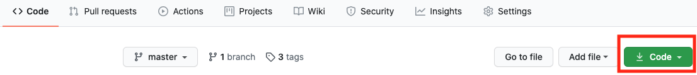
<br />

RStudioでFile→New Project..→Version Contriol→Gitで，コピーしたURLを貼り付ける。

<br />

### Simple Reaction Time Taskの準備

jsPsychのチュートリアルにあるSimple Reaction Time Taskを作ります。jsPsychSheetのリポジトリ内のexperimentフォルダ内に課題をおきます。すでに，experimentフォルダ内には，Simple Reaction Time Taskが配置されていますが，以下では，Rmarkdownで再度作りましょう。

- RStudioでexperimentフォルダをカレントワーキングディレクトリにする

- 以下をコンソールで実行

```
library(jsPsychRmd)
set_jsPsych()
```

- index.Rmdを開いて，{js}チャンク内に[jsPsychチュートリアルのThe final code](https://www.jspsych.org/tutorials/rt-task/#the-final-code)の scriptから /scriptの内容をコピーして貼り付けします。

- {js}チャンクの上の{r}チャンク内を以下のようにします。

```
library(htmltools)
tagList(
tags$script(src='jspsych-6.1.0/jspsych.js'),
tags$script(src='jspsych-6.1.0/plugins/jspsych-html-keyboard-response.js'),
tags$script(src='jspsych-6.1.0/plugins/jspsych-image-keyboard-response.js'),
tags$script(src='jspsych-6.1.0/plugins/jspsych-fullscreen.js')
)
```

ちゃんと動作するかKnitをして確かめてください。課題が動いたら，Gitでコミット＆プッシュをしてください。

<br />

### jsPsych課題でjsPsychSheetを使うための調整

- ForkしたjsPsychSheetリポジトリは，GitHub Pagesになっているので，以下のURLのいち部をユーザーアカウント名にするとアクセスできます。

https://<GitHubのユーザーアカウント名>.github.io/jsPsychSheet/experiment/


- 上記の課題をGoogle spreadsheet上で走らせる場合に，上記のURLからファイルにアクセスをします。そこで，画像を含む刺激系のファイル，jsPsychのjsライブラリなどは，上記のURLに変更をします。具体的には以下のようにします。

<br />

#### 修正1前({r}チャンク内のjsライブラリ)

```
library(htmltools)
tagList(
tags$script(src='jspsych-6.1.0/jspsych.js'),
tags$script(src='jspsych-6.1.0/plugins/jspsych-html-keyboard-response.js'),
tags$script(src='jspsych-6.1.0/plugins/jspsych-image-keyboard-response.js'),
tags$script(src='jspsych-6.1.0/plugins/jspsych-fullscreen.js')
)
```


#### 修正1後({r}チャンク内のjsライブラリ)

- GitHubのユーザーアカウント名はご自身のアカウント名に変更ください。
- jspsychsheet.jsとjspsychsheet.cssも追加します。

```
library(htmltools)
tagList(
tags$script(src='https://GitHubのユーザーアカウント名.github.io/jsPsychSheet/experiment/jspsych-6.1.0/jspsych.js'),
tags$script(src='https://GitHubのユーザーアカウント名.github.io/jsPsychSheet/experiment/jspsych-6.1.0/plugins/jspsych-html-keyboard-response.js'),
tags$script(src='https://GitHubのユーザーアカウント名.github.io/jsPsychSheet/experiment/jspsych-6.1.0/plugins/jspsych-image-keyboard-response.js'),
tags$script(src='https://GitHubのユーザーアカウント名.github.io/jsPsychSheet/experiment/jspsych-6.1.0/plugins/jspsych-fullscreen.js'),
tags$script(src="https://GitHubのユーザーアカウント名.github.io/jsPsychSheet/jspsychsheet.js"),
tags$link(rel="stylesheet",href="https://<GitHubのユーザーアカウント名>.github.io.github.io/jsPsychSheet/jspsychsheet.css")
)
```

<br />

#### 修正2前({js}チャンク内のimgの場所)

```
    var instructions = {
      type: "html-keyboard-response",
      stimulus: "<p>In this experiment, a circle will appear in the center " +
          "of the screen.</p><p>If the circle is <strong>blue</strong>, " +
          "press the letter F on the keyboard as fast as you can.</p>" +
          "<p>If the circle is <strong>orange</strong>, press the letter J " +
          "as fast as you can.</p>" +
          "<div style='width: 700px;'>"+
          "<div style='float: left;'></img>" +
          "<p class='small'><strong>Press the F key</strong></p></div>" +
          "<div class='float: right;'></img>" +
          "<p class='small'><strong>Press the J key</strong></p></div>" +
          "</div>"+
          "<p>Press any key to begin.</p>",
      post_trial_gap: 2000
    };
```

#### 修正2後({js}チャンク内のimgの場所)

```
    var instructions = {
      type: "html-keyboard-response",
      stimulus: "<p>In this experiment, a circle will appear in the center " +
          "of the screen.</p><p>If the circle is <strong>blue</strong>, " +
          "press the letter F on the keyboard as fast as you can.</p>" +
          "<p>If the circle is <strong>orange</strong>, press the letter J " +
          "as fast as you can.</p>" +
          "<div style='width: 700px;'>"+
          "<div style='float: left;'></img>" +
          "<p class='small'><strong>Press the F key</strong></p></div>" +
          "<div class='float: right;'></img>" +
          "<p class='small'><strong>Press the J key</strong></p></div>" +
          "</div>"+
          "<p>Press any key to begin.</p>",
      post_trial_gap: 2000
    };
```

<br />

#### 修正3前({js}チャンク内のimgの場所)

```
    /* test trials */
    var test_stimuli = [
      { stimulus: "img/blue.png", data: { test_part: 'test', correct_response: 'f' } },
      { stimulus: "img/orange.png", data: { test_part: 'test', correct_response: 'j' } }
    ];
```

#### 修正3後({js}チャンク内のimgの場所)

```
        /* test trials */
    var test_stimuli = [
      { stimulus: "https://GitHubのユーザーアカウント名.github.io/jsPsychSheet/experiment/img/blue.png", data: { test_part: 'test', correct_response: 'f' } },
      { stimulus: "https://GitHubのユーザーアカウント名.github.io/jsPsychSheet/experiment/img/orange.png", data: { test_part: 'test', correct_response: 'j' } }
    ];
```

<br />

#### 修正4前(結果の保存方法)

```
    /* start the experiment */
    jsPsych.init({
      timeline: timeline,
      on_finish: function() {
        jsPsych.data.displayData();
      }
    });
```

#### 修正4後(結果の保存方法)

- csv形式で保存するようにします

```
jsPsych.init({
  timeline: timeline,
  on_finish: function() {
      jsPsychSheet.uploadData(jsPsych.data.get().csv());
  }
});
```

修正ができたら，knitして，Gitでコミット＆プッシュをしてください。

<br />

## 3.Google Spreadsheetの設定

 Google Driveで新規にスプレッドシートを作ります（名前を適当につけてください）。

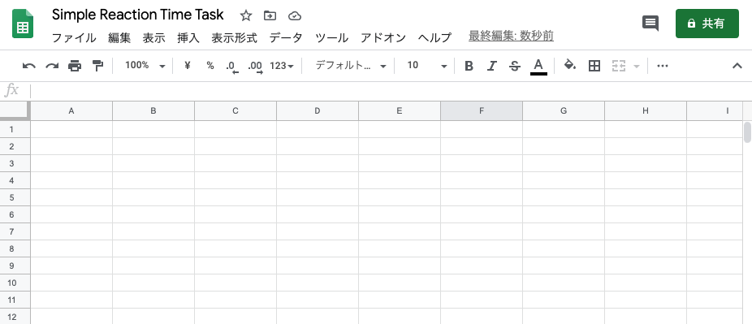

<br />

「ツール」から「スクリプトエディタ」を押してください。

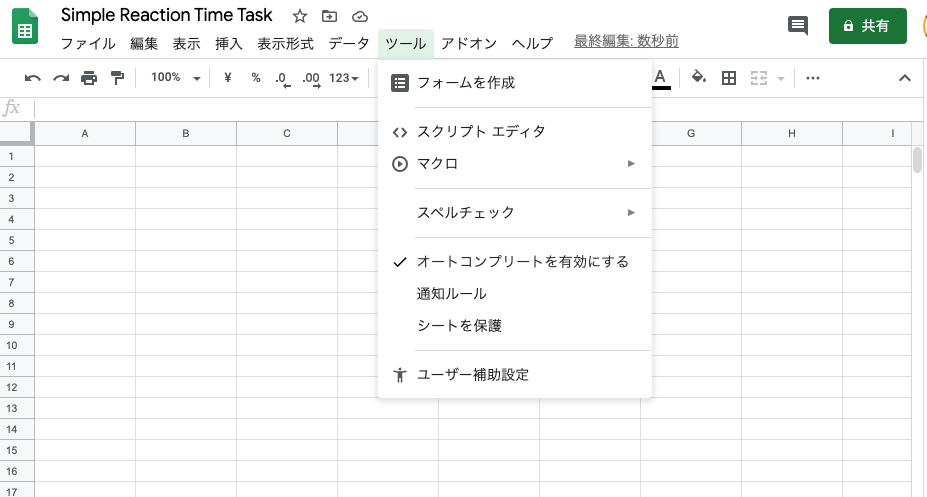


<br />

以下のような画面がでてきます。

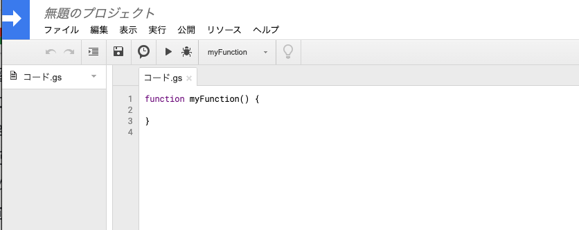


<br />

以下のコードをコード.gsに上書きしてください。

```
// App Script function to host the html page
function doGet() {
  return HtmlService.createHtmlOutputFromFile('index');
}

// App Script function to interact with google sheet
function addData(data) {
  var ss = SpreadsheetApp.getActiveSpreadsheet();
  var sheet = ss.insertSheet(0);
  var i;
  for(i=0; i< data.length; i++){
    sheet.appendRow(data[i]);
  }
}

// App Script function to interact with google sheet
function addDataMultiBlock(data, start=0) {
  var ss = SpreadsheetApp.getActiveSpreadsheet();

  if (start == 1){
    var sheet = ss.insertSheet(0);
  } else {
    var sheet = ss.getActiveSheet();
  }

  var i;
  for(i=0; i< data.length; i++){
    sheet.appendRow(data[i]);
  }
}
```

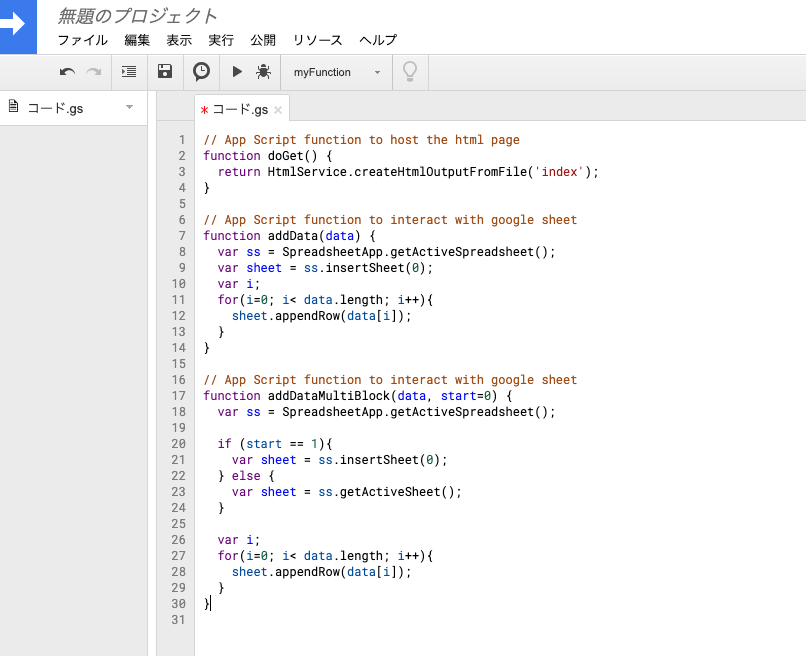


<br />


保存します。

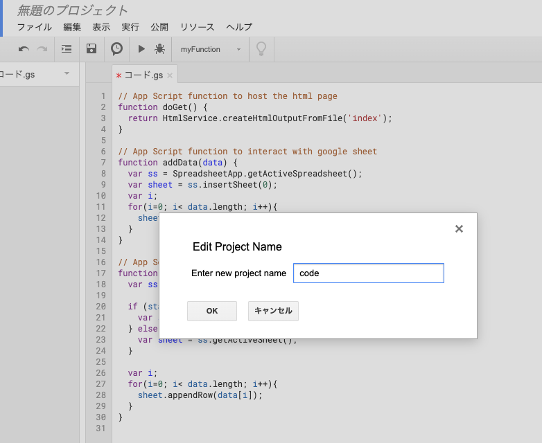


<br />


「ファイル」から「HTMLファイル」を押します。

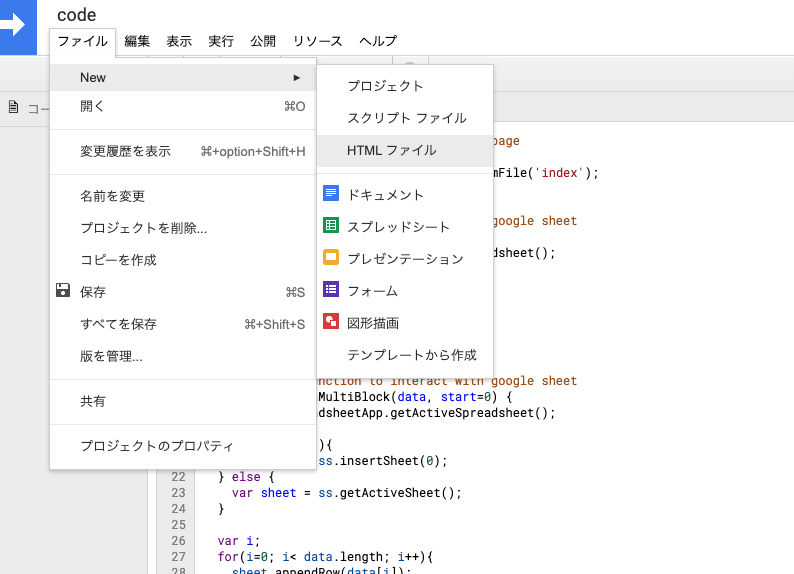


<br />


必ず，index.htmlという名前にしてから，「OK」を押してください。

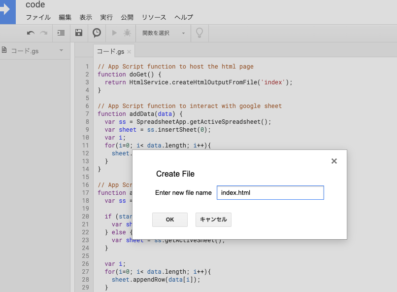


<br />


index.htmlが開くので，ここに，先程RStudio上で作成した実験課題のHTMLを貼り付けます（具体的には，HTMLファイルをクリックして，Open in Editorを選びます。その開いた内容をコピーして，貼り付けます）。

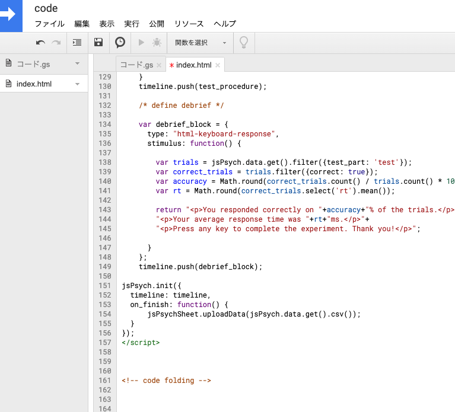


<br />


「公開」から「ウェブアプリケーションとして導入」を押します。

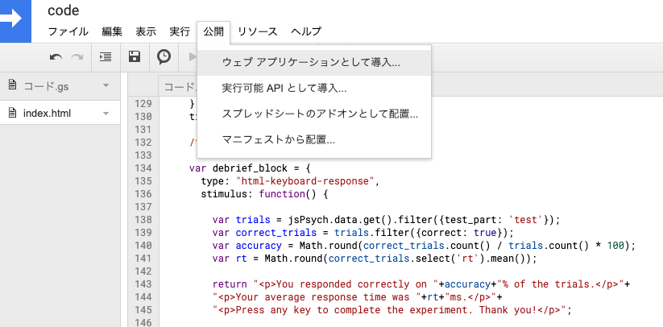


「who has access to the app:」では，「全ユーザー」を選んでください。Deployを押します。

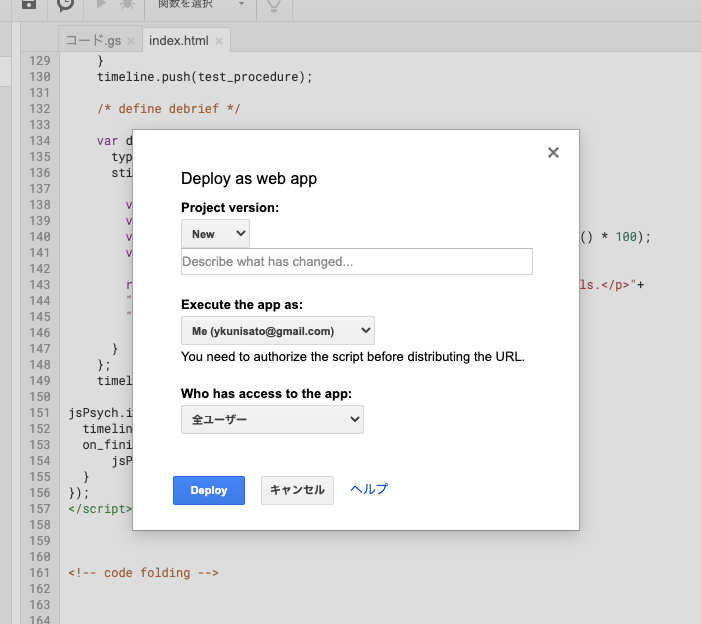


<br />


「許可を確認」を押します。

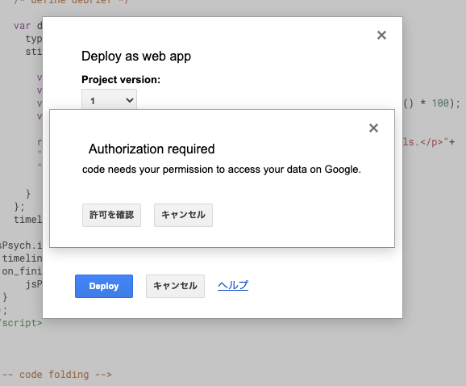


<br />


なんか怖いメッセージがでてきます。

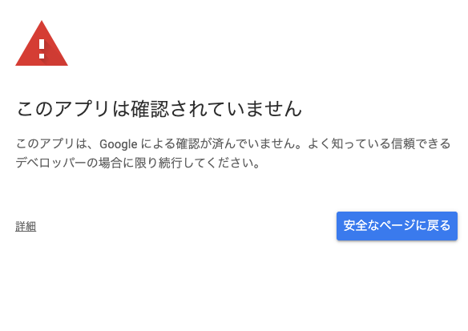


<br />

「詳細」を押して，「(安全ではないページ)へ移動」を押します。

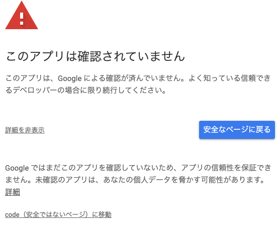


<br />

課題が行われるウェブページのURLが出てくるのでコピーします。コピーしたURLにいくと実験課題ができます。

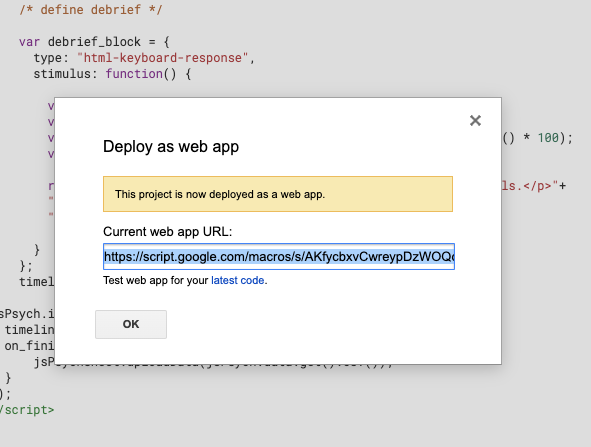


<br />


課題が終わったら，以下のようにスプレッドシートにデータが保存されます。

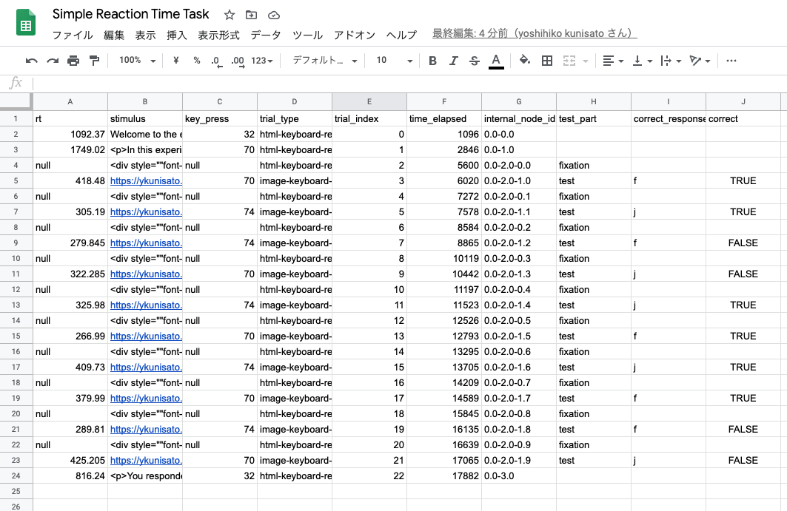

設定を丁寧にすれば，思ったよりも簡単にGoogle スプレッドシートを使って課題の実行とデータの保存ができました！