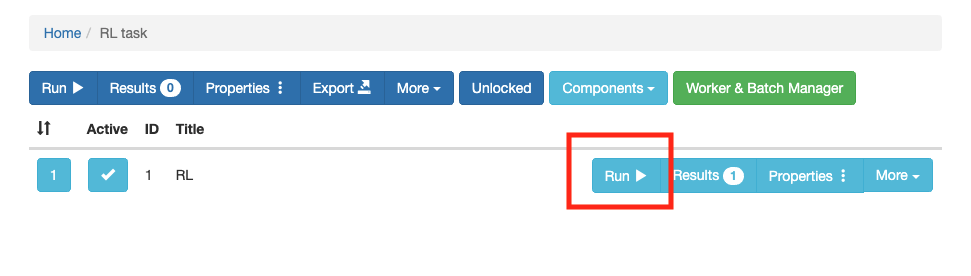

### JATOSで実験を登録する

以下のような画面になったら，```＋New Study```をクリックします。


以下のような画面になったら，```Title```に課題名を入れ，```Study assets' directory name```にディレクトリ名を入れて，```Create```をクリックします。こうすると，dockerで用意したJATOSの/opt/docker/study_assets_root/内に実験課題用のフォルダが作られます（以下の場合は，/opt/docker/study_assets_root内にrlというフォルダ作られます）。そして，dockerで-vを使ってvolume設定をしていますので，カレントディレクトリ内のjatosフォルダ内のstudy_assets_root内に同様にディレクトリが作成されます。


カレントディレクトリ/jatos/study_assets_root内にjsPsychの課題のファイルをコピーします。これで，結果として/opt/docker/study_assets_root/rl内にjsPsychの課題のファイルをコピーされます。

コピーできたら，以下のように，```Components```をクリックして，```+New```をクリックします。


```Title```に課題名をいれて，```HTML file path```で課題のHTMLファイル名をいれて，```Create```をクリックします。なお，実験が複数の課題やコンポーネントからなる場合は，複数回登録をしてください。


以下の赤で囲っている部分の```Run```をクリックすると，ローカルで実験課題を実行できます。テストしてみてください。



