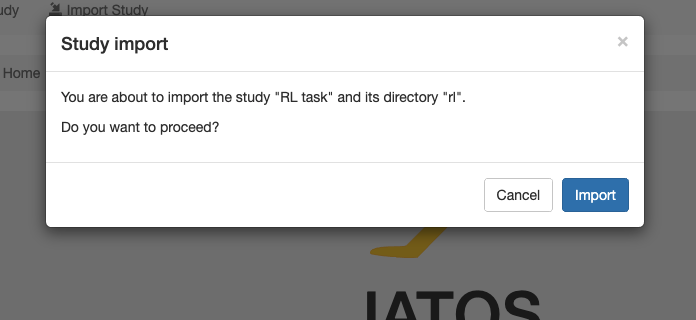
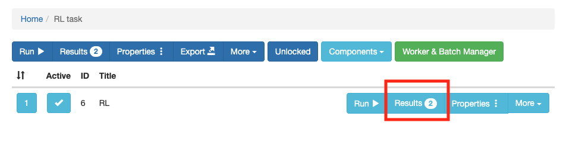

### ローカルのJATOSで準備した課題をエクスポートする

サーバー上のJATOSに課題をアップロードする場合，ローカルのJATOSで課題を準備してエクスポートしたものを読み込むのが便利です（jsPsychの場合は，推奨されています）。さきほど準備したローカルのJATOSのみて，以下の赤で囲っている部分の```Export```をクリックします。すると，これまで設定した実験課題がjzip形式で出力されます。なお，jzipは普通のzipと同じで，課題がまとめられて圧縮されたものです。


さて，サーバー上のJATOSに移動します。以下は，私がGCP上に用意したJATOSの画面です。```Import Study```をクリックします。


```Import Study```をクリックすると，ファイルの選択画面になるので，先程ローカルのJATOSからエクスポートしたjzip形式のファイルを選びます。以下のような画面で，```Import```を選択ください。左側にインポートした課題が出てきたら，成功です。



### ウェブ実験用のURLを準備する

以下で赤い線で囲った```Worker & Batch Manager```をクリックします。


以下で赤い線で囲った```Get Worker Links```をクリックします。


```Choose worker Type```で```General Sigle```を選んで，```Continue```をクリックします。

なお，worker Typeには以下の種類があります。

- Personal Single Worker: **参加者ごと**に**１回**だけ参加できるURLを発行
- Personal Multiple Worker:　**参加者ごと**に**複数回**参加できるURLを発行
- General Single Worker: **複数の参加者**が**１回**だけ参加できるURLを発行
- General Multiple Worker:**複数の参加者**が**複数回**参加できるURLを発行
- Mturk Worker: Amazon Mechanical Turk用URLを発行


以下のように実験用のURLが表示されますので，参加者に配布して使うことができます。


### ウェブ実験結果の確認

参加者の反応はJATOSサーバーに保存されます。結果を確認する場合，以下で赤い線で囲った```Results```をクリックします。



以下のような画面がでてきます。Comp.Result IDの４も５も私が試しにやってみた結果ですが，４の方は，途中でやめており，５は最後まで取り組みました。参加者の反応データは，た```Export Results```をクリックして，全てか選択したものを出力できます（txt形式で出力されます）。


