[JSTOS(Just Another Tool for Online Studies)](https://www.jatos.org/)を用いて，jsPsychで作成した実験課題をローカルもしくはオンラインで実施してみましょう。

### JATOSで用いるためにjsPsychのコードを修正する

JATOSで用いるためにjsPsychのコードを修正します。詳細は，[こちら](https://www.jatos.org/Adapt-Pre-written-Code-to-run-it-in-JATOS.html)を確認ください。

- JATOSで動作するjsライブラリを読み込むために，HTMLファイルのheadに以下を追加します。

```
<script src="jatos.js"></script>
```

- jsPsych.initをjatos.onLoad内にいれ，データをJATOSに保存できるようにします。以下のように，var resultJson = jsPsych.data.get().json()と jatos.submitResultData(resultJson, jatos.startNextComponent)を追加することで，jsPsychの結果をJATOSに保存できるようになります。

```
jatos.onLoad(function() {
  jsPsych.init( {
    // ...
    on_finish: function() {
      var resultJson = jsPsych.data.get().json();
      jatos.submitResultData(resultJson, jatos.startNextComponent);
    }
  });
});
```

## ローカルのJATOSでjsPsychを使えるようにする
### JATOSをDockerで準備する。

まず，ローカルのパソコンにJATOSを用意します。インストール方法はいくつかありますが，dockerが簡単かと思います。dockerの導入方法は，[2 事前準備（Dockerとは）](https://ykunisato.github.io/jpa2020-tws-002/02.html) を参照ください。以下のコマンドをターミナル(Macの場合。Windowsの場合は，コマンドプロンプト)で実行してください。

```
docker run -d -p 9000:9000 --name jatos jatos/jatos:latest
```

ターミナル（コマンドプロンプト）でのインストール作業が終わったら，ブラウザのURLバーに```localhost:9000```を打ち込みます。

以下のような画面がブラウザ上に出てくるので，Usernameに```admin```,Passwordに```admin```をいれてください（chromeだとパスワードについてのエラーが出るかもしれないですが，とりあえず，気にしなくて良いです）。

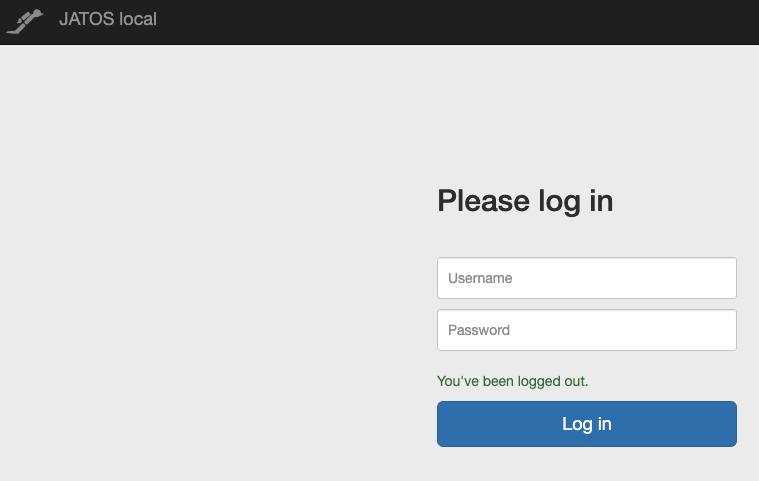


### JATOSで実験を登録する

以下のような画面になったら，```＋New Study```をクリックします。

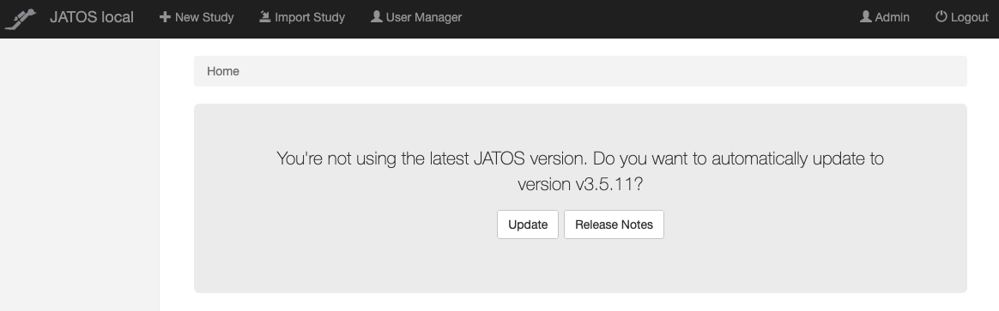

以下のような画面になったら，```Title```に課題名を入れ，```Study assets' directory name```にディレクトリ名を入れて，```Create```をクリックします。こうすると，dockerで用意したJATOSの/opt/docker/study_assets_root/内に実験課題用のフォルダが作られます（以下の場合は，/opt/docker/study_assets_root内にrlというフォルダ作られます）。

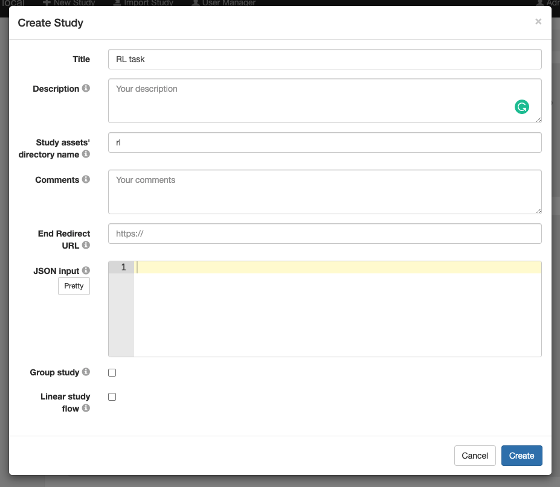

上記で準備した/opt/docker/study_assets_root/rl内にjsPsychの課題のファイルをコピーします。以下のようなコマンドをターミナル（コマンドプロンプトの場合は修正が必要に思います）で実行します（なお，今回は，Downloads/rl/内にファイルをおいています。フォルダ名は上記と同じにしています）。

```
docker cp  Downloads/rl/ jatos:/opt/docker/study_assets_root/
```

コピーができているか一応確認します。dokcerのイメージ内に入ります。

```
docker exec -i -t jatos bash
```

/opt/docker/study_assets_root/rl内をlsで確認をします。コピーしたファイルがあればOKです。

```
ls study_assets_root/rl
```

確認ができたら，以下のコマンドでイメージから出ます。

```
exit
```

さて，/opt/docker/study_assets_root/rlにコピーしたファイルを読み込みます。以下のように，```Components```をクリックして，```+New```をクリックします。

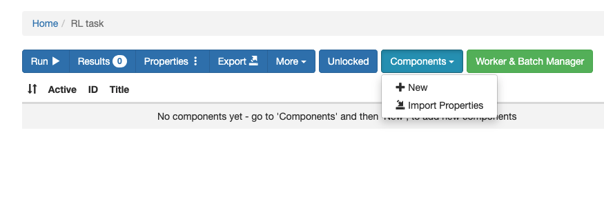


```Title```に課題名をいれて，```HTML file path```で課題のHTMLファイル名をいれて，```Create```をクリックします。なお，実験が複数の課題やコンポーネントからなる場合は，複数回登録をしてください。

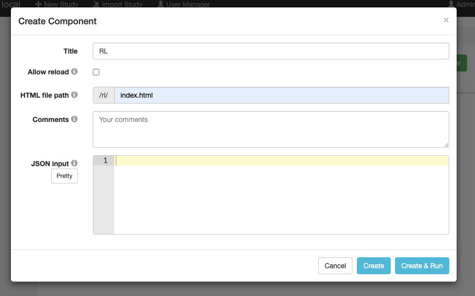

以下の赤で囲っている部分の```Run```をクリックすると，ローカルで実験課題を実行できます。テストしてみてください。

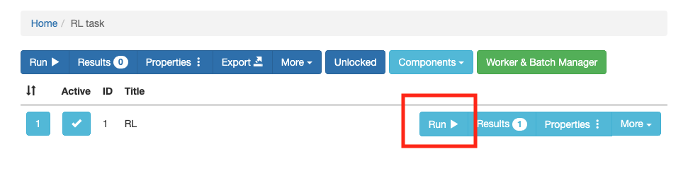

## JATOSサーバー上でjsPsychを使えるようにする

ウェブ実験を行う場合は，なんらかのサーバー上にJATOSをおいて実施します。GCPで準備する場合は，[Docker-composeを使ってGCE上の複数のサービス(Rstudio, Jupyter notebook, JATOS, elabFTW)をHTTPS化する方法](https://kunisatolab.github.io/main/how-to-docker-compose-https.html)を参照ください。それ以外にも[CentOS 8 & Nginx で JATOS 環境を作って，lab.js でオンライン実験を組むときに嵌まりそうなポイント](https://note.com/yoshi_majima/n/na07efd09097b)や[OpenSesame で心理学実験をしてみよう #2 JATOS サーバを使ったオンライン実験を設定してみよう](https://note.com/yoshi_majima/n/n304703126b22)などの有益な日本語資料もあるのでご自身の興味に合わせてご準備ください。

### ローカルのJATOSで準備した課題をエクスポートする

サーバー上のJATOSに課題をアップロードする場合，ローカルのJATOSで課題を準備してエクスポートしたものを読み込むのが便利です（jsPsychの場合は，推奨されています）。さきほど準備したローカルのJATOSのみて，以下の赤で囲っている部分の```Export```をクリックします。すると，これまで設定した実験課題がjzip形式で出力されます。なお，jzipは普通のzipと同じで，課題がまとめられて圧縮されたものです。

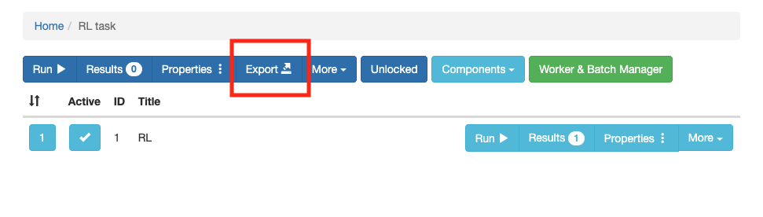

さて，サーバー上のJATOSに移動します。以下は，私がGCP上に用意したJATOSの画面です。```Import Study```をクリックします。

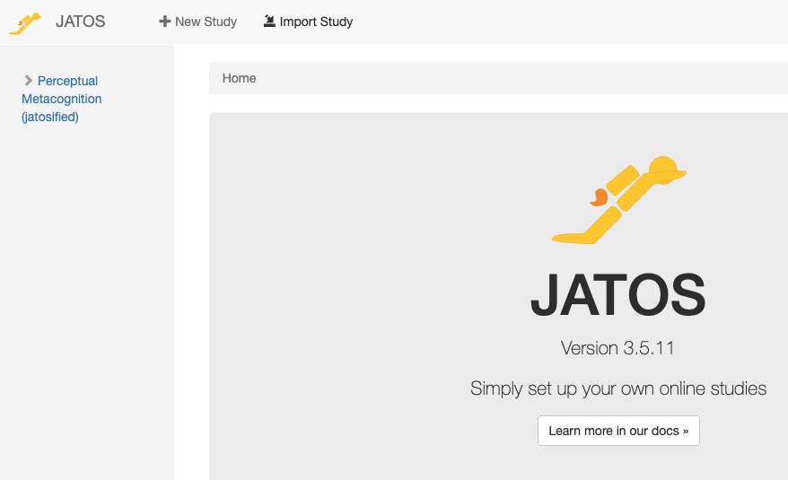

```Import Study```をクリックすると，ファイルの選択画面になるので，先程ローカルのJATOSからエクスポートしたjzip形式のファイルを選びます。以下のような画面で，```Import```を選択ください。左側にインポートした課題が出てきたら，成功です。

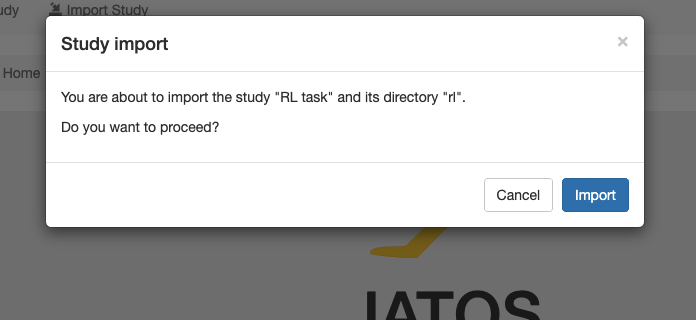

### ウェブ実験用のURLを準備する

以下で赤い線で囲った```Worker & Batch Manager```をクリックします。

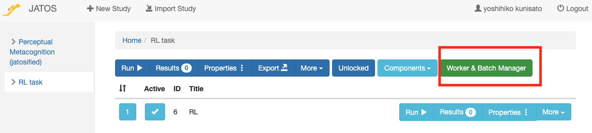

以下で赤い線で囲った```Get Worker Links```をクリックします。

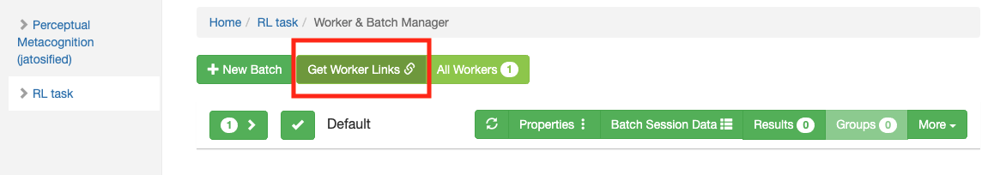

```Choose worker Type```で```General Sigle```を選んで，```Continue```をクリックします。

なお，worker Typeには以下の種類があります。

- Personal Single Worker: **参加者ごと**に**１回**だけ参加できるURLを発行
- Personal Multiple Worker:　**参加者ごと**に**複数回**参加できるURLを発行
- General Single Worker: **複数の参加者**が**１回**だけ参加できるURLを発行
- General Multiple Worker:**複数の参加者**が**複数回**参加できるURLを発行
- Mturk Worker: Amazon Mechanical Turk用URLを発行

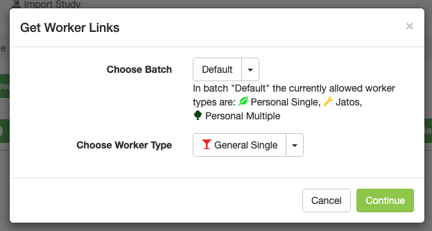

以下のように実験用のURLが表示されますので，参加者に配布して使うことができます。

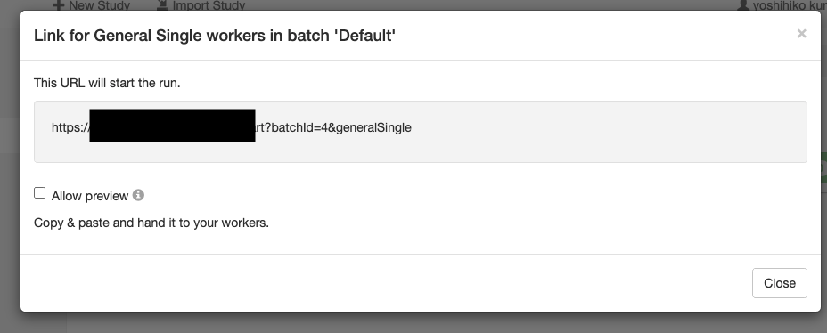

### ウェブ実験結果の確認

参加者の反応はJATOSサーバーに保存されます。結果を確認する場合，以下で赤い線で囲った```Results```をクリックします。

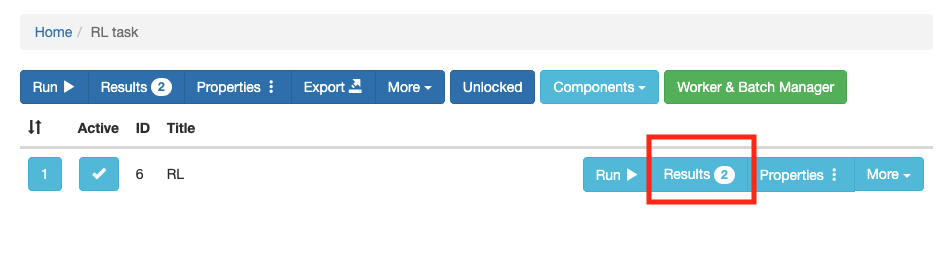

以下のような画面がでてきます。Comp.Result IDの４も５も私が試しにやってみた結果ですが，４の方は，途中でやめており，５は最後まで取り組みました。参加者の反応データは，た```Export Results```をクリックして，全てか選択したものを出力できます（txt形式で出力されます）。

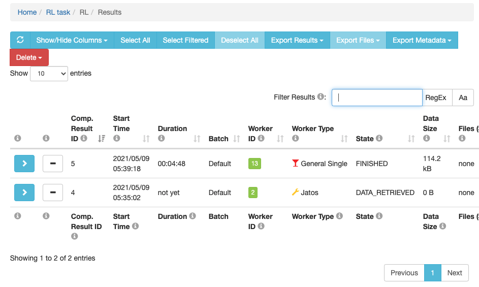


## おまけ：jsPsychとlab.jsをまぜてJATOSで動かす方法

jsPsychで作った課題とlab.jsで作った課題をJATOS上でまとめて動かしたい状況があるかと思います。例えば，lab.jsで課題やアンケートを作って，jsPsychでちょっとややこしい行動課題を作った場合，後からどちらかに統一するのはちょっと面倒です。可能ならそれぞれをJATOS上で統合して実行したいかなと思います。

### jsPsych課題の準備

jsPsych課題は以下のGitHubリポジトリの構造を意識して設定をします。

https://github.com/ykunisato/template-jsPsych-task

一般的には，jsPsych課題の名前のついたフォルダ内に，HTMLファイル，jsPsychのプラグインのフォルダ，刺激のフォルダなどを配置すると思います。JATOS上の統合をする場合は，以下のように，HTMLファイルはそれらの１つ上の階層におきます（HTMLファイルがname_of_repositoryフォルダから出て同じ階層にいるかと思います）。それに伴ってHTMLファイルないでのjsPsychプラグインのパス指定は，name_of_repositoryフォルダを含んだものになります（上記のGitHubリポジトリを参照ください）。

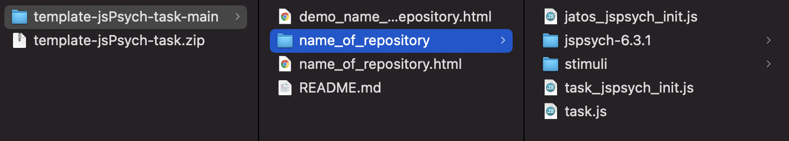


### lab.js課題の準備

lab.js Buliderで作業して完成したら（[lab.jsの導入はこちらをどうぞ](https://mklab-japan.github.io/jpa2021tws/labjs/)），以下のように，JATOS形式で保存します。するとzipファイルがダウンロードされると思います。

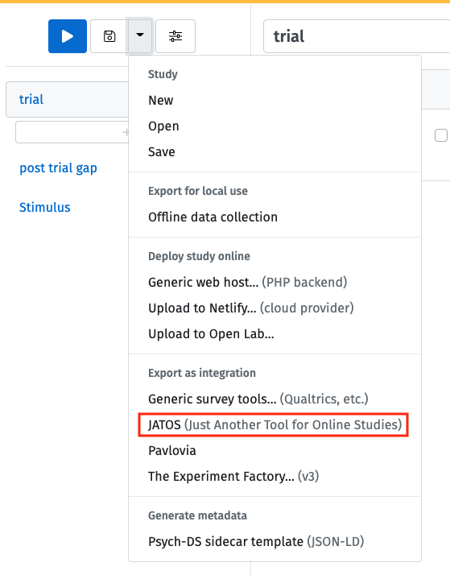

ダウロードされたzipを開くと以下のようになっていると思います。
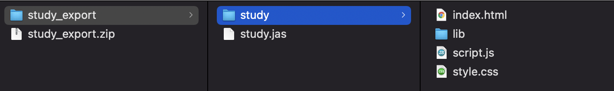

まず，study.jasを削除します。次に，Study内のindex.htmlを上の階層に移動させて，名前を変えます(ここではname_of_taskにしています)。そして，Studyフォルダも課題名にしておきます（以下のような感じにします）。最後に，index.htmlから名前を変更したHTMLファイルを開いて，パスを変更します（各種ファイルの間にname_of_taskフォルダ名が挟まります）。

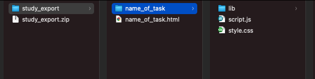

### JATOSify

JATOSifyするためにローカルにjsPsychとlab.jsを統合したフォルダを作ります。今回はstroopフォルダの下に，lab.jsで作った質問紙のquestion.htmlと各種ファイルがはいったquestionフォルダ，jsPsychで作ったストループ課題のstroop.htmlと各種ファイルがはいったstroopフォルダを配置しています。実験全体をコンポーネントに分けて，それぞれをlab.jsとjsPsychが担当している感じです。

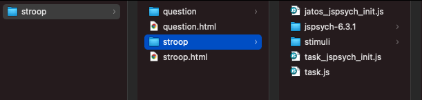

上の「JATOSで実験を登録する」を参考にJSATOS上でこの課題をローカルのJATOS上に登録していきます。今回は，Componentsでstroop.htmlとquestion.htmlを登録します。登録すると以下のような感じになります。stroopとquestionが登録されていますね。この順番で課題が実施されるので，JATOS上で実行すると，ストループ課題をしてから，質問紙が実施されます。

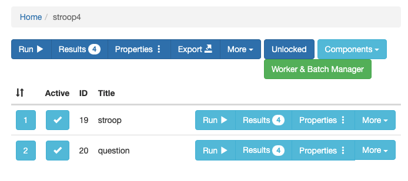

ローカルで作成したJATOSify済みのフォルダをエクスポートすれば，サーバー上のJATOSで実行できて，オンライン実験が可能です。以下は，私で試してみた結果です（同一IPアドレスからアクセスするので，テストではGeneral Multipleで実施しました）。参加者ごとにWorkerIDが割り振られて，その下にストループと質問紙の回答があります。

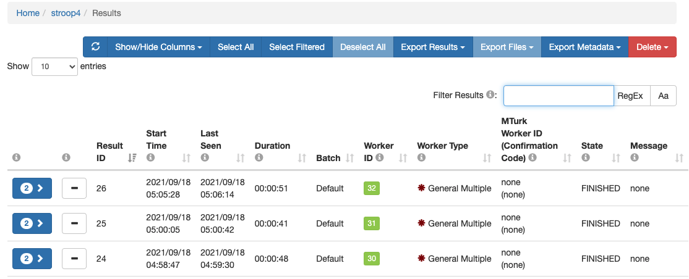

jsPsychとlab.jsを混ぜることができるのは便利ですね。