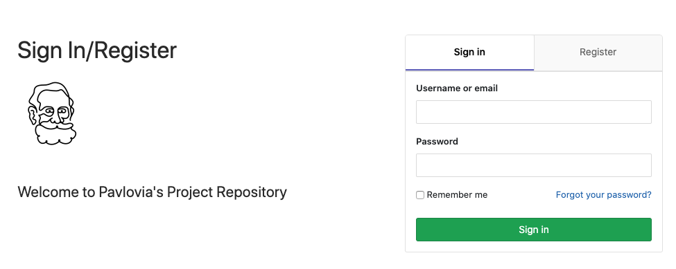
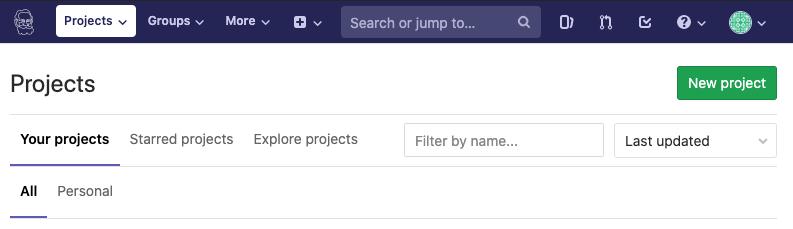
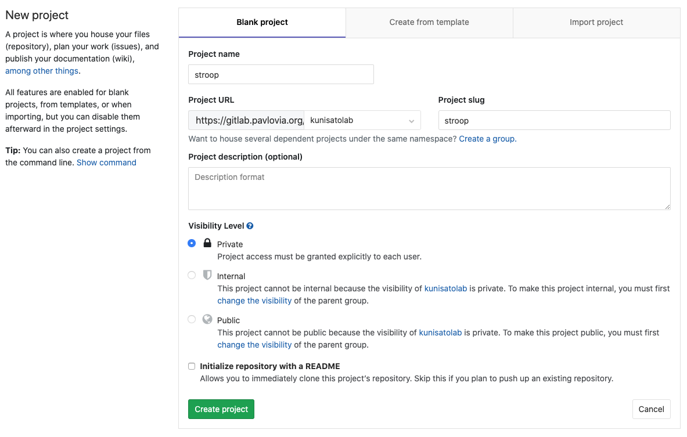
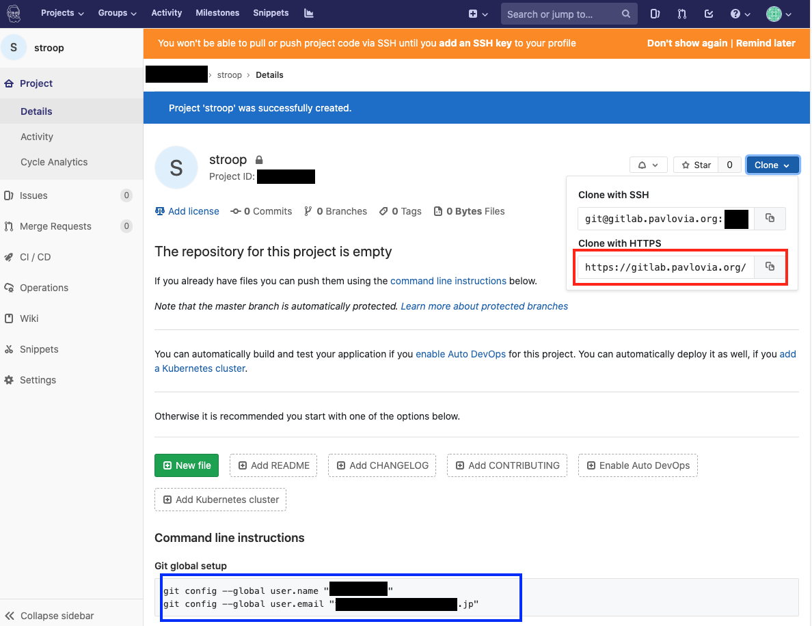
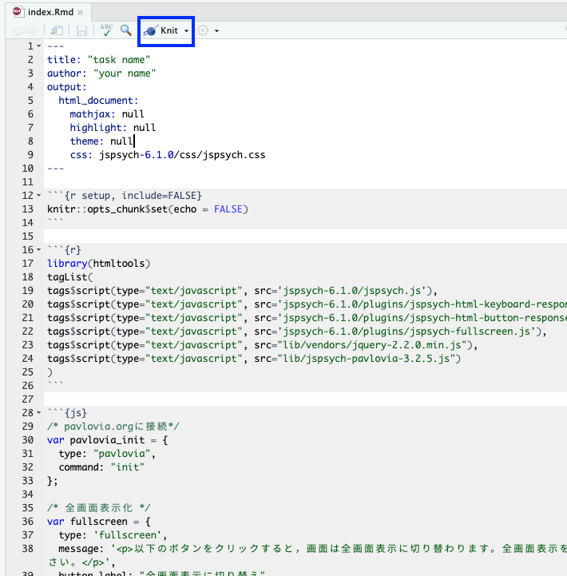
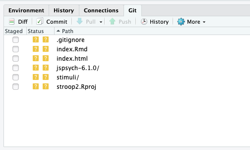
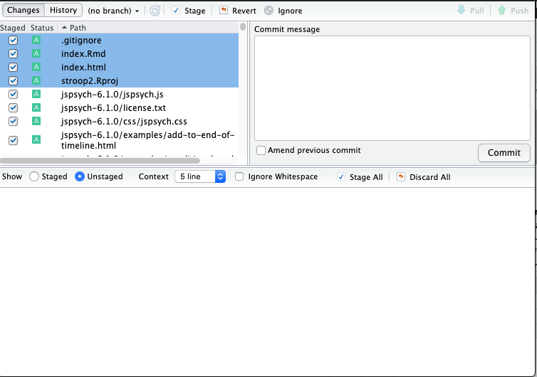

## 1.Pavlovia側の設定

Pavlovia(https://gitlab.pavlovia.org/users/sign_in )にログインします(アカウントを作ってない方はRegisterで登録ください）。

Pavloviaの利用には課金が必要ですが（詳しくはPavloviaのサイトでご確認ください），専修大学の心理学科では機関ライセンスを購入していますので，学科のメールアドレスで登録をしてください。


<br />

次に，PavloviaのGitLabページ（https://gitlab.pavlovia.org/dashboard/projects ）にアクセスします。以下のような感じの画面がでてくるので，「New project」をクリックして，実験を新規作成します。



<br />

Project nameに研究名とか課題名をいれてください（参加者に見えるので名前は工夫ください）。「Create project」をクリックします。なお，１つのPavloviaアカウント下に複数の研究グループなどがある場合は，グループを設定しておくと良いかと思います（以下では練習で，kunisatolabグループを設定してみました）。



<br />

プロジェクトを作ると，以下の画面が出てきます。赤色の部分（Clone with HTTP）のURLと青色の部分の情報（git configではじまる２行です）が必要なのでコピーして，どこかにメモしておきます。




<br />

## Pavloviaのリポジトリをクローンする

まず，Git global setupをします。Rstudioを開いて，Terminalタブで，上記の図の青色の部分をコピペして実行します。


次に，RStudio上でFile → New Project→Version Control→Gitと進めます。


<br />

このRepogitory URLに上記の図の赤色のClone with HTTPをコピペします。おそらくクローン（ダウンロード）がなされます。

次に，RStudioのTerminalというタブを探します。そして，そこに，上記の図の青色のgit configではじまる２行をコピペします。

これで，RStudio上からPavloviaに行動課題をPush（アップロード）したり，データをPull（ダウンロード）することができます。

<br />

## Pavlovia用の実験課題の作成

次に，ここまで設定したRstudio上のPavloviaの課題リポジトリ上でR Markdownを使って行動課題を作っていきます（pavloviaからクローンしたフォルダ内でR Markdownで行動課題を作ります）。その際に，jsPsychRmd(https://github.com/ykunisato/jsPsychRmd )を使うと，jsPscyhをPavloviaで実施する時に便利な関数などもついてきます。まず，Consoleに以下を打ち込んで，jsPsychRmdを読み込みます。もしエラーが出たら，まだインストールされてないかとおもいますので，その下の```remotes::install_github("ykunisato/jsPsychRmd")```を打ち込んで，インストールしてから，```library(jsPsychRmd)```を実行してください。

```
library(jsPsychRmd)
```

jsPsychRmdが読み込めたら，以下をConsoleに打ち込みます。以下を実行すると，jsPsychを使って行動課題のHTMLを出力するR Markdownファイル（index.Rmd），jsPsychのライブラリ(jspsych-6.3.1)，刺激をいれるstimuliフォルダを作ります。

```
set_jsPsych()
```

<br />

index.Rmdを開いてみましょう。まずは練習で，以下の青で囲ったKnitをクリックしてみましょう。しばらくすると，HTMLファイルが出力されて（index.html），「こんにちわあ」と表示されます。あとは，ご自身の作りたい行動課題の要素を追加していくとR Markdownから行動課題のHTMLファイルが作れるようになります（jsPsych自体のチュートリアルは[こちら](https://kunisatolab.github.io/main/code_tips.html)を確認ください）。



<br />

ご自身の課題が完成したら，index.Rmd内のjsブロックのタイムラインの設定のところのpavlovia_init，fullscreen（全画面表示のためのプラグイン），pavlovia_finishのコメントアウトをとります（つまり，行頭の//を消します）。pavlovia_initとpavlovia_finishの設定がないと，Pavloviaでのデータ収集はできません。なお，pavlovia_initとpavlovia_finishをタイムラインにいれると課題はローカルでは正常動作しなくなります（PavloviaにPush（アップロード）したら正常に動きます）。

```
/* タイムラインの設定（課題ができたらpavlovia_initとpavlovia_finishの//をとってください） */
var timeline = [];
timeline.push(pavlovia_init);
timeline.push(fullscreen);
timeline.push(welcome);
timeline.push(pavlovia_finish);
```

<br />

## Pavloviaへ課題をPushする

さて，作成した課題をPavloviaにCommitして，Pushします。まず，RstudioのGitタブを開きます。Commitをクリックします。



Pushするファイルを選んで，Stageをクリックして，Commit messageにコメントを書きます（自分が分かれば何でもいいです）。Commitをクリックします。それがうまく言ったら，Pushをクリックすれば，完了です（初回は少し時間かかるかもしれません）。



<br />

## Pavloviaでの課題のrun

[PavloviaのGitlab](https://gitlab.pavlovia.org/dashboard/projects)を確認して，一応課題がアップロードされているか確認します。ファイルが上がっていたら，次は，[Pavlovia](https://pavlovia.org)にいって，Dashboard→Experimentsで自分の作成した課題を開きます。多分INACTIVEになっていると思うので，PILOTINGで試して，うまくいきそうなら，RUNNINGをクリックします。データが保存されているか確認するために，ためしに何度かやってみると良いです。

<br />

## PavloviaからデータをPullする

PavloviaでRUNNINGすると，データが収集されるようになります。たまったデータは，先程課題を作ったRstudioのPavloviaプロジェクトのGitタブを開いて，Pullするとダウンロードされます。Pavloviaでなんどか反応をしてから，以下のGitタブのPullをクリックする。ダウンロードがはじまって，dataフォルダが作られて，その中にファイルが入っていると思います（デフォルトはcsvファイルで保存されます）。


<br />

## 刺激の事前読み込み

なお，jsPsychではウェブ上で実験をする際に，刺激の事前読み込みを自動的にやりますが，複雑な分岐を伴う課題を作ったりすると，自動ではやってくれないことがあります。その場合は，以下のように刺激の事前読み込みをしておくと良いです。

```
var images = ['img/i1.png','img/i2.png','img/i3.png'];
var audio = ['audio/a1.mp3','audio/a2.mp3','audio/a3.mp3'];
var video = ['video/v1.mp4', 'video/v2.mp4', 'video/v3.mp4'];

jsPsych.init({
    timeline: timeline,
    preload_audio: audio,
    preload_images: images,
    preload_video: video
});
```