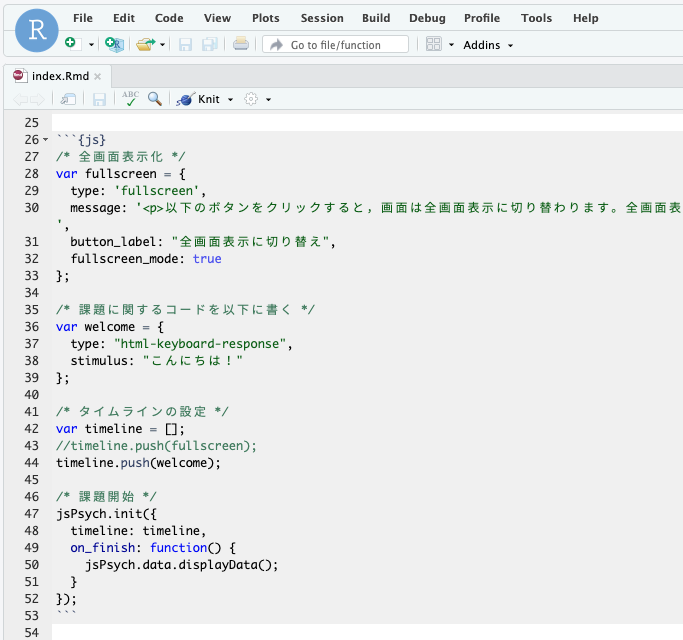
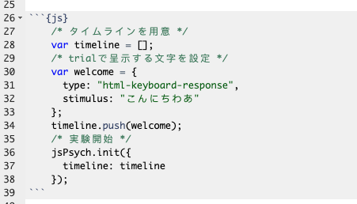
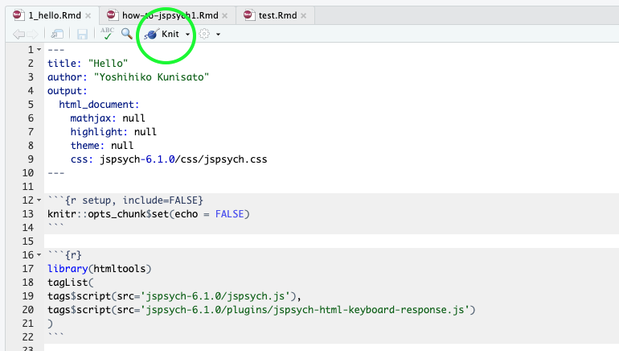
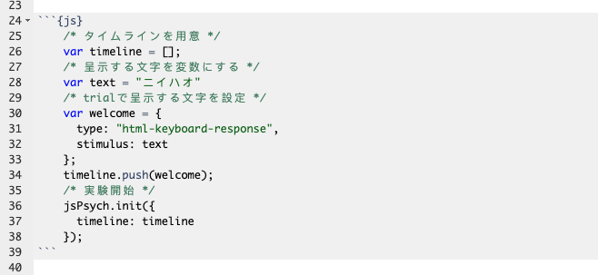
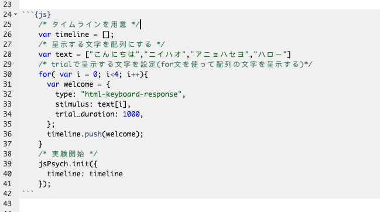
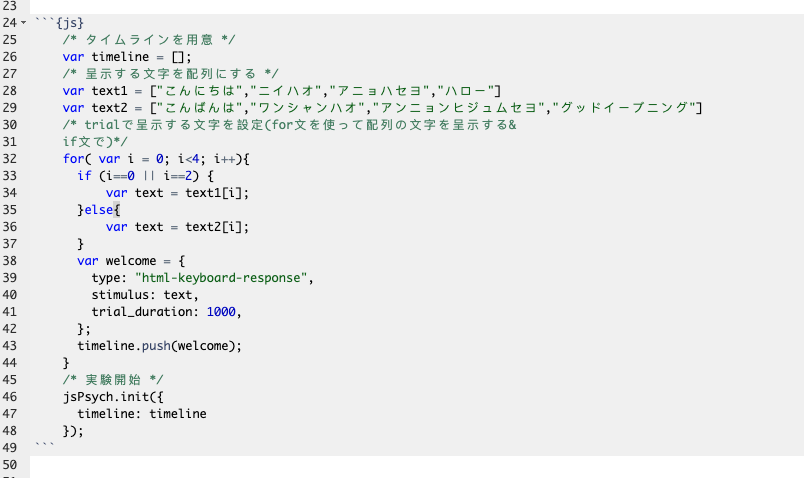

本ページでは，jsPsychを用いた認知課題の作成をRstudioで行う方法について解説をします。本ページでは，以下の内容を解説しています。

1. RstudioでjsPsychを使用するまでの準備
2. こんにちわjsPsych(文字を画面に表示)
3. JavaScriptの基本

<br>

## jsPsychとは

jsPsychとは，ウェブブラウザー（Microsoft Edge,Google Chrome,Safariなど）上で行動実験を行うためのJavaScriptライブラリーです。そもそもJavaScriptを上手く使えば，ウェブブラウザーで動作する行動実験課題は作成できます。しかし，全て一から作っていると大変です。そこで，jsPsychのライブラリーを活用することで，より楽に実験課題を作成することができます。

jsPsychの情報としては，[jsPsychのオフィシャルサイト](https://www.jspsych.org/)に豊富にありますし，日本語でも九州大学文学部心理学研究室の黒木大一朗先生の[ウェブブラウザで心理学実験と調査jsPsych](https://sites.google.com/site/webdeshinri/home)にて詳細に解説されています[^1]。分からないことがあれば，まず，この２つのサイトを参照すると良いかと思います。RstudioでjsPsychを使う方法は，[Matthew Crump氏のGithub](https://github.com/CrumpLab/jsPsychR)を参考ください。

jsPsychは，de Leeuw, J. R. 氏が開発したもので，使用する際には，以下の作成論文を引用するようにしましょう（卒論や修論で何らかのオープンソースソフトウェアを使ったら，必ず作成論文を引用してください）。

- de Leeuw, J. R. (2015). jsPsych: A JavaScript library for creating behavioral experiments in a web browser. Behavior Research Methods, 47(1), 1-12. doi:10.3758/s13428-014-0458-y.

<br>

## 1.jsPsychを使う準備

jsPsychを使うには，実験課題に関するフォルダを構成して，[jsPsychのリリースページ](https://github.com/jspsych/jsPsych/releases)から最新のjsPsychをダウンロードして，そのフォルダ内に配置したりする必要があります。それらの作業を自動的にやってくれるRパッケージのjsPsychRmd(https://github.com/ykunisato/jsPsychRmd )を国里が作成しています。これを使うと簡単に準備ができるので，以下で説明をします。


### 1.1 RstudioでjsPsychを使う準備

早速，RStudioを起動しましょう。Rstudioが起動すると以下のような画面かと思います。


まず，Consoleに以下を打ち込んで，jsPsychRmdを読み込みます。もしエラーが出たら，まだインストールされてないかとおもいますので，その下の```devtools::install_github("ykunisato/jsPsychRmd")```を打ち込んで，インストールしてから，```library(jsPsychRmd)```を実行してください。

```
library(jsPsychRmd)
```

次に，RstudioのSession → Set Working Directory → Choose Directoryを選択して，カレントワーキングディレクトリを実験課題の作成をする予定のフォルダに設定します（国里のゼミ生の場合は，GitHubリポジトリのexerciseフォルダを選択してください）。カレントワーキングディレクトリの設定ができたら，Consoleに以下を打ち込みます。

```
set_jsPsych(file_name = "hello")
```

すると，以下のような"hello"という名前のフォルダ内に以下のようなファイルとフォルダが用意されます。

- index.Rmd: jsPsychで課題を作る際にメインのファイルとなるRmdファイルです。
- jspsych-6.1.0: [jsPsychのオフィシャルサイト](https://www.jspsych.org/)からダウンロードしたjsPsychのライブラリです。
- stimuli: 刺激をいれるフォルダです。このままここに刺激を入れてもいいですし，imgって名前に変更して画像ファイルをいれてもいいです（チュートリアルはimgといった名前を使っているので，そっちの方が楽かも）。


### 1.2 R MarkdonとjsPsychで行動課題を作る

R Markdon(ファイルの拡張子は.Rmd)は，ざっくり言うと，文章とプログラミングコード（基本的にはRだが，JavaScriptやPyhtonも使える）をまとめてHTMLファイル(インターネットのサイトを作っているファイル)にして出力してくれるものです。R Markdownの詳細については，[Kazutan氏のサイト](https://kazutan.github.io/kazutanR/Rmd_intro.html)が非常に勉強になると思います。R Markdownは，解析コードと文章を１つのファイルに読みやすい形でまとめられるので，解析などでも便利なものですが，ここでは，jsPsychを使うために利用します。


さて，上記で作成されたindex.Rmdを開いてください。以下のように，すでに書き込まれているかと思います。まずは，特に考えずに，赤い四角で囲ったKnitをクリックしてみましょう。Knitをクリックすると，RmdからHTMLファイルが作成されて，画面上に「こんにちは」というのが出てきます。それができていたら，成功です。


<br>

## 2. こんにちわjsPsych(文字を画面に表示)

だいたいプログラミングの最初は，「Hello World」とか書くので，今回も「こんにちわあ」と画面に表示させることにします。

### 2.1 JavaScriptの書き込み


jsPsychの本体のコードは，チャンクを{js}とする（このチャンク内でjsPsychを使ったjsコードを書く）。{js}内を書き込んだものを画像で見せると以下のような感じです。なお，まだ{js}内は書かなくても大丈夫です。




先程のRmdの準備の段階で，プラグインなどの準備はできているので，JavaScriptの本体の記載に集中します。以下の画像の{js}チャンクをご自身のRmdファイルに転記してください（コピペだけだと覚えないので・・・）。

コードの内容を説明すると，まずtimelineというものを準備します（これは試行の順番などを指示するものです。timelineに従って課題は進みます。なお，timeline名はtimeline以外の名前でも使えます）。「こんいちわあ」という文字を出すwelcome試行を設定して（プラグインのhtml-keyboard-responseを使用），timelineにプッシュしています（イメージするなら登録ですね）。最後に，jsPsych.initで，timelineに従って実験をするように指定しています。



### 2.2 RmdからHTMLファイルを出力する

Rmdファイルの書き込みが完成したら，以下の緑の丸で囲った「Knit」ボタンをクリックします。これをクリックすると，RmdファイルからHTMLファイル生成されます。HTMLファイルができると，それが別ウィンドウで開かれて，画面上に「こんにちわあ」が呈示されるかと思います。それができたら成功です（上手く行かない場合は，上の画像をよく見て，記入ミスがないか確認してください）。



<br>

#### 演習課題1

- 「こんにちわあ」の代わりに「こんばんわあ」と画面に表示してみましょう。

## 3. JavaScriptの基本
### 3.1 JavaScriptで変数と配列を使ってみる

まず，新規にRmdファイルを作成して，hello1.Rmdの内容をコピペして，hello2.Rmdという名前で保存します。

プログラミングをしていると，変数というのが出てきます。変数は簡単にいうと箱です。箱ですので，好きなものをいれることができます（ただ，箱によっては，入れられるものと入れられないものがあります）。JavaScriptでは，「これが変数だよ」っと宣言する場合には，varを使います。先程のコードだと，var timeline = []というのがありましたが，これは，timelineという変数に，空っぽの配列[]をいれるよという宣言です(配列については後で説明します)。

変数を上手く使うことで効率よくコードが書けるので，少し練習をしてみましょう。さきほどは，"こんにちわあ"という文字を直接指定して画面に出してみましたが，今度は，textという変数に"ニイハオ"という文字をいれて，そのtextを画面に出すようにしてみましょう。以下のコードを書いて実行してください。



変数に追加して覚えておくと良いのが配列です。配列は，簡単にいうと，複数の値を変数に格納したものです（箱の中に入っている物が複数ある状態です）。例えば，以下のように書くと，textの中には，"こんにちは"から始まって４つの挨拶が入っていると宣言することになります。

```
var text = ["こんにちは","ニイハオ","アニョハセヨ","ハロー"]
```

このtextの中の特定の挨拶を指定したい場合，その配列のインデックスで指定します。難しい言い方をしましたが，配列の何番目か数字で指定するという意味です。その際，その数字は0番目から始まるのに注意します。つまり，上記のtextの場合，text[1]は"ニイハオ"であり，"こんにちは"はtext[0]です。普通だと1番目から数えると思うのに0からスタートするのは忘れないようにしておきましょう（なお，Rだと1からスタートしますし，PythonだとJavaScriptと同じく0からスタートします。ややこしいですね）。

#### 演習課題2

- textに"こんにちは","ニイハオ","アニョハセヨ","ハロー"の４つを格納して，"アニョハセヨ"を画面に呈示してください。

### 3.2 JavaScriptでfor文を使ってみる

3.1で配列を覚えました。その配列の中身４つを順番に呈示したい時，以下のように書くとそれができます。なお，さきほどまでの設定だと，なにかキーボード入力がないと次の刺激に進まないので，stimulusの後ろに"trial_duration: 1000,"を追加しています。これは刺激を1000ms(1000ミリ秒つまり1秒)呈示するという意味です。

```
    /* タイムラインを用意 */
    var timeline = [];
    /* 呈示する文字を変数にする */
    var text = ["こんにちは","ニイハオ","アニョハセヨ","ハロー"]
    /* trialで呈示する文字を設定 配列[0] */
    var welcome = {
      type: "html-keyboard-response",
      stimulus: text[0],
      trial_duration: 1000
    };
    timeline.push(welcome);
    /* trialで呈示する文字を設定 配列[1]*/
    var welcome = {
      type: "html-keyboard-response",
      stimulus: text[1],
      trial_duration: 1000
    };
    timeline.push(welcome);
    /* trialで呈示する文字を設定 配列[2]*/
    var welcome = {
      type: "html-keyboard-response",
      stimulus: text[2],
      trial_duration: 1000
    };
    timeline.push(welcome);
    /* trialで呈示する文字を設定 配列[3]*/
    var welcome = {
      type: "html-keyboard-response",
      stimulus: text[3],
      trial_duration: 1000
    };
    timeline.push(welcome);
    /* 実験開始 */
    jsPsych.init({
      timeline: timeline
    });
```
これでもいいのですが，配列のインデックス以外同じコードが４回も繰り返されており，なんという無駄が多いように感じます。単純に繰り替えているだけですので，こういう場合は，繰り返し作業のためのfor文というのを使います。

for文は以下のように書いて，繰り返したい内容をfor(){　  }で囲みます。そいて，for()の()内で，いつから初めていつ繰り返しをやめるのかを設定します。var i = 0; i<4; i++とすると，0からはじまって3まで繰り返します(それぞれ繰り返すたびにその値がiに代入されます)。var i = 3; i<6; i++とすると，3からはじまって5まで繰り返します。

```
for (var i = 0; i<終了したい数+1; i++) {
  // 繰り返したい内容
}
```

for文が分かったところで，さきほどの配列の中身４つを呈示するのは，以下のように書くことができます。for文で書くとすっきりしますね。さて，for文で書いたものを動かしてみましょう。



#### 演習課題3

- 色々な国の挨拶を８カ国分用意して，for文で8カ国分の挨拶を呈示してみましょう！

### 3.3 JavaScriptでif文を使ってみる

3.2では繰り返しのfor文を覚えました。あとは分岐のif文を覚えれば基礎は終了です。

for文は同じ内容を繰り返す場合に使います。そのため，ほぼ同じ内容だけど，少しだけ違う場合には使えないです。例えば，for文のインデックスが奇数の場合は配列Aから刺激を出して，偶数の場合は配列Bから刺激を出すというのは単純なfor文だとちょっと難しい。こういう時に条件分岐のif文を使えると簡単にプログラミングできます。

if文は以下のように書きます。if()の()内に条件文を書き，その条件に合致していれば{}内の処理がなされます。もしその後に，else if()やelse()が続くなら，最初のif()に合致しない場合に，その後の条件にあれはれば，その{}内の処理がなされます。なお，if()は最初だけで，その後はelse if()が続き，最後は上記以外を意味するelse()を使います。ただ，if()だけで終わることもあります。


```
if (条件1) {
  条件1が真であれば実行
} else if (条件2) {
  条件1が偽で条件2が真であれば実行
}
else {
  条件1も2も偽であれば実行
}
```

具体例として，BMIから「やせ」，「普通」，「肥満」を判定する場合を考えます。この場合，if文は以下のようにかけます。最初のif()は「BMIが18.5より低いなら"やせ"とする」という意味です。次のelse if文は，「BMIが18.5以上25未満なら"普通"とする」という意味です。なお，このようにAかつBを表現するには&&を使い，AまたはBを表現するには||を使います。

- A || B ←A OR B(AまたはB)
- A && B ←A AND B(AかつB) 

最後のelse()は，「上記以外のBMIなら（つまりは25以上なら）"肥満"とする」という意味です。こんな感じでif文なら条件分岐を表現できます。

```
if (BMI < 18.5) {
  var himan = "やせ" 
} else if (BMI >=18.5 && BMI < 25) {
  var himan = "普通" 
}
else {
  var himan = "肥満" 
}
```

さて，本題に戻って，以下のように，「こんにちは」の配列のtext1と「こんばんは」の配列のtext2を用意します。そして，for文のindexが偶数(ここでは0か2です)ならtext1を，奇数ならtext2を呈示してみましょう。



#### 演習課題4
- 「こんにちは」の配列のtext1と「こんばんは」の配列のtext2にそれぞれ２つ足して，要素を６つにします。さらに，各国の「おはようございます」が６つ入った配列を追加して(text3としますか)，色々な国の挨拶を朝・昼・晩と順番に6回呈示してみましょう！[^2]

[^1]:本ページを作る際に，黒木先生のサイトをかなり参考にさせていただきました。特に，必要最小限のJavaScriptの知識について大変参考になりました。

[^2]:時間が余った人は，演習課題4で３つの配列を順番に呈示した際に配列には４つ入っているのに全て使ってないことに気がついたと思います。全て使い切るにはどうすればよいでしょうか？考えて，試してみましょう。