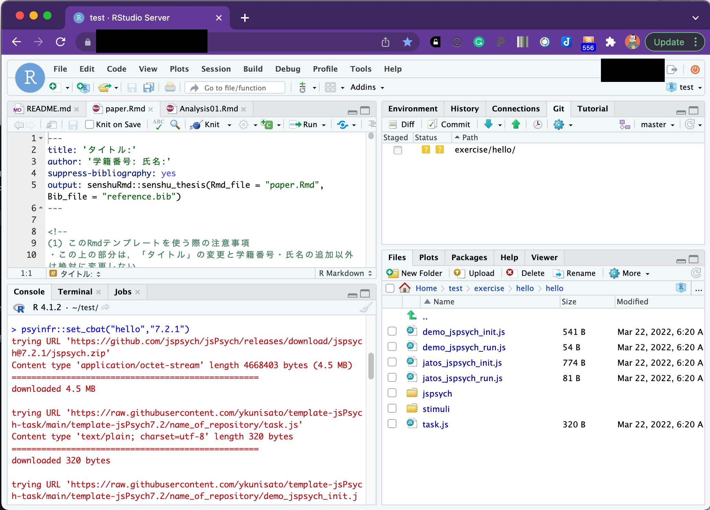
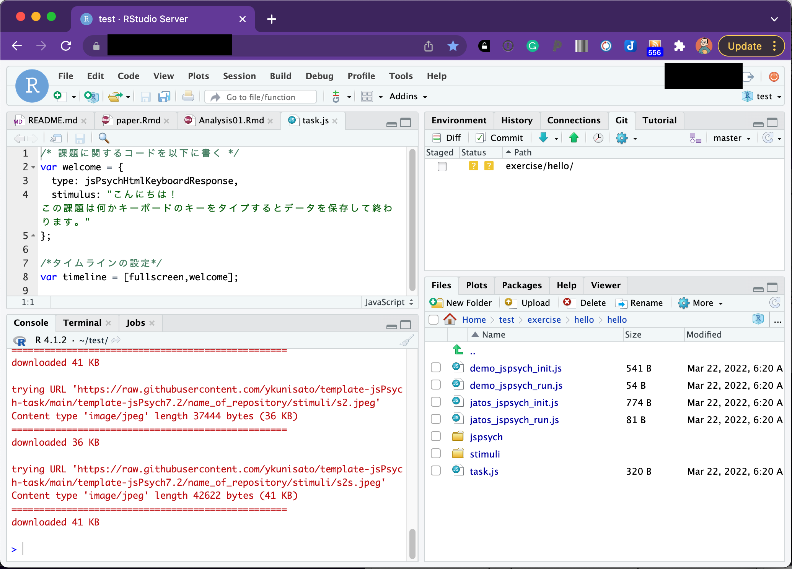

本ページでは，jsPsychを用いた認知課題の作成をRstudioで行う方法について解説をします。本ページでは，以下の内容を解説しています。**なお，以降の解説は，jsPsychのバージョン7についてになります。6系とな異なりますので，ご注意ください。**

1. RstudioでjsPsychを使用する準備をする
2. jsPsychで画面に文字を表示する
3. JavaScriptの基本を学ぶ

<br>

## jsPsychとは

jsPsychとは，ウェブブラウザー（Microsoft Edge,Google Chrome,Safariなど）上で行動実験を行うためのJavaScriptライブラリーです。そもそもJavaScriptを上手く使えば，ウェブブラウザーで動作する行動実験課題は作成できます。しかし，全て一から作っていると大変です。そこで，jsPsychのライブラリーを活用することで，より楽に実験課題を作成することができます。

jsPsychの情報としては，<a href="https://www.jspsych.org/" target="_blank">jsPsychのオフィシャルサイト</a>に豊富にありますし，日本語でも九州大学文学部心理学研究室の黒木大一朗先生の<a href="https://sites.google.com/site/webdeshinri/home" target="_blank">ウェブブラウザで心理学実験と調査jsPsych</a>にて詳細に解説されています[^1]。分からないことがあれば，まず，この２つのサイトを参照すると良いかと思います。また，国里も参加していますが，jsPsychやlab.jsのユーザー会であるpsyJSもあります。psyJSに興味がある方は，<a href="https://docs.google.com/forms/d/e/1FAIpQLSceA62ngL2M4UrRwo-imU2gAwLgdJg9P6s11TT22MThG8pT-A/viewform?usp=sf_link" target="_blank">こちらの登録フォーム</a>からご参加ください。


jsPsychは，de Leeuw, J. R. 氏が開発したもので，使用する際には，以下の作成論文を必ず引用するようにしましょう（卒論や修論で何らかのオープンソースソフトウェアを使ったら，必ず作成論文を引用してください）。

- de Leeuw, J. R. (2015). jsPsych: A JavaScript library for creating behavioral experiments in a web browser. Behavior Research Methods, 47(1), 1-12. doi:10.3758/s13428-014-0458-y.

また，黒木大一朗先生がjsPsychに関する非常に便利なプラグインのjspsych-psychophysicsを開発されています。もし，jspsych-psychophysicsを使った場合は，以下の黒木先生の論文を必ず引用してください。

- Kuroki, D. (2021). A new jsPsych plugin for psychophysics, providing accurate display duration and stimulus onset asynchrony. Behav Res 53, 301–310  https://doi.org/10.3758/s13428-020-01445-w

<br>

## 1.jsPsychを使う準備

jsPsychを使うには，実験課題に関するフォルダを作って，最新のjsPsychをダウンロードしてそのフォルダ内に配置したり色々とする必要があります。それらの作業を自動的にやってくれるRパッケージの<a href="https://github.com/ykunisato/jsPsychRmd" target="_blank">jsPsychRmd</a> を作りました。以下で説明をします。


### 1.1 RstudioでjsPsychを使う準備

早速，RStudioを開きましょう。なお，以降の解説は，<a href="https://kunisatolab.github.io/main/how-to-write-with-rstudio.html" target="_blank">RStudioで研究を行う準備</a> で，Research Compendiumの準備ができた前提で進めます。

**以下のコードをRStudioのConsoleにコピペして実行してください。**実行すると，ダウンロードに少し時間がかかります。しばらくすると，index.Rmdというファイルが開き，Research Compendiumのexerciseフォルダ内にhelloというフォルダができて，index.Rmdとその他必要なフォルダやファイルが準備されます。これで，jsPsychのプログラミング準備完了です！

もし，Research Compendiumを設定されてない場合は，エラーがでますが，カレントディレクトリーにexerciseという名前のフォルダを作ってもらえば，動作すると思います。

<br>

```{r eval=FALSE, include=TRUE}
psyinfr::set_cbat("hello","7.2.1")
```


<br>

"hello"フォルダを開くと以下のファイルがあります。以降で使うのは，基本的にdemo_hello.htmlだけです。

- demo_hello.html: ローカルでのデータ収集や動作確認に使うHTMLファイル
- hello.html: JATOS上でデータ収集を行う際に使うHTMLファイル
- hello: JavaScriptファイルや刺激などをいれるフォルダ

 

<br>

さらに"hello"フォルダを開くと以下のファイルがあります。以降で使うのは，基本的にtask.jsだけです（認知課題によってはstimuliなどを使う）。

- task.js: 認知課題の説明をするフォルダ
- stimuli: 刺激などをいれるフォルダ
- jspsych: jsPsychライブラリがおかれたフォルダ 
- demo_jspsych_init.js~jatos_jspsych_run.js: task.jsの設定だけで認知課題が動くようにするためのファイル達

 

<br>


#### psyinfr::set_cbat()のフォルダ構成について(専門家向け)

psyinfr::set_cbat()で第１引数に課題名を指定すると課題名のフォルダ内に左端（１層目）のHTMLファイルとフォルダを用意します。「demo_タスク名.html」は，ローカルPCやサーバー上で認知課題を実行するための各種設定の入ったHTMLファイルです。課題作成中の確認などでも使えます。そして，「タスク名.html」はJATOS上で認知課題を実行するための各種設定の入ったHTMLファイルです。これらのHTMLファイルはプラグイン追加以外では編集をせず，タスク名フォルダ（以下ではhelloフォルダ）以下のファイルを編集することで認知課題を作っていきます。

１層目の課題名フォルダ内（以下だとhelloフォルダ）に，事前に用意されたjavaScriptファイル(demo_jspsych_init.js~jatos_jspsych_run.js),jsPsychライブラリのあるフォルダ(jspsych)，刺激をおくフォルダ(stimuli)，課題のjavaScriptファイル(task.js)があります。基本的には，task.jsを編集することで認知課題を作っていきます。jspsychフォルダは基本的にはいじりませんし，事前に用意されたjavaScriptファイル(demo_jspsych_init.js~jatos_jspsych_run.js)は，task.jsの変更をすれば，「demo_タスク名.html」と「タスク名.html」の両方に変更が反映させるように調整するためのファイル群です。psyinfr::set_cbat()の設計思想としては，認知課題の作成者は基本的に「task.js」を編集していけば，認知課題が作れるというものです（編集すべきファイルを限定して，作業に集中しやすくしました）。また，ゼミや研究者でフォルダ形式を定めることで，可読性と組み合わせが可能になるように工夫をしています。


 

<br>

### 1.2 HTMLファイルをブラウザで開いてみる


さて，早速，用意された「demo_hello.html」を開いてみましょう！RStudio上で「demo_hello.html」をクリックすると選択肢が出てくるので，「View in Web Browser」を選びます。


<br>

すると以下の様が画面が出てきます。既にHTMLも下位ディレクトリも設定できているので，全画面化のための教示がでてきます。「開始」を押してください。


<br>

全画面表示されて困ったかもしれませんが，ブラウザの機能で適宜全画面表示は解除できます。何かキーボードをタイプするとCSVファイルがダウンロードされます。


<br>

```psyinfr::set_cbat("hello","7.2.1")``` を使えば，既に(1)全画面化,(2)教示の呈示，(3)データ保存が含まれたテンプレートが用意されます。みなさんは，これからtask.jsを編集して，(2)の部分を拡張することで認知課題を作っていきます。


## 2. jsPsychで文字を画面に表示してみる。

それでは，早速，task.jsを編集してみましょう！RStudioでtask.jsをクリックして，開いてください。



<br>

task.jsを開くと以下のようなコードが書き込んであります。(1)全画面化,(2)教示の呈示，(3)データ保存のうち(1)と(3)は別のところで書かれており，task.jsは(2)の部分を書いています。この(2)を増やしていくことで，認知課題を作っていきます。

```
/* 課題に関するコードを以下に書く */
var welcome = {
  type: jsPsychHtmlKeyboardResponse,
  stimulus: "こんにちは！ この課題は何かキーボードのキーをタイプするとデータを保存して終わります。"
};

/*タイムラインの設定*/
var timeline = [fullscreen,welcome];
```

```/* XXXX */``` /と*でコメントアウトができて，XXXは実行されません。何かメモを残す場合に利用ください。jsPsychでは，```var 名前 = ｛type: "プラグイン"｝```で，行動課題の各画面（課題の説明画面，刺激の呈示画面，反応の取得画面など）を作っていきます。```var welcome``` では，jsPsychのjsPsychHtmlKeyboardResponseプラグインを使用するため，typeでjsPsychHtmlKeyboardResponseを指定します。jsPsychHtmlKeyboardResponseは，名前の通り，HTMLファイル形式で定義した刺激を呈示して，キーボードの反応を記録するプラグインです。```stimulus: "こんにちは！ この課題は何かキーボードのキーをタイプするとデータを保存して終わります。"``` としており，「こんにちは！ この課題は何かキーボードのキーをタイプするとデータを保存して終わります。」を画面に呈示します。その他の設定はしていないので，キーボードから何か入力があれば（キーを指定していないのでなんでもいい），終了します。

var welcomeみたいに認知課題の各場面が作れたら，どういう順番で出すのかを決めます。それは，```var timeline = [fullscreen,welcome];``` で指定をします。fullscreenはtask.jsとは別のファイルで指定しているので，task.jsになくても使えます。なお，fullscreenは，画面の全画面化なのですが，課題の作成中にテストする場合に全画面化すると少し面倒かもしれないので，```var timeline = [welcome];``` のようにfullscreenをとることで，画面の全画面化をやめることができます。

#### 演習課題1

- 画面の全画面化をやめて，「こんにちは！ この課題は何かキーボードのキーをタイプするとデータを保存して終わります。」の代わりに「こんばんは！ この課題は何かキーボードのキーをタイプするとデータを保存して終わります。」と画面に表示してみましょう。

## 3. JavaScriptの基本
### 3.1 JavaScriptで変数と配列を使ってみる

プログラミングをしていると，変数というのが出てきます。変数は簡単にいうと箱です。箱ですので，好きなものをいれることができます（つまり入れるものを変更できます）。JavaScriptでは，「これが変数だよ」っと宣言する場合には，varを使います。なお，箱にいれてから（変数に代入してから）変更しないこともあります。つまり変数だけどjsファイル内で変わらないものの場合です。その場合は，varではなくてconstを使います。


変数を上手く使うことで効率よくコードが書けるので，少し練習をしてみましょう。さきほどは，"こんにちは！〜"という文字をwelcome内で直接指定して画面に出してみましたが，今度は，textという変数に"ニイハオ"という文字をいれて，そのtextを画面に出すようにしてみましょう。以下のコードを書いて実行してください。なお，javascriptでは，；（セミコロン）を文字の区切りに使います。;を用いて，どこからどこまでが１文であるのかを示します。しばらくは以下の練習問題をやりつつ，;の使い方になれていってください。

```
/* 課題に関するコードを以下に書く */
const text = "ニイハオ";

const welcome = {
  type: jsPsychHtmlKeyboardResponse,
  stimulus: text
};

/*タイムラインの設定*/
const timeline = [welcome];
```

変数に追加して覚えておくと良いのが配列です。配列は，簡単にいうと，複数の値を変数に格納したものです（箱の中に入っている物が複数ある状態です）。例えば，以下のように書くと，textの中には，"こんにちは"から始まって４つの挨拶が入っていると宣言することになります。

```
const text = ["こんにちは","ニイハオ","アニョハセヨ","ハロー"];
```

このtextの中の特定の挨拶を指定したい場合，その配列のインデックスで指定します。難しい言い方をしましたが，配列の何番目か数字で指定するという意味です。その際，その数字は0番目から始まるのに注意します。つまり，上記のtextの場合，text[1]は"ニイハオ"であり，"こんにちは"はtext[0]です。普通だと1番目から数えると思うのに0からスタートするので気をつけましょう（なお，Rだと1からスタートしますし，PythonだとJavaScriptと同じく0からスタートします。ややこしいですね）。

#### 演習課題2

- textに"こんにちは","ニイハオ","アニョハセヨ","ハロー"の４つを格納して，"アニョハセヨ"を画面に呈示してください。

### 3.2 JavaScriptでfor文を使ってみる

3.1で配列を覚えました。その配列の中身４つを順番に呈示したい時，以下のように,welcomeを配列の中身の数だけ書くとそれができます。なお，さきほどまでの設定だと，なにかキーボード入力がないと次の刺激に進まないので，stimulusの後ろに"trial_duration: 1000,"を追加しています。これは刺激を1000ms(1000ミリ秒つまり1秒)呈示するという意味です。

```
/* 課題に関するコードを以下に書く */
const text = ["こんにちは","ニイハオ","アニョハセヨ","ハロー"];

const welcome1 = {
  type: jsPsychHtmlKeyboardResponse,
  stimulus: text[0],
  trial_duration: 1000,
};

const welcome2 = {
  type: jsPsychHtmlKeyboardResponse,
  stimulus: text[1],
  trial_duration: 1000,
};

const welcome3 = {
  type: jsPsychHtmlKeyboardResponse,
  stimulus: text[2],
  trial_duration: 1000,
};

const welcome4 = {
  type: jsPsychHtmlKeyboardResponse,
  stimulus: text[3],
  trial_duration: 1000,
};

/*タイムラインの設定*/
const timeline = [welcome1,welcome2,welcome3,welcome4];
```

これでもいいのですが，配列のインデックス以外welcomの設定に同じコードが４回も繰り返されており，なんだか無駄が多いように感じます。単純に繰り返しているだけですので，こういう場合は，繰り返し作業のためのfor文というのを使います。

for文は以下のように書いて，繰り返したい内容をfor(){　  }で囲みます。そして，for()の()内で，いつから初めていつ繰り返しをやめるのかを設定します。var i = 0; i<4; i++とすると，0からはじまって3まで繰り返します(それぞれ繰り返すたびにその値がiに代入されます)。var i = 3; i<6; i++とすると，3からはじまって5まで繰り返します。

```
for (var i = 0; i<終了したい数+1; i++) {
  // 繰り返したい内容
}
```

for文が分かったところで，さきほどの配列の中身４つを呈示するのは，以下のように書くことができます(今回はtimelineへのpushをfor文内ですることにしたので，タイムラインの設定が最後ではなく前にきています。認知課題を作る場合は，タイムラインは後ろにある方が作りやすいかと思います)。for文で書くとすっきりしますね。さて，for文で書いたものを動かしてみましょう。

```
/* 課題に関するコードを以下に書く */
const text = ["こんにちは","ニイハオ","アニョハセヨ","ハロー"];

/* タイムラインの設定 */
const timeline = []
for (var i = 0; i<4; i++) {
  const welcome = {
    type: jsPsychHtmlKeyboardResponse,
    stimulus: text[i],
    trial_duration: 1000,
  };
  timeline.push(welcome);
}
```

#### 演習課題3

- 色々な国の挨拶を８カ国分用意して，for文で8カ国分の挨拶を呈示してみましょう！

### 3.3 JavaScriptでif文を使ってみる

3.2では繰り返しのfor文を覚えました。あとは分岐のif文を覚えれば基礎は終了です。for文は同じ内容を繰り返す場合に使います。そのため，ほぼ同じ内容だけど，少しだけ違う場合には使えないです。例えば，for文のインデックスが奇数の場合は配列Aから刺激を出して，偶数の場合は配列Bから刺激を出すというのは単純なfor文だとちょっと難しい。こういう時に条件分岐のif文を使えると簡単にプログラミングできます。

if文は以下のように書きます。if()の()内に条件文を書き，その条件に合致していれば{}内の処理がなされます。もしその後に，else if()やelse()が続くなら，最初のif()に合致しない場合に，その後の条件に当てはまれば，その{}内の処理がなされます。なお，if()は最初だけで，その後はelse if()が続き，最後は上記以外を意味するelse()を使います。ただ，if()だけで終わることもあります。


```
if (条件1) {
  条件1が真であれば実行
} else if (条件2) {
  条件1が偽で条件2が真であれば実行
}
else {
  条件1も2も偽であれば実行
}
```

具体例として，BMIから「やせ」，「普通」，「肥満」を判定する場合を考えます。この場合，if文は以下のようにかけます。最初のif()は「BMIが18.5より低いなら"やせ"とする」という意味です。次のelse if文は，「BMIが18.5以上25未満なら"普通"とする」という意味です。なお，このようにAかつBを表現するには&&を使い，AまたはBを表現するには||を使います。

- A || B ← A OR B(AまたはB)
- A && B ← A AND B(AかつB) 

最後のelse()は，「上記以外のBMIなら（つまりは25以上なら）"肥満"とする」という意味です。こんな感じでif文なら条件分岐を表現できます。

```
if (BMI < 18.5) {
  var himan = "やせ" 
} else if (BMI >=18.5 && BMI < 25) {
  var himan = "普通" 
}
else {
  var himan = "肥満" 
}
```

さて，本題に戻って，以下のように，「こんにちは」の配列のtext1と「こんばんは」の配列のtext2を用意します。そして，for文のindexが偶数(ここでは0か2です)ならtext1を，奇数ならtext2を呈示してみましょう。indexのiは0から始まるので，1が２に対応して，偶数が奇数となるのでややこしいですね。

```
/* 課題に関するコードを以下に書く */
const text1 = ["こんにちは","ニイハオ","アニョハセヨ","ハロー"];
const text2 = ["こんばんは","ワンシャンハオ","アンニョンヒジュムセヨ","グッドイーブニング"];

/* タイムラインの設定 */
const timeline = []
for( var i = 0; i<4; i++){
  if (i==0 || i==2) {
    var text = text1[i];
  }else{
    var text = text2[i];
  }
  const welcome = {
    type: jsPsychHtmlKeyboardResponse,
    stimulus: text,
    trial_duration: 1000,
  };
  timeline.push(welcome);
}
```

確かに，奇数は昼の挨拶，偶数は夜の挨拶になったのですが，「こんにちは」，「ワンシャンハオ」，「アニョハセヨ」，「グッドイーブニング」といった感じで，配列のすべての単語を呈示できてないです。そこで，text1とtext2の要素すべてを使って，繰り返し呈示することにします。いろいろな方法があるのですが，ここでは，for文を重ねることにします。最初のfor文はiを０から３まで１つずつふやしていきます。そして，その１回ごとに，２つ目のfor文があり，これはjが0から１まで１つずつ増えます（実質は，jは０と１です）。このようにすると，text1とtext2の配列のすべての要素を呈示できます。


```
/* 課題に関するコードを以下に書く */
const text1 = ["こんにちは","ニイハオ","アニョハセヨ","ハロー"];
const text2 = ["こんばんは","ワンシャンハオ","アンニョンヒジュムセヨ","グッドイーブニング"];

/* タイムラインの設定 */
const timeline = []
for( var i = 0; i<4; i++){
  for( var j = 0; j<2; j++){
    if (j==0) {
      var text = text1[i];
    }else{
      var text = text2[i];
    }
  const welcome = {
    type: jsPsychHtmlKeyboardResponse,
    stimulus: text,
    trial_duration: 1000,
  };
  timeline.push(welcome);
  }
}
```

#### 演習課題4
- 「こんにちは」の配列のtext1と「こんばんは」の配列のtext2にそれぞれ２つ足して，要素を６つにします。さらに，各国の「おはようございます」が６つ入った配列を追加して(text3としますか)，色々な国の6種の挨拶を朝・昼・晩と順番に呈示してみましょう！

[^1]:本ページを作る際に，黒木先生のサイトをかなり参考にさせていただきました。特に，必要最小限のJavaScriptの知識について大変参考になりました。