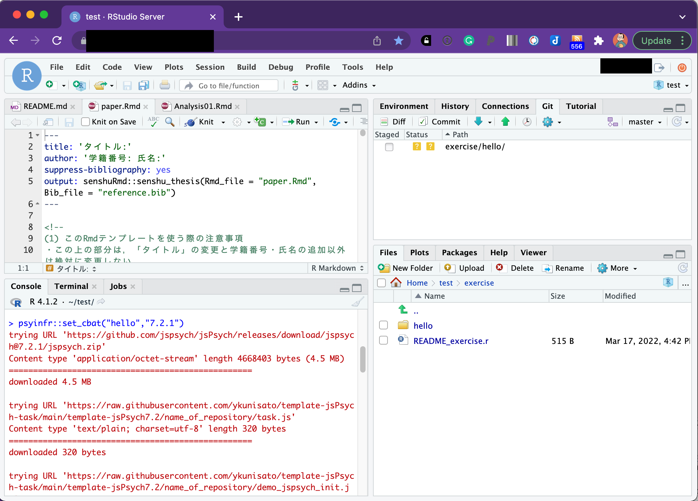

本ページでは，jsPsychを用いた認知課題の作成をRstudioで行う方法について解説をします。本ページでは，以下の内容を解説しています。

1. RstudioでjsPsychを使用する準備をする
2. jsPsychで画面に文字を表示する
3. JavaScriptの基本を学ぶ

<br>

## jsPsychとは

jsPsychとは，ウェブブラウザー（Microsoft Edge,Google Chrome,Safariなど）上で行動実験を行うためのJavaScriptライブラリーです。そもそもJavaScriptを上手く使えば，ウェブブラウザーで動作する行動実験課題は作成できます。しかし，全て一から作っていると大変です。そこで，jsPsychのライブラリーを活用することで，より楽に実験課題を作成することができます。

jsPsychの情報としては，<a href="https://www.jspsych.org/" target="_blank">jsPsychのオフィシャルサイト</a>に豊富にありますし，日本語でも九州大学文学部心理学研究室の黒木大一朗先生の<a href="https://sites.google.com/site/webdeshinri/home" target="_blank">ウェブブラウザで心理学実験と調査jsPsych</a>にて詳細に解説されています[^1]。分からないことがあれば，まず，この２つのサイトを参照すると良いかと思います。また，国里も参加していますが，jsPsychやlab.jsのユーザー会であるpsyJSもあります。psyJSに興味がある方は，<a href="https://docs.google.com/forms/d/e/1FAIpQLSceA62ngL2M4UrRwo-imU2gAwLgdJg9P6s11TT22MThG8pT-A/viewform?usp=sf_link" target="_blank">こちらの登録フォーム</a>からご参加ください。


jsPsychは，de Leeuw, J. R. 氏が開発したもので，使用する際には，以下の作成論文を必ず引用するようにしましょう（卒論や修論で何らかのオープンソースソフトウェアを使ったら，必ず作成論文を引用してください）。

- de Leeuw, J. R. (2015). jsPsych: A JavaScript library for creating behavioral experiments in a web browser. Behavior Research Methods, 47(1), 1-12. doi:10.3758/s13428-014-0458-y.

また，黒木大一朗先生がjsPsychに関する非常に便利なプラグインのjspsych-psychophysicsを開発されています。もし，jspsych-psychophysicsを使った場合は，以下の黒木先生の論文を必ず引用してください。

- Kuroki, D. (2021). A new jsPsych plugin for psychophysics, providing accurate display duration and stimulus onset asynchrony. Behav Res 53, 301–310  https://doi.org/10.3758/s13428-020-01445-w

<br>

## 1.jsPsychを使う準備

jsPsychを使うには，実験課題に関するフォルダを作って，最新のjsPsychをダウンロードしてそのフォルダ内に配置したり色々とする必要があります。それらの作業を自動的にやってくれるRパッケージの<a href="https://github.com/ykunisato/jsPsychRmd" target="_blank">jsPsychRmd</a> を作りました。以下で説明をします。


### 1.1 RstudioでjsPsychを使う準備

早速，RStudioを開きましょう。なお，以降の解説は，<a href="https://kunisatolab.github.io/main/how-to-write-with-rstudio.html" target="_blank">RStudioで研究を行う準備</a> で，Research Compendiumの準備ができた前提で進めます。


**以下のコードをRStudioのConsoleにコピペして実行してください。**実行すると，ダウンロードに少し時間がかかります。しばらくすると，index.Rmdというファイルが開き，exerciseフォルダ内にhelloというフォルダができて，index.Rmdとその他必要なフォルダやファイルが準備されます。これで，jsPsychのプログラミング準備完了です！

```{r eval=FALSE, include=TRUE}
psyinfr::set_cbat("stroop","7.2.1")
```

＊国里ゼミ以外でResearch Compendiumを使ってない場合は，", rc = TRUE"を削除して実行してください。

"hello"フォルダ内の説明をすると以下のようなファイルとフォルダが用意されます。

- index.Rmd: jsPsychで課題を作る際にメインのファイルとなるRmdファイルです。
- jspsych-6.3.1: jsPsychのサイトからダウンロードしたjsPsychのライブラリです。
- stimuli: 刺激をいれるフォルダです。





### 1.2 R MarkdonとjsPsychで行動課題を作る

R Markdown(.Rmd)は，文章とプログラミングコードをまとめてHTMLファイルにして出力してくれるものです。jsPsychはHTMLのプラグインなので，R Markdownを使うことで，jsPsychを組み込んだ実験課題の動作するHTMLファイルを出力できます。

さきほど開かれたindex.Rmdを確認して，以下の図で赤い四角で囲ったKnitをクリックしてみましょう。Knitをクリックすると，RmdからHTMLファイルが作成されます。画面上に「こんにちは！」というのが出てきたら，成功です。


<br>

## 2. jsPsychで文字を画面に表示してみる。

#### 2.1 jsPsychをR Markdownで使うための設定

まず，さきほどのindex.Rmdを見てください。２行目と３行目は課題名と自分の名前を入れてください（入れなくても動作はします）。それ以外は，14行目までは基本的に変更しないでください。１６行目から２４行目にかけては，jsPsychのプラグインを指定しています。今回は，jspsych-html-keyboard-response.js（HTML形式で刺激を呈示してキーボードから反応を取るもの）とjspsych-html-button-response.js（HTML形式で刺激を呈示してマウスから反応を取るもの）と
jspsych-fullscreen.js（全画面表示するもの）の３つのプラグインを使います。これからつくる課題によっては，別のプラグインを使うことになります。プラグインを追加する場合は，１６行目から２４行目のブロックに，```tags$script(src='jspsych-6.3.1/plugins/プラグイン名.js')```を追加します。


### 2.2 JavaScriptで課題を作る設定

jsPsychの本体のコードは，チャンクを{js}とします（このチャンク内でjsPsychを使ったjsコードを書きます）。こちらがjsPsychで課題を作成する際の本体になります。jsPsychRmdを使った場合は，以下の内容が事前に入っています。

```
/* 全画面表示化 */
var fullscreen = {
  type: 'fullscreen',
  message: '<p>以下のボタンをクリックすると，画面は全画面表示に切り替わります。全画面表示を止めたい場合はEscキーを押してください。</p>',
  button_label: "全画面表示に切り替え",
  fullscreen_mode: true
};

/* 課題に関するコードを以下に書く */
var welcome = {
  type: "html-keyboard-response",
  stimulus: "こんにちは！"
};

/* タイムラインの設定 */
var timeline = [];
//timeline.push(fullscreen);
timeline.push(welcome);

/* 課題開始 */
jsPsych.init({
  timeline: timeline,
  on_finish: function() {
    jsPsych.data.displayData();
  }
});
```

まず```var 名前｛type: "プラグイン"｝```で，行動課題の各画面（課題の説明画面，刺激の呈示画面，反応の取得画面など）を作っていきます。今回は，fullscreen（画面を全画面にするかの教示），welcome（画面に「こんにちは！」を呈示する）を用意しています。そして，用意した画面をtimelineにどんどん入れていきます（timelineに入れた順番で画面が用意されます）。今回は，welcomeだけtimelineに入れています（fullscreenは//でコメントアウトされているのでtimelineに入りません）。最後に，jsPsych.initで，timelineに従って実験をするように指定しています。

### 2.2 RmdからHTMLファイルを出力する

Rmdファイルの書き込みが完成したら，以下の緑の丸で囲った「Knit」ボタンをクリックします。これをクリックすると，RmdファイルからHTMLファイル生成されます。HTMLファイルができると，それが別ウィンドウで開かれて，画面上に行動課題が呈示されるかと思います。

<br>

#### 演習課題1

- 「こんにちは！」の代わりに「こんばんは！」と画面に表示してみましょう。

## 3. JavaScriptの基本
### 3.1 JavaScriptで変数と配列を使ってみる

プログラミングをしていると，変数というのが出てきます。変数は簡単にいうと箱です。箱ですので，好きなものをいれることができます（ただ，箱によっては，入れられるものと入れられないものがあります）。JavaScriptでは，「これが変数だよ」っと宣言する場合には，varを使います。先程のコードだと，var timeline = []というのがありましたが，これは，timelineという変数に，空っぽの配列[]をいれるよという宣言です(配列については後で説明します)。

変数を上手く使うことで効率よくコードが書けるので，少し練習をしてみましょう。さきほどは，"こんにちは！"という文字を直接指定して画面に出してみましたが，今度は，textという変数に"ニイハオ"という文字をいれて，そのtextを画面に出すようにしてみましょう。以下のコードを書いて実行してください。

```
/* 全画面表示化 */
var fullscreen = {
  type: 'fullscreen',
  message: '<p>以下のボタンをクリックすると，画面は全画面表示に切り替わります。全画面表示を止めたい場合はEscキーを押してください。</p>',
  button_label: "全画面表示に切り替え",
  fullscreen_mode: true
};

/* 課題に関するコードを以下に書く */
/* 呈示する文字を変数にする */
var text = "ニイハオ"
var welcome = {
  type: "html-keyboard-response",
  stimulus: text
};

/* タイムラインの設定 */
var timeline = [];
//timeline.push(fullscreen);
timeline.push(welcome);

/* 課題開始 */
jsPsych.init({
  timeline: timeline,
  on_finish: function() {
    jsPsych.data.displayData();
  }
});
```

変数に追加して覚えておくと良いのが配列です。配列は，簡単にいうと，複数の値を変数に格納したものです（箱の中に入っている物が複数ある状態です）。例えば，以下のように書くと，textの中には，"こんにちは"から始まって４つの挨拶が入っていると宣言することになります。

```
var text = ["こんにちは","ニイハオ","アニョハセヨ","ハロー"]
```

このtextの中の特定の挨拶を指定したい場合，その配列のインデックスで指定します。難しい言い方をしましたが，配列の何番目か数字で指定するという意味です。その際，その数字は0番目から始まるのに注意します。つまり，上記のtextの場合，text[1]は"ニイハオ"であり，"こんにちは"はtext[0]です。普通だと1番目から数えると思うのに0からスタートするのは忘れないようにしておきましょう（なお，Rだと1からスタートしますし，PythonだとJavaScriptと同じく0からスタートします。ややこしいですね）。

#### 演習課題2

- textに"こんにちは","ニイハオ","アニョハセヨ","ハロー"の４つを格納して，"アニョハセヨ"を画面に呈示してください。

### 3.2 JavaScriptでfor文を使ってみる

3.1で配列を覚えました。その配列の中身４つを順番に呈示したい時，以下のように,welcomeを配列の中身の数だけ書くとそれができます。なお，さきほどまでの設定だと，なにかキーボード入力がないと次の刺激に進まないので，stimulusの後ろに"trial_duration: 1000,"を追加しています。これは刺激を1000ms(1000ミリ秒つまり1秒)呈示するという意味です。

```
/* 全画面表示化 */
var fullscreen = {
  type: 'fullscreen',
  message: '<p>以下のボタンをクリックすると，画面は全画面表示に切り替わります。全画面表示を止めたい場合はEscキーを押してください。</p>',
  button_label: "全画面表示に切り替え",
  fullscreen_mode: true
};

/* 呈示する文字を変数にする */
var text = ["こんにちは","ニイハオ","アニョハセヨ","ハロー"]

/* trialで呈示する文字を設定 配列[0] */
var welcome1 = {
    type: "html-keyboard-response",
    stimulus: text[0],
    trial_duration: 1000
};

/* trialで呈示する文字を設定 配列[1]*/
var welcome2 = {
    type: "html-keyboard-response",
    stimulus: text[1],
    trial_duration: 1000
};

/* trialで呈示する文字を設定 配列[2]*/
var welcome3 = {
    type: "html-keyboard-response",
    stimulus: text[2],
    trial_duration: 1000
};

/* trialで呈示する文字を設定 配列[3]*/
var welcome4 = {
    type: "html-keyboard-response",
    stimulus: text[3],
    trial_duration: 1000
};

/* タイムラインの設定 */
var timeline = [];
//timeline.push(fullscreen);
timeline.push(welcome1);
timeline.push(welcome2);
timeline.push(welcome3);
timeline.push(welcome4);

/* 課題開始 */
jsPsych.init({
  timeline: timeline,
  on_finish: function() {
    jsPsych.data.displayData();
  }
});
```
これでもいいのですが，配列のインデックス以外welcomの設定に同じコードが４回も繰り返されており，なんという無駄が多いように感じます。単純に繰り替えているだけですので，こういう場合は，繰り返し作業のためのfor文というのを使います。

for文は以下のように書いて，繰り返したい内容をfor(){　  }で囲みます。そいて，for()の()内で，いつから初めていつ繰り返しをやめるのかを設定します。var i = 0; i<4; i++とすると，0からはじまって3まで繰り返します(それぞれ繰り返すたびにその値がiに代入されます)。var i = 3; i<6; i++とすると，3からはじまって5まで繰り返します。

```
for (var i = 0; i<終了したい数+1; i++) {
  // 繰り返したい内容
}
```

for文が分かったところで，さきほどの配列の中身４つを呈示するのは，以下のように書くことができます(今回はtimelineへのpushをfor文内ですることにしたので，タイムラインの設定が最後ではなく前にきています。行動課題を作る場合は，タイムラインは後ろにある方が作りやすいかと思います)。for文で書くとすっきりしますね。さて，for文で書いたものを動かしてみましょう。

```
/* 全画面表示化 */
var fullscreen = {
  type: 'fullscreen',
  message: '<p>以下のボタンをクリックすると，画面は全画面表示に切り替わります。全画面表示を止めたい場合はEscキーを押してください。</p>',
  button_label: "全画面表示に切り替え",
  fullscreen_mode: true
};

/* タイムラインの設定 */
var timeline = [];
//timeline.push(fullscreen);

/* 呈示する文字を変数にする */
var text = ["こんにちは","ニイハオ","アニョハセヨ","ハロー"]

for (var i = 0; i<4; i++) {
  var welcome = {
    type: "html-keyboard-response",
    stimulus: text[i],
    trial_duration: 1000
  };
  timeline.push(welcome);
}

/* 課題開始 */
jsPsych.init({
  timeline: timeline,
  on_finish: function() {
    jsPsych.data.displayData();
  }
});
```

#### 演習課題3

- 色々な国の挨拶を８カ国分用意して，for文で8カ国分の挨拶を呈示してみましょう！

### 3.3 JavaScriptでif文を使ってみる

3.2では繰り返しのfor文を覚えました。あとは分岐のif文を覚えれば基礎は終了です。for文は同じ内容を繰り返す場合に使います。そのため，ほぼ同じ内容だけど，少しだけ違う場合には使えないです。例えば，for文のインデックスが奇数の場合は配列Aから刺激を出して，偶数の場合は配列Bから刺激を出すというのは単純なfor文だとちょっと難しい。こういう時に条件分岐のif文を使えると簡単にプログラミングできます。

if文は以下のように書きます。if()の()内に条件文を書き，その条件に合致していれば{}内の処理がなされます。もしその後に，else if()やelse()が続くなら，最初のif()に合致しない場合に，その後の条件にあれはれば，その{}内の処理がなされます。なお，if()は最初だけで，その後はelse if()が続き，最後は上記以外を意味するelse()を使います。ただ，if()だけで終わることもあります。


```
if (条件1) {
  条件1が真であれば実行
} else if (条件2) {
  条件1が偽で条件2が真であれば実行
}
else {
  条件1も2も偽であれば実行
}
```

具体例として，BMIから「やせ」，「普通」，「肥満」を判定する場合を考えます。この場合，if文は以下のようにかけます。最初のif()は「BMIが18.5より低いなら"やせ"とする」という意味です。次のelse if文は，「BMIが18.5以上25未満なら"普通"とする」という意味です。なお，このようにAかつBを表現するには&&を使い，AまたはBを表現するには||を使います。

- A || B ← A OR B(AまたはB)
- A && B ← A AND B(AかつB) 

最後のelse()は，「上記以外のBMIなら（つまりは25以上なら）"肥満"とする」という意味です。こんな感じでif文なら条件分岐を表現できます。

```
if (BMI < 18.5) {
  var himan = "やせ" 
} else if (BMI >=18.5 && BMI < 25) {
  var himan = "普通" 
}
else {
  var himan = "肥満" 
}
```

さて，本題に戻って，以下のように，「こんにちは」の配列のtext1と「こんばんは」の配列のtext2を用意します。そして，for文のindexが偶数(ここでは0か2です)ならtext1を，奇数ならtext2を呈示してみましょう。

```
/* 全画面表示化 */
var fullscreen = {
  type: 'fullscreen',
  message: '<p>以下のボタンをクリックすると，画面は全画面表示に切り替わります。全画面表示を止めたい場合はEscキーを押してください。</p>',
  button_label: "全画面表示に切り替え",
  fullscreen_mode: true
};

/* タイムラインの設定 */
var timeline = [];
//timeline.push(fullscreen);

/* 呈示する文字を配列にする */
var text1 = ["こんにちは","ニイハオ","アニョハセヨ","ハロー"]
var text2 = ["こんばんは","ワンシャンハオ","アンニョンヒジュムセヨ","グッドイーブニング"]
/* trialで呈示する文字を設定(for文を使って配列の文字を呈示する&if文で)*/
for( var i = 0; i<4; i++){
  if (i==0 || i==2) {
    var text = text1[i];
  }else{
    var text = text2[i];
  }
  var welcome = {
    type: "html-keyboard-response",
    stimulus: text,
    trial_duration: 1000,
  };
  timeline.push(welcome);
}

/* 課題開始 */
jsPsych.init({
  timeline: timeline,
  on_finish: function() {
    jsPsych.data.displayData();
  }
});
```

#### 演習課題4
- 「こんにちは」の配列のtext1と「こんばんは」の配列のtext2にそれぞれ２つ足して，要素を６つにします。さらに，各国の「おはようございます」が６つ入った配列を追加して(text3としますか)，色々な国の挨拶を朝・昼・晩と順番に6回呈示してみましょう！[^2]

[^1]:本ページを作る際に，黒木先生のサイトをかなり参考にさせていただきました。特に，必要最小限のJavaScriptの知識について大変参考になりました。

[^2]:時間が余った人は，演習課題4で３つの配列を順番に呈示した際に配列には４つ入っているのに全て使ってないことに気がついたと思います。全て使い切るにはどうすればよいでしょうか？考えて，試してみましょう。