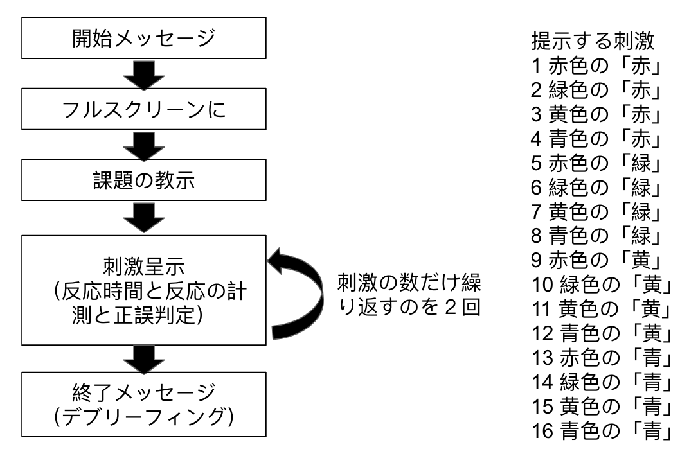
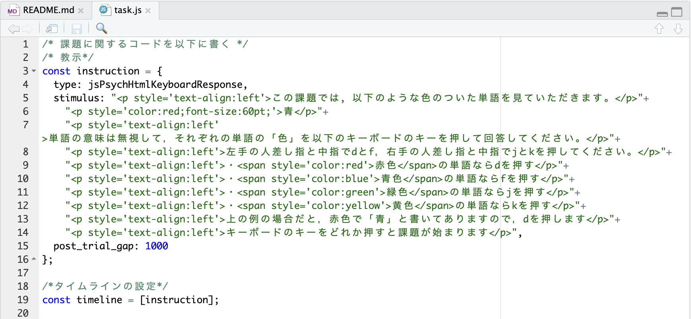
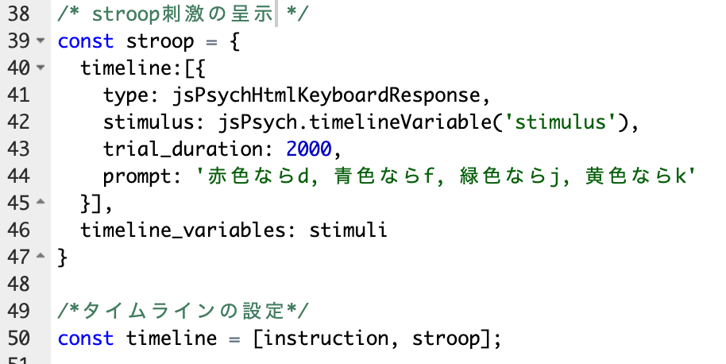
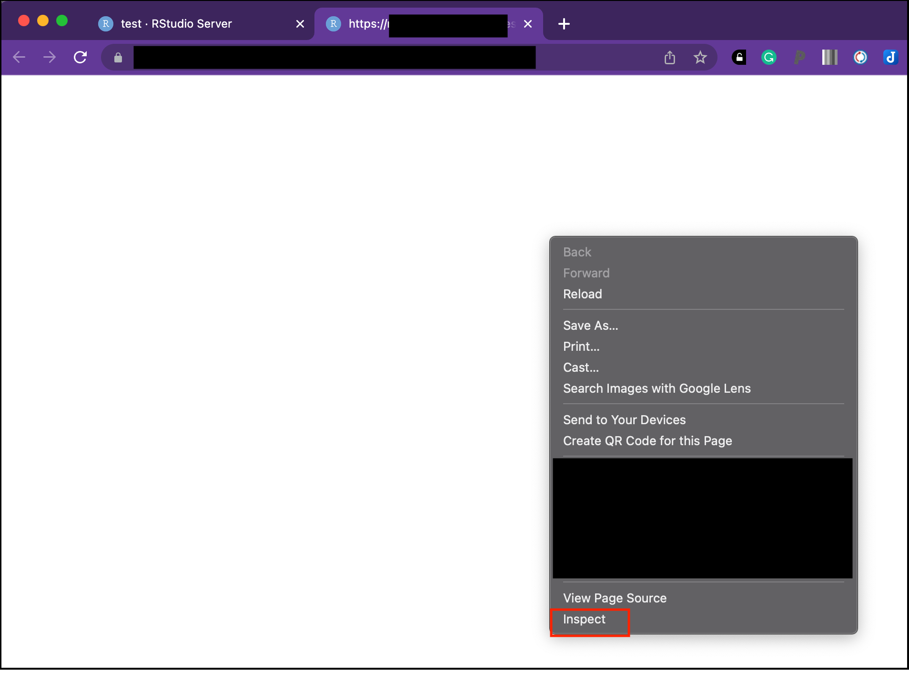
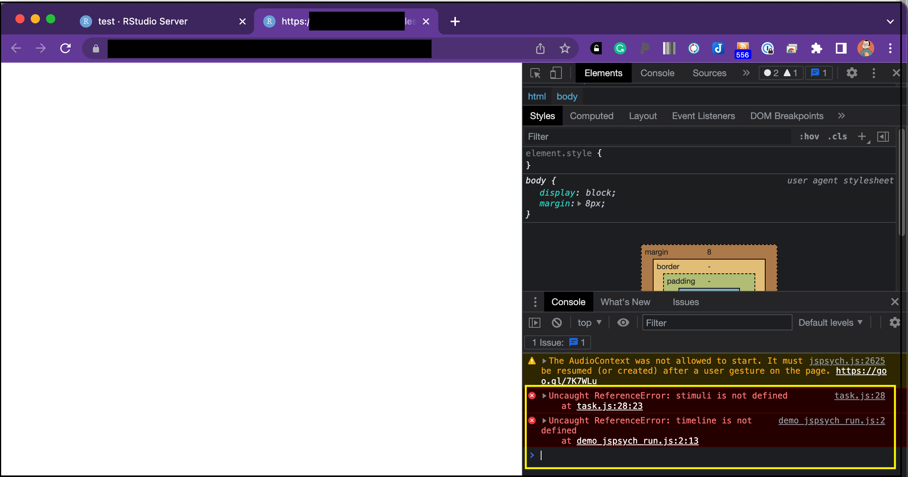

本ページでは，jsPsychを用いた認知課題の作成をRstudioで行う方法について解説をします。以下では，簡単なストループ課題を作ってみて，jsPsychでの課題作成方法を学びます。

<br>

## 0. ストループ課題を作る準備

ストループ課題に限りませんが，認知課題をプログラミングする場合に，いきなりそのままプログラムを書くのは避けたほうが良いです。私が認知課題を作る時に普段やっていることを整理すると以下のような感じになります。

1. 課題の情報を整理する
2. 課題の設計図を作る
3. 教示と課題のメインブロックを最もシンプルな形で作る
4. 課題のメインブロックに機能を追加をする
5. メインブロック以外のブロックを追加していく

1~5にまっすぐ進むわけでなく，試行錯誤しつつ，行きつ戻りつしながら進みます。特に初学者にとって大切なのは，１と２です。課題の情報を整理して紙などに課題の設計図を書いてみること，いきなり実際に行う課題を作ろうとするのではなくメインブロックを一番シンプルな形（例えば，ストループ課題の場合は，文字を画面に出すこと）で作ることです。その後で，徐々に機能を追加していきます。いきなり完成形を作ろうとしなくても良いです。

<br>

## 1. 課題の情報を整理する

まずストループ課題の情報を整理します。

ストループ課題は，以下のように文字の意味と文字の色が同じだったり違ったりすることで，意味と色の情報が干渉しあうストループ効果を調べる課題です。典型的には，以下の左のように意味と色が一致な刺激や右のように不一致な刺激を呈示し，意味ではなく色に関して反応するように求めます。その時の反応時間を計測して，一致条件よりも不一致条件の方が反応時間が長い場合にストループ効果が示されたとします（不一致条件では，色の判断に意味の情報が干渉するので遅くなる）。


ストループ課題にもいろいろなタイプがありますが，今回は，赤色・青色・緑色・黄色の４つの刺激を使って，一致条件と不一致条件を作って，キーボードのボタン押しによって，反応時間を測定することにしましょう。

<br>

## 2. 課題の設計図を作る

それではストループ課題の設計図を作ってみましょう！私はなにかプログラムを書くときは，必ず全体像を紙に書き出してから作業を始めます（別に紙じゃなくてもいいんですが，最初からコードを書かないということです）。がむしゃらにトライアンドエラーを繰り返すのも大切ですが，まずは自分が作ろうとしているものの全体像を紙に書き出します。

全体像を書き出すと，以下のようになります（以下の図は私が紙に書き出したものをGoogle スライドで清書したものです。必ず，紙などに書き出す習慣をつけましょう。ゼミだとホワイトボードを使いますね）。図の左側にあるように，開始メッセージ（画面に「ようこそ！」みたいなのを出す），フルスクリーンにする（ブラウザの一部で実験課題をすると集中できないのでフルスクリーンで実施します），課題の教示（課題について説明する文書です），課題のメインの部分（ストループ刺激を呈示して，反応を取得する。そして，これを刺激の数だけ繰り返す），終了メッセージ（課題終了のメッセージです。今回は正答率などのフィードバックもすることにします）の順番になります。

ここで大切なのは，実験課題は全体で１つというよりは，いくつかのブロックから構成されているとうことです。全体をいきなり作るのは結構たいへんですが，一部のブロックだけ作るなら頑張れるかもしれません。こうやって小さなブロックをいくつか作って，それをLEGOブロックみたいに組み合わせることで全体を作っていきます。こういう小さなブロックに分けて作っていくやり方を意識するようにしてみてください。



そして，図の右側のように刺激の組み合わせも書き出します。赤・緑・黄・青の４種類があるので，色４種と文字４種で16通りがあります。そして，1，6，11，16が一致条件，それ以外は不一致条件ですね。上の図のような順番で刺激を呈示すると，参加者は予想できてしまいますので，刺激呈示する際には，ランダム化して呈示します。

紙に書き出すとか古臭いと思うかもしれませんが，こういう地味な作業をすることが漏れのない設計に繋がります。実験課題などのプログラミングだけでなく，理論やモデルの理解の際にもこういう習慣を身に着けておくと良いです。

<br>

## 3. 教示と課題のメインブロックを最もシンプルな形で作る

さて，設計図を見るといくつかあるブロックの中で一番メインのプロックは刺激呈示をして反応を取得するブロックです。これを最もシンプルな形で作るとすれば，反応の取得はおいておいて，まずは刺激を呈示するブロックを作ることになります。ということで，以下では，早速，教示と課題のメインブロックの刺激呈示部分を作ることとにします。なぜ教示も作るかというと，教示は一般的には簡単につくれることが多いのと，教示は参加者向けのものではありますが，上記の設計図と同じ働きをして，課題の全体像を意識することにつながります。


さて，ストループ課題用を作るための準備をします。**以下をRStudioのConsoleに打ち込んで準備をしましょう。**


```{r eval=FALSE, include=TRUE}
psyinfr::set_cbat("stroop","7.2.1")
```

フォルダとファイルが準備されるので，demo_stroop.htmlファイルをブラウザで開いて，stoopフォルダ内のtask.jsファイルを開こう。


＊国里ゼミ以外でResearch Compendiumを使ってない場合は，カレントディレクトリーにexerciseという名前のフォルダを作ってもらえば，そちらにフォルダを用意します。

<br>

### 3.1 教示を呈示する

早速，教示を作ってみましょう。以下のような内容を画面に呈示して，説明をします（＜＞内はその前の単語の色を指定しています）。

```
この課題では, 以下のような色のついた単語を見ていただきます。
青＜赤色＞
単語の意味は無視して，それぞれの単語の「色」を以下のキーボードのキーを押して回答してください。
左手の人差し指と中指でdとf，右手の人差し指と中指でjとkを押してください。
・赤色＜赤色＞の単語ならdを押す
・青色＜青色＞の単語ならfを押す
・緑色＜緑色＞の単語ならjを押す
・黄色＜黄色＞の単語ならkを押す
上の例の場合だと，赤色で「青」と書いてありますので，dを押します
キーボードのキーをどれか押すと課題が始まります
```

task.jsを開いて,コードを書いてみましょう。教示は，以下のように，typeにjsPsychHtmlKeyboardResponseを使って呈示します。stimulusってところで呈示する内容を指定します。post_trial_gapは，教示出してから次に移行する間の時間です。ここでは，1000msに設定します。なお，教示の説明部分は，pで挟まれた文章がありますが，これは，文字の大きさを変えたり，左揃えにする際に必要になります。そして，spanで挟まれた文章は，文字の色を変えることができます。

教示の設定を書く，instructionができたら，timelineを作って，instructionを追加します。demo_stroop.htmlファイルをブラウザで開いて，動作確認しましょう。



基本の教示ブロックが完成しました。

<br>

### 3.2 ストループ刺激を呈示する

さて，次はメインのブロックです。メインのブロックでは，ストループ刺激（色のついた文字）を呈示し，その反応を取得します。ただいきなり反応取得までいくとごちゃごちゃしますので，まずは刺激を順番通りに呈示するだけにします（ランダム化しない）。段階を踏むのは遠回りに思えるかもしれませんが，いきなり色々と入れ込むとわけわからなくなるので，やめておきましょう。

以下のように，stimuliの中に16個のストループ刺激(stimulus)を用意します。p styleで色やフォントサイズの指定をしています（最初のstimulusは赤色の60ポイントの「赤」という文字ですね）。上の課題の設計図のところで作成したように，刺激を順番に指定します。これで，stimuliには，16個の色と文字の異なる刺激が準備できました。

```
/* 刺激 */
const stimuli = [
  {stimulus: "<p style='color:red;   font-size:60pt;'>赤</p>"},
  {stimulus: "<p style='color:green; font-size:60pt;'>赤</p>"},
  {stimulus: "<p style='color:yellow;font-size:60pt;'>赤</p>"},
  {stimulus: "<p style='color:blue;  font-size:60pt;'>赤</p>"},
  {stimulus: "<p style='color:red;   font-size:60pt;'>緑</p>"},
  {stimulus: "<p style='color:green; font-size:60pt;'>緑</p>"},
  {stimulus: "<p style='color:yellow;font-size:60pt;'>緑</p>"},
  {stimulus: "<p style='color:blue;  font-size:60pt;'>緑</p>"},
  {stimulus: "<p style='color:red;   font-size:60pt;'>黄</p>"},
  {stimulus: "<p style='color:green; font-size:60pt;'>黄</p>"},
  {stimulus: "<p style='color:yellow;font-size:60pt;'>黄</p>"},
  {stimulus: "<p style='color:blue;  font-size:60pt;'>黄</p>"},
  {stimulus: "<p style='color:red;   font-size:60pt;'>青</p>"},
  {stimulus: "<p style='color:green; font-size:60pt;'>青</p>"},
  {stimulus: "<p style='color:yellow;font-size:60pt;'>青</p>"},
  {stimulus: "<p style='color:blue;  font-size:60pt;'>青</p>"}
];
```

さて，このstimliを呈示していくわけですが，前に学んだようにfor文で呈示することもできますが，jsPsychでは，「Timeline variables」を使って，もう少し簡単に書くこともできます(Timeline variablesの詳細は，<a href="https://www.jspsych.org/7.2/overview/timeline/" target="_blank">こちら</a>を参照ください)。教示をjsPsychHtmlKeyboardResponseで呈示しましたが，それは１回だけでした。jsPsychでは，instructionや以下のstroopといったオブジェクトの中にもtimelineを作ることができます（なんだかよくわからないと思いますが，stroopの中に16個の刺激を呈示するtimelineを持つことができて，これができるとコードがすっきりします）。

以下のように，const stroop ={の後ろにtimeline:[{}]を作ります。timeline:[{}]内で，type, stimulus, trial_duration,  promptを指定します。そして，timeline:[{}]の後ろに，timeline_variablesで先程作ったstimuliを指定します。なお，今回は，stimulusを入れ替えて呈示するので，jsPsych.timelineVariable()を使って，timeline_variablesで指定したstimliの中のstimulusをstimulus: jsPsych.timelineVariable('stimulus')と指定します。このように，timeline_variablesに16個のストループ刺激が入ったstimuliを指定したので，timeline:[{}]のstimulusをstimuliのstimulusを使って変更しつつ16回呈示します。

以下を先程追加したstimliの下に続けて書いて，HTMLファイルで動作確認をしてください。作成したリストの順番でストループ刺激が呈示されるかと思います。




Timeline variablesは，ちょっと分かりにくいですが，呈示したい刺激のリストを作って，それをtimeline_variablesに入れると，jsPsych.timelineVariable()を使って，その前のtimeline内の内容を変更することができるというものです（今回の場合は，stimulusを施行ごとに変更しています）。これを上手く使うと，シンプルかつ柔軟に課題を作ることができます。


<br>

### 演習課題1

- 今回は漢字で刺激を呈示しましたが，「赤」ではなく，「あか」のようにひらがなに変えて，刺激を呈示してみましょう。

<br>
<br>

### デバッグについて

さて，ここまで上手く作れたでしょうか？なかなか動かなくて困った人もいるかもしれません。少しでもコードが間違っていると，ちゃんと動作しないことも多いです。その時に，以下の方法でバグを探すと良いです。

ブラウザで開いているHTMLファイルの画面を右クリックをしてメニューをだして，「検証」(私が英語表記を使っているので以下では，「Inspect」になっていますが，パソコンで日本語を使っていれば「検証」と思います)をクリックします。



<br>

そうすると以下の右側のような画面がでてくるので，黄色で囲ったConsoleあたりをみるとエラーが出ています。エラーをみると，コードのどこに問題があるか確認できます。今回の場合は，私がわざとstimuliを削除して実行したのですが，”stimuli is not defined”とでているようにstimuliの定義ができてないとのエラーがでています。エラーメッセージが英語なのでスルーしちゃいがちですが，簡単な英語で書いてありますし，よく見ると解決に至りやすいです。


<br>

## 4. 課題のメインブロックに機能を追加をする

メインブロックの刺激呈示はできましたが，いくつかやり残したことがあります。ここでは，提示する刺激のランダム化と反応の取得をします。

<br>

### 4.1 ストループ刺激をランダムに呈示する

まず，刺激のランダム化は簡単で，timeline_variablesの後ろに，randomize_order: trueを入れればできます(ランダム化の詳細は，[こちら](https://www.jspsych.org/7.2/overview/timeline/)を参照ください)。

```
const stroop = {
  timeline:[{
    type: jsPsychHtmlKeyboardResponse,
    stimulus: jsPsych.timelineVariable('stimulus'),
    trial_duration: 2000,
    prompt: '赤色ならd, 青色ならf, 緑色ならj, 黄色ならk'
  }],
  timeline_variables: stimuli,
  randomize_order: true
}
```

ただ，実際の課題は，刺激リストを数回繰り返すことも多いかと思います。その場合は，sampleを使います。sampleでは，以下のような方法があります。

- with-replacement: timeline variablesから特定の数ランダムにサンプルする(数はsizeで指定する)。同じアイテムが何度も選ばれることがある。

- without-replacement: timeline variablesから特定の数ランダムにサンプルする(数はsizeで指定する)。それぞれのアイテムが１回だけ選ばれる。

- fixed-repetitons: timeline variablesのアイテムがランダムに特定の回数サンプルされる（繰り返しの数はsizeで指定する）。

今回の場合は，ストループ刺激のリストをランダムに2回（リストを2周する）呈示するので，fixed-repetitonsが適していますね。timeline_variables: stimuliの次にsample: {type: 'fixed-repetitions',size: 2}を追加しましょう。これで，simuliリストのアイテムを２回ランダムに呈示します。

```
const stroop = {
  timeline:[{
    type: jsPsychHtmlKeyboardResponse,
    stimulus: jsPsych.timelineVariable('stimulus'),
    trial_duration: 2000,
    prompt: '赤色ならd, 青色ならf, 緑色ならj, 黄色ならk'
  }],
  timeline_variables: stimuli,
  sample: {type: 'fixed-repetitions',size: 2}
}
```
<br>

### 4.2 ボタン押しの記録と正誤判定

今回作成しているストループ課題では，キーボードのタイピングで反応を取得します(d,f,j,k)。

この情報も踏まえて，上のstimuliのリストに手を加えます。先程は，stimulusのみを書いていましたが，その後の正誤判定のためや解析で使えるように，dataにno（項目番号）,stim_type（一致か不一致か）,correct_key（正答のキーボードのキー）を以下のように追加します。


```
const stimuli = [
  {stimulus: "<p style='color:red;font-size:60pt;'>赤</p>",
  data: { no:'1', stim_type: 'congruent', correct_key: 'd'}},
  {stimulus: "<p style='color:green;font-size:60pt;'>赤</p>",
  data: { no:'2', stim_type: 'incongruent', correct_key: 'j'}},
  {stimulus: "<p style='color:yellow;font-size:60pt;'>赤</p>",
  data: { no:'3', stim_type: 'incongruent', correct_key: 'k'}},
  {stimulus: "<p style='color:blue;font-size:60pt;'>赤</p>",
  data: { no:'4', stim_type: 'incongruent', correct_key: 'f'}},
  {stimulus: "<p style='color:red;font-size:60pt;'>緑</p>",
  data: { no:'5', stim_type: 'congruent', correct_key: 'd'}},
  {stimulus: "<p style='color:green;font-size:60pt;'>緑</p>",
  data: { no:'6', stim_type: 'incongruent', correct_key: 'j'}},
  {stimulus: "<p style='color:yellow;font-size:60pt;'>緑</p>",
  data: { no:'7', stim_type: 'incongruent', correct_key: 'k'}},
  {stimulus: "<p style='color:blue;font-size:60pt;'>緑</p>",
  data: { no:'8', stim_type: 'incongruent', correct_key: 'f'}},
  {stimulus: "<p style='color:red;font-size:60pt;'>黄</p>",
  data: { no:'9', stim_type: 'congruent', correct_key: 'd'}},
  {stimulus: "<p style='color:green;font-size:60pt;'>黄</p>",
  data: { no:'10', stim_type: 'incongruent', correct_key: 'j'}},
  {stimulus: "<p style='color:yellow;font-size:60pt;'>黄</p>",
  data: { no:'11', stim_type: 'incongruent', correct_key: 'k'}},
  {stimulus: "<p style='color:blue;font-size:60pt;'>黄</p>",
  data: { no:'12', stim_type: 'incongruent', correct_key: 'f'}},
  {stimulus: "<p style='color:red;font-size:60pt;'>青</p>",
  data: { no:'13', stim_type: 'congruent', correct_key: 'd'}},
  {stimulus: "<p style='color:green;font-size:60pt;'>青</p>",
  data: { no:'14', stim_type: 'incongruent', correct_key: 'j'}},
  {stimulus: "<p style='color:yellow;font-size:60pt;'>青</p>",
  data: { no:'15', stim_type: 'incongruent', correct_key: 'k'}},
  {stimulus: "<p style='color:blue;font-size:60pt;'>青</p>",
  data: { no:'16', stim_type: 'incongruent', correct_key: 'f'}}
];
```
そして，以下のようにstroopブロックに追加をしていきます。

- typeの下に，choices: ["d","f","j","k"]をおいて，stroopブロックで使う選択肢を指定する。
- キーを押したら刺激呈示が終わるように，response_ends_trial: trueを追加する。
- data: jsPsych.timelineVariable('data')を追加して，上のstimuliで設定したdataがjsPsychの結果に保存されるようにします。
- 刺激呈示or反応後にすぐに次の刺激がでてくるとまずいのでpost_trial_gapでブランクをいれます。その際に，post_trial_gap: function() {return Math.floor(Math.random() * 1500) + 500;}として，ランダムになるようにします（Math.random()は0~1の間の値をランダムにとるので，最小500ms，最大2000msになります）。

以下が設定できたら，一度走らせてみましょう！

```
const stroop = {
  timeline:[{
    type: jsPsychHtmlKeyboardResponse,
    choices: ["d","f","j","k"],
    stimulus: jsPsych.timelineVariable('stimulus'),
    trial_duration: 2000,
    response_ends_trial: true,
    prompt: '赤色ならd, 青色ならf, 緑色ならj, 黄色ならk',
    data: jsPsych.timelineVariable('data'),
    post_trial_gap: function() {
        return Math.floor(Math.random() * 1500) + 500;
    }
  }],
  timeline_variables: stimuli,
  sample: {type: 'fixed-repetitions',size: 2}
}
```

さて，データ収集後に解析することを考えると，反応の正誤判定をしておくと便利です。stimuliのリストのアイテムの正答反応を意味するcorrect_key(dataに保存されるとdata.correct_key)と実際の反応がdataに保存されたdata.responseとが一致していれば，その試行の反応は正答です。それをif文を使って表現すると以下になります。基本的にはcorrectは0としておいて，もしアイテムの正答反応と反応が一致したら，correctを1にして，dataに保存します。

```
var correct = 0;
if(data.correct_key == data.response){
  correct = 1;
} 
data.correct = correct;
```

この作業は試行の最後にしてほしいので，試行終了時の作業を指示するon_finish: function()を使います。また，ここではstimuli内のdataを使うので，data: jsPsych.timelineVariable('data')も指定します。そうすると以下のようになります。

```
const stroop = {
  timeline:[{
    type: jsPsychHtmlKeyboardResponse,
    choices: ["d","f","j","k"],
    stimulus: jsPsych.timelineVariable('stimulus'),
    trial_duration: 2000,
    response_ends_trial: true,
    prompt: '赤色ならd, 青色ならf, 緑色ならj, 黄色ならk',
    data: jsPsych.timelineVariable('data'),
    on_finish: function(data){
      var correct = 0;
      if(data.correct_key == data.response){
        correct = 1;
      } 
      data.correct = correct;
    },
    post_trial_gap: function() {
        return Math.floor(Math.random() * 1500) + 500;
    }
  }],
  timeline_variables: stimuli,
  sample: {type: 'fixed-repetitions',size: 2}
}
```

走らせてみて，出力されるcsvファイルをみてみて，ちゃんと正答した時にcorrectが1になっていますか？それができていれば，メインブロック部分は完成です。

<br>

### 演習課題2

- 上記では繰り返しが２回でしたが，繰り返しが３回のストループ課題を作ってみましょう。

<br>

## 5. メインブロック以外のブロックを追加していく

さて，メインブロックは完成したので，残りのブロックを追加していきます。まずは，課題が始まった時に表示されるウェルカムメッセージとフルスクリーンで実施するための教示などのブロックを追加して，最後に終了の教示（今回はデブリーフィングとして，結果のフィードバックをする）を表示します。

<br>

### 5.1 ウェウカムメッセージとフルスクリーン化の追加

最初にウェウカムメッセージとして以下のwelcomブロックを追加します。

```
/* 最初のメッセージ*/
const welcome = {
  type: jsPsychHtmlKeyboardResponse,
  stimulus: "<p><span style='font-size:20pt;'>実験にお越しいただき，ありがとうございます!!!</span></p>"+
  "<p>キーボードのキーをどれか押して，開始してください</p>"
};
```

timelineにもwelcomとfullscreenを追加します（fullscreenは元々設定されているので，timelineに追加するだけです）。

```
/*タイムラインの設定*/
const timeline = [welcome, fullscreen, instruction, stroop];
```

<br>

### 5.2 デブリーフィング

いよいよ最後です。最後に，終了時の教示（今回は結果のフィードバックをする）のブロックを追加します。jsPsychHtmlKeyboardResponseを使って画面を表示しますが，stimulusにて，dataから結果を引っ張ってきて，一致試行と不一致試行の平均反応時間を計算しています。ややこしそうですが，dataからfilterで絞り込みをかけて，countなどで数えるという単純な作業をしているだけになります。その計算結果をいれこんだ文章をつくって表示しています。

```
/*デブリーフィングの設定*/
const debrief = {
  type: jsPsychHtmlKeyboardResponse,
  stimulus: function() {
    const incongruent_trials = jsPsych.data.get().filter({stim_type: 'incongruent'}).count();
    const congruent_trials = jsPsych.data.get().filter({stim_type: 'congruent'}).count();
    const accuracy = Math.round(jsPsych.data.get().filter({correct: 1}).count() / (incongruent_trials + congruent_trials) * 100);
    const congruent_rt = Math.round(jsPsych.data.get().filter({correct: 1, stim_type: 'congruent'}).select('rt').mean());
    const incongruent_rt = Math.round(jsPsych.data.get().filter({correct: 1, stim_type: 'incongruent'}).select('rt').mean());
    return "<p>あなたの正答率は，<strong>"+accuracy+"%</strong>でした。</p> " +
    "<p>色と単語が一致していた時にボタンを押すまでにかかる時間の平均は， <strong>" + congruent_rt + "ms</strong>でした。</p>"+
    "<p>色と単語が不一致だった時にボタンを押すまでにかかる時間の平均は， <strong>" + incongruent_rt + "ms</strong>でした。</p>"+
    "<p>キーボードのキーをどれか押すと結果がCSV形式でダウンロードされます。ブラウザを閉じて終了してください。ご参加ありがとうございました。</p>";
  }
};

/*タイムラインの設定*/
const timeline = [welcome, fullscreen, instruction, stroop, debrief];
```

さて，これで，ストループ課題は完成です！

<br>

### 演習課題3

- キーボードのキーを，"d","f","j","k"ではなく，"z","x","n","m"に変えてストループ課題を作ってみよう！