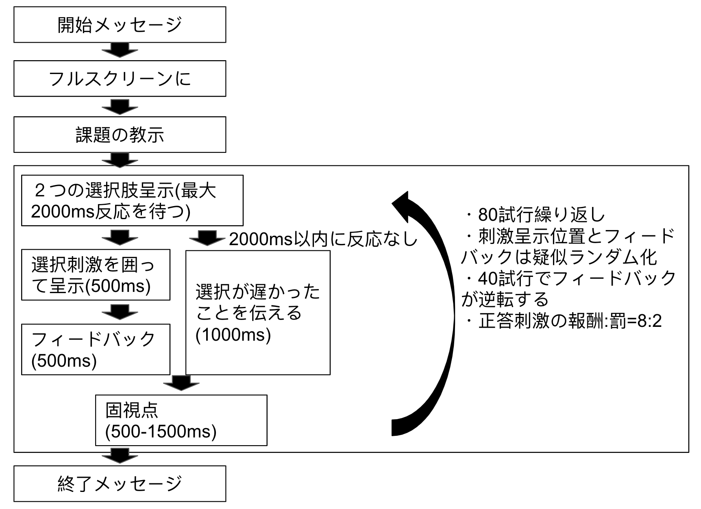
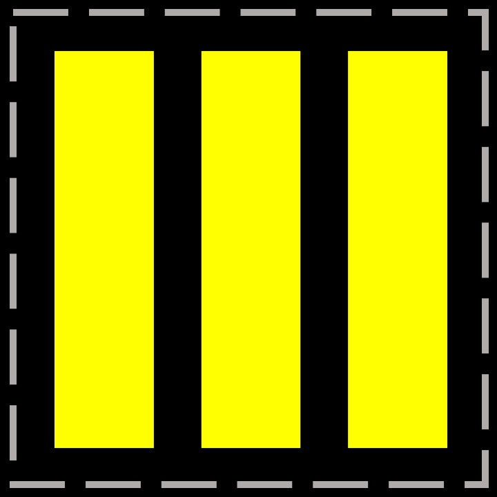
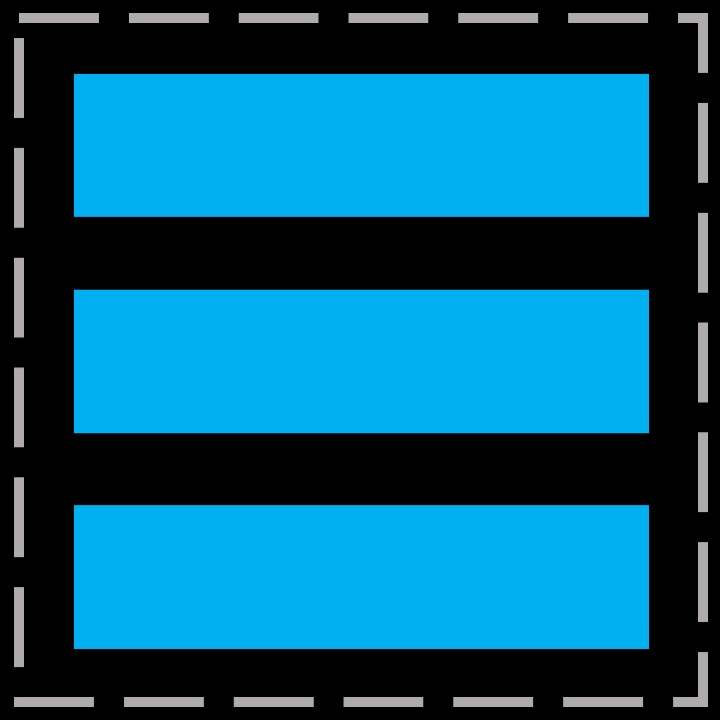
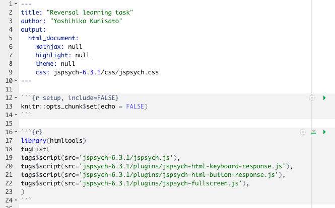
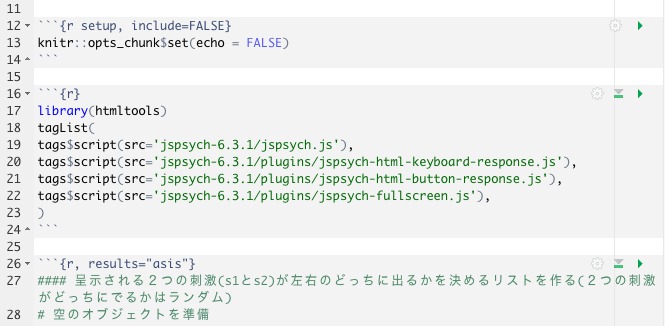
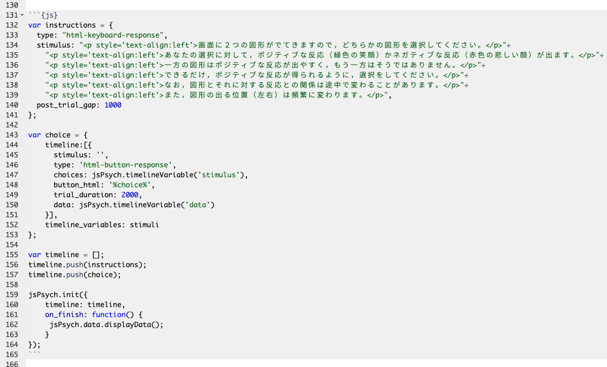
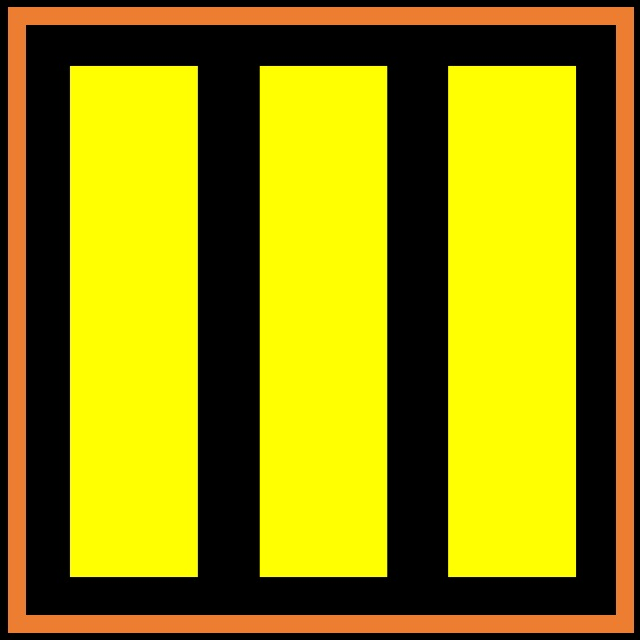
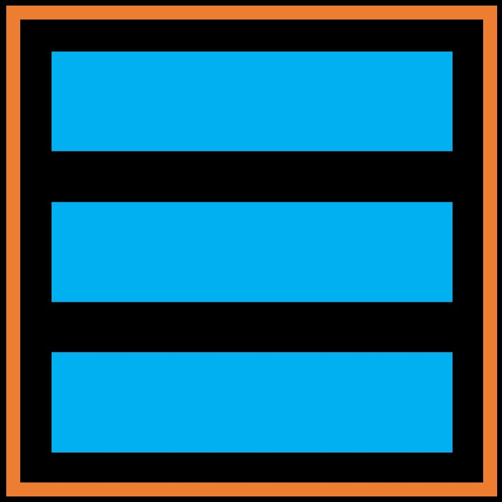
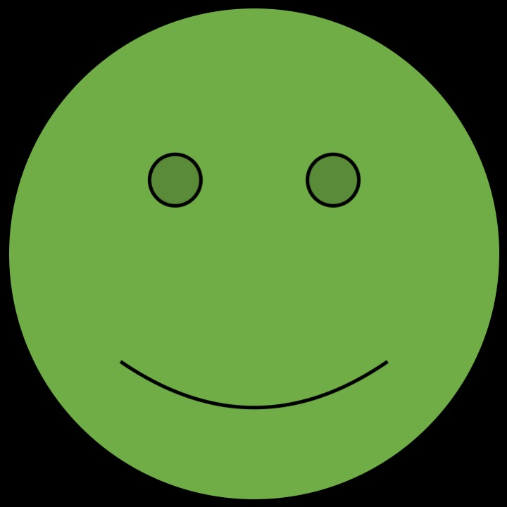
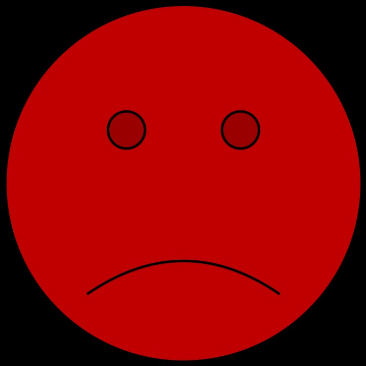

認知的柔軟性を測る課題として確率的逆転学習課題とうものがあります。名前の通り，途中でルールが逆転する課題で，その逆転に柔軟に対応できるかを測定することができます。また，確率的逆転学習課題は，その後の強化学習モデルの演習でも活用します。それでは，確率的逆転学習課題を作ってみましょう。今回も，以下の手順に従っていきましょう。

1. 課題の情報を整理する
2. 課題の設計図を作る
3. 教示と課題のメインブロックを最もシンプルな形で作る
4. 課題のメインブロックに機能を追加をする
5. メインブロック以外のブロックを追加していく


## 1. 課題の情報を整理する

確率的逆転学習課題もいろいろな種類がありますが，今回は，den Ouden et al.(2013)で使用されている課題からスタートすることにします。den Ouden先生は，計算論的精神医学で有名な先生で，わかりやすい<a href="https://hannekedenouden.ruhosting.nl/RLtutorial/Instructions.html" target="_blank">強化学習モデルを使ったモデルフィッティングの資料</a>を公開されています。さて，この研究は，セロトニンとドーパミンの遺伝子多型の違いが逆転学習課題成績にどのような違いを生むのかを検討した研究です。遺伝子多型ってのは，ざっくりいうとDNA配列の個人差です。人によってセロトニン遺伝子の配列が微妙に違っていて，これが行動や認知にどういう影響を及ぼすのか研究されてきています。オープンアクセスなので，以下のリンクから本文を読むことができます。

<a href="https://www.cell.com/neuron/fulltext/S0896-6273(13)00789-7?_returnURL=https%3A%2F%2Flinkinghub.elsevier.com%2Fretrieve%2Fpii%2FS0896627313007897%3Fshowall%3Dtrue" target="_blank">den Ouden, H. E. M., Daw, N. D., Fernandez, G., Elshout, J. A., Rijpkema, M., Hoogman, M., Franke, B., & Cools, R. (2013). Dissociable effects of dopamine and serotonin on reversal learning. Neuron, 80(4), 1090–1100.</a>

本文のExperimental Proceduresの Probabilistic Reversal Learning Taskに課題の概要が書いてあるので，簡単に整理します。

- 刺激を選択すると，確率的にポジティブもしくはネガティブなフィードバックを受けます（ポジティブは緑の嬉しい顔，ネガティブは赤の悲しい顔。以下の図を参照ください）。ここでは，ポジティブなフィードバックを報酬，ネガティブなフィードバックを罰と呼びます。

- 各施行の流れは，(1)４箇所の場所（上下左右）の２箇所に２つの刺激が呈示される，(2)参加者はマウスで報酬が得られる刺激をクリックするように求められる，(3)正答の刺激（第１試行で選んだ刺激が正答刺激）を選んだ場合は，70:30=報酬:罰の比でフィードバックがされます。誤答の刺激を選んだ場合は，30:70=報酬:罰の比でフィードバックがされます。30%の試行は，正答にたどり着くのを邪魔する働きをします。

- 40試行経過したら，刺激と報酬との関係が逆転します。よく報酬がフィードバックされていた刺激が，今度は，よく罰がフィードバックされる刺激になります。さらに40試行行います。つまり，全部で80試行になります。

- 80試行は疑似ランダム化された事前に決めた順番で実施されます。

- 参加者には，変化する正答刺激を特定するように教示しますが，どのくらいの頻度で変化するのかについては伝えません。

<a href="https://marlin-prod.literatumonline.com/cms/attachment/98a09c50-fc3e-478d-bf35-7c28b9ed6ad8/gr1.jpg"></a>

上記の情報だけで課題が作成できそうですが，刺激の呈示時間などがわかりません。刺激の選択画面は参加者の反応があるまで呈示しつづけるかもしれませんが，フィードバック刺激は何秒呈示するかはわかりません。こういう時は，同じ課題を使っている研究を参考にすると良いです。den Ouden et al.(2013)では，課題の説明において，共著者のCools先生の論文を引用しています。Cools先生の論文を探すのが良さそうです。これは論文検索をしてもいいですが，幸いなことに， <a href="http://www.roshancools.com/reversal-learning" target="_blank">「Cools先生のHPで逆転学習課題の論文リスト」</a>がまとめられています。それを見ると，以下が一番古い論文なようです。オープンアクセスの論文です。


<a href="https://www.ncbi.nlm.nih.gov/pubmed/11709484" target="_blank">Cools, R., Barker, R. A., Sahakian, B. J., & Robbins, T. W. (2001). Enhanced or impaired cognitive function in Parkinson’s disease as a function of dopaminergic medication and task demands. Cerebral Cortex , 11(12), 1136–1143.</a>

この論文を確認しても，刺激の呈示時間はわかりませんでした。ただ，Cools et al.(2001)が引用している論文を遡ると，確率的逆転学習課題は，以下のLawrence et al.(1999)が一番大元の課題になり（刺激呈示の構造はCools et al.(2001)と一緒です），逆転の切り替えは，Swainson　et al.(2000)を参考にしていることがわかります。課題を作る際に役に立つ情報ではないですが，少しウンチクが増えましたね。おめでとう。ちなみに，den Ouden et al.(2013)では，70:30=報酬:罰の比でしたが，Coolsの最初の方の論文では，80:20=報酬:罰の比でフィードバックをしています。

<a href="https://www.ncbi.nlm.nih.gov/pubmed/10606011" target="_blank">Lawrence, A. D., Sahakian, B. J., Rogers, R. D., Hodge, J. R., & Robbins, T. W. (1999). Discrimination, reversal, and shift learning in Huntington’s disease: mechanisms of impaired response selection. Neuropsychologia, 37(12), 1359–1374.</a>

<a href="https://www.ncbi.nlm.nih.gov/pubmed/10689037" target="_blank">Swainson, R., Rogers, R. D., Sahakian, B. J., Summers, B. A., Polkey, C. E., & Robbins, T. W. (2000). Probabilistic learning and reversal deficits in patients with Parkinson’s disease or frontal or temporal lobe lesions: possible adverse effects of dopaminergic medication. Neuropsychologia, 38, 596–612.</a>

もう少し調べていくと，以下のCools et al.(2002)のfMRIでの確率的逆転学習課題がその後の研究でよく使われていることがわかります。この課題では，刺激が左右に２つ呈示され（上下左右の４箇所ではない），刺激の選択画面は2000ms呈示されて（2000msを超えると「too late」というメッセージが出る），フィードバックは２つの刺激の間に500ms呈示されます（どちらを選択したかは刺激の上の三角形で示す）。上下左右４箇所に呈示するメリットもあるとは思いますが，今回は左右の2箇所に提示するのがシンプルでいいかなと思います（特に，den Ouden et al.,(2013)の追試がやりたいわけではありませんし）。

<a href="https://www.ncbi.nlm.nih.gov/pubmed/12040063" target="_blank">Cools, R., Clark, L., Owen, A. M., & Robbins, T. W. (2002). Defining the neural mechanisms of probabilistic reversal learning using event-related functional magnetic resonance imaging. The Journal of Neuroscience, 22(11), 4563–4567.</a>


<a href="https://pubmed.ncbi.nlm.nih.gov/12040063-defining-the-neural-mechanisms-of-probabilistic-reversal-learning-using-event-related-functional-magnetic-resonance-imaging/#&gid=article-figures&pid=fig-1-uid-0"></a>

Cools et al.(2002)は，様々な研究で使用されています。以下のWaegeman et al.(2014)では，刺激はAとBという文字にして，最大2000ms選択画面を呈示し（押したら次に進む），選択した文字の下に下線を引いて500ms呈示（参加者がどちらを選択したか示している），フィードバックを500ms呈示し，500ms-1500ms固視点(+)を呈示しています。なお，2000ms以内に反応できなかったら，"too late"と1000ms呈示されます。


<a href="https://psycnet.apa.org/record/2014-52742-001" target="_blank">Waegeman, A., Declerck, C. H., Boone, C., Seurinck, R., & Parizel, P. M. (2014). Individual differences in behavioral flexibility in a probabilistic reversal learning task: An fMRI study. Journal of Neuroscience, Psychology, and Economics, 7(4), 203–218.</a>


当初は，den Ouden　et al.(2013)を作る予定でしたが，Cools et al. (2002)を参考に刺激呈示をシンプルにしたり，一般的に使用される20:80のフィードバックにしたり，Cools et al.(2002)とWaegeman et al.(2014)に従って刺激呈示時間を決めることにします。まとめると以下になります。
 
 - Cools et al.(2001)をベースに逆転学習課題を作成する：合計80試行（前半40試行，後半逆転して40試行），フィードバックは顔（ポジティブが緑の嬉しい顔，ネガティブが赤の悲しい顔)，報酬:罰比は，80:20。
 
 - Cools et al.(2002)を参考にして，選択刺激の呈示位置は左右，刺激の選択画面は2000ms呈示されて（2000msを超えると遅いことを伝える「2秒以内に選択してください」），フィードバックは２つの刺激の間に500ms呈示する。
 
- den Ouden et al.(2013)を参考にして，選択はマウスでクリックする（キーボードでも可能ですが，jsPsychの練習のため），80試行は疑似ランダム化された事前に決めた順番で提示する，参加者には変化する正答刺激を特定するように教示する(しますが，)どのくらいの頻度で変化するのかについては伝えない）。

- Waegeman et al.(2014)を参考にして，最大2000ms選択画面を呈示する（押したら次に進む），選択した刺激を枠で囲って500ms呈示（どちらを選択したか分かるようにする），フィードバックを500ms呈示し，500ms-1500ms固視点(+)を呈示する。

今回は課題を作ることが目的なので，よりシンプルかつ詳細情報のある論文を参考にしていますが，実際に研究する場合は，テーマや対象を考慮しつつ参考にする論文を選んでいくことになります。


## 2. 課題の設計図を作る

上記の課題の情報をもとに，確率的逆転学習課題の設計図を作ります。ご自身で課題を作る場合は，かならず，こういう感じのものを作ってみて，課題について足りない情報はないかを確認ください。



今回も開始メッセージ，フルスクリーン化，課題の教示，課題，終了メッセージの順で，大きく５つのブロックに分けられます。そして，課題の部分は，((1)選択肢呈示＆反応取得，(2)選択した刺激が分かるように呈示，(3)フィードバック，(4)固視点，(5)もし2000ms以内に反応しなかった時に反応が遅いことを指摘するメッセージの５つの下位ブロックからなります。一気に全てを作るのは難しいですが，１つずつブロックを作って，それをLEGOブロックのように組み合わせて課題を完成させましょう。なお，課題ブロックは，80試行あり，各施行のフィードバックは正答試行に対して，8:2=報酬:罰でなされます。これらの設計もプログラミングに反映させる必要があります。

また，細かいことですが，疑似ランダム化に関しては，10試行を１つの単位にして，8回繰り返すことにして，


## 3. 教示と課題のメインブロックを最もシンプルな形で作る
### 3.1 教示ブロックを作成する

上記を考慮しつつ，わかりやすさを考えて，以下のような教示をします。

```
画面に２つの図形がでてきますので，どちらかの図形を選択してください。
あなたの選択に対して，ポジティブな反応（緑色の笑顔）かネガティブな反応（赤色の悲しい顔）が出ます。
一方の図形はポジティブな反応が出やすく，もう一方はそうではありません。
できるだけ，ポジティブな反応が得られるように，選択をしてください。

なお，図形とそれに対する反応との関係は途中で変わることがあります。
また，図形の出る位置（左右）は頻繁に変わります。
キーボードのキーをどれか押すと課題が始まります。
```

#### 演習課題1

**RStudioのConsoleで以下を実行して，逆転学習課題(RL)のフォルダとファイルをを用意します**

```
jsPsychRmd::set_jsPsych(folder = "RL", rc = TRUE)
```

＊国里ゼミ以外でResearch Compendiumを使ってない場合は，", rc = TRUE"を削除して実行してください。

それから，ストループ課題を参考に，上記の教示を出してみましょう！

### 3.2 メインブロック：２つの画像刺激を呈示する

さて，メインブロックを作りましょう。以下の"s1.jpeg"（黄色の縦線）と"s2.jpeg"(青の横線)を呈示する刺激に使いましょう。画像刺激は準備をしておきましたので，以下のコードを実行して，RLフォルダ内のstimuliにダウンロードしましょう。


```
temp <- tempfile()
download.file("https://github.com/kunisatoLab/main/raw/master/materials/stimuli.zip",temp)
unzip(temp, exdir = paste0(getwd(),"/exercises/RL/"))
unlink(temp)
```

＊国里ゼミ以外でResearch Compendiumを使ってない場合は，以下を実行してください。
```
temp <- tempfile()
download.file("https://github.com/kunisatoLab/main/raw/master/materials/stimuli.zip",temp)
unzip(temp, exdir = paste0(getwd(),"/RL/"))
unlink(temp)
```

　 

今回は，画像刺激を呈示して，マウスでのクリックをもとめるので，jspsych-html-button-responseプラグインを使います。以下のように，RMarkdownにもプラグインを追加しておきましょう。



jspsych-html-button-responseプラグインは，以下のように使います。通常は，Stimulusになんらかの刺激をいれて，choicesやbutton_htmlの部分でマウスで選択するボタンを定義します(trial_durationは最大の呈示時間で，デフォルトでマウスクリックで次の試行に進みます)。今回は，ボタン部分に上記の２つの画像刺激を出して，それをクリックさせるようにします。そこで，choicesの部分で[]内に２つ画像を呈示するためのコードを書いています。divとか出てきて謎と思うかもしれませんが，positionのところで画像をだす位置を決めていて(画面のtopつまり上から50%くらい，leftから20%くらいに呈示すると指定している)，img以降で画像のある場所と画像名を指定し，widthで大きさを指定しています。その次も同様に定義しています。

```
var choice = {
    stimulus: '',
    type: 'html-button-response',
    choices: ['<div style="position: absolute; top: 50%; left: 20%"></div>',
    '<div style="position: absolute; top: 50%; right: 20%"></div>'],
    button_html: '%choice%',
    trial_duration: 2000
};
```

上記が追加できたら，timelineにchoiceも追加しておきましょう。では，Knitして，画像が呈示されるか確かめましょう。
```
var timeline = [];
timeline.push(instructions);
timeline.push(choice);
```


#### 演習課題2

上記のコードを使って，(1)s1.jpegやs2.jpeg以外の画像を呈示してみる，(2)呈示した画像を左上や右下などの別の位置にも呈示してみましょう！

### 3.3 メインブロック：画像刺激のリストを使って刺激呈示する

さて，課題は80試行もあるので，ストループ課題と同じ用に，刺激をリストにした上で呈示することにします。ストループと同じ用に，stimuliに追加していきます。stimuli内のstimulusの[]内に２つ分の画像の呈示に関する指定をいてていきます。以下で３試行分の画像が準備できました。R Markdownに追加します。

```
var stimuli = [
 {
    stimulus: ['<div style="position: absolute; top: 50%; left: 20%"></div>',
    '<div style="position: absolute; top: 50%; right: 20%"></div>']
  },{
    stimulus: ['<div style="position: absolute; top: 50%; right: 20%"></div>',
    '<div style="position: absolute; top: 50%; left: 20%"></div>']
  },{
    stimulus: ['<div style="position: absolute; top: 50%; left: 20%"></div>',
    '<div style="position: absolute; top: 50%; right: 20%"></div>']
  }
]
```

上記で準備したリストをchoice内で使います。choice内にtimelineを追加して，最後にtimeline_variablesに上記のstimuliを指定しています。そして，さきほど直接，画像の指定情報をいれていたchoicesには，jsPsych.timelineVariable('stimulus')を追加します。これで，stimuliリスト内を上から順番に実行していって，stimulusの情報がchoiceに入って画面に呈示されます。

```
var choice = {
    timeline:[{
      stimulus: '',
      type: 'html-button-response',
      choices: jsPsych.timelineVariable('stimulus'),
      button_html: '%choice%',
      trial_duration: 2000
    }],
    timeline_variables: stimuli
};
```
ここれ一旦，knitして，画像が３試行呈示されるか確認をしましょう。

### 3.4 メインブロック：画像刺激のリストを使って刺激呈示する

さて，ここからが少し大変になってきます。先程のstimuliのリストを長くしていって，80試行分準備すればよいのですが，かなり長いですし，おそらくミスも生じるかと思います。また，刺激を左右にランダムに出したり，報酬の確率を80%などにするのは手作業では難しいです。そこで，それらの作業をRを使って実行し(こういう操作をする上ではRは便利です)，Rで作ったリストをjsPsych側に読み込ませて，刺激呈示することにしましょう。

早速，Rで作業ができるように，RMarkdownにRチャンクを追加します。その際に，「r, results="asis"」を必ず入れるようにしましょう（通常はrだけが入っています）。



それでは，さっそくRで刺激リストを作っていきましょう。

#### 画像を左右のどちらに出すのかに関するリストの作成

s1刺激を左右のどちらに出すのかのリスト(left_right_s1)とs2刺激を左右のどちらに出すのかのリスト（left_right_s1）を作ります。やり方はシンプルで，1=left, 2= rightとした上で，1と2を５個ずつ用意した10試行分を1ブロックにして，シャッフルするのを８回行って，最終的に80試行分の左右の呈示情報リストを作成します。1と2を40個ずつ用意して，一気に80試行をシャッフルすることも考えたかもしれませんが，そうすると，すごい偏ることがあります（20試行s1が右ということも生じ得ます）。そうすると，そこに意図が発生してしまって思わぬ結果になるかもしれません。そこで，今回は疑似ランダム化として，80試行を10試行で１ブロックにして，ブロックごとにシャッフルすることにしました。以下のコードを順番に読んで，for文で8回繰り返し，sample()でシャッフルし，c()で２つのリストをつなげているのを理解ください。最後に，1や２みたいな数字ではなく，"left","right"という情報もあとで使うので，ifelse文でleft_right_s1_text, left_right_s2_textというものも作成しています。以下の内容をjsPSych用のR Markdownファイルにコピペしてもいいですが，まずは，Consoleにコピペして，動作確認をしましょう。

```{r}
#### 呈示される２つの刺激(s1とs2)が左右のどっちに出るかを決めるリストを作る(２つの刺激がどっちにでるかはランダム)
# 空のオブジェクトを準備
left_right_s1 <- NULL
# いきなり80試行をシャッフルせずに，10試行を1ブロックにして，シャッフルを８回行う（for文で８回繰り返す)
repeat_shuffle <- 8
for (i in 1:repeat_shuffle) {
  # 1=leftか2=rightを５つずつ作成(つまり，10試行分)
  left_right_10 <- rep(1:2,5)
  # 上記をシャフル
  left_right_10shuffle <- sample(left_right_10, length(left_right_10))
  # left_right_s1に追加
  left_right_s1 <- c(left_right_s1,left_right_10shuffle)
}
# s2が右にでるか左にでるかはs1と逆なので，left_right_s1を使って逆転処理する
left_right_s2 <- 3-left_right_s1
# ifelseを使ってleft_right_s1(2)==1の時（1なのでつまりleft），"left"をそれ以外は"right"を入れたものを作成する
left_right_s1_text <- ifelse(left_right_s1==1, "left", "right")
left_right_s2_text <- ifelse(left_right_s2==1, "left", "right")
```

上記をConseleで実行できたら，以下のコードも実行して，left_right_s1とleft_right_s2が上手く設定できているか確認をしてみましょう。なお，以下のplot()は動作確認用ですので，R Markdownにはコピペしないでください。大きな偏りなくランダムにleft(1)やright(2)になっているので，良さそうですね。問題なさそうなら，R Markdownの「r, results="asis"」チャンクに，確認用plot以外をコピペして追加ください。

```{r}
plot(left_right_s1)
plot(left_right_s2)
```

#### 刺激を選択した時のフィードバックのリストの作成

次に，刺激を選択した時のフィードバックのリストを作ります。s1とs2でそれぞれ，reward_s1とreward_s2を作ります。やり方は，左右の呈示と同じで，10試行で１ブロックにしてシャッフルをしています。なお，8:2=報酬:罰（つまり4:1=報酬:罰）だったので，1ブロックの刺激は報酬8試行，罰2試行で作成して，シャッフルします(2:8=報酬:罰の時は逆)。8:2で作ってもいいのですが，repのc()内に打ち込む数が増えるとミスがふえますので，4:1で2回繰り返すことで，報酬8試行，罰2試行にしています。ここでは，報酬は1，罰は0としています（なんでもいいのですが，この課題でデータをとって，解析をする際に少しだけ便利です）。先ほどと違うのは，最初の4ブロックと後半の4ブロックでは，reward_s1とreward_s2に追加されるリストが逆転することです（最初に8:2=報酬:罰だったら，次は2:8=報酬:罰になる）。

```{r}
#### s1とs2を選んだ時のフィードバック(reward=1, punishment=0)のリストを作る
# 空のオブジェクトを準備
reward_s1 <- NULL
reward_s2 <- NULL
# いきなり80試行をシャッフルせずに，10試行を１ブロックにして，シャッフルを８回行う（for文で８回繰り返す）
# 逆転を開始するブロックも指定しておく
reverse_block <- 5
for (i in 1:repeat_shuffle) {
  # 8:2=報酬:罰（つまり4:1=報酬:罰）のリストを作ってシャッフル
  reward82 <- rep(c(1,1,1,1,0),2)
  reward82_shuffle <- sample(reward82, length(reward82))
  # 2:8=報酬:罰（つまり1:4=報酬:罰）のリストを作ってシャッフル
  reward28 <- rep(c(1,0,0,0,0),2)
  reward28_shuffle <- sample(reward28, length(reward28))
  # 1~40試行(5ブロックより前)は，s1が8:2=報酬:罰，s2が2:8=報酬:罰。41試行以降は逆転する
  if(i < reverse_block){
    reward_s1 <- c(reward_s1,reward82_shuffle)
    reward_s2 <- c(reward_s2,reward28_shuffle)
  }else{
    reward_s1 <- c(reward_s1,reward28_shuffle)
    reward_s2 <- c(reward_s2,reward82_shuffle)
  }
}
```

上記をConseleで実行できたら，以下のコードも実行して，reward_s1とreward_s2が上手く設定できているか確認をしてみましょう。なお，以下のplot()は動作確認用ですので，R Markdownにはコピペしないでください。真ん中くらいで1と0の出てくる頻度が変わっていますね。問題なさそうなら，R Markdownの「r, results="asis"」チャンクに，確認用plot以外をコピペして追加ください。

```{r}
plot(reward_s1)
plot(reward_s2)
```

#### 刺激リストをデータフレーム化

さて，上記の情報をもとにして，刺激リストをRのデータフレーム形式で作成してみましょう。最初にHTML用の刺激の設定情報をいくつか設定しておきます（画像をどこにだすかとか，どのくらいの大きさで出すかといった情報です）。その後，それらの設定と左右の呈示リストをあわせて，画像を呈示するための刺激リストを作成します。HTMLファイル内の記述のため「<p...」みたいな記号とtop_bottom_s1みたいな変数を組み合わせて，paste関数を使って，3.3で作ったような刺激リストを作成します。

```
#### 左右以外の上下の位置(topから50%の位置に刺激を呈示する)や使う画像のパスの情報（今回は全施行で以下は変わらない）
# s1の設定
top_bottom_s1 = "top"
top_bottom_position_s1 = 40
image_path_s1 = "stimuli/s1.jpeg"
image_width_s1 = 200
left_right_position_s1 <- 20
# s2の設定
top_bottom_s2 = "top"
top_bottom_position_s2 = 40
image_path_s2 = "stimuli/s2.jpeg"
image_width_s2 = 200
left_right_position_s2 <- 20
#### 刺激リストの作成(HTML用に調整)
stimulus <- paste("[\"<p style='position: absolute; ",
                       top_bottom_s1,": ",
                       top_bottom_position_s1,"%;",
                       left_right_s1_text,": ",
                       left_right_position_s1,"%'></p>\",",
                       "\"<p style='position: absolute; ",
                       top_bottom_s2,": ",
                       top_bottom_position_s2,"%;",
                       left_right_s2_text,": ",
                       left_right_position_s2,"%'></p>\"]",sep="")
```


上記で作ったstimulusのリストとその他のリストを結合してデータフレームを作ります。一応，これをcsvファイルで保存しておいて，後で「どういうリストだったけ？」と思った時に簡単に確認できるようにしておきます。

```
#### 上記で作ったものをデータフレーム化しておく
RL_stim <- data.frame(stimulus,
                      left_right_s1,
                      left_right_s2,
                      reward_s1,
                      reward_s2)
# どういう刺激リストを作成したのかの情報も残しておく
write.csv(RL_stim,"RL_stim.csv")
```

#### Rで作った刺激リストをJson形式で出力

さて，刺激リストができたので，それらをJson形式で出力します（ストループの時に作ったやたら{}を使う形式のことです）。scriptで始まってscriptで終わるわけですが，その間に，stimuli内に1試行ずつstimulusとdataを80試行追加しています。

```
#### 上記で作ったデータフレームをJson形式で出力する
for (i in 1:nrow(RL_stim)) {
  if(i==1){cat("<script>", "var stimuli = [")}
  cat("{stimulus:",as.character(RL_stim$stimulus[i]),",
      data:{left_right_s1:",RL_stim$left_right_s1[i],
      ", left_right_s2:",RL_stim$left_right_s2[i],
      ", reward_s1:",RL_stim$reward_s1[i],
      ", reward_s2:",RL_stim$reward_s2[i],"}}")
  if(i==nrow(RL_stim)){
    cat("]; </script>")
  }else{
    cat(",")
  }
}
```

上記のコードを以下のような感じのJson形式の出力が出てきます。これができたら成功です。R上で刺激リストの処理ができて，jsPsychで読み込める形式で出力できました。

```
<script> var stimuli = [
  {
  stimulus: ["<p style='position: absolute; top: 40%;left: 20%'></p>",
  "<p style='position: absolute; top: 40%;right: 20%'></p>"] ,
  data:{left_right_s1: 1 , left_right_s2: 2 , reward_s1: 1 , reward_s2: 0 }
  },{
  stimulus: ["<p style='position: absolute; top: 40%;right: 20%'></p>",
  "<p style='position: absolute; top: 40%;left: 20%'></p>"] ,
  data:{left_right_s1: 2 , left_right_s2: 1 , reward_s1: 1 , reward_s2: 0 }
  },
... 
```

さて，ここまできたら，jsチャンク内を以下のようにします（3.3で設定したstimuliを削除して，data: jsPsych.timelineVariable('data')を追加するだけです）。刺激リストの作成でかなり労力を使いましたが，jsチャンク内はスッキリしました。これでメインブロックの(1)刺激リストを用意して，(2)画像を呈示して，(3)マウスで反応をとるができました。



※ Rへの本格入門の前にこの内容はキツイかなと思いますが，後で段々と理解できると思います。jsPsychrパッケージを使うとストループ刺激のような文字刺激のリスト化はかなり簡単にできるようになりますが，今回のようにちょっと画像刺激を出してマウスで選択するような方法だと自分でコードをかかないといけません。

#### 演習課題3

試行数を40試行にしてみましょう（この場合，20試行で逆転させましょう）！


## 4. 課題のメインブロックに機能を追加をする

刺激リストを作成して，画像を画面に２つ呈示して，マウスクリックで反応を取得するまでできました。メインブロックの残りは，(1)選択した刺激を枠で囲って500ms呈示する，(2)選択の結果（報酬か罰）を500msフィードバックする，(3)固視点(+)を500msから1500ms呈示するです。


### 4.1 選択肢が分かるように呈示する

ここまで白背景で課題を作ってきたのですが，今回は背景色を黒にしてみましょう。HTMLではbodyってところで背景色を設定できるのですが，R Markdownでやる場合は，htmltoolsを使って，tags$bodyで指定をします。#000000は黒色です。文字は，text="#ffffff"で白色を指定します。

```
library(htmltools)
tagList(
tags$body(bgcolor="#000000", text="#ffffff")
tags$script(src='jspsych-6.3.1/jspsych.js'),
tags$script(src='jspsych-6.3.1/plugins/jspsych-html-keyboard-response.js'),
tags$script(src='jspsych-6.3.1/plugins/jspsych-html-button-response.js')
)
```

さて，参加者が選択した方の図形が分かるように，以下のように選択した図形はオレンジの枠で囲まれるようにします(それぞれ，ファイル名は，s1s.jpegとs2s.jpegです)。

　 

それでは，選択した画像の方にオレンジの枠で囲った画像(s1s.jpegかs2s.jpeg)が呈示されるようにしていきましょう。


まず，3.4で作ったchoiceブロックを以下のように変更してみます。なんだか長くなっていますが，最初は3.4と同じで，それに続けて，選択した画像を画面に呈示する試行を追加しています("{type: 'html-keyboard-response'"以降の内容です)。選択した画像を呈示する試行では，stimulus:に参加者の選択時応じた画像刺激をセットし，trial_duration: 500 (試行は500ms),response_ends_trial: false(選択によって画像呈示が終わらないようにしています)とします。stimulus:が重要ですが，ここでは，jsPsych.data.get().last(1).values()[0]を使って１つ前の試行（つまり選択試行です）からbutton_pressedで選択結果，left_right_s1でs1が左と右のどちらかに呈示されたかを取得します(それぞれ，last_selectとlast_left_right_s1に入る)。ちなみに，jsPsych.data.get().last(1).values()[0]のlast内の数字でいくつ前の施行かを指定します（数字によって2試行前のデータをもってくることもできます）。そして以下の5パターンで処理をします。

- last_select==0 && last_left_right_s1 == 1の場合，ボタン押しのlast_selectが0なのでs1を選択し（java scriptは0始まりで，stimulusはいつもs1,s2の順番でした），last_left_right_s1が1なので，s1は左に出ていました。そのため，オレンジの選択枠のあるs1s.jpegを左に呈示します。

- last_select==0 && last_left_right_s1 == 2の場合，ボタン押しのlast_selectが0なのでs1を選択し（java scriptは0始まりで，stimulusはいつもs1,s2の順番でした），last_left_right_s1が2なので，s1は右に出ていました。そのため，オレンジの選択枠のあるs1s.jpegを右に呈示します。

- last_select==1 && last_left_right_s1 == 1の場合，ボタン押しのlast_selectが1なのでs2を選択し（java scriptは0始まりで，stimulusはいつもs1,s2の順番でした），last_left_right_s1が1なので，s1は左に出て，s2は右に出ていました。そのため，オレンジの選択枠のあるs2s.jpegを右に呈示します。

- last_select==2 && last_left_right_s1 == 2の場合，ボタン押しのlast_selectが1なのでs2を選択し（java scriptは0始まりで，stimulusはいつもs1,s2の順番でした），last_left_right_s1が2なので，s1は右に出て，s2は左に出ていました。そのため，オレンジの選択枠のあるs2s.jpegを左に呈示します。

- else，つまり上記以外の場合は，last_selectがnull，つまり反応が無い場合です，そこで，「時間内に選択を行ってください」という教示を呈示します。

```
var choice = {
    timeline:[{
      stimulus: '',
      type: 'html-button-response',
      choices: jsPsych.timelineVariable('stimulus'),
      button_html: '%choice%',
      trial_duration: 2000,
      data: jsPsych.timelineVariable('data')
    },{
      type: 'html-keyboard-response',
      stimulus: function(){
        var last_select = jsPsych.data.get().last(1).values()[0].button_pressed;
        var last_left_right_s1 = jsPsych.data.get().last(1).values()[0].left_right_s1;
        if (last_select==0 && last_left_right_s1 == 1){
           return "<p style='position: absolute; top: 40%;left: 20%'></p> <p style='position: absolute; top: 40%;right: 20%'></p>"
        } else if (last_select==0 && last_left_right_s1 == 2){
           return "<p style='position: absolute; top: 40%;right: 20%'></p> <p style='position: absolute; top: 40%;left: 20%'></p>"
        } else if (last_select==1 && last_left_right_s1 == 1){
           return "<p style='position: absolute; top: 40%;left: 20%'></p> <p style='position: absolute; top: 40%;right: 20%'></p>"
        } else if (last_select==1 && last_left_right_s1 == 2){
           return "<p style='position: absolute; top: 40%;right: 20%'></p> <p style='position: absolute; top: 40%;left: 20%'></p>"
        } else {
           return '<p style="font-size: 48px">時間内に選択を行ってください</p>'
        }
      },
      trial_duration: 500,
      response_ends_trial: false,
    }],
    timeline_variables: stimuli
};
```

さて，上記のようにchoiceを変更してみて，実際に選択した画像の方がオレンジで囲われるようになったら成功です。


### 4.2 フィードバックする


次に，参加者の反応に対する正誤に応じて，以下のフィードバック画像を呈示します(それぞれ，ファイル名は，reward.jpegとpunishment.jpegです)。

　 

4.1で行ったchoiceへの追加に対して，さらにフィードバックを追加します。jsPsych.data.get().last(2).values()[0]を使って，２つ前の試行からデータをとってきます（つまり，選択の確認試行の１つ前の選択試行のデータをとってきます）。とってきたデータを使って，last_selectに参加者の選択, last_left_right_s1にs1が左右のどちから, last_reward_s1にs1の正誤, last_reward_s2にs2の正誤をいれます。この４つを用いて，以下の9パターンで処理をします（もっとスマートにプログラミングできそうですが，わかりやすさとの兼ね合いで地道に９パターンでフィードバックします）。

- last_select==0 && last_left_right_s1 == 1 && last_reward_s1==1の場合，ボタン押しのlast_selectが0なのでs1を選択し（java scriptは0始まりで，stimulusはいつもs1,s2の順番でした），last_left_right_s1が1なので，s1は左に出ていました。そのため，オレンジの選択枠のあるs1s.jpegを左に呈示します。そして，last_reward_s1==1なので，真ん中にreward.jpegを呈示します。

- last_select==0 && last_left_right_s1 == 1 && last_reward_s1==0の場合，ボタン押しのlast_selectが0なのでs1を選択し（java scriptは0始まりで，stimulusはいつもs1,s2の順番でした），last_left_right_s1が1なので，s1は左に出ていました。そのため，オレンジの選択枠のあるs1s.jpegを左に呈示します。そして，last_reward_s1==0なので，真ん中にpunishment.jpegを呈示します。

- last_select==0 && last_left_right_s1 == 2 && last_reward_s1==1の場合，ボタン押しのlast_selectが0なのでs1を選択し（java scriptは0始まりで，stimulusはいつもs1,s2の順番でした），last_left_right_s1が2なので，s1は右に出ていました。そのため，オレンジの選択枠のあるs1s.jpegを右に呈示します。そして，last_reward_s1==1なので，真ん中にreward.jpegを呈示します。

- last_select==0 && last_left_right_s1 == 2 && last_reward_s1==0の場合，ボタン押しのlast_selectが0なのでs1を選択し（java scriptは0始まりで，stimulusはいつもs1,s2の順番でした），last_left_right_s1が2なので，s1は右に出ていました。そのため，オレンジの選択枠のあるs1s.jpegを右に呈示します。そして，last_reward_s1==0なので，真ん中にpunishment.jpegを呈示します。

- last_select==1 && last_left_right_s1 == 1 && last_reward_s2==1の場合，ボタン押しのlast_selectが1なのでs2を選択し（java scriptは0始まりで，stimulusはいつもs1,s2の順番でした），last_left_right_s1が1なので，s1は左に出て，s2は右に出ていました。そのため，オレンジの選択枠のあるs2s.jpegを右に呈示します。そして，last_reward_s2==1なので，真ん中にreward.jpegを呈示します。

- last_select==1 && last_left_right_s1 == 1 && last_reward_s2==0の場合，ボタン押しのlast_selectが1なのでs2を選択し（java scriptは0始まりで，stimulusはいつもs1,s2の順番でした），last_left_right_s1が1なので，s1は左に出て，s2は右に出ていました。そのため，オレンジの選択枠のあるs2s.jpegを右に呈示します。そして，last_reward_s2==0なので，真ん中にpunishment.jpegを呈示します。

- last_select==1 && last_left_right_s1 == 2 && last_reward_s2==1の場合，ボタン押しのlast_selectが1なのでs2を選択し（java scriptは0始まりで，stimulusはいつもs1,s2の順番でした），last_left_right_s1が2なので，s1は右に出て，s2は左に出ていました。そのため，オレンジの選択枠のあるs2s.jpegを左に呈示します。そして，last_reward_s2==1なので，真ん中にreward.jpegを呈示します。

- last_select==1 && last_left_right_s1 == 2 && last_reward_s2==0の場合，ボタン押しのlast_selectが1なのでs2を選択し（java scriptは0始まりで，stimulusはいつもs1,s2の順番でした），last_left_right_s1が2なので，s1は右に出て，s2は左に出ていました。そのため，オレンジの選択枠のあるs2s.jpegを左に呈示します。そして，last_reward_s2==0なので，真ん中にpunishment.jpegを呈示します。

- else，つまり上記以外の場合は，last_selectがnull，つまり反応が無い場合です，そこで，「時間内に選択を行ってください」という教示を呈示します。


上記の9パターンのフィードバックをするために，4.1の内容に，以下を追加します（4.1で選択の確認試行の追加と同じようにしてみてください）。

```
{
      type: 'html-keyboard-response',
      stimulus: function(){
        var last_select = jsPsych.data.get().last(2).values()[0].button_pressed;
        var last_left_right_s1 = jsPsych.data.get().last(2).values()[0].left_right_s1;
        var last_reward_s1 = jsPsych.data.get().last(2).values()[0].reward_s1;
        var last_reward_s2 = jsPsych.data.get().last(2).values()[0].reward_s2;
        if (last_select==0 && last_left_right_s1 == 1 && last_reward_s1==1){
           return "<p style='position: absolute; top: 40%;left: 20%'></p> <p style='position: absolute; top: 40%;right: 20%'></p> <p style='position: absolute; top: 40%;right: 45%'></p>"
        } else if (last_select==0 && last_left_right_s1 == 1 && last_reward_s1==0){
           return "<p style='position: absolute; top: 40%;left: 20%'></p> <p style='position: absolute; top: 40%;right: 20%'></p> <p style='position: absolute; top: 40%;right: 45%'></p>"
        }else if (last_select==0 && last_left_right_s1 == 2 && last_reward_s1==1){
           return "<p style='position: absolute; top: 40%;right: 20%'></p> <p style='position: absolute; top: 40%;left: 20%'></p> <p style='position: absolute; top: 40%;right: 45%'></p>"
        } else if (last_select==0 && last_left_right_s1 == 2 && last_reward_s1==0){
           return "<p style='position: absolute; top: 40%;right: 20%'></p> <p style='position: absolute; top: 40%;left: 20%'></p> <p style='position: absolute; top: 40%;right: 45%'></p>"
        } else if (last_select==1 && last_left_right_s1 == 1 && last_reward_s2==1){
           return "<p style='position: absolute; top: 40%;left: 20%'></p> <p style='position: absolute; top: 40%;right: 20%'></p> <p style='position: absolute; top: 40%;right: 45%'></p>"
        } else if (last_select==1 && last_left_right_s1 == 1 && last_reward_s2==0){
           return "<p style='position: absolute; top: 40%;left: 20%'></p> <p style='position: absolute; top: 40%;right: 20%'></p> <p style='position: absolute; top: 40%;right: 45%'></p>"
        }else if (last_select==1 && last_left_right_s1 == 2 && last_reward_s2==1){
           return "<p style='position: absolute; top: 40%;right: 20%'></p> <p style='position: absolute; top: 40%;left: 20%'></p> <p style='position: absolute; top: 40%;right: 45%'></p>"
        } else if (last_select==1 && last_left_right_s1 == 2 && last_reward_s2==0){
           return "<p style='position: absolute; top: 40%;right: 20%'></p> <p style='position: absolute; top: 40%;left: 20%'></p> <p style='position: absolute; top: 40%;right: 45%'></p>"
        } else {
           return '<p style="font-size: 48px">時間内に選択を行ってください</p>'
        }
      },
      trial_duration: 1000,
      response_ends_trial: false,
    }
```

### 4.3 固視点の追加

フィードバックまで上手く呈示できたら，最後に固視点を追加してみましょう。フィードバックに続けて，以下を追加すると，固視点(+)が500~1500ms呈示されます。

```
{
    　type: 'html-keyboard-response',
      stimulus: '<p style="font-size: 48px">+</p>',
      trial_duration: function() {
        return Math.floor(Math.random() * 1000) + 500;
      },
      response_ends_trial: false,
}
```

### 演習課題4

4.3まで刺激はtop:40%に呈示してきましたが，top:35%に呈示してみましょう（何かがずれたら適切に調整をしてください）！

## 5. メインブロック以外のブロックを追加していく

メインブロックは完成したので，課題が始まった時に表示されるウェルカムメッセージとフルスクリーンで実施するための教示などのブロックを追加して，最後に終了メッセージを追加します。これはストループ課題の時と一緒です。

### 5.1 ウェウカムメッセージとフルスクリーン化の追加

最初にウェウカムメッセージとして以下のwelcomブロックを追加します。

```
var welcome = {
  type: "html-keyboard-response",
  stimulus: "<p><span style='font-size:20pt;'>実験にお越しいただき，ありがとうございます!!!</span></p>"+
  "<p>キーボードのキーをどれか押して，開始してください</p>"
};
```

tagは以下のように設定します。

```
library(htmltools)
tagList(
tags$body(bgcolor="#000000", text="#ffffff"),
tags$script(src='jspsych-6.3.1/jspsych.js'),
tags$script(src='jspsych-6.3.1/plugins/jspsych-html-keyboard-response.js'),
tags$script(src='jspsych-6.3.1/plugins/jspsych-html-button-response.js'),
tags$script(src='jspsych-6.3.1/plugins/jspsych-fullscreen.js')
)
```


timelineのwelcomeの次にfullscreenをプッシュします。これで，ウェルカムメッセージが表示されて，全画面表示ができるようになっていると思います。

```
var fullscreen = {
  type: 'fullscreen',
  message: '<p>以下のボタンをクリックすると，画面は全画面表示に切り替わります。全画面表示を止めたい場合はEscキーを押してください。</p>',
  button_label: "全画面表示に切り替え",
  fullscreen_mode: true
};

var timeline = [];
timeline.push(welcome);
timeline.push(fullscreen);
timeline.push(instructions);
timeline.push(choice);
```

### 5.2 終了メッセージの追加

最後に「キーボードのキーをどれか押すと画面に結果の記録が表示されます。ブラウザを閉じて終了してください。ご参加ありがとうございました。」というメッセージが画面に出てくるようにします。ストループ課題と同じくdebriefで画面を用意して，debriefをpushしておきます。

```
var debrief = {
  type: "html-keyboard-response",
  stimulus: "<p>キーボードのキーをどれか押すと画面に結果の記録が表示されます。ブラウザを閉じて終了してください。ご参加ありがとうございました。</p>"
};

var timeline = [];
timeline.push(welcome);
timeline.push({
  type: 'fullscreen',
  fullscreen_mode: true
});
timeline.push(instructions);
timeline.push(choice);
timeline.push(debrief);
```

これで逆転学習課題は完成です。

### 演習課題5 

ストループ課題と同様に，debriefブロックで，「あなたの正答率は，80%でした。」というように，参加者の正答率を計算して，呈示しましょう！