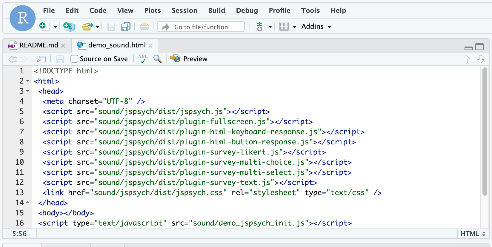
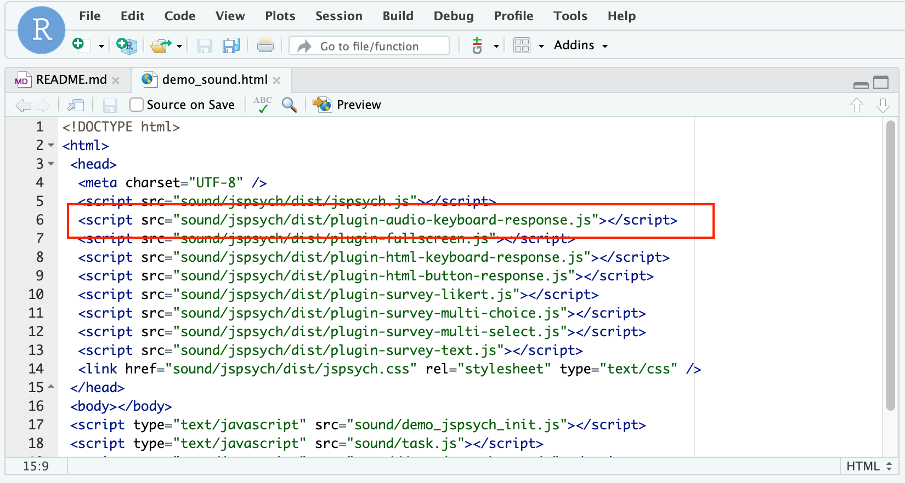
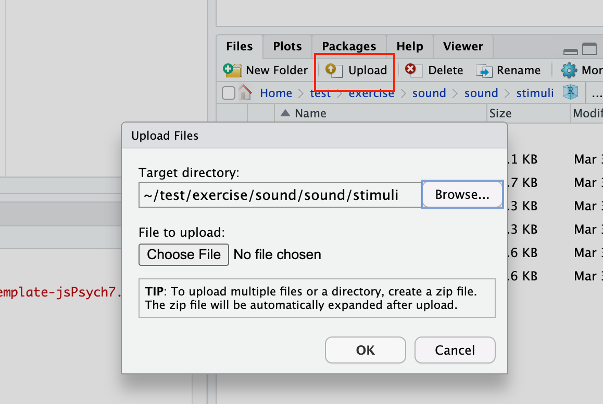
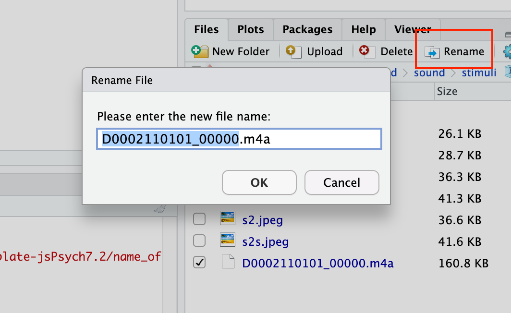
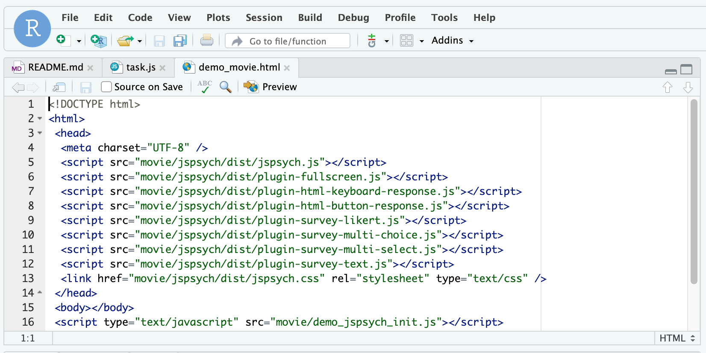
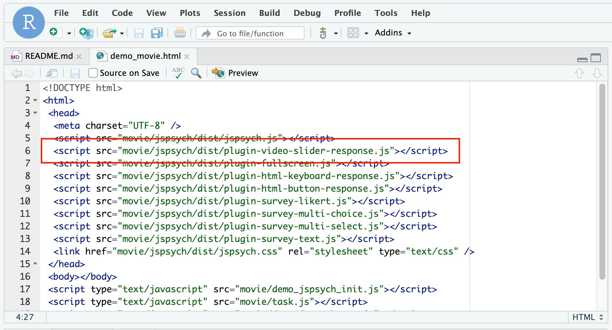
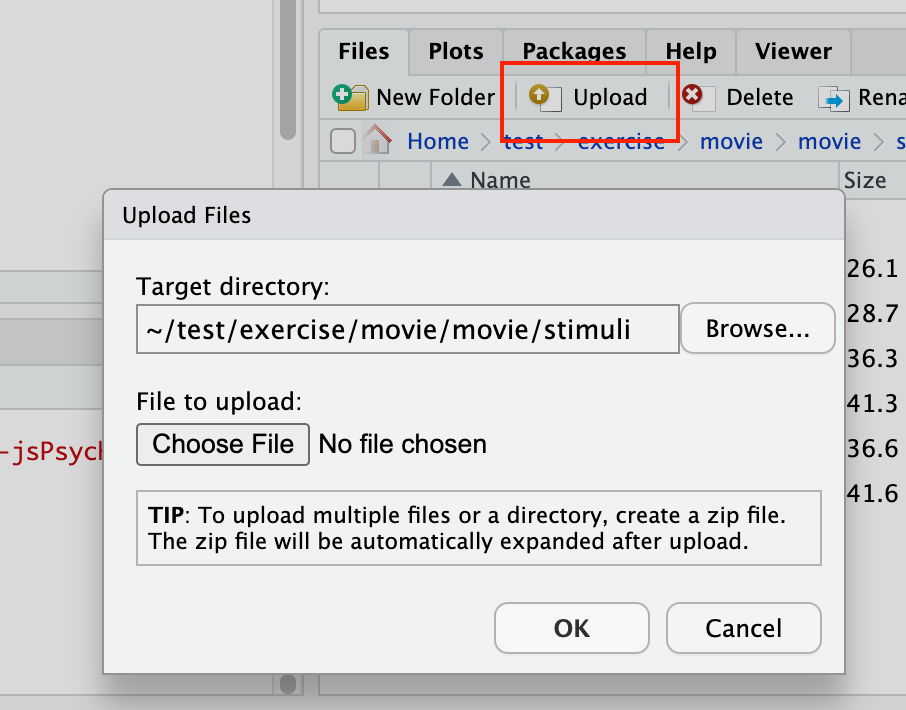
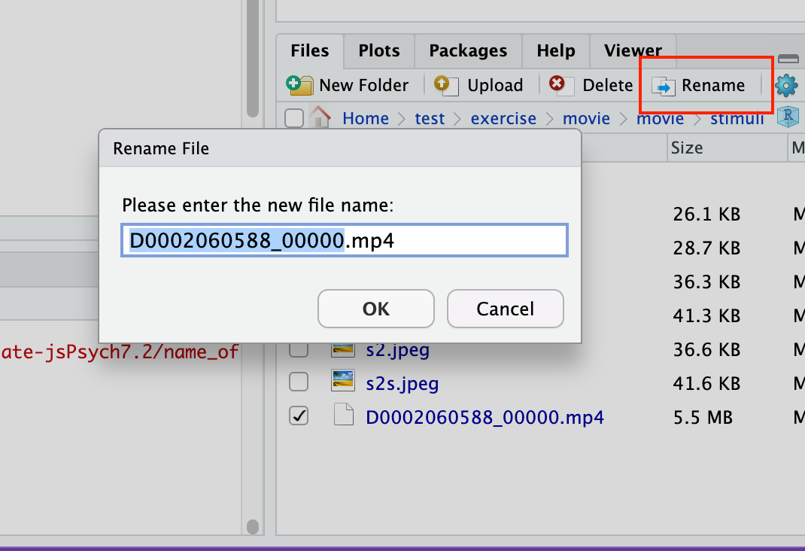

ストループ課題や逆転学習課題の作成は大変だったと思うので，少しひと呼吸おいて，今回は音声や動画を呈示するようなjsPsychの他のプラグインを使ってみましょう！

<br>

## 音声を呈示してみよう！

以下をRstudioのConsoleで実行して，フォルダとファイルを準備します。

```{r eval=FALSE, include=TRUE}
psyinfr::set_cbat("sound","7.2.1")
```

＊国里ゼミ以外でResearch Compendiumを使ってない場合は，カレントディレクトリーにexerciseという名前のフォルダを作ってもらえば，そちらにフォルダを用意します。

jsPsychでは，以下のプラグインを使うと音声を呈示することができます。

- audio-button-response
- audio-keyboard-response
- audio-slider-response

<br>

今回は，キーボードで反応をとることにして，audio-keyboard-responseを使います。demo_sound.htmlファイルをクリックして，「Open in Editor」を選択して，HTMLファイルを開いてみましょう。



<br>

以下のように，plugin-audio-keyboard-response.jsをHTMLファイルに追加します。



<br>


さて，呈示する音声ですが，無料で使える便利な素材ライブラリの
<a href="https://www.nhk.or.jp/archives/creative/material/category-list.html?i=110" target="_blank">NHK CREATIVE LIBRARYに百人一首の音声データ</a>があるので，カルタをやることにします。とりあえず，以下の「秋の田の・・・」の音声をダウンロードしておきます。ダウンロードは，必要な音声データをクリック，リンク先の利用規約に同意した上で，パソコンにダウンロードします。

- [秋の田のかりほの庵の苫をあらみ　わが衣手は露にぬれつつ](https://www2.nhk.or.jp/archives/creative/material/view.cgi?m=D0002110101_00000)


ダウンロードができたら，RStudioで「Upload」をクリックして，音声ファイルをアップロードします。以下のような画面が開くので，Target directoryにsound > sound > stimuliフォルダを選んで，パソコン内のダウンロードした音声ファイルをChoose Fileで選んでOkをクリックします。




<br>

ファイルがアップロードされると思いますが，ファイル名が長いので，「Rename」をクリックして，ファイル名を「a1.m4a」に変更します。



<br>

上記でダウンロードした音声が鳴ったら，正しい歌を選んでもらうのですが，「秋の田の・・・」以外に以下の３つも呈示して，４択にしてみましょう。

- 春過ぎて夏来にけらし白妙の　衣干すてふ天の香具山
- あしびきの山鳥の尾のしだり尾の　ながながし夜をひとりかも寝む
- 田子の浦にうち出でてみれば白妙の　富士の高嶺に雪は降りつつ

<br>

教示は，適当に以下のようにしてみましょう。

```
const instruction = {
  type: jsPsychHtmlKeyboardResponse,
  stimulus: "<p style='text-align:left'>これから百人一首の音声が流れます。</p>"+
    "<p style='text-align'>流れているものを１から４のキーを押して選んでください。</p>"+
    "<p style='text-align:left'>スペースを押して始めてください。</p>",
  post_trial_gap: 1000
};
```

<br>

音声を呈示してキーボードで反応取得する場合は，audio-keyboard-responseプラグインを使います。stimulus:で音声刺激を指定します。sound/stimuliフォルダ内のa1.m4aを指定します。４つの歌を呈示して反応を取るので，choiceでは４つキーを設定します（適当に1,2,3,4としました）。最後にpromptに教示と選択肢の歌を書いて呈示します（見やすさを考えて左揃えにしました）。

```
const hundred_poems1  = {
    type: jsPsychAudioKeyboardResponse,
    stimulus: 'sound/stimuli/a1.m4a',
    choices: ['1', '2','3','4'],
    prompt: "<p style='text-align:left'>これから流れる百人一首は以下のどれでしょうか？１から４のキーで選んでください</p>"+
    "<p style='text-align:left'>1 あしびきの山鳥の尾のしだり尾の　ながながし夜をひとりかも寝む</p>"+
    "<p style='text-align:left'>2 春過ぎて夏来にけらし白妙の　衣干すてふ天の香具山</p>"+
    "<p style='text-align:left'>3 秋の田のかりほの庵の苫をあらみ　わが衣手は露にぬれつつ</p>"+
    "<p style='text-align:left'>4 田子の浦にうち出でてみれば白妙の　富士の高嶺に雪は降りつつ</p>"
};
```

<br>

教示ブロックと音声呈示ブロックができたので，timelineを設定します。

```
const timeline = [instruction, hundred_poems1];
```

demo_sound.htmlをブラウザで開いて動作確認しましょう。

<br>

### 演習課題1

上記に続けて，以下の「わが庵は・・・」を答えとしたカルタも作ってみましょう！

- わが庵は都の辰巳しかぞ住む　世をうぢ山と人はいふなり
- 奥山に紅葉踏み分け鳴く鹿の　声聞く時ぞ秋は悲しき
- かささぎの渡せる橋に置く霜の　白きを見れば夜ぞ更けにける
- 天の原ふりさけみれば春日なる　三笠の山に出でし月かも

<br>

## 動画を呈示してみよう！

以下をRstudioのConsoleで実行して，フォルダとファイルを準備します。

```{r eval=FALSE, include=TRUE}
psyinfr::set_cbat("movie","7.2.1")
```

jsPsychでは，以下のプラグインを使うと動画を呈示することができます。

- jspsych-video-button-response
- jspsych-video-keyboard-response
- jspsych-video-slider-response

<br>

今回は，マウスを使ってスライダーを動かして，動画の好き嫌いを評定させることにしてみましょう。その場合は，jspsych-video-slider-responseを使います。demo_movie.htmlファイルをクリックして，「Open in Editor」を選択して，HTMLファイルを開いてみましょう。


<br>

以下のように，plugin-video-slider-response.jsを追加します。


<br>

音声と同様に<a href="https://www.nhk.or.jp/archives/creative/material/" target="_blank">NHK CREATIVE LIBRARY</a>を使いましょう。正直なんでもいいのですが，あまり長くない動画を適当に選んで，パソコンにダウンロードしてください。

movie > movie > stimuli フォルダにダウンロードした動画をアップロードします。


<br>


stimuliフォルダ内の動画ファイルをv1.mp4に変更してください。


<br>


まず，以下のような教示をします。
```
const instruction = {
  type: jsPsychHtmlKeyboardResponse,
  stimulus: "<p style='text-align:left'>これから動画が流れます。</p>"+
    "<p style='text-align'>流れている動画どのくらい好きか嫌いかマウスを使ってスライダーを動かして評価してください。</p>"+
    "<p style='text-align:left'>スペースを押して始めてください。</p>",
  post_trial_gap: 1000
};
```

<br>

次に，video-slider-responseプラグインを使って，動画を呈示します。stimulus:で動画ファイルを指定します。そのままだと大きい場合が多いので，width:で大きさを調整します。labels: でスライダーのラベルをつけられます。今回は嫌い-どちらでもない-好きの３つのラベルをつけます。prompt:で教示を指定します。デフォルトでは，下に「Continue」ボタンがでてきますが，これは，「button_label: "次へ"」とすることで，「次へ」ボタンに変更します。

```
const movie1 = {
    type: jsPsychVideoSliderResponse,
    stimulus: ['movie/stimuli/v1.mp4'],
    width: 600,
    labels: ["嫌い", "どちらでもない", "好き"],
    prompt: "<p>この動画がどのくらい好きか嫌いか，マウスでスライダーを動かして，評定してください</p>",
    button_label: "次へ"
}
```

<br>

教示ブロックと音声呈示ブロックができたので，timelineを設定します。

```
var timeline = [instruction, movie1];
```

demo_movie.htmlをブラウザで開いて動作確認しましょう。

<br>

### 演習課題2

上記の評定ラベルを，"1嫌い"から"10好き"までの10段階に変更しましょう（途中の2,3,4...もラベルをつけてください）。その上で，別の動画も追加して，２つの動画を評定するようにしてみましょう！

<br>

## 研究参加の同意を取ろう！

研究をする場合は，研究内容，参加者の権利，個人情報保護を含むデータの扱われ方などについて説明をした上で，研究参加の同意をとります。では，survey-multi-selectプラグインを使って同意をとってみます。


<br>

以下のように同意ブロック(ic)を作ります。実際の研究では，...の部分やABCなどをおいている部分に加筆・修正をして使います。

```
const ic = {
    type: jsPsychSurveyMultiSelect,
    questions: [{
        prompt: '<span style = "font-size: 14pt"><b>以上の内容をよく読んで，理解した上で実験参加に同意いただける方はチェックをお願いします。同意されない方は，ウィンドウを閉じてください。</b></span>',
        options: ['<span style = "font-size: 14pt">説明事項をよく読み，理解した上で，研究参加に同意します。</span>'],
        required: true,
        name: 'approval'
    }],
    preamble: '<div style = "font-size: 14pt; text-align: left;"><p>A大学B部C学科・Dが行っている「Eに関する研究」に関心を持っていただき，誠にありがとうございます。参加にあたり，以下の説明をスクロールしてお読みください。</p>' +
    '<p><b>１．研究目的</b>' +
    '<br>本研究は，...を目的としております。</p>' +
    '<p><b>２．研究内容</b>' +
    '<br>本研究は，日本語を母国語とする20歳以上の方を対象としています。本研究では，...<参加者が取り組む内容を記載>...分程度で終了します。なお，これから行うアンケートや課題は，あなた個人の性格や能力を個別に評価することを目的とはしておりません。' +
    '<p><b>３．危険性ならびに不利益</b>' +
    '<br>研究に参加することで被る身体的な負担は，...。アンケートへの回答や課題中，もし不快感を感じることがあったら，ご自身の意志で研究参加をいつでも中止することができます。参加の中止はいつ，いかなる理由でも可能です。また，参加の中止，不参加に伴う不利益は一切生じません。</p>' +
    '<p><b>４．参加者の権利</b>' +
    '<br>本研究の参加は，皆様の自由意志によるものです。本研究に参加することに同意しても，それはいつでも撤回することができます。同意を撤回しても，いかなる不利益を受けることはありません。参加に同意した後に，参加途中で撤回する場合は，そのままウェブブラウザを閉じていただけると同意撤回したとみなします。参加途中で参加を撤回された場合は，そのデータをその後の研究で使用いたしません。また，最後まで参加したもののご自身の研究データを研究に使用してほしくない場合は，最後に提示されるコードを以下の連絡先にお送りいただければ，その後の研究でそのデータを使用いたしません。</p>' +
    '<p><b>5.謝礼</b>' +
    '<br>謝礼につきましては...。</p>' +
    '<p><b>6.研究結果の使用およびプライバシーの保護</b>' +
    '<br>参加された方のアンケートへの回答や課題への反応は，全て匿名で扱われ，データからあなたが特定されることはありません。本研究の結果は，学術論文や学会発表などを通じて公表される可能性があります。ただし，その際も参加者の代表値(平均値など)となる統計量を使用し，特定の個人に焦点を当てた発表は行いません。' +
    '<br>なお，この研究参加にあたり，画面上に呈示する画像などを皆様のパソコンに一時的にダウンロードします。最後まで研究に参加いただいた場合は，ダウンロードしたファイルは削除し，反応などのデータのみを取得します。その他の情報には一切アクセスいたしません。予めご了承ください。</p>' +
    '<p><b>7.データの公開</b>' +
    '<br>データを公開し広く閲覧・分析できる状態にすることは，研究の再現性を高め，今回の研究によって得られる知見の増加につながります。そのため，本研究では得られた研究データをAなどのサイトにおいて，公開することを予定しています。公開するのは，B,C,D,Eになります。その際，参加された際に付与されるIDとは全く別のIDをランダムに付与します。そのため，いかなる手段を用いても，公開データの閲覧者は，公開データから個人を特定することはできないようにいたします。</p>' +
    '<p><b>8.倫理委員会</b>' +
    '<br>本研究は，A大学B部C学科の人を対象とした研究倫理委員会の承認を得た上で実施しています（申請番号：E）。</p>' +
    '<p><b>9.研究結果のフィードバック方法</b>' +
    '<br>研究結果は，Aにて，B年C月D日からE年間フィードバックいたします。研究参加の辞退実験や本研究のお問い合わせは、以下の連絡先にお願い致します。</p>' +
    '<p><b>10.研究に関する問い合わせ先</b>' +
    '<br>A大学B部C学科 D' +
    '<br>〒214-8580 神奈川県川崎市多摩区東三田 2-1-1</p></div>',
    button_label: '次へ'
};
```

<br>

そして，以下のようにすれば，同意の取得，教示，動画の呈示という流れが作れます。

```
var timeline = [ic, instruction, movie1];
```

これで，あとは試行錯誤すれば，いろいろな心理学の行動課題をjsPsychで作れるようになります。

<br>

## 演習課題3

ICを自分の研究テーマ（仮），所属，名前に変更してみよう！
