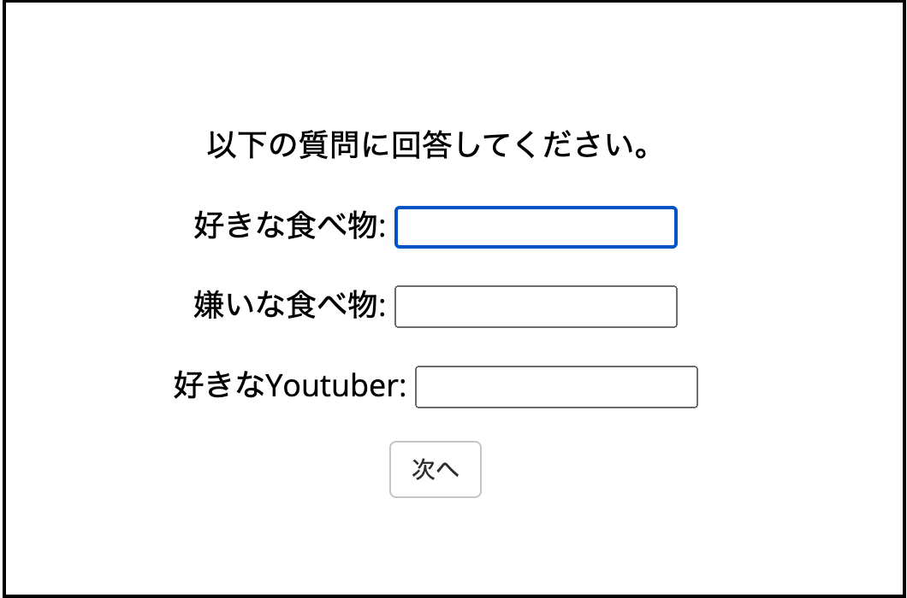
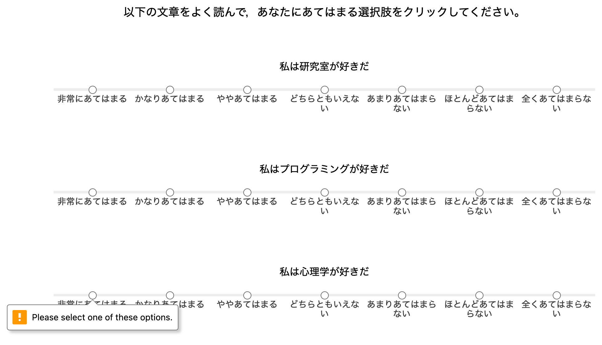
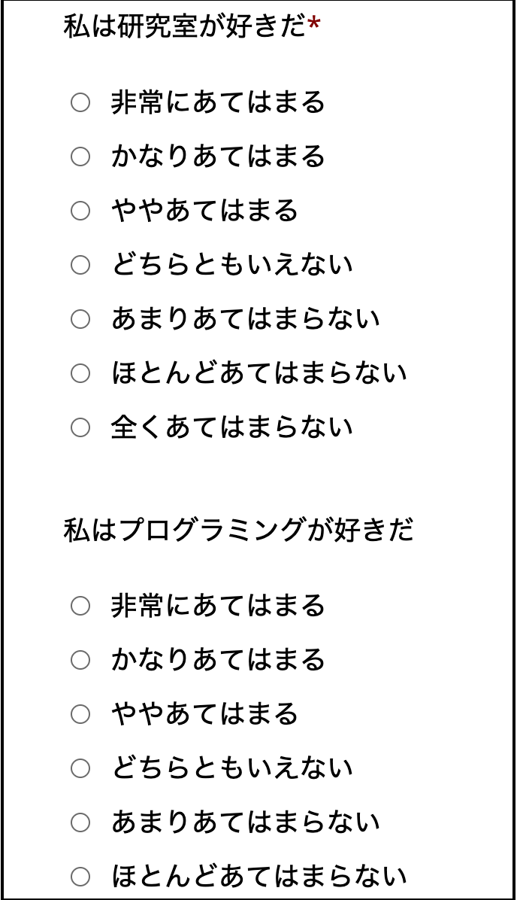
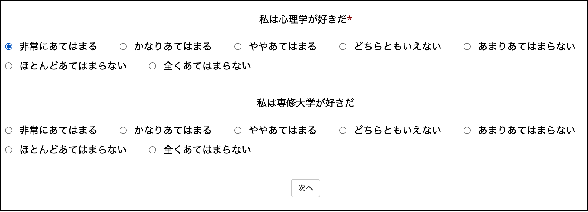
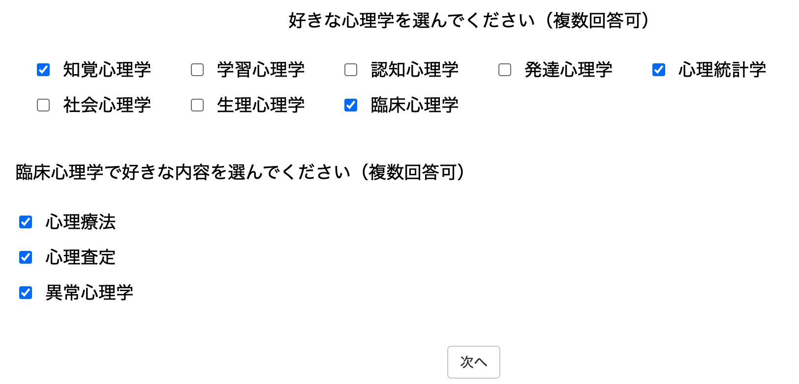
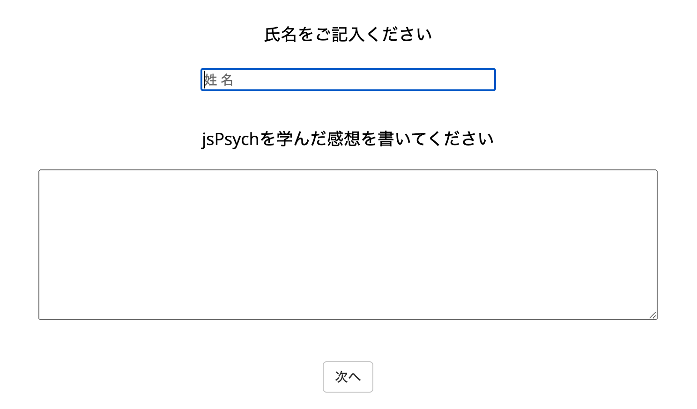

## 「紙の質問紙で調査」はもう時代遅れかも？

これまで心理学の調査研究では，"紙の質問紙で調査→Excelで手入力→Excelで前処理"というフローが使われていました。しかし，新型コロナウィルス感染症の影響でオンライン調査が増えていること，"紙の質問紙で調査→Excelで手入力→Excelで前処理"というフローにはヒューマンエラーの入り込む余地が大きいことから推奨できません。

そこで，本研究室では，紙でのデータ収集は止めて，jsPsychを使ったデータ収集を推奨します。「jsPsychで作った調査票をJATOSにおいてデータ収集→生データ保管&匿名化処理→匿名化済みデータをRで前処理」という流れになります。

<br>

## jsPsychで質問紙を実施してみよう！

jsPsychで質問票を作る方法について学んでいきましょう。**まず，以下をRstudioのConsoleで実行して，フォルダとファイルを準備します。**

```{r eval=FALSE, include=TRUE}
psyinfr::set_cbat("survey","7.2.1")
```

jsPsychでは，以下の５つのプラグインが用意されています。以下，それぞれ簡単に説明します。

- survey-html-form
- survey-likert
- survey-multi-choice
- survey-multi-select
- survey-text

<br>

そこで，最初のタグの設定は，５つのプラグインを読み込んで，以下のようになります。

<br>


## 1. survey-html-form

フォームを作成するプラグインです。type:にjsPsychSurveyHtmlForm，preamble:に質問文，html:でフォームの設定をします(```<input name="food_like" type="text" />```のところが入力フォームの部分です。nameが入力のラベルで，typeで入力する種類を指定します。idもつかうので適当に指定します)。デフォルトでは”Continue”というボタンが出てくるので，button_label:を'次へ'にします。そして，autofocusでhtml内で指定したidを指定すると，調査票が始まった時に，自動的にそのidの入力欄にフォーカスされます（つまり入力欄にカーソルがあたる）。autofocusを最初の入力欄に指定しておくと，ユーザーはマウスでカーソルを合わせなくても入力を始められるので回答しやすくなると思います。以下を，task.jsにコピペして（上書きしてください），動作確認してみましょう。

```{js}
const form = {
  type: jsPsychSurveyHtmlForm,
  preamble: '<p> 以下の質問に回答してください。</p>',
  html: '<p> 好きな食べ物: <input name="food_like" id="food_like" type="text" /></p>'+
  　　　'<p> 嫌いな食べ物: <input name="food_dislike" id="food_dislike" type="text" /></p>'+
        '<p> 好きなYoutuber: <input name="youtuber" id="youtuber" type="text" /></p>',
  button_label: '次へ',
  autofocus: 'food_like'
};

const timeline = [form];
```

survey-html-formでは，以下のような入力画面を作ることができます。





### 演習課題1

「大学の近くでおすすめの料理屋」，「家の近くでおすすめの料理屋」を尋ねるフォームを作ってみましょう！

<br>

## 2. survey-likert

Likert式の質問紙を行うためのプラグインです。まず,scaleに選択肢を用意します（なお，名前はscaleじゃなくても良くて，好きな名前で良いです）。今回は，７件法の選択肢を用意します。type:にjsPsychSurveyLikertを指定し,questionsで質問項目の設定をしていきます。questions内の各項目については，prompt:に質問項目，name:にその質問項目のラベル，labels:にさきほど用意した選択肢のscaleを用意します。なお，"私は心理学が好きだ"という質問は，required: trueにしています。これは，必ず回答しないといけない項目を指定する場合に使います。デフォルトでは”Continue”というボタンが出てくるので，button_label:を'次へ'にします。以下を，task.jsにコピペして，動作確認してみましょう。


```{js}
const scale = [
  "非常にあてはまる", 
  "かなりあてはまる", 
  "ややあてはまる", 
  "どちらともいえない",
  "あまりあてはまらない",
  "ほとんどあてはまらない",
  "全くあてはまらない"
];

const likert = {
  type: jsPsychSurveyLikert,
  preamble: '<p> 以下の文章をよく読んで，あなたにあてはまる選択肢をクリックしてください。</p>',
  questions: [
    {prompt: "私は研究室が好きだ", name: 'lab', labels: scale},
    {prompt: "私はプログラミングが好きだ", name: 'programming', labels: scale},
    {prompt: "私は心理学が好きだ", name: 'psych', labels: scale, required: true},
    {prompt: "私は専修大学が好きだ", name: 'Senshu', labels: scale}
  ],
  button_label: '次へ'
};

const timeline = [likert];
```

survey-likertでは，以下のように調査票を作ることができます。required: trueにしている"私は心理学が好きだ"に回答をしないと，左下のようなアラートが出ます。




### 演習課題2

心理学で使われる尺度を１つ選んでsurvey-likertで質問票を作ってみよう！そして，「button_label: '次へ'」の下に「randomize_question_order: true」を追加して，質問項目の呈示順序をランダムにしてみよう！

<br>

## 3. survey-multi-choice

ラジオボタン式の選択を行うためのプラグインです。まず,optionsに選択肢を用意します（なお，名前はoptionsじゃなくても良くて，好きな名前で良いです）。今回は，７件法の選択肢を用意します。type:にjsPsychSurveyMultiChoiceを指定して，question:の設定をしていきます。prompt:に質問項目，name:にその質問項目のラベル，options:にさきほど用意した選択肢のoptionsを用意します。required:はtrueにすると必須項目になり，回答しないと次のページに進めなくなります。falseにすると必須項目ではなくなります。また，選択肢のoptionsは基本的には垂直方向に並びますが，horizontal: trueにすると水平方向に並びます。今回は，垂直方向と水平方向の両方を試してみましょう。　最後に，デフォルトでは”Continue”というボタンが出てくるので，button_label:を'次へ'にします。以下を，task.jsにコピペして，動作確認してみましょう。

```{js}
const options = [ "非常にあてはまる", 
  "かなりあてはまる", 
  "ややあてはまる", 
  "どちらともいえない",
  "あまりあてはまらない",
  "ほとんどあてはまらない",
  "全くあてはまらない"];

const multi_choice = {
  type:  jsPsychSurveyMultiChoice,
  questions: [
    {prompt: "私は研究室が好きだ", name: 'lab', options: options, required:true}, 
    {prompt: "私はプログラミングが好きだ", name: 'program', options: options, required: false}
  ],
  button_label: '次へ'
};

const multi_choice_h = {
  type: jsPsychSurveyMultiChoice,
  questions: [
    {prompt: "私は心理学が好きだ", name: 'psych', options: options, required: true, horizontal: true}, 
    {prompt: "私は専修大学が好きだ", name: 'senshu', options: options, required: false, horizontal: true}
  ],
  button_label: '次へ'
};

const timeline = [multi_choice, multi_choice_h];
```

survey-multi-choiceでは，以下のように調査票を作ることができます。


水平方向にすると以下のような感じになります。Likert式なら，survey-likertをつかうのが良さそうですね。




### 演習課題3

演習課題2で選んだ心理尺度について，survey-multi-choiceを使って，質問票を作ってみよう！また，「randomize_question_order: true」も追加してみよう！

<br>

## 4. survey-multi-select

複数回答可能な調査を行うためのプラグインです。type:にjsPsychSurveyMultiSelectを指定し，question:の設定をしていきます。prompt:に質問項目，options: に選択肢，horizontal: trueで水平方向に並べて，required: trueで必須項目にして，name:にその質問項目のラベルを用意します。　デフォルトでは”Continue”というボタンが出てくるので，button_label:を'次へ'にして，randomize_question_order: trueで質問の呈示順序をランダムにします。これまで説明をしたプラグインでも，randomize_question_orderを使うと項目の呈示順序をランダムにすることができます。以下を，task.jsにコピペして，動作確認してみましょう。

```{js}
const multi_select = {
    type: jsPsychSurveyMultiSelect,
    questions: [
      {
        prompt: "好きな心理学を選んでください（複数回答可）", 
        options: ["知覚心理学", "学習心理学", "認知心理学", "発達心理学", "心理統計学","社会心理学","生理心理学","臨床心理学"], 
        horizontal: true,
        required: true,
        name: 'psych'
      }, 
      {
        prompt: "臨床心理学で好きな内容を選んでください（複数回答可）", 
        options: ["心理療法", "心理査定", "異常心理学"], 
        horizontal: false,
        required:　false,
        name: 'ClinicalPsych'
      }
    ], 
    button_label: '次へ',
    randomize_question_order: true
};

const timeline = [multi_select];
```

survey-multi-selectでは，以下のように複数回答可能な調査票を作ることができます。




### 演習課題4

大学の心理学の各研究室名を選択肢にいれて，志望研究室（複数回答可）を尋ねる質問票を作ってみよう！

<br>

## 5. survey-text

キーボードを使って，回答を書き込んでもらうためのプラグインです。prompt:に質問，name:に質問項目のラベルを指定します。placeholder:を設定すると欄内に記載内容の指示も入れられます。rows:と columns:を設定すると，記入欄の大きさを調整できます。以下を，task.jsにコピペして，動作確認してみましょう。

```{js}
const survey_text = {
  type: jsPsychSurveyText,
  questions: [
    {prompt: "氏名をご記入ください", name: 'name',placeholder: "姓 名"},
    {prompt: "jsPsychを学んだ感想を書いてください", rows: 10, columns: 80}, 
  ],
  button_label: '次へ',
};

const timeline = [survey_text];
```

survey-textでは，以下のように調査票を作ることができます。




### 演習課題5

心理学を学ぼうとおもったきっかけを自由記述で回答してもらうような質問票を作ってみよう！


<br>

### 演習課題6

以下のような質問票を作成ください。

- 1ページ目:ラジオボタン形式で，性別と利き手を尋ねる。
- 2ページ目:フォーム形式で，大学名，学部名，学科名を尋ねる。
- 3ページ目:心理尺度（演習課題２）を１つ選んでLikert形式で尋ねる。
- 4ページ目:月曜日から金曜日で大学に来ている日を尋ねる（複数回答可にする）。
- 5ページ目:調査に回答した感想を自由記述形式で尋ねる。

### 補足情報（国里のためのメモ）

jsPsychには，<a href="https://www.jspsych.org/7.2/plugins/survey/" target="_blank">survey</a>というプラグインがあって，SurveryJSというjsPsychとは異なる調査用のライブラリが使えます。SurveryJSの表現力は豊かなので，期待のできるプラグインですが，現在開発中なので，ここでは解説をしません。

survey-likertでも良いのですが，若干紙の質問紙からすると乖離があるかもしれません。そのため，本研究室でプラグインを作成しています。その解説は今後追加する予定です。
