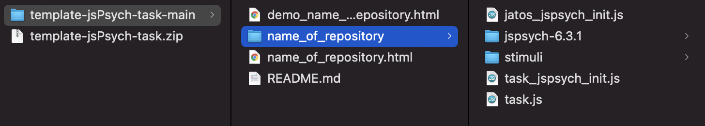
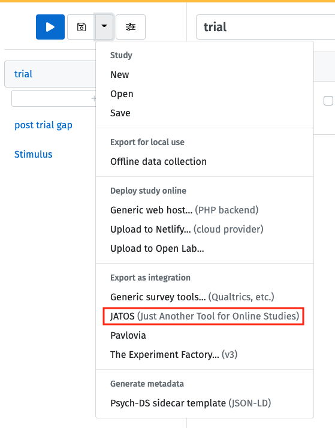
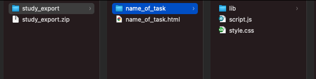
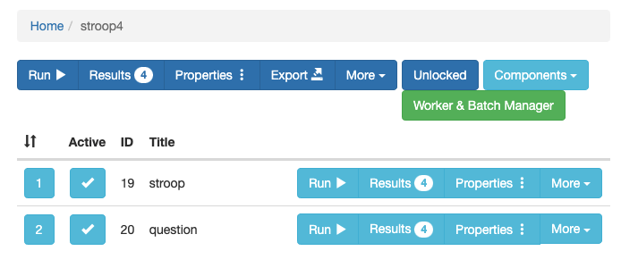
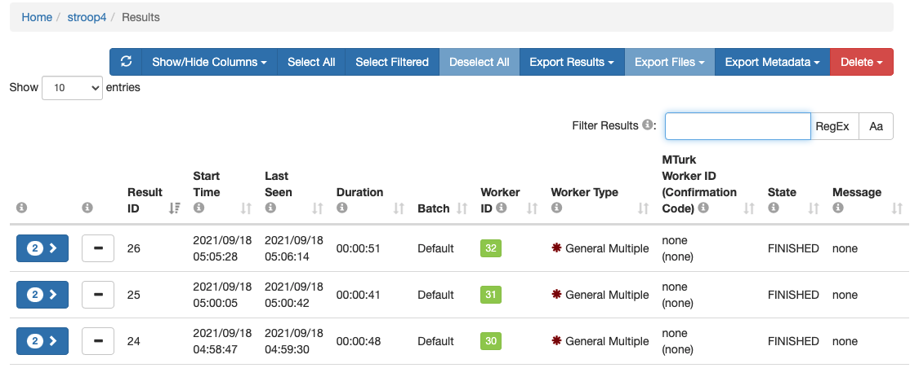

jsPsychで作った課題とlab.jsで作った課題をJATOS上でまとめて動かしたい状況があるかと思います。例えば，lab.jsで課題やアンケートを作って，jsPsychでちょっとややこしい行動課題を作った場合，後からどちらかに統一するのはちょっと面倒です。可能ならそれぞれをJATOS上で統合して実行したいかなと思います。

### jsPsych課題の準備

jsPsych課題は以下のGitHubリポジトリの構造を意識して設定をします。

https://github.com/ykunisato/template-jsPsych-task

一般的には，jsPsych課題の名前のついたフォルダ内に，HTMLファイル，jsPsychのプラグインのフォルダ，刺激のフォルダなどを配置すると思います。JATOS上の統合をする場合は，以下のように，HTMLファイルはそれらの１つ上の階層におきます（HTMLファイルがname_of_repositoryフォルダから出て同じ階層にいるかと思います）。それに伴ってHTMLファイルないでのjsPsychプラグインのパス指定は，name_of_repositoryフォルダを含んだものになります（上記のGitHubリポジトリを参照ください）。

### lab.js課題の準備

lab.js Buliderで作業して完成したら（[lab.jsの導入はこちらをどうぞ](https://mklab-japan.github.io/jpa2021tws/labjs/)），以下のように，JATOS形式で保存します。するとzipファイルがダウンロードされると思います。

ダウロードされたzipを開くと以下のようになっていると思います。

まず，study.jasを削除します。次に，Study内のindex.htmlを上の階層に移動させて，名前を変えます(ここではname_of_taskにしています)。そして，Studyフォルダも課題名にしておきます（以下のような感じにします）。最後に，index.htmlから名前を変更したHTMLファイルを開いて，パスを変更します（各種ファイルの間にname_of_taskフォルダ名が挟まります）。

### JATOSify

JATOSifyするためにローカルにjsPsychとlab.jsを統合したフォルダを作ります。今回はstroopフォルダの下に，lab.jsで作った質問紙のquestion.htmlと各種ファイルがはいったquestionフォルダ，jsPsychで作ったストループ課題のstroop.htmlと各種ファイルがはいったstroopフォルダを配置しています。実験全体をコンポーネントに分けて，それぞれをlab.jsとjsPsychが担当している感じです。

上の「JATOSで実験を登録する」を参考にJSATOS上でこの課題をローカルのJATOS上に登録していきます。今回は，Componentsでstroop.htmlとquestion.htmlを登録します。登録すると以下のような感じになります。stroopとquestionが登録されていますね。この順番で課題が実施されるので，JATOS上で実行すると，ストループ課題をしてから，質問紙が実施されます。

ローカルで作成したJATOSify済みのフォルダをエクスポートすれば，サーバー上のJATOSで実行できて，オンライン実験が可能です。以下は，私で試してみた結果です（同一IPアドレスからアクセスするので，テストではGeneral Multipleで実施しました）。参加者ごとにWorkerIDが割り振られて，その下にストループと質問紙の回答があります。

jsPsychとlab.jsを混ぜることができるのは便利ですね。