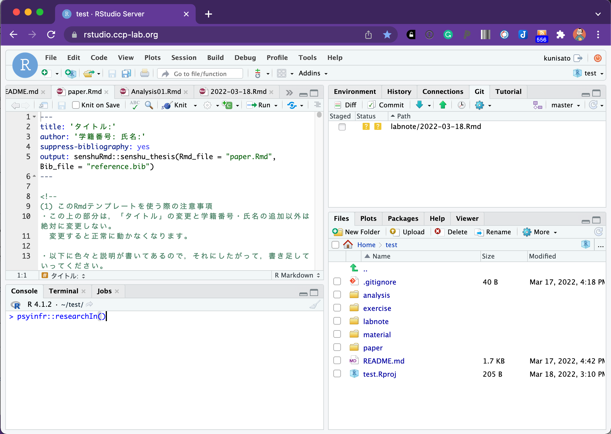
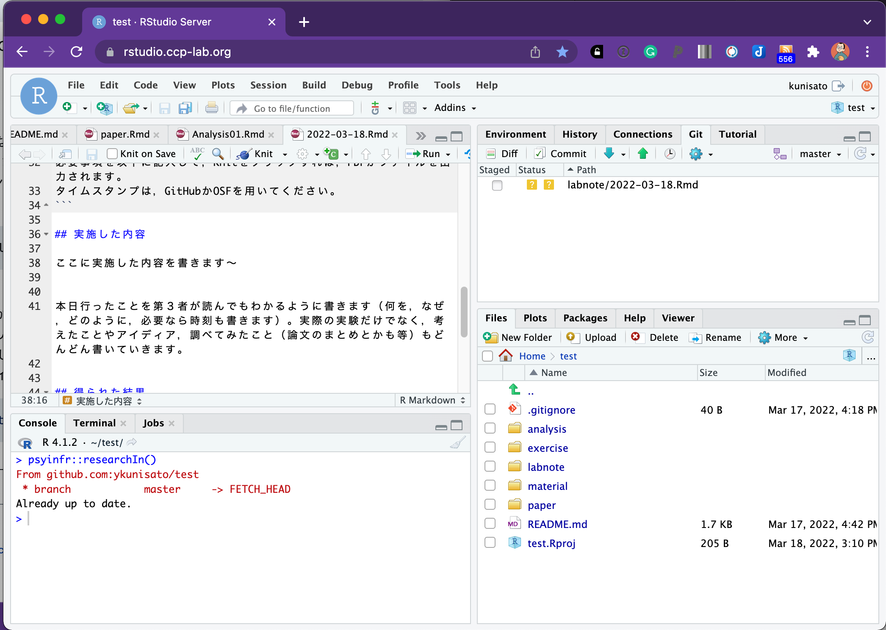
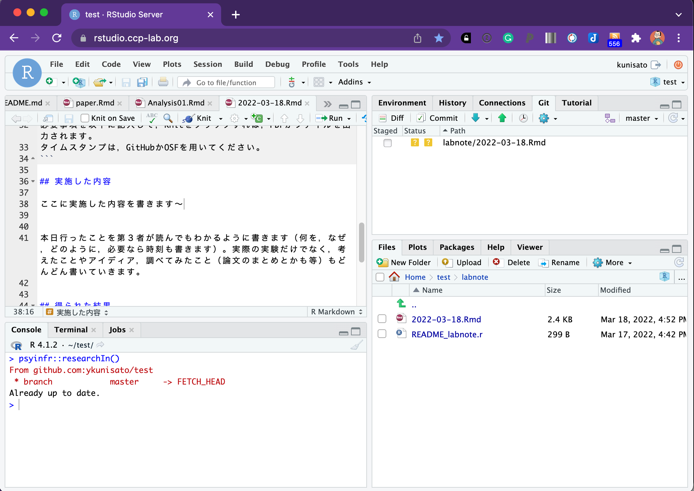
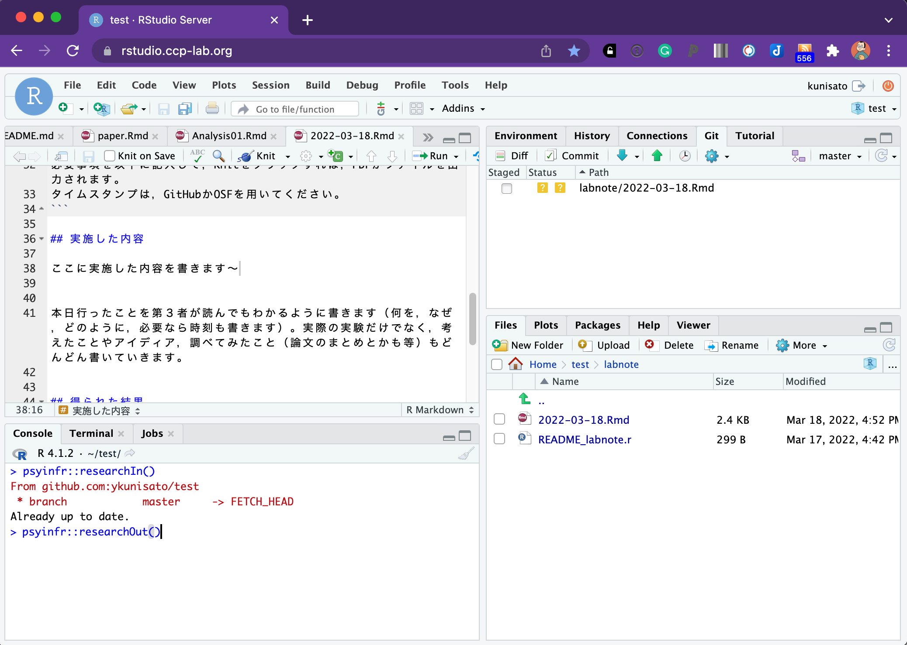
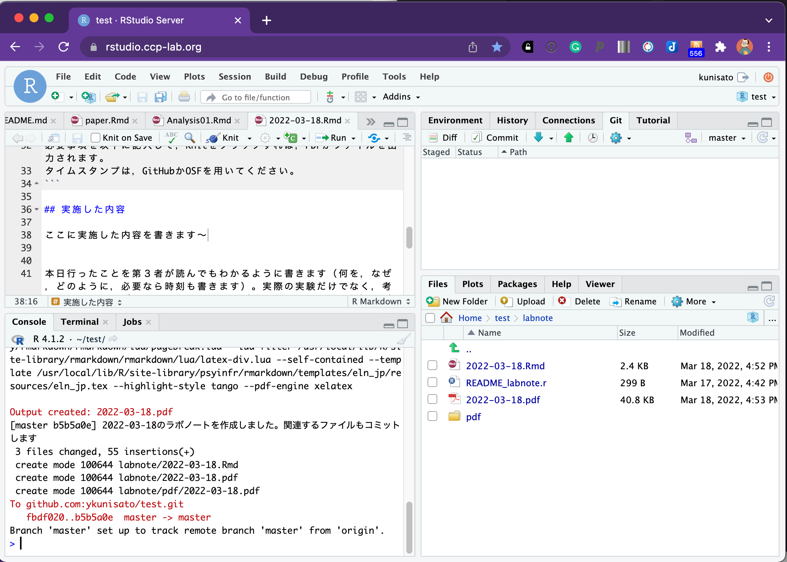
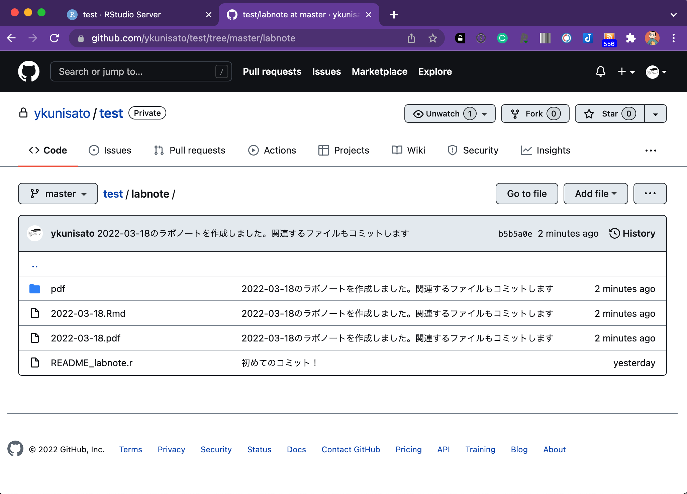

卒論・修論への取り組む際に，以下のルーティンを意識しましょう。

1. **研究開始**RStudioサーバーを開いて，GitHubからプルする（Rstudioサーバーを最新の状態にする）。
2. **研究**卒論・修論の作業をする（調べたこと考えたことのメモ，データ収集準備，解析，執筆などなど）
3. **研究終了**ラボノートを書いてコミットした上でGitHubにプッシュする。


この１〜３を繰り返していくことで，卒論・修論ができていきます。日々の研究の記録を丁寧に残して，実験した内容，発見や仮説などをタイムスタンプをつけて残すことは研究公正において重要になります。ただ，既存のラボノートや電子ラボノートは簡単なものでなく，心理学ではなかなか定着していない状況があります。そこで，[psyinfr](https://github.com/ykunisato/psyinfr)パッケージにはRから使える簡易な電子ラボノートを用意しています。

<br />

以下の作業をする場合は，[GitHubの設定](https://kunisatolab.github.io/main/how-to-github.html)と[Research Compendiumの設定](https://kunisatolab.github.io/main/how-to-write-with-rstudio.html)を事前にしておきましょう。

### (1)研究開始

R StudioのConsoleに，以下のコードを打ち込みます。それだけです（これだけなので覚えてね）。

```{r eval=FALSE, include=TRUE}
psyinfr::researchIn()
```


<br />


すると，GitHubからプルしてRstudioサーバーを最新の状態になって，日付のついた電子ラボノート用Rmdファイルを作成されます。


<br />


### (2)研究

さて，卒論・修論の作業をしましょう。RStuidoでの卒論・修論の作業となると，データ収集準備・データ解析・執筆となるかと思うかもしれませんが，それよりも，卒論・修論に関して調べたこと・考えたことのメモをしっかり残しましょう。

卒論・修論に関して調べたこと・考えたことのメモは，ラボノートに書きましょう。ラボノートには以下のように書き込めます。ゼミでホワイトボードを使った場合は，その写真をアップするのも良いと思います。


<br />


### (3)研究終了

その日の研究が終わったら，以下のコードを打ち込みます。それだけです（これだけなので覚えてね）。

```{r eval=FALSE, include=TRUE}
psyinfr::researchOut()
```


<br />


実行すると，まずその日のラボノートをRMarkdownからPDFに変換します（なにかRMarkdownの記述に問題があるとエラーがでます）。それをlabnoteフォルダ内のPDFフォルダにコピーして，最後にコミットをした上でGitHubにプッシュします。これらが自動で行われます。


<br />

GitHubで確認すると，自動で入るコミットメッセージとともにラボノートがPDFフォルダに入っています。これで，あとで確認ができます。


<br />

## まとめ

日々の研究では，以下の１〜３を以下のコマンドを使って繰り返します。

1. **研究開始**```psyinfr::researchIn()```
2. **研究**
3. **研究終了**　```psyinfr::researchOut()```


