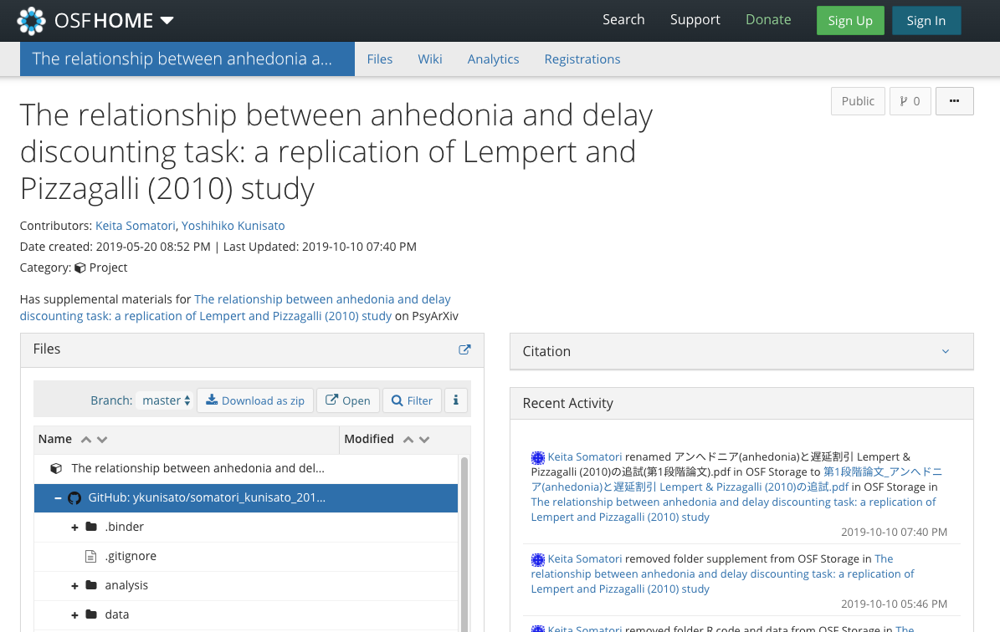
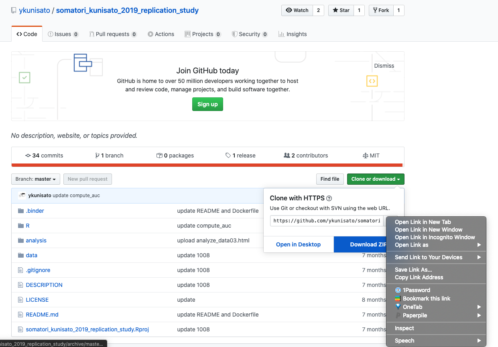

## 1. 心理学関連オープンデータのリスト

心理学関連オープンデータをリスト化してみました（私以外にも有志の方に追加をしてもらっています。もし，ご存知のオープンデータがありましたら，追加ください）。

- [心理学関連オープンデータのリスト](https://docs.google.com/spreadsheets/d/1LMREITla_T3caRrPhGihTEB2U7QDiEn78HH4VBgQ8Rs/edit#gid=0)


<br />

## 2. openPsychDataパッケージ

心理学関連のオープンデータの一部をRにダウンロードできる[RパッケージopenPsychData](https://github.com/ykunisato/openPsychData)をつくりました。まだ開発途中で，本パッケージの使用に関わるトラブルについては責任は負えませんので，予めご了承ください（一緒に開発してくれる人がいれば，連絡ください）。

### インストール

openPsychDataは，Rコンソールに以下を打ち込むことで，GitHubからインストールできます。

```{r eval=FALSE}
# install.packages("devtools")
devtools::install_github("ykunisato/openPsychData")
```

### 使い方

現状では，[Open-Source Psychometrics Project](https://openpsychometrics.org/_rawdata/)のデータをダウンロードして，Rにデータとして読み込みができます。[Open-Source Psychometrics Project](https://openpsychometrics.org/_rawdata/)をみて，以下のGoogleスプレッドシートのdataset_name in openPsychDataの列から，必要なデータセットの「dataset_name」を確認ください。利用可能なデータセットは順次増やしていく予定です。

[openPsychDataのGoogleスプレッドシート](https://docs.google.com/spreadsheets/d/1FHiqq7q5iItaU8KfYZTo_8bKhUGM_yGwMiklx8GiMXI/edit?usp=sharing)

データの読み込み
データを読み込む場合は，load_openPsyData()を使ってください。「dataset_name」に使いたいデータの名前を指定ください。もし，まだカレントディレクトリにデータをダウンロードしていない場合は，自動的にダウンロードします（カレントディレクトリに「dataset_name」と同じ名前のディレクトリを作成して，データを保存します）。 codebookをTRUEにしておくと変数の説明をしたcodebookを開きます。


```{r eval=FALSE}
library(openPsychData)
data <- load_openPsyData(dataset_name = "16PF", codebook = TRUE)
```


<br />

## 3. Open Science FrameworkのデータをRで使う

Open Science Frameworkには，有用＆貴重なデータセットが公開されています。例えば，以下のデータセットには，COVID-19が流行る前の日本における1382名の感染脆弱意識尺度への回答が収められています。

- Yamada Y, Xu H and Sasaki K. A dataset for the perceived vulnerability to disease scale in Japan before the spread of COVID-19 [version 1; peer review: awaiting peer review]. F1000Research 2020, 9:334 (https://doi.org/10.12688/f1000research.23713.1)

OSFにあるデータをRで使う場合は，osfrパッケージが便利です。使うのは，tidyverseパッケージとosfrパッケージです。

```{r message=FALSE, warning=FALSE}
library(tidyverse)
library(osfr)
```

Japan PVD 2018リポジトリ(https://osf.io/qw2af/)をosf_retrieve_node()でリトリーブしてみます。 metaにいろいろな情報が入っています。

```{r}
osf_retrieve_node("qw2af")
```

次に，リトリーブしたものをosf_ls_files()にいれて，リポジトリのファイルを確認します。PVDJapan2018.xlsxとDataset.txtがあるのがわかりますね。

```{r}
osf_retrieve_node("qw2af") %>% 
  osf_ls_files()
```


最後に，osf_download()でosf_ls_files()で確認したファイルをローカルにダウンロードします。

```{r eval=FALSE, include=FALSE}
osf_retrieve_node("qw2af") %>% 
  osf_ls_files() %>% 
  osf_download()
```

<br />

## 4. GitHubのデータをRで使う

データやコードがOSFにある論文も多いが，データとコードがGitHubにアップロードされている論文も多いです。例えば，以下の論文のデータやコードはGitHubにアップロードされています。

- 杣取恵太・国里愛彦 (2019). アンヘドニア(anhedonia)と遅延割引：Lempert & Pizzagalli(2010)の追試　心理学評論, 62(3), 231-243.




GitHubのデータやコードをRで使う場合，リポジトリのリンクを取得して，Rで読み込むと楽です。まず，以下のようにして，右クリックして，リンクアドレスをコピーします。



そして，コピーしたリンクを使って，以下のRコードを実行します（URLだけ変えればあとはコピペでいけます）。そうすると，カレントワーキングディレクトリに，データやコードが含まれたフォルダが作られます。

```{r eval=FALSE, include=FALSE}
url <- "https://github.com/ykunisato/somatori_kunisato_2019_replication_study/archive/master.zip"
temp <- tempfile()
download.file(url,temp)
unzip(temp)
unlink(temp)
```

