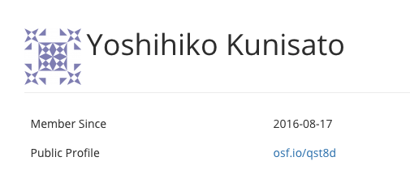

## ゼミでのOSFの活用

本ゼミでは，OSFを活用して，以下のことを行います。

- 卒論・修論の事前登録
- 卒論・修論関連の資料のアップロード

## OSFアカウントの作成

<a href="https://osf.io/" target="_blank">OSF</a>にアクセスして，Sing Upをクリックし，以下を入力してSign Upしてください。

- Full name(指名)
- Contact email(心理学科のメールアドレス)
- Confirm email(上と同じメールアドレス)
- Password(できるだけわかりにくいもの)

事前登録と卒論・修論関連の資料のアップロードは，そのタイミングになったら，アナウンスをします（IDとパスワードをなくさないようにちゃんと保管をしておいてください）。

**OSFの自分のページを確認して，以下の画像のようなアイコンの横にある登録名をslackで国里にお知らせください。研究室のプロジェクトに追加します**

 
 
 

これで，OSFでの登録は終わりです。
