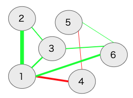

## 心理ネットワークとは？

心理ネットワーク（精神病理ネットワーク）については，まずは以下の２つの論文を読んでください。以降は，それを前提として，技術的な側面のみを解説します。

- [樫原 潤・伊藤正哉(印刷中) 心理ネットワークアプローチがもたらす「臨床革命」—認知行動療法の文脈に基づく展望— 認知行動療法研究](https://www.jstage.jst.go.jp/article/jjbct/advpub/0/advpub_20-015/_article/-char/ja/)
- [樫原 潤(2019) 精神病理ネットワークの応用可能性―うつ病治療のテイラー化を促進するために― 心理学評論  62(2),143-165](https://www.jstage.jst.go.jp/article/sjpr/62/2/62_143/_article/-char/ja)


心理ネットワークとは，観察可能な変数を表すノードと統計的関係を表すエッジから構成されるものです(Epskamp, Borsboom & Fried, 2018　以下の内容は基本的にEpskamp et al., 2018に従っています)。心理ネットワークモデルは，因子分析やSEMなどのように潜在変数を仮定してそれから各項目・症状を説明するのではなく，症状（心理変数）間のネットワーク構造を検討します。

心理ネットワークは，以下の図のように，観察可能な変数を表すノードは円で，関係を表すエッジは線でプロットされます。


### 心理学的ネットワーク分析の手順

心理ネットワーク分析は，おおよそ以下の４ステップからなります。

1. 統計的手法によってノード間のエッジを推定する
2. 推定された統計的関係をもとにネットワークを図示する
3. ネットワーク特性の指標の検討する
4. ネットワークの精度の検討する


ここで注意すべき点は，一般的なネットワーク科学で扱うネットワークの場合は，エッジは観察可能です（例えば，電力網ネットワークのエッジは直接観察・測定可能です）。しかし，心理ネットワークのエッジは，データから推定されます（重み付けネットワーク）。そのため，サンプルサイズの影響も受けますので，ネットワークのエッジの精度も検討する必要があります。また，ネットワーク科学では，グローバルなネットワーク特性の指標が使われます(small worldness, density, global clustering)。しかし，心理ネットワークのような重み付けネットワークでは使えません。そのため，２つのノードの関係や１つのノードがどのような影響力をもつのか（中心性の指標）といったローカルなネットワーク特性を用いることが多いです。


### 有向・無向ネットワーク

心理ネットワークの話の前に，有向ネットワークと無向ネットワークについて説明をしておきます。まず，有向ネットワークとはエッジに方向性があるネットワークになります。以下の図ようにエッジが矢印になっているネットワークです。この矢印の方向には因果関係が想定されています。例えば，「活動性低下→抑うつ気分増加」となっていましたら，活動低下が原因で抑うつ気分増加するという意味になります。ただし，「活動性低下→抑うつ気分増加」と聞いて，「活動性低下←抑うつ気分増加」もありえるのではないかと感じた方もおられるかもしれません。そのとおりでして，因果関係を言うには，まず原因は結果に時間的に先行する必要がありますし，因果に関連する変数が全て測定された上で，原因と結果が巡回しない（非巡回）必要があります。観察研究によって収集された心理学のデータの場合，時間的な前後関係は時系列データによって示せても，非巡回となるとかなり難しいかと思います。そのため，横断データに対する心理ネットワークでは，エッジに方向性がない無向ネットワークが用いられます。


### ２つのノードの関係(エッジの符号)


横断データに対する心理ネットワークでは，エッジに方向性がない無向ネットワークが用いられます。エッジの色は符号を意味していて，青もしくは緑の場合は正，赤の場合は負を表します。エッジが正（青色もしくは緑色）の場合は，２つのノード間には正の関係性が存在します（片方が増えると，もう一方も増える）。エッジが負（赤色）の場合は，２つのノード間には負の関係性が存在します（片方が増えると，もう一方は減る）。また，エッジの太さは，関係の強さを意味します。この場合の関係の強さとは，全体のノードからの影響を考慮した時の２つのノード間の関係の強さになります。そして，エッジの長さは，エッジの強さの逆数になります。つまり，ノード間の関係が強ければ強いほど，エッジの長さが短くなります。分かりやすいか微妙な例ですが，パーティ会場で関係性の近い２人のコミュニケーションは近い距離でなされるイメージをもつと良いかなと思います。


### ノードの中心性指標

心理ネットワークは，重み付けネットワークのため，その他のネットワークと違って，グローバルなネットワーク特性の指標（small worldness, density, global clustering）が使えません。そこで，各ノードの他のノードの影響性のようなローカルなネットワーク特性（中心性指標）を用います。そのようなローカルなネットワーク特性としては，strength，closeness，betweenessの３つがあります。


**Strength**


Strength（重み付けのないネットワークの場合は，degreeと言う）は，あるノードがつながっている全てのエッジの強さを合計したものです。あるノードが他のノードとどのくらい強くつながっているのかを表す指標であり，そのノードの全体に対する影響力を表しているといえます。

以下のようなネットワークを例にして，ノード１のStrengthを計算してみましょう。ノード1とノード2の間には，0.3の緑のエッジがあります。ノード1とノード3の間には，0.1の緑のエッジがあります。ノード1とノード6の間には，0.2の緑のエッジがあります。最後にノード1とノード4の間には，0.2の赤のエッジがあります。これらを合計した0.8がノード１のStrengthになります。ここの計算では，エッジの正負は問われません。なお，Strengthは接続しているノードの合計ですので，ノードが増えるほど大きくなるのでプロットする際には標準化されます。これは他の指標も同様です。



**Closeness**

Closenessは，あるノードと他の全てのノード間の最短経路長の合計の逆数になります。なにそれ？と思ったかもしれません。まず，ノード間の最短経路長とは，あるノードから別のノードまで最短距離でいける距離です。この距離というのは，エッジの強さの逆数になります。つまり，エッジの強さが0.1ならばその逆数は1/0.1で10になり，エッジの強さが0.5ならば1/0.5で2になります。最短経路長は，この距離を使って，あるノードから別のノードまでの距離を計算して，最も短い距離でいける距離を計算します。そして，あるノードへの他の全てのノードとの最短経路長を計算して，合計したものの逆数がClosenessになります。

ちょっと具体例で計算してみましょう。以下の図で，ノード１からノード３の最短経路長を調べてみましょう。ノード３からノード１に行くには，(1)ノード３からノード１に直接移動する，(2)ノード３からノード２を経由してノード１へ移動する，(3)ノード３からノード６を経由してノード１にいくの３つがあります。まず，(1)のノード１から３への直接経路については，ノード１と３のエッジの強さは0.1なので距離は10です。次に，(2)のノード２を経由する間接経路は，ノード３と２のエッジが0.1で距離10,ノード２とノード１のエッジが0.3で距離3.33なので，合計13.33になります。最後に，(3)のノード６を経由する間接経路は，ノード3と6のエッジが0.05で距離20，ノード6とノード１が0.2で距離５なので合計25となります。(1)(2)(3)を比較すると，ノード１から３の直接経路の長さが最短経路長となります。ただ，もしノード３と２のエッジが0.2の場合は，ノード２を経由する間接経路が最短経路になります。なお，以下の図は，手作業で作ったので強さと距離んの関係が適切ではありません，ご理解のほどよろしくお願いいたします。

このような感じで，あるノードから他のノードまでの最短経路長をそれぞれ計算していって，それらを合計したものの逆数がClosenessになります。Closenessは，あるノードがどのくらい間接的な影響を含めて他のノードとつながっているのかを示しています(一方，Strengthは，あるノードがどのくらい直説的に他のノードとつながっているのかを示しています）。つまり，あるノードから他のノードへの拡散の速さを表現していると言えます。


**Betweeness**

Betweennessは，2つのノード間の最短経路上に，あるノードが何回あるのかを示しています。先程，Clonenessで最短経路を計算しましたが，その最短経路上に，特定のノードが登場する回数を見ることで，そのノードが影響性の流れにおいてどの程度の影響力を持つのかを検討できます。以下の図の場合，ノード4と2の最短経路は，ノード４からノード１を経由してノード１に行くというものです。このように，ノード４とノード２の最短経路上には，ノード１があります。このようにして，特定のノード（今回はノード１）が最短経路上に何回出てくるのかカウントすることでBetweenessが計算できます。このように，Betweennessは，あるノードが2つのノードの接続においてどのくらい重要かを示すものです。このノードによっては，影響性の流れを変えることができるので，心理的介入などにおいても重視される指標といえるかもしれません。


## Gaussian Graphical Model(GGM)

変数間の関係がある・ないというグラフを作る場合に，確率分布と結びつけるようなモデルのことをベアワイズ・マルコフ・グラフ(pairwise Markov graph)と呼びます。そして，心理ネットワークで用いる無向ネットワークモデルの推定では，ペアワイズ・マルコフ確率場(pairwise Markov random field)がよく使われます。さらに，無向ネットワークでも，データが連続かつ正規分布の場合には，多変量正規分布を用いたGaussian Graphical Model(GGM)が用いられます。心理学で収集するデータは，連続変数かつ正規分布を仮定できることも多いので，心理ネットワーク分析ではGGMがよく用いられます。

GGMでは，以下のように，$y_{C}$ は平均0,
分散共分散行列 $\mathbf{\Sigma}$ の多変量正規分布に従う。ここでのyは確率変数ベクトルYの実現値で，中心化をしたものである（中心化は値から平均値を引く手続きです）。$y_{C}$ のCはcaseつまりデータフレームの行に対応しており，yはベクトルなので，１つの値ではなく複数の変数が収められている（例. y[c=1,1]は１人目の不安得点，y[c=2,1]は2人目の不安得点, y[c=1,2]は１人目のうつ得点など）。そして，分散共分散行列 $\mathbf{\Sigma}$は，ベクトルyに含まれる変数間の分散共分散行列になります。

$$
y_{C} \sim N(\mathbf{0}, \mathbf{\Sigma})
$$

### 分散共分散行列→精度行列→偏相関行列

GGMでは，$y_{C}$ は平均0,
分散共分散行列 $\mathbf{\Sigma}$ の多変量正規分布に従うとして，その分散共分散行列から偏相関行列を算出します。具体的な手続きとしては，分散共分散行列からその逆行列である精度行列を計算し，精度行列から偏相関行列を計算します。なんだかややこしそうですが，そうでもありません。


まず，Kは精度行列です。この精度行列Kは，分散共分散行列の逆行列になります。

$$
\boldsymbol{K}=\boldsymbol{\Sigma}^{-1}
$$

逆行列って何？ってなるかもしれないのですが，逆行列は，ｎ次正方行列Aに掛けた場合に以下のような単位行列Eとなるような行列のことです。分散共分散行列に何か行列をかけ合わせた時に，以下のような単位行列Eになるようなものがここで知りたい逆行列です。どうやって逆行列計算するの？って思われたかもしれませんが，以降はパソコンに頼ってRで計算させつつ分散共分散行列から精度行列を経由して，偏相関行列を計算してみましょう。


$$\boldsymbol{E}=\left[\begin{array}{lcc}1 & 0 \\ 0 & 1\end{array}\right]$$
以降の計算は，Epskamp, Waldorp, Mõttus & Borsboom(2018)に記載されている例を用います。まず，以下のような分散共分散行列( $\mathbf{\Sigma}$ ) Aを使って，これを偏相関行列にします。Aは以下の通りです。Rで計算できますので，以下をコピペして実行ください。変数１と変数２は負の関連があり，変数１と変数３は正の関連があり，変数２と変数３は関連は弱そうです。

```{r}
A <- matrix(c(1,-0.26,0.31,-0.26,1,-0.08,0.31,-0.08,1), 3, 3)
A
```

さて，この分散共分散行列Aの逆行列，つまりAの精度行列を計算しましょう。手計算だと大変なので，ここはサクッとRのsolve()関数に計算させます。以下を実行ください。精度行列では，一部符号が逆転していますね（必ずではないです）。逆行列の計算では，特定の変数間の関連について他の変数の影響も考慮することになります。そのため，この精度行列（分散共分散行列の逆行列）を使って，偏相関行列を求めることができます。なお，逆行列が存在する行列は正則行列と呼ばれます。


```{r}
inv_A <- solve(A)
inv_A
```

以下の式を使って，上記で算出した精度行列から偏相関係数を求めることができます。

$$\operatorname{Cor}\left(Y_{i}, Y_{j} \mid \boldsymbol{y}_{-(i, j)}\right)=-\frac{\kappa_{i j}}{\sqrt{\kappa_{i i}} \sqrt{\kappa_{j j}}}$$
これは手計算でも簡単にできるのですが，現代人なので，Rのstatsパッケージのcov2cor関数を使って偏相関行列を計算をしちゃいましょう。あまり大きな変化はないかもしれませんが，変数２と３の関係が分散共分散行列行列よりも小さくなり，関係がないと言ってもよいかと思われます。この偏相関行列の偏相関係数をエッジにしてネットワークを描きます。

```{r}
library(stats)
-1 * cov2cor(inv_A)
```

GGMは比較的シンプルなもので，多変量正規分布の分散共分散行列から偏相関行列を計算して，それを用いてネットワークを書くというものです。

## クロスセクショナルデータのGGM

GGMは上記で説明をしたように，推定は簡単なので，最尤推定，最小二乗法，ベイズどれを使っても良いです。ただし，精度行列を求める方法としては，分散共分散行列の逆行列の計算でもできるけど，ネットワークのエッジが多すぎるとネットワークの理解がしにくくなります。そのため，ネットワークを疎(sparse)にするような手法が用いられることが多いです。そのような手法の１つとして，正則化(regularization)があります。正則化は，機械学習などにおいて発展してきた手法で，モデルの複雑さに罰則をかけて，過学習を避けるような手法です。ざっくり説明すると，多数の変数を使って予測をする場合に，影響力が弱い変数の影響をゼロに近づけるような工夫を導入することで，不要なエッジを除くことができる。影響力は弱いけそ存在している変数が減るとモデルが複雑じゃなくなりますが，複雑さに罰則をかけると，影響力は弱いけそ存在している変数の影響をゼロに近づけるようになります。このようにして，解釈に置いて煩雑なエッジを減らすことができます。GGMでは，LASSO(least absokute shrinkage and selection operator)が使われます。特にLASSOの一種のGraphical LASSOは，精度行列に直接的に罰則をかけられ，分散共分散行列があれば計算でき，一般的に他の方法よりも早いです。そして，このGLASSOのパラメータ調整では，EBICを使うのが推奨されています。

### GGMの解釈法

GGMで計算されるエッジはどのように解釈されるでしょうか？まず，偏相関になりますので，通常の２変数間の相関係数ではなく，２変数以外の影響も考慮した２変数の関係になります。なので，ネットワークに含まれる変数の違いによっては，値が異なる可能性もありますし，２変数だけでなくネットワーク全体を考慮した解釈が必要になります。その際の解釈としては，つい「変数Aによって変数Bが引き起こされた」のような因果に踏み込んだ解釈をしてしまいますが，横断データのGGMで得られたエッジからそのような方向性をもった解釈は難しいです。できる解釈としては，(1)予測可能性の示唆と(2)因果関係の示唆になります。まず，因果関係は不明ではありますが，他の変数の影響を考慮しても，ある変数から別の変数が予測できているとはいえるので，A-B-Cという形でエッジがある場合に，BはAかCを予測する可能性があります。もちろん，最終的には縦断調査によって予測ができるかどうか検証する必要はあります。次に，因果関係の仮定を満たすことはできないし，効果の方向性は不明だが，そのエッジにはなんらかの因果的な効果がある可能性はあります。この結果を踏まえて，より因果関係に踏み込めるような研究を行うことができると思います。どちらも歯に物が挟まったような表現ですが，多くの場合心理ネットワークは探索的に実施されることからも，強い理論的予測による仮説検証の結果のような解釈をしないように気をつける必要があります。

### Rパッケージ 

偏相関行列の計算自体は複数のRパッケージで可能になりますので，心理ネットワーク分析に使えるRパッケージは複数あります。ただし，心理ネットワーク分析の中心地でもあるアムステルダム大学の[Sacha Epskamp](http://sachaepskamp.com/)が開発した[qgraph](https://cran.r-project.org/web/packages/qgraph/index.html)と[bootnet](https://cran.r-project.org/web/packages/bootnet/index.html)があれば，横断データの心理ネットワーク分析は実施できます。

- [qgraph](https://cran.r-project.org/web/packages/qgraph/index.html):ネットワークのプロットと推定
- [bootnet](https://cran.r-project.org/web/packages/bootnet/index.html): 様々な種類のネットワーク推定

なお，アムステルダム大学で開発しているベイズ統計と頻度論統計のGUIソフトウェアである[JASP](https://jasp-stats.org/)には，心理ネットワーク分析が組み込まれており，簡単に実施して見る上ではかなり有用と思います。JASPは国里を含む日本語化チームにより2021年9月(v0.15)より一部が日本語化されています。心理ネットワーク分析の説明は，[こちら](https://jasp-stats.org/2018/03/20/perform-network-analysis-jasp/)をご確認ください。

## 心理ネットワーク分析を試してみよう！

さて，以下では，実際にRで心理ネットワーク分析を実行してみましょう。その題材として， [Jordan, P., Shedden-Mora, M. C., & Löwe, B. (2017). Psychometric analysis of the Generalized Anxiety Disorder scale (GAD-7) in primary care using modern item response theory. PloS One, 12(8), e0182162.](https://journals.plos.org/plosone/article?id=10.1371/journal.pone.0182162)を選びました。この研究は，不安の症状評価で用いられるGAD-7について項目反応理論を用いた検討を行った研究です。Hamburgのプライマリケアを受診した3404名からデータを収集しており，比較的サンプルサイズが大きいのと，雑誌のサイト上でデータを公開していることから，以下の心理ネットワーク分析の練習で使ってみましょう。なお，以降のRコードは，樫原さんの[Kashihara_Ito_2020](https://ytake2.github.io/CBT_research_methodology/kashihara/)も参考にしています。こちらも，是非とも参照ください。


### 使用するRパッケージの読み込み

Jordan et al.(2017)のデータがSPSS形式で配布されているのでSPSS形式のデータを読み込むforeignパッケージとデータ処理用にtidyverseパッケージを読み込みます。そして，心理ネットワーク分析では，上述したbootnetパッケージとqgraphパッケージを読み込みます。

```{r message=FALSE, warning=FALSE}
library(tidyverse)
library(foreign)
library(bootnet)
library(qgraph)
```

### データの読み込み

Jordan et al.(2017)のデータを雑誌のサイトからdownload.fileでダウンロードして，それを読み込みます。変数名がややこしかったので，renameで名前を変更しています。

```{r message=FALSE, warning=FALSE}
download.file("https://doi.org/10.1371/journal.pone.0182162.s004","pone.0182162.s004.sav")
data <- read.spss("pone.0182162.s004.sav", 
                  to.data.frame=TRUE)
# データの整理
data_gad <- data %>% 
  rename(gad7a = S_GAD7_a, gad7b = S_GAD7_b, 
         gad7c = S_GAD7_c, gad7d = S_GAD7_d, 
         gad7e = S_GAD7_e, gad7f = S_GAD7_f, 
         gad7g = S_GAD7_g, phq9a = S_PHQ9_a, 
         phq9b = S_PHQ9_b, phq9c = S_PHQ9_c, 
         phq9d = S_PHQ9_d, phq9e = S_PHQ9_e, 
         phq9f = S_PHQ9_f, phq9g = S_PHQ9_g, 
         phq9h = S_PHQ9_h, phq9i = S_PHQ9_i) %>% 
  select(gad7a, gad7b, gad7c, gad7d, gad7e, gad7f, gad7g)
```


### ネットワークの推定とプロット

bootnetパッケージのestimateNetwork()関数でネットワークを推定します。ここでは，EBICでパラメータ調整をするGLASSOを使っています。それから，推定したネットワークをプロットします。

```{r message=FALSE, warning=FALSE}
results_gad <- estimateNetwork(data_gad,default = "EBICglasso")
plot(results_gad, layout = "spring",labels = TRUE)
```


```{r message=FALSE, warning=FALSE}
accuracy_edge <- bootnet(results_gad, nBoots = 2500, nCores =4, statistics =   c("edge", "strength", "closeness", "betweenness"))
plot(accuracy_edge, labels = FALSE, order = "sample")
```

### 中心性の指標のプロット


```{r message=FALSE, warning=FALSE}
centralityPlot(results_gad, include = c("Strength", "Betweenness", "Closeness"))
```


```{r message=FALSE, warning=FALSE}
stability_centrality <- bootnet(results_gad, nBoots = 2500, type = "case", nCores =4, statistics =  c("strength", "closeness", "betweenness"))
plot(stability_centrality, c("strength", "closeness", "betweenness"))
```


```{r message=FALSE, warning=FALSE}
corStability(stability_centrality)
```


## ネットワーク比較テスト(GAD7の性差）

```{r}
library(NetworkComparisonTest)

data_gad_gender <- data %>% 
  rename(gad7a = S_GAD7_a, gad7b = S_GAD7_b, gad7c = S_GAD7_c, gad7d = S_GAD7_d, 
         gad7e = S_GAD7_e, gad7f = S_GAD7_f, gad7g = S_GAD7_g, phq9a = S_PHQ9_a, 
         phq9b = S_PHQ9_b, phq9c = S_PHQ9_c, phq9d = S_PHQ9_d, phq9e = S_PHQ9_e, 
         phq9f = S_PHQ9_f, phq9g = S_PHQ9_g, phq9h = S_PHQ9_h, phq9i = S_PHQ9_i) %>% 
  select(gad7a, gad7b, gad7c, gad7d, gad7e, gad7f, gad7g, gender) %>%
  mutate(gender2 = if_else(gender == "Weiblich", 2, 1))#1=male, 2= female

data_gad_male <- data_gad_gender %>% 
  filter(gender2 == 1) %>% 
  select(gad7a, gad7b, gad7c, gad7d, gad7e, gad7f, gad7g) %>% 
  na.omit()

data_gad_female <- data_gad_gender %>% 
  filter(gender2 == 2) %>% 
  select(gad7a, gad7b, gad7c, gad7d, gad7e, gad7f, gad7g) %>% 
  na.omit()
```


## 男女別のプロットの作成
```{r message=FALSE, warning=FALSE}
network_males <- estimateNetwork(data_gad_male, default = "EBICglasso", 
                                 corMethod = "cor")
network_females <- estimateNetwork(data_gad_female, default = "EBICglasso", 
                                   corMethod = "cor")

L <- averageLayout(network_males, network_females)
Max <- max(abs(c(getWmat(network_males), getWmat(network_females)))) 
layout(t(1:2))
plot(network_males, layout = L, title = "Males", maximum = Max) 
plot(network_females, layout = L, title = "Females", maximum = Max)
```


## ネットワーク比較テスト

```{r message=FALSE, warning=FALSE}
res_nct <- NCT(data_gad_male, data_gad_female,progressbar=FALSE,test.edges=TRUE, test.centrality=TRUE)
res_nct
```


## 文献

- Epskamp, S., Borsboom, D., & Fried, E. I. (2018). Estimating psychological networks and their accuracy: A tutorial paper. Behavior Research Methods, 50(1), 195–212.
- Jordan, P., Shedden-Mora, M. C., & Löwe, B. (2017). Psychometric analysis of the Generalized Anxiety Disorder scale (GAD-7) in primary care using modern item response theory. PloS One, 12(8), e0182162.
- Epskamp, S., Waldorp, L. J., Mõttus, R., & Borsboom, D. (2018). The Gaussian Graphical Model in Cross-Sectional and Time-Series Data. Multivariate Behavioral Research, 53(4), 453–480.
- Epskamp, S., Borsboom, D., & Fried, E. I. (2018). Estimating psychological networks and their accuracy: A tutorial paper. Behavior Research Methods, 50(1), 195–212.