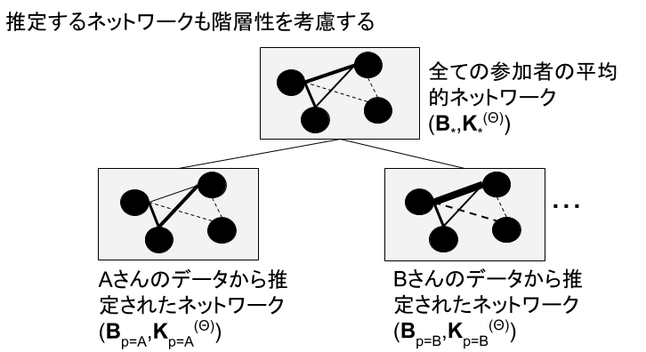
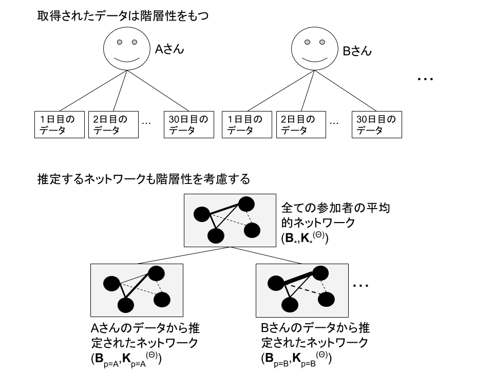

## 心理ネットワークとは？

心理ネットワーク（精神病理ネットワーク）については，まずは以下の２つの論文を読んでください。以降は，その前提で，技術的な側面のみを解説します。

- [樫原 潤・伊藤正哉(印刷中) 心理ネットワークアプローチがもたらす「臨床革命」—認知行動療法の文脈に基づく展望— 認知行動療法研究](https://www.jstage.jst.go.jp/article/jjbct/advpub/0/advpub_20-015/_article/-char/ja/)
- [樫原 潤(2019) 精神病理ネットワークの応用可能性―うつ病治療のテイラー化を促進するために― 心理学評論  62(2),143-165](https://www.jstage.jst.go.jp/article/sjpr/62/2/62_143/_article/-char/ja)


心理ネットワークとは，観察可能な変数を表すノードと統計的関係を表すエッジから構成されるものです(Epskamp, Borsboom & Fried, 2018)。心理ネットワークモデルは，reflective latent variable models(SEMや因子分析などです)のように，潜在変数を仮定してそれから各項目・症状を説明するのではなく，症状間のネットワーク構造を検討します。

心理ネットワークは，以下の図のように，観察可能な変数を表すノードは円で，関係を表すエッジは線でプロットされます。


## 心理学的ネットワーク分析の手順

心理ネットワーク分析は，おおよそ以下の４ステップからなります。

1. 統計的手法によってノード間のエッジを推定する
2. 推定された統計的関係をもとにネットワークを図示する
3. ネットワーク特性の指標の検討する
4. ネットワークの精度の検討する


ここで注意すべき点は，一般的なネットワーク科学で扱うネットワークの場合は，エッジは観察可能です（例えば，電力網ネットワークのエッジは直接観察・測定可能です）。しかし，心理ネットワークのエッジは，データから推定されます（重み付けネットワーク）。そのため，サンプルサイズの影響も受けますので，ネットワークのエッジの精度も検討する必要があります。また，ネットワーク科学では，グローバルなネットワーク特性の指標が使われます(small worldness, density, global clustering)。しかし，心理ネットワークのような重み付けネットワークでは使えません。そのため，２つのノードの関係や１つのノードがどのような影響力をもつのか（中心性の指標）といったローカルなネットワーク特性を用いることが多いです。


### 有向ネットワークと無向ネットワーク

心理ネットワークの話の前に，有向ネットワークと無向ネットワークについて説明をしておきます。まず，有向ネットワークとはエッジに方向性があるネットワークになります。以下の図ようにエッジが矢印になっているネットワークです。この矢印の方向には因果関係が想定されています。例えば，「活動性低下→抑うつ気分増加」となっていましたら，活動低下が原因で抑うつ気分増加するという意味になります。ただし，「活動性低下→抑うつ気分増加」と聞いて，「活動性低下←抑うつ気分増加」もありえるのではないかと感じた方もおられるかもしれません。そのとおりでして，因果関係を言うには，まず原因は結果に時間的に先行する必要がありますし，因果に関連する変数が全て測定された上で，原因と結果が巡回しない（非巡回）必要があります。観察研究によって収集された心理学のデータの場合，時間的な前後関係は時系列データによって示せても，非巡回となるとかなり難しいかと思います。そのため，横断データに対する心理ネットワークでは，エッジに方向性がない無向ネットワークが用いられます。


### ２つのノードの関係(エッジの符号)


横断データに対する心理ネットワークでは，エッジに方向性がない無向ネットワークが用いられます。

- エッジの色は符号を意味する（緑が正，赤が負）。

- エッジが正の場合は，２つのノード間には正の関係性が存在する（片方が増えると，もう一方も増える）

- エッジが負の場合は，２つのノード間には負の関係性が存在する（片方が増えると，もう一方は減る）


- エッジの太さは，強さを意味する。強さは，全体のノードを考慮しときの２つのノードの関係の強さになる。

- エッジの長さは，エッジの強さの逆数になる（強いほど短い）。
- パーティ会場で，関係性の近い２人のコミュニケーションは近い距離でなされるイメージ


### ノードの中心性指標(strength，closeness，betweeness)

- 心理学的ネットワークは，重み付けネットワークのため，グローバルなネットワーク特性の指標がが使えない。

- 各ノードの他のノードの影響性のようなローカルなネットワーク特性（中心性指標）を用いる。




### Strength

- Strength（重み付けのないネットワークの場合は，degreeと言う）は，あるノードがつながっている全てのエッジの強さを合計したものである。

- 右の場合，1と2のエッジが.green[0.3], 1と3のエッジが.green[0.1],1と6のエッジが.green[0.2],1と4のエッジが.green[0.2]だったら，.green[0.8]となる。

- そのノードの全体に対する影響力を表している。

### closeness

- Closenessは，あるノードと他の全てのノード間の最短経路長の合計の逆数である。

- エッジの強さの逆数が距離になる(1と3の強さが0.1なら10になる)。
- 最短経路長は，この距離を使って，特定のノードから特定のノードまで最短で行ける距離を計算する(1と３は直接つながっているが，1と2が0.5,2と3が0.2なら合計は7になる。この場合は，間接経路が早い)。

あるノードから他のノードまでの最短経路長を計算して合計したものの逆数がClosenessになる。

- Closenessは，あるノードがどのくらい.green[間接的に]他のノードとつながっているのか(Strengthは，あるノードがどのくらい.green[直説的に]他のノードとつながっているのか)。

- あるノードから他のノードの拡散の速さを表現する

### betweeness


- Betweennessは，2つのノード間の最短経路上にあるノードが何回あるのかである。

- 例えば，4と2の最短経路上に１がある。２つのノードの最短経路を計算して，その上にあるノードをカウントしていくとbetweenessになる。

- Betweennessは，2つの他のノードの接続においてどのくらい重要かを示す。影響性の流れを変える影響力をもつノードとして考えられる。


以下のようにプロットされることが多い。




## Gaussian Graphical Model(GGM)

- 変数間の関係がある・ないというグラフを作る場合に，確率分布と結びつけるようなモデルをpairwaise Markov graphと呼ぶ。

- 無向ネットワークモデルの推定では，pairwise Markov random fieldがよく使われる。

- データが連続かつ正規分布の場合には，多変量正規分布を用いたGaussian Graphical Model(GGM)が適用される。心理ネットワーク分析では，GGMがよく用いられる。

- yは確率変数Yの実現値で，中心化をしたものとする（値から平均値を引いている）。

→平均0,
分散共分散行列が $\mathbf{\Sigma}$ の正規分布に従う（Cはcaseつまりデータフレームの行に対応する）。


$$
y_{C} \sim N(\mathbf{0}, \mathbf{\Sigma})
$$

### 精度行列

- Kは精度行列であり，分散共分散行列の逆行列になる。

$$
\boldsymbol{K}=\boldsymbol{\Sigma}^{-1}
$$

- 逆行列は，ｎ次正方行列Aに掛けた場合に以下のような単位行列Eとなるような行列のことである。

$$\boldsymbol{E}=\left(\begin{array}{ll}1 & 0 \\ 0 & 1\end{array}\right)$$

精度行列の具体例(Epskamp et al., 2018)

- 分散共分散行列( $\mathbf{\Sigma}$ ) のAを用意する。

```{r}
A <- matrix(c(1,-0.26,0.31,-0.26,1,-0.08,0.31,-0.08,1), 3, 3)
A
```


- 分散共分散行列Aの逆行列をsolveで計算する。


```{r}
inv_A <- solve(A)
inv_A
```


以下の式で精度行列から偏相関係数を求めることができる。

$$\operatorname{Cor}\left(Y_{i}, Y_{j} \mid \boldsymbol{y}_{-(i, j)}\right)=-\frac{\kappa_{i j}}{\sqrt{\kappa_{i i}} \sqrt{\kappa_{j j}}}$$
```{r}
-1 * cov2cor(inv_A)
```


## クロスセクショナルデータのGGM

- 推定は簡単なので，最尤推定，最小二乗法，ベイズどれを使っても良い。
- 精度行列を求める方法としては，分散共分散行列の逆行列の計算でもできるけど，ネットワークを疎(sparse)にするために，正則化(regularization)をする。
- 正則化は，機械学習などにおいて発展してきた手法で，モデルの複雑さに罰則をかけて，過学習を避ける。GGMでは，LASSO(least absokute shrinkage and selection operator)が使われる。
- 正則化をざっくり説明すると，多数の変数を使って予測をする場合に，影響力が弱い変数の影響をゼロに近づけるような工夫を導入することで（影響力の有る変数が減ると複雑じゃなくなる，つまりこれが複雑さへの罰則。その強さを調整するパラメータがある），不要なエッジを除くことができる。

- 特にLASSOの一種のGraphical LASSOは，精度行列に直接的に罰則をかけられ，分散共分散行列があれば計算でき，一般的に他の方法よりも早い。GLASSOのパラメータ調整では，EBICを使うのが良い。

### Rパッケージ 
- 分散共分散行列の逆行列化と標準化:corpcor, qgraph

- GLASSO: glasso, huge(EBICとクロスバリデーション), qgraph(EBICでパラメータチューニングするglasso)

- parcor: GGMを推定する他のLASSOが使える

- BDgraph: 無向構造のベイズ推定できる

- ggmやlvnet: GGMのフィッティングや推定で使える。

### GGMの解釈法

- 予測効果：因果関係は分からないけど，ある変数から別の変数が予測できるとはいえる。A-B-Cの場合，BはAかCを予測するとはいえる。

- 因果関係の示唆：因果推論の仮定を満たすことは難しいが，GGMでは同様のことができる。GGMでは，効果の方向性はわからないけど，エッジに因果的な効果がある可能性があると解釈できる。


## 心理ネットワーク分析を試してみよう！

- [Jordan, P., Shedden-Mora, M. C., & Löwe, B. (2017). Psychometric analysis of the Generalized Anxiety Disorder scale (GAD-7) in primary care using modern item response theory. PloS One, 12(8), e0182162.](https://journals.plos.org/plosone/article?id=10.1371/journal.pone.0182162)

- GAD-7について項目反応理論を用いた検討を行った研究

- Hamburgのプライマリケアを受診した3404名からデータを収集している。


### 使用するRパッケージとデータの読み込み


```{r message=FALSE, warning=FALSE}
library(tidyverse)
library(foreign)
library(bootnet)
library(qgraph)
download.file("https://doi.org/10.1371/journal.pone.0182162.s004","pone.0182162.s004.sav")
data <- read.spss("pone.0182162.s004.sav", 
                  to.data.frame=TRUE)
# データの整理
data_gad <- data %>% 
  rename(gad7a = S_GAD7_a, gad7b = S_GAD7_b, 
         gad7c = S_GAD7_c, gad7d = S_GAD7_d, 
         gad7e = S_GAD7_e, gad7f = S_GAD7_f, 
         gad7g = S_GAD7_g, phq9a = S_PHQ9_a, 
         phq9b = S_PHQ9_b, phq9c = S_PHQ9_c, 
         phq9d = S_PHQ9_d, phq9e = S_PHQ9_e, 
         phq9f = S_PHQ9_f, phq9g = S_PHQ9_g, 
         phq9h = S_PHQ9_h, phq9i = S_PHQ9_i) %>% 
  select(gad7a, gad7b, gad7c, gad7d, gad7e, gad7f, gad7g)
```


ネットワークの推定とプロット
```{r message=FALSE, warning=FALSE}
results_gad <- estimateNetwork(data_gad,default = "EBICglasso")
plot(results_gad, layout = "spring",labels = TRUE)
```


中心性の指標のプロット
```{r message=FALSE, warning=FALSE}
centralityPlot(results_gad, include = c("Strength", "Betweenness", "Closeness"))
```

エッジの精度


```{r}
accuracy_edge <- bootnet(results_gad, nBoots = 2500, nCores =4, statistics =   c("edge", "strength", "closeness", "betweenness"))
```


```{r}
plot(accuracy_edge, labels = FALSE, order = "sample")
```


```{r}
stability_centrality <- bootnet(results_gad, nBoots = 2500, type = "case", nCores =4, statistics =  c("strength", "closeness", "betweenness"))
```


```{r}
plot(stability_centrality, c("strength", "closeness", "betweenness"))
```

```{r}
corStability(stability_centrality)
```

## ネットワーク比較テスト(GAD7の性差）

```{r}
library(NetworkComparisonTest)

data_gad_gender <- data %>% 
  rename(gad7a = S_GAD7_a, gad7b = S_GAD7_b, gad7c = S_GAD7_c, gad7d = S_GAD7_d, 
         gad7e = S_GAD7_e, gad7f = S_GAD7_f, gad7g = S_GAD7_g, phq9a = S_PHQ9_a, 
         phq9b = S_PHQ9_b, phq9c = S_PHQ9_c, phq9d = S_PHQ9_d, phq9e = S_PHQ9_e, 
         phq9f = S_PHQ9_f, phq9g = S_PHQ9_g, phq9h = S_PHQ9_h, phq9i = S_PHQ9_i) %>% 
  select(gad7a, gad7b, gad7c, gad7d, gad7e, gad7f, gad7g, gender) %>%
  mutate(gender2 = if_else(gender == "Weiblich", 2, 1))#1=male, 2= female

data_gad_male <- data_gad_gender %>% 
  filter(gender2 == 1) %>% 
  select(gad7a, gad7b, gad7c, gad7d, gad7e, gad7f, gad7g) %>% 
  na.omit()

data_gad_female <- data_gad_gender %>% 
  filter(gender2 == 2) %>% 
  select(gad7a, gad7b, gad7c, gad7d, gad7e, gad7f, gad7g) %>% 
  na.omit()
```


## 男女別のプロットの作成
```{r}
network_males <- estimateNetwork(data_gad_male, default = "EBICglasso", 
                                 corMethod = "cor")
network_females <- estimateNetwork(data_gad_female, default = "EBICglasso", 
                                   corMethod = "cor")

L <- averageLayout(network_males, network_females)
Max <- max(abs(c(getWmat(network_males), getWmat(network_females)))) 
layout(t(1:2))
plot(network_males, layout = L, title = "Males", maximum = Max) 
plot(network_females, layout = L, title = "Females", maximum = Max)
```


## ネットワーク比較テスト

```{r message=FALSE, warning=FALSE}
res_nct <- NCT(data_gad_male, data_gad_female,progressbar=FALSE,test.edges=TRUE, test.centrality=TRUE)
res_nct
```


## 文献

- Epskamp, S., Borsboom, D., & Fried, E. I. (2018). Estimating psychological networks and their accuracy: A tutorial paper. Behavior Research Methods, 50(1), 195–212.
- Jordan, P., Shedden-Mora, M. C., & Löwe, B. (2017). Psychometric analysis of the Generalized Anxiety Disorder scale (GAD-7) in primary care using modern item response theory. PloS One, 12(8), e0182162.
- Epskamp, S. (2020). Psychometric network models from time-series and panel data. Psychometrika, 85(1), 206–231.
- Epskamp, S., van Borkulo, C. D., van der Veen, D. C., Servaas, M. N., Isvoranu, A.-M., Riese, H., & Cramer, A. O. J. (2018). Personalized Network Modeling in Psychopathology: The Importance of Contemporaneous and Temporal Connections. Clinical Psychological Science, 6(3), 416–427.
- Epskamp, S., Waldorp, L. J., Mõttus, R., & Borsboom, D. (2018). The Gaussian Graphical Model in Cross-Sectional and Time-Series Data. Multivariate Behavioral Research, 53(4), 453–480.
- Aalbers, G., McNally, R. J., Heeren, A., de Wit, S., & Fried, E. I. (2019). Social media and depression symptoms: A network perspective. Journal of Experimental Psychology. General, 148(8), 1454–1462.
- Beard, C., Millner, A. J., Forgeard, M. J. C., Fried, E. I., Hsu, K. J., Treadway, M. T., Leonard, C. V., Kertz, S. J., & Björgvinsson, T. (2016). Network analysis of depression and anxiety symptom relationships in a psychiatric sample. Psychological Medicine, 46(16), 3359–3369.
