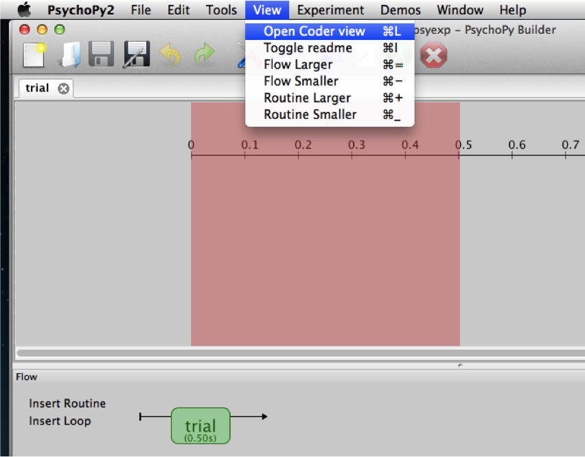
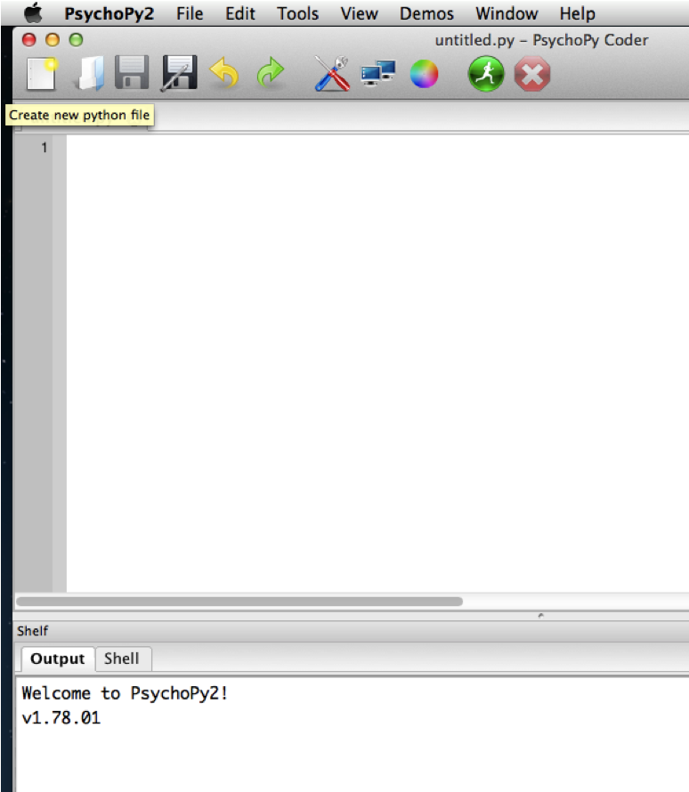
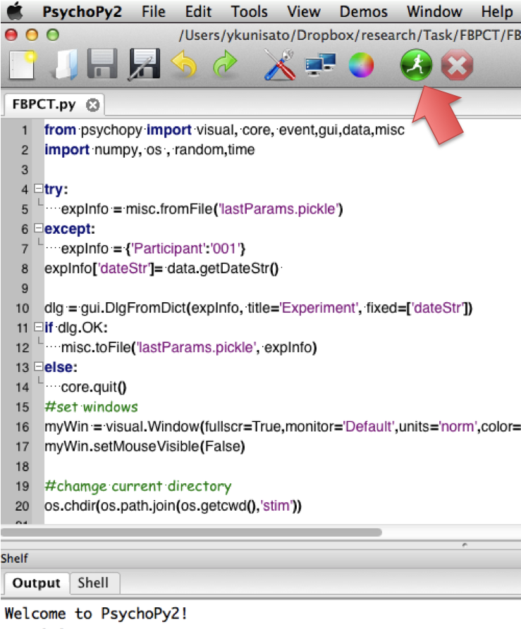
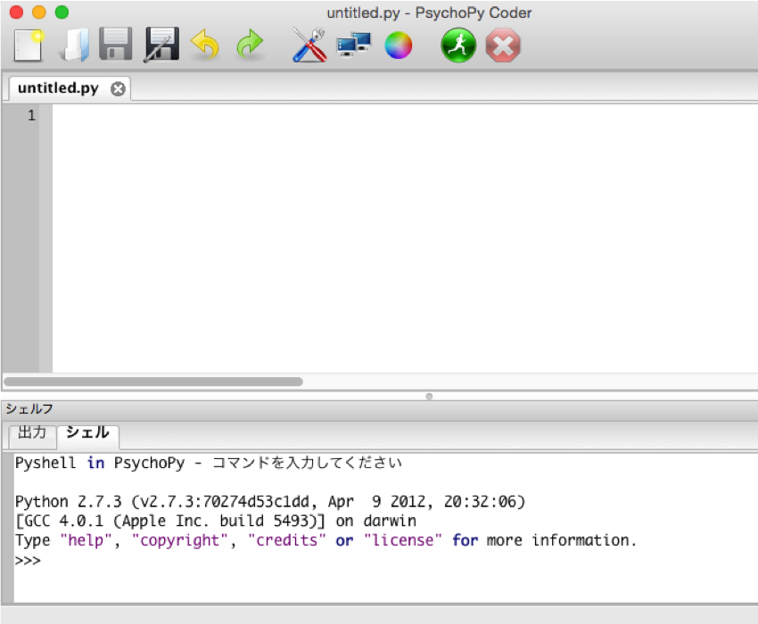
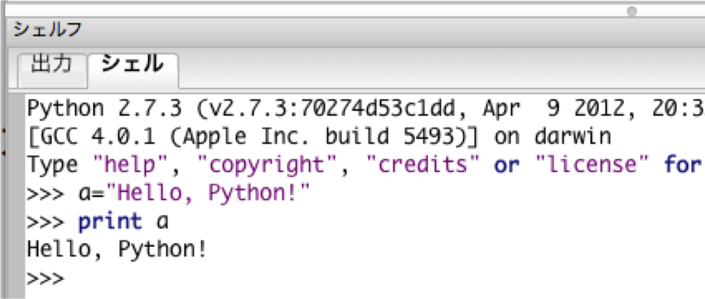
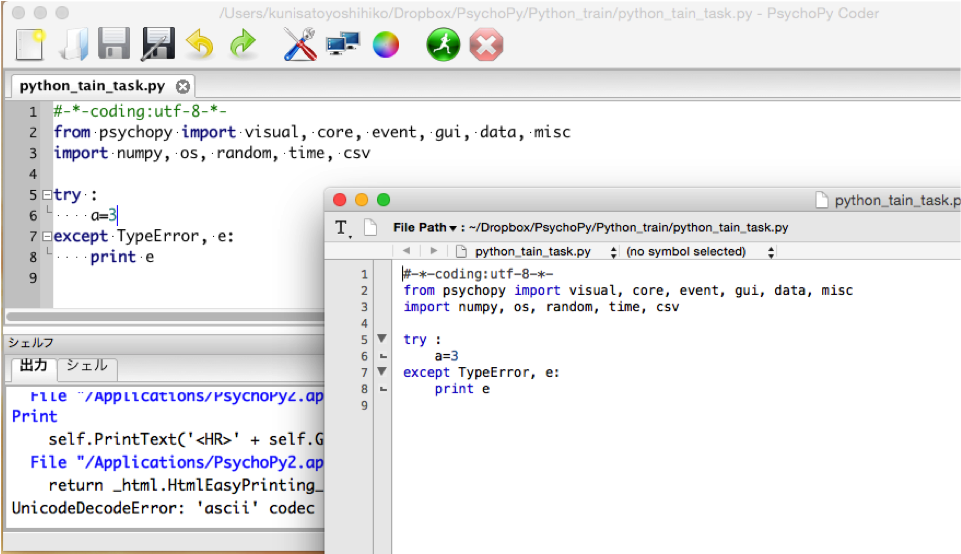

# 本ページの内容はPsychoPy3に対応していません。2020年3月までには修正する予定です。

## はじめに

本資料は，専修大学人間科学部の国里ゼミで使用するPsychoPyに関するトレーニング資料になります。
本資料は，まだ完成版には程遠く，間違いも存在する可能性があります。もし誤りなどがございましたら，
[メールフォーム](https://docs.google.com/forms/d/1OQ7pN-oQda1YwGvcTBga3oKkviI697uc9AQlGVhX2YI/viewform)にて
ご連絡いただけましたら幸いです。

## 注意事項

本ページの内容は，まだPsychoPy3に対応していません。PsychoPy3のCoderについては，[Qiitaのsnishymさんの記事](https://qiita.com/snishym/items/8b52db0d901cf5744463)をおすすめします。なお本ページも2020年３月までにはPsychoPy3に対応予定です（サバティカル後の授業開始までに対応します・・・）。

## PsychoPyとは？

python上で動作する刺激呈示ソフトです。フリーソフトになりますが，高機能で，基本的な使用法を理解できれば，心理学・神経科学で行う認知課題のほとんどが作成可能です。以下のサイトや書籍が参考になります。

- [PsychoPyのHP](http://www.psychopy.org/)

- [PychoPyも含めたpythonで心理実験をする時に便利な愛媛大学の十河先生のHP](http://www.s12600.net/psy/python/index.html)

- 十河著(2017/4/20)『心理学実験プログラミング: ―Python/PsychoPyによる実験作成・データ処理―』[Amazon.co.jp](http://amzn.asia/1JyEKlg)


## 課題0
### 課題0の1
####「PsychoPyのダウンロードとインストールをしよう！」

PsychoPyのサイト(http://www.psychopy.org/) からダウンロード&
インストールしましょう。
サイトからダウンロードしたものをダブルクリックとかすればインスールが開始されるかと思います。細かい設定とかもあるけど，まずは，気にしない。


<br />
<br />
<br />

### 課題0の2
####「PsychoPyのCoder画面を開こう！」

PsychoPyはGUIでも実験課題を作ることができる(Builderと呼ぶ)。
最初は，Builderの方が簡単なので良いかなと思うかもしれないですが，
複雑な実験課題を作る時にCoderでないと難しい時がある。
Coderは，プログラミングになる。プログラミングは，将来それを仕事に
しない人も一度勉強しておくとよい。パソコンのスキルが上がるし，
複雑な作業をできるだけ単純にして，効率的に処理することができるようになる。

「Coderだったら，この面白そうな実験課題が使えるのに...でもプログラミングは
勉強してないから，別のやつにしよう」となってはツマラナイ。
やりたい研究を自由にできるように勉強したい。


<br />
<br />
<br />

左端のアイコンを選ぶと新しいエディタがでてきます。このエディタ部分にコードを書き込んでいきます。


<br />
<br />
<br />

コードがかけたら，緑色のアイコン（赤い矢印で指している）をクリックするとコードが実行できます。
実行すると，下のOutput(出力)タブにその結果がでます。shell（シェル）では，Pythonコードを
確認することができます（このコードはどういう動きをするのか確認したい時に便利です）。


<br />
<br />
<br />

### 課題0の3
####「Shellでプログラミング入門をしよう！」

なぜかわからないけど，プログラミグの最初の一歩では，”Hello World”って画面に
表示させることが多い。「シェル」タブにコードを打ち込んで”Hello, Python!”と画面に表示させてみよう！


<br />
<br />
<br />

「シェル」タブに以下のコードを打ち込もう。
```python
a = “Hello, Pyton!”
print a
```
“＝”は数学での意味とは違って，左辺に右辺のものを代入するという意味です。
つまり，“Hello, Pyton!”という言葉をaに入れます（格納なんて言ったりする）。
そして，その“Hello, Pyton!”が入ったaを出すにはprintという命令をつかいます。


<br />
<br />
<br />

## 課題１
####「灰色の画面上に黒字で”Hello, Python!”と３秒間表示させよう！」

パソコンに強い人はPsychoPyとかでネット検索してやると力がつくと思いますが，
以下のヒントも活用ください。模範解答(task1.py)もありますが，まずはヒントをみつつ，
自分で作成しましょう。

**ヒント** coderのエディタを新規作成して，以下を打ち込みます
（コーディングをUTF-8に指定する。PsychoPyを日本語で使う場合に必要）。
```python
# -*- coding: utf-8 -*-
```

**ヒント** 以下のように，PsychoPyから必要なモジュールをインポートする
（実験によって，インポートする内容は変わる）。PsychoPy以外にも
Pythonで必要なモジュールをインポートする(numpy, os , random, time, csv)。

```python
from psychopy import visual, core, event, gui, data, misc
import numpy, os , random,time,csv
```

**ヒント** プログラミングをするとかならずエラーが生じます。
エラーがあったら，以降の処理をストップして，エラーを報告してくれる方法として，
try-except文があります。これをつかうと，try以降のプログラム（以下では”なんらかの処理”）
にエラーが生じるとその内容を表示してくれます。

```python
try :
	なんらかの処理
except TypeError, e:
	print e
```

**ヒント** 多くのプログラミング言語では，()とか{}を使って，処理の単位を区分します。
Pythonでは，処理の単位をインデント(Tabや半角スペース４つ)で区分します。
以下のように処理の単位のブロック１とブロック２をインデントで分けています。

```
ブロック1の始まり:
  ブロック1
    ネストしたブロック2:
      ここはブロック2
      ここもブロック2
  ブロック1に戻って来た
ブロックの外
```

**ヒント** PsychoPyで視覚刺激提示は，visual.Windowで画面の準備をして，何かに格納する（myWinがよくつかわれる）。
文字刺激の場合は，visual.TextStimで刺激を準備して，何かに格納する（以下の例では，myText）。
そして，draw()で準備した刺激を書き込んで，書き込んだ画面(以下の例ではmyWin)をflip()で提示する。core.wait(秒)で何秒間画面を出すか指定する。

```
myWin = visual.Window(fullscr=True, monitor= 'Default', allowGUI=False, units='norm', color= (0,0,0))
myText = visual.TextStim(myWin,text = u‘ここに表示したい刺激を書く',color = (-1,-1,1))
myText.draw()
myWin.flip()
core.wait(2)
```

**ヒント** 上記のmyWinやmyTextは，こちらで好きに名前を決めてよいものになります。
こういった変数の名前をつける場合は，分かりやすい名前をつけることが大切です。
分かりやすい名前をつけるとなると複合語になります。例えば，怒った顔刺激のリストの
場合，angry+face+listでangryFaceListといった名前になります。
このように，複合語の複合語の先頭を，小文字で書き始め，続く語の最初を大文字
で書き表すことをキャメルケースと呼びます（大文字が「らくだのこぶ」のように見えることからこの名前です）。


**ヒント**: PsychoPyでの色表示は，いろいろな方法がとれますが，
RGB(赤緑青の三原色を混ぜる方法)では以下のような，数字で設定をします。

* 白：　color = ( 1,1,1)
* 灰色：color = (0,0,0)
* 黒：　color = (-1,-1,-1)
* 赤：　color = (1.0,-1,-1)
* 緑： color = (-1, 1, -1)
* 青： color = (-1, -1, 1)
* ピンク：　color = (1.0,0.6,0.6) 　

**ヒント** PsychoPyはフリーズすることがあるので，こまめに保存をする。
また，psychoPyのエディタ上では，日本語入力がやりにくい。
そのため，PsychoPy上でコードを修正するよりも，なんらかのテキストエディタで作成や修正をしたほうが早い
（〜.pyという名前のファイルをテキストエディタで開いて編集，PsychoPyで動作確認とすると早いです）。
エディタは，なんでも良いのだけど，[Atom](https://github.com/atom/atom)が色々なOSで使えるし便利です。


<br />
<br />
<br />

## 課題2
####「"1"，"2"，"3"，"4"，"5"の数字を１秒間ずつ画面に提示してみよう！」

**ヒント**　刺激の準備(visual.TextStim)からcore.wait(1)を繰り返します。

**ヒント**　#を使うとその部分は実行されません。プログラミングでは，
かならず#などを使って，自分が行っている処理について説明を加えてください。

## 課題３
####「"あ"，"い"，"う"，"え"，"お"を１秒間ずつ画面に提示してみよう！」

**ヒント**  日本語の場合は，TextStimでtext = ‘あ’とするところを，
text = u‘あ’と文字の前にuをいれてみましょう。日本語として処理してくれます。


## 課題４
####「"1"，"2"，"3"，"4"，"5"を１秒間ずつ画面に提示することを，５回繰り返してみよう！」

「１」，「２」，「３」，「４」，「５」，「１」，「２」，「３」，「４」，「５」，
「１」，「２」，「３」，「４」，「５」と刺激の準備(visual.TextStim)から１秒間待つ
(core.wait)を15回繰り返しても良いけど，効率がわるい。単純に繰り返すのではない方法を選びましょう。

**ヒント** 刺激を毎回指定するのではなくて，あらかじめリストを作っておいて，
そのリストから刺激を指定するとスムーズです。リストは以下のように，要素を[]でくくります
（以下の場合は，list1に格納）。
```python
list1 = [1,2,3,4,5]
list2 = [u‘あ’,u‘い’,u‘う’,u‘え’,u‘お’]
```
普通，リスト内の番号は，1から2,3,4…と数える，Pythonでは，0から1,2,3…と数えます。
なので，list1[3]とした時は，３番目の3ではなくて４番目の４になります。list2[2]としたときは，u’い’ではなくu’う’になる。

刺激のリストではなく，単純に0から１ずつ増える数字のリストを作りたい場合は，range()を使うと良い。
range(リストの長さ)とすることで，必要な長さの0から始めるリストを作れる。
以下のようにすると，list3に[0,1,2,3,4,5,6,7]が入る(Pythonなので，1ではなくて0からスタート)。

```python
list3 = range(8)
```

**ヒント** 全く同じことを繰り返すときは，for文を使います。
先ほどのrange(繰り返し数)によって，0から1ずつ繰り返したい数の１つ前まで増えるリストが作れます。
以下のfor文は，range()で作成したリストの最初から順番に変数にいれて繰り返しをして，
range()のリストの最後まできたら，終了します。

```python
for 変数　in　range(繰り返し数) :
	命令（数字を画面に提示するなど）
```

以下を「シェル」に打ち込むと，range(5)に入っている，0から4がiに入って，
画面に表示(print)される。リストが最後までいくと繰り返しは終了する。
```python
for i　in　range(5) :
  print i
```

for文での変数（上記だとi）をうまく使うと色々と便利です。
また，インデントを使って，for文を重ねることができます。
以下の場合は，３回内側のループを回すことを５回繰り返すということになります。
```python
for i in range(5):
  for m in range(3):
  	print m
```

なお，リストは，for文の前で設定をするようにしてください。

## 課題5
####「課題４を応用して，漢字で"壱"，"弐"，"三"，"四"，"五"を１秒ずつ提示することを，５回繰り返してみよう！」


## 課題6
####「1から９の数字をランダムにだしてみよう(1から9の数字は0.5秒間ずつ２回提示する)！」

**ヒント** numpy.random.shuffle(リスト)という関数を使います。
これを使うと，リストの中身がシャッフルされます。

## 課題7
### 課題7の１
####「課題６を使って，1から９の数字をランダムに0.5秒ずつだす（２回繰り返し）時に，色を変えて提示してみよう！」

**ヒント** 課題1でも簡単に触れましたが，visual.TextStim内のcolorとcolorSpaceで色を設定できます。

* 白：　color = ( 1,1,1)
* 灰色：color = (0,0,0)
* 黒：　color = (-1,-1,-1)
* 赤：　color = (1.0,-1,-1)
* 緑： color = (-1, 1, -1)
* 青： color = (-1, -1, 1)
* ピンク：　color = (1.0,0.6,0.6)
* 黄色：color = (1,1,-1)　　

```python
myText = visual.TextStim(myWin,text = str(numList[i]),color = (-1,-1,-1),colorSpace='rgb')
```

### 課題7の２
####「課題６を使って，1から９の数字をランダムに0.5秒ずつだす（２回繰り返し）時に，文字の大きさを変えて提示してみよう！」

**ヒント** 以下のheightを変更すると，大きさが変わります。1だと大きいです。
色々と試してみましょう。

```python
myText = visual.TextStim(myWin,text = str(numList[i]),color = (1,0.6,-0.6),height=1)
```

### 課題7の３
#### 「課題６を使って，1から９の数字をランダムに0.5秒ずつだす（２回繰り返し）時に，文字の位置を変えて提示してみよう！」

**ヒント** 以下のposで提示する場所をきめる。pos=(x軸，y軸)であり，0が中心になる（1から-1の範囲）。
左右上下，右上，左下などに，文字を出してみましょう。

```python
myText = visual.TextStim(myWin,text = str(numList[i]),pos=(-0.5,0),color = (1,0.6,-0.6),height=0.5)
```

## 課題８
#### 「ストループ課題を作ってみよう！」
赤色で青と書かれた文字や黄色で赤と書かれている文字について，文字の色を答えるように言っても，
色ではなく意味の情報が干渉して，反応時間が遅くなる現象をストループ効果という。

今回は，ストループ課題を作る。練習なので，あまり複雑ではない単純なストループ課題にする。
用いる色は「赤色」と「黄色」と「青色」で，用いる文字は「赤」，「黄」，「青」になる。
なので，組み合わせは以下の９パターンになる（色と文字の一致，不一致はカッコ内に）。
以下の９パターンの刺激について，刺激を１秒間提示して，その後，注視点(+)を１秒間提示する
(つまり９回，刺激と注視点を繰り返す)ことを２回繰り返す。

1. 赤色の「赤」(一致)
1. 赤色の「黄」(不一致)
1. 赤色の「青」(不一致)
1. 黄色の「赤」(不一致)
1. 黄色の「黄」(一致)
1. 黄色の「青」(不一致)
1. 青色の「赤」(不一致)
1. 青色の「黄」(不一致)
1. 青色の「青」(一致)

**ヒント1** 注視点は，visual.TextStimのtextに’＋’を入れればよい。

**ヒント2** これまでは，[]をつかって，list1 = [1,2,3,4,5]のような感じでリストを作ってきました。
今回は，色と文字の組み合わせが複雑ですので，辞書型というものを導入します。辞書型の基本形は以下のようになります。
{}内の要素はカンマ(,)で区切ります。要素は値とキーのペアで構成され，値とキーはコロン(:)で区切ります。

{キー1:値1, キー2:値2, ...}

つまり，キー１と値１は対応があり，キー２と値２には対応があることになります。これを上の色とかの話にすると。
文字(kanjiChar)と色（color）の組み合わせは以下のように記述することができます。

```python
colorDic = {
				u'赤': {'rgb': ( 1, -1,-1), 'type': '1'},
				u'黄': {'rgb': ( 1,  1,-1), 'type': '2'},
				u'青': {'rgb': (-1, -1, 1), 'type': '3'}
				}
```
上記のようにすると，赤，黄，青という色に対応するRGBの値（visual.TextStim内のcolorで指定する値）を
辞書として格納できます。つまり，赤という日本語の文字は，rgbで1,-1,-1に対応し，ここで設定したtypeでは0になるということです。
なんだか余計面倒ではないかという気持ちにもなるわけですが，より複雑なプログラムを書く時に覚えておくと便利なテクニックです。

**ヒント3** 辞書型の導入に追加して，より複雑なリストの使用法を導入します。
例えば，今回のストループ課題では，文字が３種，色が３種で，合計９種の組み合わせがあります。
このような２つ以上の事柄（文字と色）の組み合わせをリストにする時は以下のようにします。
```python
charConditionList = [
				{'kanjiChar': u'赤', 'color': u'赤'},
				{'kanjiChar': u'黄', 'color': u'赤'},
				{'kanjiChar': u'青', 'color': u'赤'},
				{'kanjiChar': u'赤', 'color': u'黄'},
				{'kanjiChar': u'黄', 'color': u'黄'},
				{'kanjiChar': u'青', 'color': u'黄'},
				{'kanjiChar': u'赤', 'color': u'青'},
				{'kanjiChar': u'黄', 'color': u'青'},
				{'kanjiChar': u'青', 'color': u'青'}
				]
```
まず，上記のように，リスト[]内で，{}を使うと組み合わせにできます。
つまり，[｛色,文字｝,...]ってすると，色と文字が組み合わせになってリストになります。
そして，今回は，辞書型にもなっており，kanjiCharとcolorの辞書にもなっています。
これは，あとで，操作をする上で便利になるので，とりあえずは，飲み込んでみてください。

**ヒント4** これまでは，ループをする時に，その繰り返し回数をrange()を使って指定してきました。
しかし，実験では，繰り返し回数を変更することもよくありますので，繰り返し回数を変数にしておいて，
その変数でループを回せると便利です。特に，今回は，charConditionListに刺激の組み合わせを
用意していますので，その刺激のリストの長さがループの繰り返し回数に対応します。それを使うと便利です。

```python
# charConditionListを繰り返す回数(９個入ったリストを２回繰り返す)
M =2

# charConditionListの長さを調べる
N = len(charConditionList)
#　上で指定したMとNを使ってループを回す。
for m in range(M):
		r = range(N)
		for i, currentState in enumerate(r):
```
上記のように指定したMやNでループを回すと，回数を変更するときなどに，Mやリストを変更するだけで良いので便利です。
なお，ここで，range()ではなく，enumerate()というのがでてきました。まず，リストの長さ(N)をrange(N)でrにいれて，
それをenumerate(r)にしています。enumerate()を使うと，その前のi,currentStateにインデックス（何番目か？）と要素（何か？）の
情報をいれてくれます。現段階では，それほど便利でもないですが，今後，リストをenumerateにいれたりできると，
リストの何番目の刺激で，なんの刺激かの情報が，i,currentStateにはいります（もちろん，iやcurrentStateは，
自分で設定できます）。


**ヒント5** 上記で作った辞書やリストを元にして，刺激を準備する。ややこしいですが，ちょっとずつ慣れていってください。

```python
# currentStateに入っているの数字（range(N=9)のどれか）でcharConditionListから選んで，charConditionに入れる。
charCondition = charConditionList[currentState]
# charConditionを元にして，colorDicから文字の色のRGBやtypeの情報を取り出す。
colorData = colorDic[charCondition['color']]
# charConditionを元にして，colorDicから文字の意味のRGBやtypeの情報を取り出す。
#　以下の処理は今回は不要ですが，あとで，typeを活用するので必要になる。
kanjiCharData = colorDic[charCondition['kanjiChar']]
#　kanjiListのi番目（kanjiList[i]）を，colorListのi番目の色(colorList[i])で提示する。
myText = visual.TextStim(myWin,text = charCondition['kanjiChar'],pos=(0,0),color = colorData['rgb'],height=0.2)
```

## 課題９
#### 「課題８で作ったストループ課題について，刺激をランダムに提示してみよう！」

課題８は，作成した刺激のリストを順番に提示していました。繰り返しの順番が同じというのは
まずいのでランダムに提示したいと思います。その際に，charConditionListをシャッフルすると対応関係も
ぐちゃぐちゃになりますので，まずいです。そこで，刺激呈示時にcharConditionListを順番に提示するリスト（r）をシャッフルすると良いです。
以下のコードを挿入する場所に気をつけてください。

```python
numpy.random.shuffle(r)
```

## 課題10
#### 「課題9に，実験教示を追加してみよう！」

課題９の最初に，5秒間ほど，以下のような実験の教示を出してみましょう。

「今から，色のついた文字がでてきます。文字の意味ではなく，文字の色に基づいてボタン押しをしてください。
文字が赤色なら，キーボードの１を押してください。文字が黄色なら，キーボードの２を押してください。
文字が青色なら，キーボードの３を押してください。」

**ヒント**　改行をしたい場合は，```\n```を打つとできる。また，myTextでなくて，instTextにする
（今後は，myTextではなくて，意味の分かりやすい名前にする。instTextは，instruction(教示)の
文章という意味です）。

## 課題11
#### 「課題10について，参加者の反応を測定してみましょう!」

刺激を出すだけでは実験はできないので，キーボードやマウスで参加者の反応を測定する必要があります。
まずは，教示を以下のように変更してください（10秒間教示を出すのではなくて，参加者がスペースキーを
押したら，課題に進む）。

「今から，色のついた文字がでてきます。文字の意味ではなく，文字の色に基づいてボタン押しをしてください。
文字が赤色なら，キーボードの１を押してください。文字が黄色なら，キーボードの２を押してください。
文字が青色なら，キーボードの３を押してください。この教示が読めたら，「スペース」キーを押して
課題を始めてください」

参加者のキーボードでの反応をまつ場合は，event.waitKeys()を使います。
myWin.flip()して，画面を出してから，以下のようにすれば，参加者がスペースを
押すまで待ちます（今回は，core.wait()を使わない）。

```python
keyList = event.waitKeys(keyList=['space'])
```

これで，教示を読み終わったらスペースキーを押すことで課題に進むことができるようになりました。
しかし，私たちの関心は，刺激に対する参加者がどのような反応をして，その反応までの時間(反応時間)が
どのくらいだったかになります。では，ここからは，ストループ課題での反応を測定しましょう！

まず，刺激を提示することにかかわるfor文の前にcore.Clock()を
stopwatchに格納します。これで，core.Clock()の機能はstopwatchになります(stopwatchはcore.Clock()ということ)。

```python
#反応時間の計測のための設定
stopwatch = core.Clock()
```

そして，実験刺激を提示するmyWin.flip()をして，画面を出してから，以下のコードを書き込みます(core.wait(1)を消して，以下を書き込む)。

```python
# 参加者の反応測定開始
# 前回の刺激提示の影響を消去する
event.clearEvents()
#ストッウォッチをリセット
stopwatch.reset()
# 参加者の反応をリセット
Responded = False
#ストップウォッチをリセットしてからstopwatch.getTime()で
#測定した時間が1秒を超えるまで以下の処理を実行
while stopwatch.getTime() < 1:
		# もしこれまでに反応がないようなら，event.waitKeysで反応を抜き出す。
		# Responded内には反応と反応時間が入る
		if not Responded:
				Responded = event.getKeys(keyList=['1','2','3'],timeStamped=stopwatch)
# もし1秒たっても反応がないなら，no responseと反応時間なしで処理する
if not Responded:
		Responded = [('no respose', 0)]
# 参加者の反応測定終了
```
event.clearEvents()，stopwatch.reset()，Responded = Falseで反応時間や反応を
リセットしてから，while関数を使って，stopwatchで測定した時間（stopwatch.getTime())が1を超えるまで，
event.getKeysで反応を測定します。event.getKeysで指定した反応の測定と反応時間を計測できます。
whileとかifが出てきていますが，とりあえず，スルーして進んで下さい。


## 課題12
#### 「課題11で測定した参加者の反応にフィードバックをしてみよう!」

課題11では，参加者の反応と反応時間を測定していますが，その結果を保存したり(課題13でやります)，
その結果をフィードバックしてないので，画面上は変化はありません。そこで，「刺激提示（反応計測）1秒」
→「注視点 1秒」の注視点を２秒にして，固視点の下に「正解」，「不正解」をフィードバックさせましょう。
また，「正解」か「不正解」の下に反応時間も表示しましょう。

**ヒント** "もし"参加者が正解の反応を"したら"，「正解」とフィードバックし，"もし"参加者が
不正解の反応を"したら"，「不正解」とフィードバックする。このように，"もし"のような形で
条件分岐する場合は，if文を使う。Pythonでのif文は以下のようになる(if,elif,elseと:と
インデントによって，条件分岐を作る)。

```python
if 式A:
	式Aが真の時の実行文
elif 式B:
	式Bが真の時の実行分
else:
	いずれも真でない時の実行文
```

**ヒント** Responded = event.getKeys(keyList=['1','2','3'],timeStamped=stopwatch)の
Respondedには，反応内容(押したキー(1,2,3)やno response)と反応時間が入っている。Responded[0][0]は
（つまりRespondedの１行１列目），反応内容であり，Responded[0][1]は（Respondedの１行２列目），
反応時間が入っている。


**ヒント** Responded[0][0]に入っている反応内容と最初のほうで設定している辞書のcolorData['type']が
一致すれば，正解になり，不一致だと不正解になる。また，反応をしないno reseponseの場合は，反応なしになる。

```python
# 正解，不正解のフィードバック
if Responded[0][0] == 'no respose':
	# fbTextに，フィードバックする文字をいれる
  fbText = visual.TextStim(myWin,text = u'無反応',pos=(0,-0.3),color = (-1,-1,-1),height=0.2)
  # rtTextに，フィードバックする反応時間(Responded[0][0])をいれる
  rtText = visual.TextStim(myWin,text = str(Responded[0][1])+u'秒',pos=(0,-0.5),color = (-1,-1,-1),height=0.2)
  # 保存用の結果
  correctIncorrect = None
elif Responded[0][0]== colorData['type']:
	# fbTextに，フィードバックする文字をいれる
	fbText = visual.TextStim(myWin,text = u'正解',pos=(0,-0.3),color = (-1,-1,-1),height=0.2)
	# rtTextに，フィードバックする反応時間(Responded[0][0])をいれる
	rtText = visual.TextStim(myWin,text = str(Responded[0][1])+u'秒',pos=(0,-0.5),color = (-1,-1,-1),height=0.2)
	# 保存用の結果
	correctIncorrect = True
else:
	# fbTextに，フィードバックする文字をいれる
	fbText = visual.TextStim(myWin,text = u'不正解',pos=(0,-0.3),color = (-1,-1,-1),height=0.2)
	# rtTextに，フィードバックする反応時間(Responded[0][0])をいれる
  rtText = visual.TextStim(myWin,text = str(Responded[0][1])+u'秒',pos=(0,-0.5),color = (-1,-1,-1),height=0.2)
  # 保存用の結果
  correctIncorrect = False
```
上記では，まず，Responded[0][0] がno responseの状況から処理をしていきます。no responseの場合は，fbTextで
u'無反応'を入れておきます。また，rtTextでは，str(Responded[0][1])を使って反応時間が文字になるようにしています。
最後の，保存用の結果のcorrectIncorrect = Noneは，次回（課題13）で使うので今はとりあえず打っておいてください。

次に，Responded[0][0]== colorData['type']，つまり，反応内容（Responded[0][0]）と辞書のタイプ（colorData['type'])が
一緒の場合になります。この場合は，正解なので，fbTextで，u'正解'を入れておきます。反応時間や保存用の結果については，上の場合と同じです。

最後に，elseとうことで，no responseでも，反応内容と辞書のタイプが一致しないような場合になります。これは，不正解なので，
fbTextでu'不正解'をいれておきます。反応時間や保存用の結果については，上の場合と同じです。


fbTextやrtTextが準備できたら，draw()で書き込んで，注視点とともにflip()させてください。
```python
#上記で設定したフィードバックと反応時間の書き込み
fbText.draw()
rtText.draw()
# 中視点の準備
myText = visual.TextStim(myWin,text = '+',pos=(0,0),color = (-1,-1,-1),height=0.2)
myText.draw()
#　画面表示
myWin.flip()
core.wait(2)
```


## 課題13
#### 「課題12の結果を保存してみよう!」

結果の保存にあたり，実験時に参加者IDをいれれるようにしておくと便利です。
以下のコードで参加者IDの入力画面が出てきます。以下のコードは，全体のtry構文の
最初に入れておくとよいです。
入力すると，expInfoに被験者IDと実行日時（例.2013_Nov_20_1646）が入ります。

```python
# 参加者IDの取得
try:
	expInfo = misc.fromFile('lastParams.pickle')
except:
	expInfo = {'Participant':'001'}

expInfo['dateStr']= data.getDateStr()
dlg = gui.DlgFromDict(expInfo, title='Experiment', fixed=['dateStr'])
if dlg.OK:
	misc.toFile('lastParams.pickle', expInfo)
else:
	core.quit()
```

まず，結果を保存する場合，その結果を入れていく場所を作ります。
以下では，resultsという場所を作っています。今後，結果をここに入れてきます。
これは，教示や刺激を提示するコマンドの前（刺激リストのあとくらい）に入れておきます。

```python
results=[]
```

課題13では，以下の情報を保存したいとします（保存したい情報は実験課題や行いたい解析によって異なります）。
正当か誤答かについては，CorrectIncorrectという変数を新たに追加します。

1. 何試行目か
1. 出した文字の意味
1. 出した文字の色
1. 条件（一致条件，不一致条件）
1. 反応
1. 正答か誤答
1. 反応時間

append()を使って，resultsに刺激や反応を追加していきます([]と+で繋いでいく)。
課題13の場合，上記の保存したい情報を準備していきます。まず，後の処理が楽なように，
漢字や色のタイプをkanjiCharTypeやcolorTypeに代入しておきます。

```python
kanjiCharType = kanjiCharData['type']
colorType = colorData['type']
```
そして，上記の保存したい情報を以下のように準備します。

1. 何試行目か = N*m+i
1. 出した文字の意味 = kanjiCharType
1. 出した文字の色 = colorType
1. 条件（一致条件，不一致条件）= colorType==kanjiCharType
1. 反応 = Responded[0][0]
1. 正答か誤答 = CorrectIncorrect
1. 反応時間 = Responded[0][1]

PsychoPyでこれらの情報を保存する場合は，各試行ごとに，appendして（追加して）いきます。
```python
# １試行の結果の保存
results.append([
		N*m + i,
		kanjiCharType,
		colorType,
		colorType==kanjiCharType,
		Responded[0][0],
		correctIncorrect,
		Responded[0][1]
		]
		)
```

resultsに各試行の情報が追加されていったら，それを最後にファイルに書き込んで保存します。
そのためには，書き込む対象のファイルを作成（open）する必要があります。その際に，作成する場所を指定しますが，
まずgetcwdで.pyファイルのあるディレクトリを調べて，path.joinを使ってそのディレクトリ内のlogという名前の
ディレクトリに結果を保存するファイルを作成します。

```python
# 最終的な結果を保存
curD = os.getcwd()
datafile=open(os.path.join(curD, 'log', 'Sub{0}_{1}.csv'.format(expInfo['Participant'], expInfo[ 'dateStr'])),'wb')
```

ファイルが作成できたら，そのファイルにresultsの内容をwrite()で書き込んでいきます。書き込む際に，最初の
一行目にヘッダーの情報を書き込みます(datafile.write('trial,meaning,color,congruent,response,correct,RT\n'))。
改行\nを忘れないようにしましょう。
その後，datafile.writeを使ったfor文でresultsの一番上から書き込みをしていきます。

```python
datafile.write('trial, meaning, color, congruent, response, correct, RT\n')
for r in results:
		datafile.write('{0}, {1}, {2}, {3}, {4}, {5}, {6}\n'.format(*r))
datafile.close()
```

## 課題14
#### 「画面に質問項目を呈示して，反応を取得してみよう！」

psychoPyでは，RatingScaleという関数が用意されており，これをつかうとPC上で質問項目をだしてマウスで反応を取ることができる。どうせ認知課題を使うのなら，
質問紙もこれでとると記入漏れやデータ入力の手間がはぶける（記入しなおすことができない問題はありますが・・・）。

```python
# 評価尺度の準備（今回は１から５の５件法）
myRatingScale = visual.RatingScale(myWin,scale=u'1=全くそう思わない\n2=そう思わない\n3=どちらでもない\n4=そう思う\n5=とてもそう思う',low=1,high=5, size=1.3, textSize=0.65, pos =  (0.0, -0.3),tickMarks=[1,2,3,4,5],tickHeight=-1)
# 質問項目のリストを準備(今回は５問用意した)
questionList = [u"PsychoPyを勉強して良かったですか？",u"PsychoPyは面白かったですか？",u"PsychoPy難しかったですか？",u"for文は理解できましたか？",u"if文は理解できましたか？"]
# 質問項目リストの１〜５を呈示して，反応と反応時間を取得する。
for questionNum in range(5):
		# 反応があるまで以下の項目の書き込みと画面呈示をする。
		myRatingScale.reset()
		while myRatingScale.noResponse:
				myItem = visual.TextStim(myWin, text=questionList[questionNum], height=.1, units='norm',pos=(0,0.1))
				myItem.draw()
				myRatingScale.draw()
				myWin.flip()
		# 反応は，myRatingScale.getRating()で，反応時間はmyRatingScale.getRT()で取得できる
		results.append([questionNum+1]+[myRatingScale.getRating()]+[myRatingScale.getRT()])
```

## 課題15
#### 「用意した画像刺激を呈示してみよう」

認知課題の多くは，なんらかの用意した画像刺激を提示することが多い。以下では，stimliフォルダ内のcard1.jpgからcard4.jpgを
順番に呈示してみましょう。文字の場合は，TextStimでしたが，画像の場合は，ImageStimを使用します。使用する画像は[こちら](materials/psychopy/images.zip)からダウンロードしてください。

```python
#画面の設定（今回は画像の関係で白い背景します）
myWin = visual.Window(fullscr=True,monitor='SubMonitor',allowGUI=False,screen=1,units='norm',color=(1,1,1))
#現在このコードのある場所のパスを取得して，そのパスの１つ下のstimliフォルダに移動する（画像ファイルを読み込むため）
curD = os.getcwd()
os.chdir(os.path.join(curD,'stimli'))
#使用する画像のリスト
StimList = ["card1.jpg","card2.jpg","card3.jpg","card4.jpg"]
try:
    for i in range(4):
        #画像刺激を提示(2秒ずつ)
        cardImage = visual.ImageStim(win=myWin,image=StimList[i],pos=(0,0),units='norm')
        cardImage.draw()
        myWin.flip()
        core.wait(2)
```

## 課題16
#### 「音刺激を呈示してみよう!」

音声の出力については，まだPsychoPyでは開発途中な部分もある。今回は，PsychoPyで設定してだすビープ音と用意した音声ファイルを呈示する。
音声を扱う場合は，from psychopy importでsoundをインポートしておく。音声ファイルはmid, wav, oggをサポートしているらしい。
音刺激の準備はsound.Sound( )を用い，.setVolume()で音量調整，
.play()で音をだす。使用する音声ファイルは[こちら](materials/psychopy/sounds.zip)からダウンロードしてください。なお，今回使用した拍手の音は，[くらげ工匠](http://www.kurage-kosho.info/)のファイルを用いています。

```python
#　画面の準備（灰色の画面，マウスはallowGUI=Falseで表示されないようにしている）
myWin = visual.Window (fullscr=True, monitor= 'Default', allowGUI=False, units='norm', color= (0,0,0))
#現在このコードのある場所のパスを取得して，そのパスの１つ下のstimフォルダに移動する（音声ファイルを読み込むため）
curD = os.getcwd()
os.chdir(os.path.join(curD,'stimli'))
# トーン音の教示をだす。
instText = visual.TextStim(myWin,text = u'ピーって音',pos=(0,0),color = (-1,-1,-1),height=0.1)
instText.draw()
myWin.flip()
# トーン音の作成準備とプレイ
tone = sound.Sound(value='C', sampleRate=44100, secs=1.0, bits=8, octave=5)
tone.setVolume(0.5)
tone.play()
core.wait(2)

# 盛大な拍手音の教示をだす。
instText = visual.TextStim(myWin,text = u'盛大な拍手',pos=(0,0),color = (-1,-1,-1),height=0.1)
instText.draw()
myWin.flip()
# 用意した拍手音の準備とプレイ
applauseLarge = sound.Sound('applauseLarge.wav')
applauseLarge.setVolume(0.5)
applauseLarge.play()
core.wait(10)
```

## 課題17
#### 「動画刺激を呈示してみよう!」

動画を呈示する場合は，MovieStim( )を使います。今回は，[mazwai.com](http://mazwai.com/)から再配布可能な動画をもってきて，
呈示します。[こちら](materials/psychopy/sea.mov)から動画をダウンロードください。

```python
#時計の準備
stopwatch = core.Clock()
#動画刺激の準備
mov1 = visual.MovieStim(myWin, 'sea.mov',size = [640,480])
mov1.play()
#時計のリセット
stopwatch.reset()
#動画を７秒間呈示する
while stopwatch.getTime() < 7:
		mov1.draw()
		myWin.flip()
		if event.getKeys(keyList=['escape','q']):
				myWin.close()
				core.quit()
myWin.close()
core.quit()
```

## 課題18
#### 「オリジナルのギャンプル課題を試しに作ってみよう！」

最後に，これまで学んだことを使って，ギャンブリング課題を作ってみましょう。
画面上にcard1からcard4まで並べて置いて，4つのうち1つを選ぶとポイントのフィードバックがなされる課題を作ってみましょう。
フィードバックは，プラス10ポイントの報酬とマイナス10ポイントの罰の２種類があります。
card1は90%の確率で正解，card2は30%の確率で正解，card3は60%の確率で正解，card4は20%の確率で正解になります。
そのようなフィードバックがなされるように設定をしてください。
フィードバックの画面では，真ん中にその試行のフィードバックを出し，右下にこれまでの合計獲得ポイントを示します。
参加者は獲得ポイントが最大になるように選択をします。

本課題は，２ブロックからなり，各ブロックは４０試行からなります。各ブロックの最初にビープ音を1秒鳴らします。
ブロック1とブロック2の間には，休憩として，癒しの海の動画を30秒挟んでください。
なお，ブロック2では，ブロック１とフィードバック確率が変わります。
card1は10%の確率で正解，card2は30%の確率で正解，card3は90%の確率で正解，card4は60%の確率で正解になります。
ブロック番号，試行番号，参加者の選択，反応時間などを記録して，csvファイルで保存しましょう。


## さいごに

ここまできたら，あとは上記の内容を組み合わせたり，ウェブ検索で新しい方法を取り入れることで，大体の認知課題は作成できるかと思います。
なお，課題１から課題17までのPythonコードは，[こちら](materials/psychopy/code.zip)に置いていますので，ダウンロードして確認することもできます。


