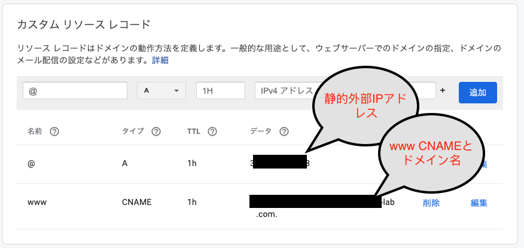
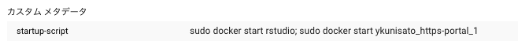
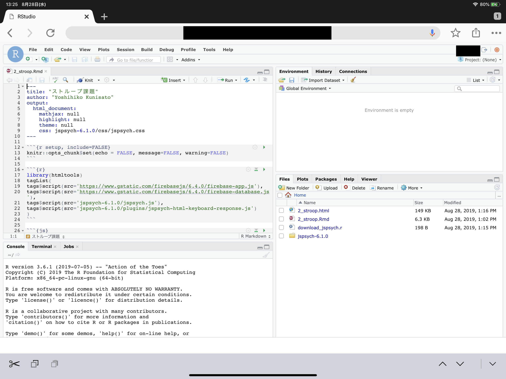
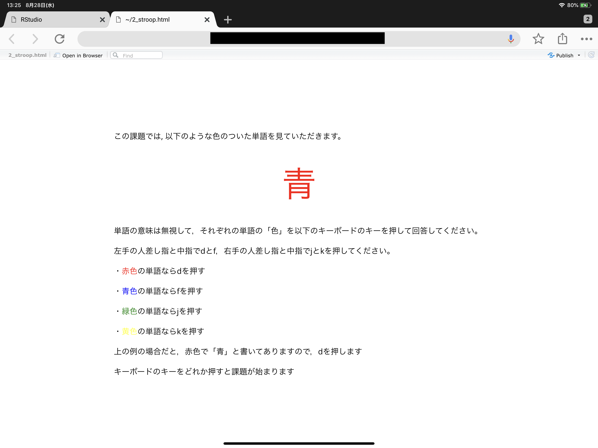

## はじめに

本ページでは，Google Compute Engine上でRocker(RStudio ServerのDocker)をベースにしたDockerでRStudio Serverを使う場合にHTTPS化する方法を解説しています。SSL暗号化通信については，RStudio Server Proが対応していますが，Open Source Editionは対応していません。そのため，Rocker(RStudio ServerのDocker)を使ってRStudio Serverを立ち上げると，http接続になり，セキュリティ上リスクがありますし，ブラウザでも警告が出て気持ちよくありません。しかし，RStudio Server Proは心理学者が個人で定期的に支出できる額ではないので，SSL暗号化通信に対応してないRockerでもそれを可能にするというのが，今回の主な目的です。

なお，国里は，サーバーに関して専門的な教育を受けたことはないので，間違っている部分も多いかと思います。本ページを参考に作業された結果，何らかの問題が生じた場合に，国里は責任を負えません。予めご了承ください（Google Compute Engineを使用すると課金されますので，慎重に作業ください。例えば何度もVMインスタンスを作成し，それを稼働したまま放置していたら，結構な金額になると思います）。また，お詳しい方は，誤りを見つけられましたら，ご指摘いただけましたら幸いです。

## 1. Google Compute Engineを使えるようにする

[公式のドキュメント](https://cloud.google.com/compute/?hl=ja)などを参考にGoogle Compute Engineを使えるように設定します（これは解説資料も多いので省略します）。

## 2. 仮想マシン(VM)の準備

1. 名前やマシンの構成は好みで選択してください（マシンの構成によって金額が変わるので，お財布と相談ください）。ブートディスクの設定で変更を押して，Ubuntu 18.04 LTSを選んで，ディスクサイズは30GBくらいにしておきます[^1]
2. ファイヤーウォールの設定(「HTTP トラフィックを許可する」と「HTTPS トラフィックを許可する」にチェックをいれる)
3. VMインスタンスを作成します。勝手に立ち上がると思うので，停止します（作成したインスタンスの右端の方で停止ができます）。
4. VMインスタンスは起動のたびに外部IPが変わっちゃうので[静的外部 IP アドレスの予約](https://cloud.google.com/compute/docs/ip-addresses/reserve-static-external-ip-address?hl=ja)をします。
5. VMインスタンスを起動します。設定した外部IPになっているか確認します。

なお，VMインスタンスは起動している間課金されるので，使わないときは停止しておきます。また，よく使う仮想マシン構成が決まっている場合は，インスタンステンプレートを使うと便利と思います。

## 3. ドメイン名の入手

色々とサービスがありますが，私は[GoogleのDomainサービス](https://domains.google/)を使いました。少々お金はかかりますが（私の場合は年1400円でした），HTTPS化には必要な作業です。ドメイン名が入手できたら，以下のように静的外部IPを使ってDNSの登録をします。





## 4. 仮想マシン(VM)にDockerをインストール

Compute EngineのページのVMインスタンスをみると先程設定したVMインスタンスがあると思います。こちらが起動していると接続というところの「SSH」がクリック可能になっていると思います。SSHをクリックしてください。すると，別ウィンドウが起動して，ターミナルが出現します。そこで，[こちら](https://docs.docker.com/install/linux/docker-ce/ubuntu/)を参考に以下を打ち込んでDockerをインストールします。途中何か聞かれると思いますが，質問に従って，Yなどの返事をタイプください。

```
sudo apt-get update
```

```
sudo apt-get install \
    apt-transport-https \
    ca-certificates \
    curl \
    gnupg-agent \
    software-properties-common
```

```
curl -fsSL https://download.docker.com/linux/ubuntu/gpg | sudo apt-key add -
```

```
sudo apt-key fingerprint 0EBFCD88
```

```
sudo add-apt-repository \
   "deb [arch=amd64] https://download.docker.com/linux/ubuntu \
   $(lsb_release -cs) \
   stable"
```

```
sudo apt-get install docker-ce docker-ce-cli containerd.io
```

## 5. docker-composeをインストール

続けて，[こちら](https://docs.docker.com/compose/install/)を参考にして，Docker-composeもインストールします。

```
sudo curl -L "https://github.com/docker/compose/releases/download/1.24.0-rc1/docker-compose-$(uname -s)-$(uname -m)" -o /usr/local/bin/docker-compose
```

```
sudo chmod +x /usr/local/bin/docker-compose
```

```
sudo ln -s /usr/local/bin/docker-compose /usr/bin/docker-compose
```

これで，Dockerを動かす準備ができました。

### ＜必要に応じて＞Google Cloud SDKとFirebase CLIのインストール

私はホスト側でGoogle Cloud SDKとFirebase CLIを使いたかったので，docker-composeに続いて，それらをインストールしています。Rstudio Serverに絶対に必要ということはないですが，Rsutido serverを使っていてホスト側からGoogle Cloud Strageを使ったバックアップやアップロードをしたい場合に，Google Cloud SDKが必要です。また，ウェブ実験などで，jsPsychなどで作成したファイルを直接デプロイしたい場合はFirebase CLIが必要です。

#### Google Cloud SDKをインストール

詳しくは[こちら](https://cloud.google.com/storage/docs/gsutil_install?hl=ja#linux)を参照ください。

- コマンド プロンプトで次のコマンドを入力します。ディレクトリ名は，gc_sdkにします。あとは言われるままに，対応をしてください。

```
curl https://sdk.cloud.google.com | bash
```

- shell を再起動します。

```
exec -l $SHELL
```

- gcloud init を実行して gcloud 環境を初期化します。プロジェクトIDが聞かれるので，Google Cloud Platformで確認ください。

```
gcloud init
```

- cloud strageを使うためのgsutilを準備します。この認証では，Strageの設定における相互運用性タブのサービスアカウントHMACを使います。作るとアクセスキーとシークレットキーが出てくるので，以下をタイプ後にコピペします。

```
gsutil config -a
```

- 以下も打ち込みます。

```
gcloud config set pass_credentials_to_gsutil false
```

- Rstudio server保存用のバケット作ってみます。これでCloud Strageが使えるようになりました。

```
gsutil mb -l asia-northeast1 gs://保存用バケット名/
```

#### Firebase CLIをインストール

詳しくは，[こちら](https://firebase.google.com/docs/cli?hl=ja)を参照。ただ，Node.jsとnpmのインストールは，以下の方が楽（ちょっとバージョンが古くなるみたいだけど）。

```
sudo apt-get install nodejs
```

```
sudo apt-get install npm
```

Firebase CLI をインストールします。
```
sudo npm install -g firebase-tools
```

ログインする。これだとコマンドライン上でログインができる。URLがでてくるので，ローカルのPCでもログインの手続きができる。

```
firebase login --no-localhost
```

うまくインストールできたか確認する。
```
sudo firebase list
```

## 6. docker-compose用YMLの準備

DockerやDocker-composeについては解説をしませんので，[さくらナレッジのDocker入門](https://knowledge.sakura.ad.jp/13265/)や[「Docker/Kubernetes 実践コンテナ開発入門」](https://www.amazon.co.jp/dp/4297100339/ref=cm_sw_r_tw_dp_U_x_HunBDbSJ25G3S)などで別途学習をされると良いかと思います。

今回は，docker-composeを使います。これは，複数のDockerを使う場合に，それらの構成をyamlで定義して，それを元にしてDockerを用意するサービスです。今回は，[国里が作成したRStudio Sever用Docker(Rockerをベースに必要なソフトを色々といれたもの。Stanも使えます)](https://hub.docker.com/r/ykunisato/ccp-lab-r)と[https-portal](https://github.com/SteveLTN/https-portal)を使いますが，この２つのDockerの設定と接続などについてymalで記載をします。

まずは，テキストエディタに以下の内容を貼り付けて（インデントに意味があるので崩れないようにする），ドメイン名（上で設定したもの），ユーザー名（自由につける），ユーザーパスワード（自由につける）を変更します。それを"docker-compose.yml"という名前をつけて保存します(必ず，"docker-compose.yml"という名前にしてください)。

ざっくり内容を説明すると， 以下のyamlでは，https-portalとrstudioの２つのサービスをそれぞれ設定しています。https-portalは，設定するとnginxというWEBサーバーを用意して，Let's EncryptというSSL証明の認証局から証明書を自動でとってきて設定してくれます（これは１つずつ設定することを考えると驚くくらい楽です）。rstudioは，国里が用意したykunisato/ccp-lab-rから作られるRStudio Serverです。Rockerベースであれば，ykunisato/ccp-lab-rの代わりに他のDockerを使うことも可能です。https-portalとrstudioの関係としては，外のインターネットの世界とはnginxが接していて，nginxには外からHTTPSで接続がきます，そしてそこを経由して，Rstudio serverの8787番ポートに接続する感じです（8787番ポートが暗号化されずに外にでているのではなくnginxを介する＆暗号化することで安全性を高めているという理解を私はしています）。その他の細かい設定は，Dockerについて学習をすると段々とわかってくるかと思います。

```
version: '3'

services:
  https-portal:
    image: steveltn/https-portal:1
    ports:
      - 80:80
      - 443:443
    links:
      - rstudio
    restart: always
    environment:
      DOMAINS: 'ドメイン名 -> http://rstudio:8787'
      STAGE: production #local

  rstudio:
    image: ykunisato/ccp-lab-r
    container_name: rstudio
    environment:
      - VIRTUAL_HOST=ドメイン名
      - USER=ユーザー名
      - PASSWORD=ユーザーパスワード
    expose:
      - 8787
    volumes:
      - ./rstudio:/home

```

なお，上記のyamlのhttps-portalの設定ではSTAGE: productionとなっていますが，これは本番環境での実施を意味しています。Let's Encryptは何度も実施すると一定期間使えなくなるので，まずはSTAGE: localでちゃんと動かくか確認してから，STAGE: productionを実施することを強く勧めます。STAGE: localは自己証明なので，これで実施をするとhttps化されますがブラウザでは警告がでると思います。警告を無視してちゃんと動作しているかを確認して，大丈夫そうなら，STAGE: productionに進むと良いと思います。


## 7. docker-composeの実行

上記で設定したdocker-compose.ymlを実行するために，VMインスタンスにSSH接続します。ウィンドウの右上の設定っぽいボタンをクリックするとアップロードの選択肢がでてくると思うので，それを使って，さきほどの"docker-compose.yml"をアップロードします。それができたら，以下を打ち込んで，docker-compose.ymlを実行します。

```
sudo docker-compose up
```

なんか終わった感じになったらSSH接続を切って，ブラウザに https://ドメイン名 を打ち込んでみます。Rstudioのログイン画面が出てくる＆URLバーに警告がでてなければ，Rstudio serverがHTTPS化できました。結構ややこしいことをしているのですが，殆どの作業を事前に設定したDockerがやってくているので，こちらの作業はかなり少なくて済みました。

## 8. ユーザーとパスワードの追加

docker-compose.ymlで設定した以外のユーザーを追加する場合は，VMインスタンスにSSH接続した上で，Dockerコンテナに接続してユーザーアカウントを作ります。まず，以下のコマンドで，Dockerコンテナにssh接続します。

```
sudo docker exec -it rstudio bash
```
次に，以下のコマンドで新規ユーザー登録します。パスワードを聞かれるので打ち込んで，あとはエンターキーやYをタイプします。

```
sudo adduser 新規ユーザー名
```

終わったら，以下を打ち込んで，Dockerコンテナへの接続をやめます。

```
exit
```

もし，ユーザーをそのユーザーのフォルダごと削除したくなったら，以下を打ち込みます。
```
userdel -r ユーザ名
```


## 9. 起動時にdocker-composeが起動するように設定

なお，RStudio Serverを使ってない時はお金の節約もかねてVMインスタンスを停止すると思いますが，その場合，次に起動した時に，Dockerが停止したままになっていることがあります。そこで，VMインスタンスをクリックして，VMインスタンスの詳細から編集をクリックして，カスタムメタデータを以下のように設定します。これをしておくとインスタンスの起動とともにdockerコンテナを起動してくれます（起動のためにいちいちSSH接続しなくて済みます）。



```
startup-script
```

コンテナ名は，rstudioとアカウント名_https-portal_1になると思うが，SSH接続して，sudo docker-compose psで確認してから設定する。

```
sudo docker start rstudio; sudo docker start アカウント名_https-portal_1
```


## Tips

### よく使うDocker-composeコマンド

docker-composは，up, down, psくらいです。細かい設定は，dockerコマンドを使うことが多いです。

- コンテナの作成と起動

```
sudo docker-compose up
```

- コンテナの一覧の確認

コンテナが停止してないかとかコンテナ名を確認するのに使います

```
sudo docker-compose ps
```

- コンテナの停止とコンテナやネットワークの削除

```
sudo docker-compose down
```

以下のようにすると，コンテナを停止して，コンテナやネットワークを削除し，イメージも削除します。

```
sudo docker-compose down --rmi all

```

### よく使うDocker コマンド

- コンテナの一覧を確認

起動状況もそうですが，コンテナ名を確認できます。なお，-aをつけないと，稼働してないコンテナは表示されないので，一応，いつも-aをつけています。

```
sudo docker ps　-a
```

- コンテナの停止

削除ではないので，起動すればまた使えます。

```
sudo docker stop コンテナ名
```

- コンテナの起動

なお，「9. 起動時にdocker-composeが起動するように設定」ではこれを使っています。

```
sudo docker start コンテナ名
```


- コンテナの削除

削除すると，startでは起動しないです。停止→削除という流れを意識しておくと良いです。

```
sudo docker rm コンテナ名
```

- Docker イメージの確認

コンテナを削除してもイメージは残っています。イメージの一覧は以下で確認できます。次のイメージの削除の際に，ここで確認できるIMAGE IDが必要です。

```
sudo docker images
```

- Docker イメージの削除

docker imagesで確認したイメージID(IMAGE ID)を指定して，イメージを削除します。

```
sudo docker rmi イメージID
```

- ユーザーの追加とコンテナ内での作業

ユーザーの追加やDockerコンテナに変更を加えたい場合は，コンテナに接続します。

```
sudo docker exec -it コンテナ名 bash
```

次に，以下のコマンドで新規ユーザー登録します。パスワードを聞かれるので打ち込んで，あとはエンターキーやYをタイプします。

```
sudo adduser 新規ユーザー名
```

終わったら，以下を打ち込んで，Dockerへの接続をやめます。

```
sudo exit
```

もし，ユーザーをそのユーザーのフォルダごと削除したくなったら，以下を打ち込みます。
```
sudo userdel -r ユーザ名
```

### Google Cloud PlatformのiOSアプリ

iOSにGCPのアプリがあります。それほど機能はありませんが，スマホからVMインスタンスの監視や起動と停止はできます。起動・停止にPCが不要＆RStudo serverはウェブブラウザがあれば使用できるので，以下のように，iPadにキーボードを付けておけば，普通にRが使えます。

||
|:-:|

R Markdownを用いたjsPsychによるウェブ実験課題の作成もこの通り。これで出張はiPadだけでいいですね！

||
|:-:|

### googleCloudStorageRとgoogleComputeEngineRで解析後に自動保存とインスタンスの自動停止をする

googleCloudStorageRもgoogleComputeEngineRも非常に優れたパッケージですが，比較的時間のかかる重い処理が終わったらワークスペースのものを自動保存し，インスタンスも停止するコマンドにだけ紹介します。これは地味に重要な機能です。というのは，GCEのVMインスタンスは稼働しているとずっと課金されますので，解析が終わったら結果を保存し，自動的にインスタンスも停止してくれるとすごく助かります。


まず，[googleCloudStorageRのセットアップ](http://code.markedmondson.me/googleCloudStorageR/articles/googleCloudStorageR.html)と[googleComputeEngineRのセットアップ](https://cloudyr.github.io/googleComputeEngineR/articles/installation-and-authentication.html)は，公式ドキュメントに従って，事前に済ませておきます。簡単に説明すると，GCPの「APIとサービス」→「認証情報」→「認証情報の作成」で認証に関するjsonファイルを得ます。それをインスタンスの安全な場所に置いた上で，Homeに".Renviron"という名前のファイルを作って，以下の情報を書き込みます。

```
GCE_AUTH_FILE="/フルパス/認証.json"
GCE_DEFAULT_PROJECT_ID="プロジェクトID"
GCE_DEFAULT_ZONE="asia-northeast1-c"
GCS_DEFAULT_BUCKET = "バケット名"
GCS_AUTH_FILE = "/フルパス/認証.json"
```

そして，以下を実行して，認証に成功した旨がでてきたら，成功です。

```
library(googleCloudStorageR)
library(googleComputeEngineR)
```

解析コードの最後に以下を書き込んでおいて，実行すると，終了時点の日付時間などが名前になったRdataファイルをGoogle Cloud Storageに保存し，使っているVMインスタンスを停止します。これがちゃんと動作すれば，長い時間のかかる解析であっても夜安心してゆっくり寝れますね。

```
# 終了時点の日付時間などが名前になったRdataファイルをGoogle Cloud Storageに保存
gcs_save(list=ls(all=TRUE), file=paste(format(as.POSIXlt(Sys.time(), tz = "Europe/Amsterdam"),"%Y_%m%d_%H%M_%s"),"_all.Rdata",sep=""), bucket = gcs_get_global_bucket())
# 使っているVMインスタンスを停止
gce_vm_stop("インスタンス名")
```

### ウェブから直接zipファイルを得る方法

RStudio serverを使っていて，Githubから直接ファイルがzipなどのファイルがほしい時があります。githubならgitを使ってもいいですが，以下のようにしてもzipファイルの取得＆解凍ができます。

```
temp <- tempfile()
curl <- "https://github.com/jspsych/jsPsych/releases/download/v6.1.0/jspsych-6.1.0.zip"
download.file(curl, temp, mode="wb") 
unzip (temp, exdir = "./jspsych-6.1.0")
unlink(temp)
```

### ファイルのアップや保存について(Google Cloud Strageの活用)

Rstudio serverではペインからファイルのアップロードやダウンロードができますが，ある程度のファイルサイズになると難しくなります。その場合は，Google Cloud Strageを使うのが良いかと思います。なお，ユーザーとしてGoogle Cloud Strageを使う場合は，[googleCloudStorageR](http://code.markedmondson.me/googleCloudStorageR/index.html)を使うのが良いです。以下では，ホスト側から各ユーザーのRstudioディレクトリにファイルをコピーしたり，バックアップしたりする場合の作業を記載しています。

#### バケットの作成

Cloud Strageにバケットを作成します。

```
sudo gsutil mb -c <ストレージクラス> -l <ロケーション> gs://バケット名
```

東京の場合は，以下のような感じでしょうか。

```
sudo gsutil mb -c regional -l asia-northeast1 gs://バケット名
```


#### バケット内のファイルの参照

lsでどんなファイルがあるか確認できます。

```
sudo gsutil ls gs://バケット名
```

#### Google Cloud Strageからファイルやフォルダのコピー

以下のようにして，Google Cloud Strageからファイルをコピーします。

```
sudo gsutil cp gs://バケット名/ファイル名 rstudio/ユーザー名/フォルダ名/
```

フォルダの場合は-rをつけます。

```
sudo gsutil cp -r gs://バケット名/フォルダ名/ rstudio/ユーザー名/フォルダ名/
```

sudoで操作するので，Google Cloud Strageからコピーしたファイルはrootがユーザーになるので，以下のように変更をしておきます(私の環境では，ubuntu:ubuntuでうまくいきましたが，ちょっと自信はないです)。ただ，これしなくても動作することもあり，ちょっとよくわからない点ではあります。

```
sudo chown -R ubuntu:ubuntu rstudio/ユーザフォルダ名
```

#### Google Cloud Strageへのフォルダコピー

Rstudio serverからGoogle Cloud Strageへのフォルダコピーは以下のようにします。以下だと，rstudio以下のすべてのユーザーのホーム以下のデータがバックアップされています。

```
sudo gsutil cp -r rstudio/ gs://バケット名/フォルダ名/
```

#### Google Cloud Strageへのバックアップ

ユーザーのHome以下のデータをバックアップする場合は以下のようにしても良いかと思います。Cloud Strage上のフォルダ名をバックアプした年月日_時間とすることで，いつのバックアップかわかりやすくしておきます。

```
sudo gsutil cp -r rstudio/ gs://バックアップ用のバケット名/`date "+%Y_%m%d_%H%M_%S"`/
```

これの操作をカスタムメタデータにshutdown-scriptとして追加するのも検討しましたが，ちょっとむずかしい様子でした。手動でお願いします（何か良い方法があればご指摘ください）・・・

#### Dockerをまるごとimageにして保存して，送る

解析が終了したら，解析の再現性のためにも，使っているDockerイメージも保存すると良いかと思います。ただ，これはかなり重いので，Cloud Strageが必須です。まずは，以下のように，Dockerコマンドでイメージを保存します。

```
sudo docker commit コンテナのID 好きな名前

sudo docker save 上で付けた名前 > 好きな名前.tar
```

保存したイメージをCloud Strageにコピーします。

```
sudo gsutil cp 好きな名前.tar gs://バケット名/フォルダ名/
```

Cloud StrageにコピーされたDockerイメージは，loadすれば，その環境のDockerイメージの一覧に入ります。あとは，runをすれば，同じ解析環境になるかと思います。

```
docker load < 上で付けた名前.tar
run -e PASSWORD=パスワード -p 8787:8787 -v ~:/home/rstudio -d --name コンテナ名 リポジトリ名
```


[^1]: Dockerの活用を考えると，Container-Optimized OSが良いのですが，ホスト側でGoogle Cloud SDKを使いたかったので，Container-Optimized OSを使いました。Ubuntuを使う必然性はないのですが，なんとなく前に使ったことがあるLinuxだったので選びました。
