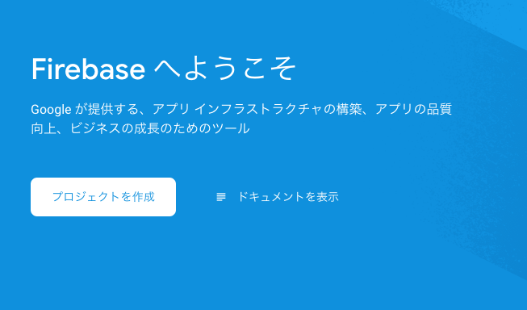
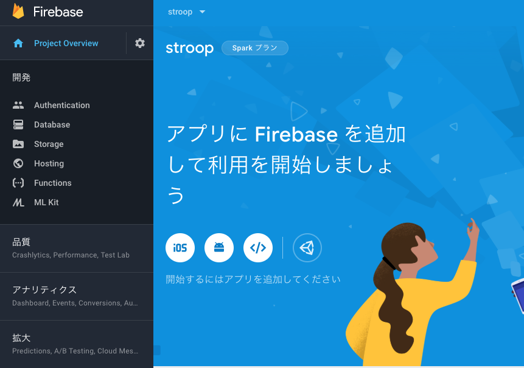
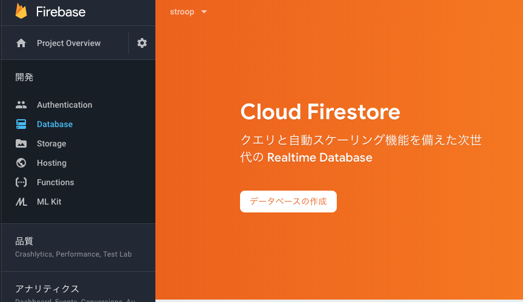
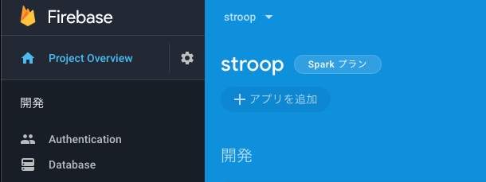
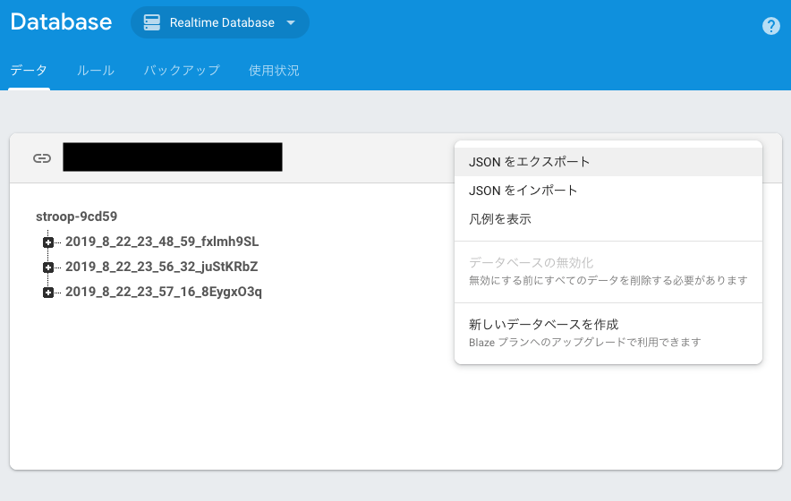

## はじめに

WEB実験をするには，jsPsychで作成したWEB実験用htmlファイルを，どこかのウェブサーバーにおく必要があります。サーバーの知識のある方は自前でサーバーを立てて実施できますし，有料ですがpavlovia(https://pavlovia.org/about.html )などのサービスを使っても実施できます。自前でサーバーを立てると，その維持費用が必要なのと，サーバーの設定や管理には結構スキルが必要です。pavloviaは，サーバーの管理は不要で，設定も簡単ですが，ある程度の予算が必要です(2019年8月現在，1名の実験につき0.2ポンド)。Googleのサービスの1つのFirebaseなら，サーバーの管理は不要で（最初に少し設定が必要です），通常のWEB実験なら無料枠内で実施できます。以下では，Firebaseを用いたWEB実験の解説をしています。

<br />

## Firebaseアカウント＆プロジェクトの作成[^1]:

- まずは，[Firebase](https://firebase.google.com/?hl=ja)で，Firebaseのアカウントを作成します（Googleアカウントでログインすると使えるようになると思います）。
- 「プロジェクトを作成」をクリックして，プロジェクト名を設定します。


プロジェクトはアプリのコンテナになるので，１つのデータ収集に１つのプロジェクトを割り当てます（1web実験につき1プロジェクトです）。わかりやすく認知課題名or研究名をプロジェクト名にしてもいいですが，そのプロジェクト名がweb実験時のURLに記載されるので，参加者の回答に影響のない名前を選ぶと良いかと思います。



続いて，Googleアナリティクスを使うか聞いてきますが，「今は必要ない」としておきます。


無事プロジェクトが完成して，プロジェクトのページにはいるとこんな感じの画面になります（今回のプロジェクト名はstroopです）。



<br />

## Firebase CLIのインストール
　
Firebaseのサイト上のプロジェクトの設定は終わったので，次はローカルPC（手元のパソコンです）の設定をします。

- [こちら](https://firebase.google.com/docs/cli?hl=ja)にしたがって，Firebase CLI をインストールします。

手順は，Node.jsをインストールしてから（これはOSによって違います），以下のコマンドをターミナルに打ち込んで，Firebase CLIをインストールします。

```
npm install -g firebase-tools
```

その後，Google アカウントで Firebase にログインします。

```
firebase login
```

これで，Firebase CLIを使用する準備が整いました。

<br />

### Firebaseプロジェクトの初期化

- Firebase用のフォルダをローカルPCに作成します（フォルダ名は英語ならなんでもいいと思います。場所もどこでもいいです）。
- ターミナルを開いて（Windowsならコマンドプロンプト？），作ったフォルダをカレントディレクトリに設定します(cdコマンドを使って設定します)。

なお，以下がその例です。ターミナルの"$"の次にcdと打ち込んで，カレントディレクトリにするフォルダの場所を指定します(Macの場合，当該フォルダをターミナルにドラッグ&ドロップするとパスがはいると思います)。今回の例では，Documents内にfirebaseというフォルダを作って，さらに，その下にstroopというフォルダを作った上で，それをカレントディレクトリにしています。

```
cd Documents/firebase/stroop
```
- 以下のコマンドを使って，firebaseの初期化をします。

```
firebase init
```

こんな感じの文字が出てきます。


- 以下のように，"Which Firebase CLI features do you want to set up for this folder?"と聞いてくるので，スペースキーを使って，Database, Hostingを選択してエンターを押します。


- "Select a default Firebase project for this directory"と聞いてきますので，最初にFirebase上で設定したプロジェクト名を選択して，エンターを押します。

- "What file should be used for Database Rules?"と聞いてきますので，そのままエンターを押します。

- "What do you want to use as your public directory?"と聞いてきますので，そのままエンターを押します。

- "Configure as a single-page app (rewrite all urls to /index.html)?"と聞いてきますので， Nをタイプします。

これで，firebaseプロジェクトの初期化が終わりました。　

<br />

### Databaseのセキュリティルールの設定

- ブラウザ上でも設定できるのですが，せっかくローカルにデータベースの設定ファイル(database.rules.json)があるので，そっちで設定します。database.rules.jsonをテキストエディタで開きます。デフォルトでは，以下のような内容だと思います。

```
{
  /* Visit https://firebase.google.com/docs/database/security to learn more about security rules. */
  "rules": {
    ".read": false,
    ".write": false
  }
}
```

- これだと，データベースへの書き込みができないので，以下のようにwriteの方をtureに変更して，保存します。

```
{
  /* Visit https://firebase.google.com/docs/database/security to learn more about security rules. */
  "rules": {
    ".read": false,
    ".write": true
  }
}
```

- この変更内容をクラウド上のFirebaseに反映させるために，以下をターミナルに打ち込んで，デプロイします。しばらくかかりますが，"Deploy complete!"とか出てきたら成功です。

```
firebase deploy
```

<br />

## Databaseとアプリの設定

- 今度は，[Firebase](https://firebase.google.com/?hl=ja)のプロジェクトのページに移動して，左側のメニューからDatabaseを選びます。
　
- 「データベースの作成」をクリックします。



- 「テストモードで開始」を選んで，「次へ」をクリックする（Firestoreは使わないので，「ロックモードで開始」でもいいかも？）。


- Cloud Firestoreのロケーションを選択する。なお，"asia-northeast1"は東京，"asia-northeast2"は大阪です。


- 実際に使うのはCloud Firestoreではなく，Realtime Databaseなので，そちらを選択します。


- Realtime Databaseの「ルール」を開いて，さきほどローカルで設定した内容になっているか確認します（writeがtrueになっていれば成功です）。


- プロジェクトのページから，「アプリを追加」します。



- "ウェブ</>"をクリックします。


- アプリの登録画面になりますので，名前を入力して，「アプリを登録」をクリックします。


- Firebase SDKの追加というのが出てくるので，これをコピーします。この内容をjsPsychを使って作ったweb実験用HTML内に挿入することで，web実験サイトで入力された参加者の反応をRealtime databaseに保存できます。


## Realtime databaseにデータを保存するためのjsPsychの設定

- コピーしたFirebase SDKをHTMLに挿入します。

- まずは，"<script src="https://www.gstatic.com/firebasejs/6.4.0/firebase-app.js"></script>"を追加します。RstudioでjsPsychを使っている場合は，jsPsychのタグ設定部分にfirebase関連のjsを追加します。データベースも使うので，firebase-appだけでなく，firebase-database.jsも追加します。

```
library(htmltools)
tagList(
tags$script(src='https://www.gstatic.com/firebasejs/6.4.0/firebase-app.js'),
tags$script(src='https://www.gstatic.com/firebasejs/6.4.0/firebase-database.js'),
tags$script(src='jspsych-6/jspsych.js'),
tags$script(src='jspsych-6/plugins/jspsych-html-keyboard-response.js')
)
```
- jsPsychの設定の本体である{js}チャンク内に上記のFirebaseの情報を追加します。XXXXXがそれぞれのFirebaseプロジェクトによって異なります。

```
// Firebase set up
  // Your web app's Firebase configuration
   var firebaseConfig = {
    apiKey: "XXXXX",
    authDomain: "XXXXX",
    databaseURL: "XXXXX",
    projectId: "XXXXX",
    storageBucket: "",
    messagingSenderId: "XXXXX",
    appId: "XXXXX"
  };
  // Initialize Firebase
  firebase.initializeApp(firebaseConfig);
```

- Realtime Databaseに書き込む際のIDを設定します。jsPsychの設定の本体である{js}に以下コードを追加すると，exp_idに「日付時刻_8桁の乱数」が用意されます（この辺の保存IDなどは個人の好みに合わせて設定ください）。

```
/*ID(日付時刻_８桁の乱数)の設定*/
// 乱数
var l = 8;
var c = "abcdefghijklmnopqrstuvwxyzABCDEFGHIJKLMNOPQRSTUVWXYZ0123456789";
var cl = c.length;
var r_num = "";
for(var i=0; i<l; i++){
  r_num += c[Math.floor(Math.random()*cl)];
}
// 日付時刻
var time_date= new Date();
var year = time_date.getFullYear();
var month = time_date.getMonth()+1;
var date = time_date.getDate();
var hour = time_date.getHours();
var minute = time_date.getMinutes();
var second = time_date.getSeconds();
// ID
var exp_id = year +'_'+ month +'_'+ date +'_'+ hour +'_'+ minute +'_'+ second +'_' + r_num;
```

- 最後に，以下のコードを。jsPsychの設定の本体である{js}に書き込むと，データがRealtime Databaseに書き込まれます。

```
/*タイムラインの開始*/
jsPsych.init({
    timeline: timeline,
    on_finish: function() {
    firebase.database().ref(exp_id).set({
      data: jsPsych.data.get().values()
    })
    }
});
```

- 上記のように設定して，実験用HTMLファイルをknitします。

## 実験用HTMLをホスティングして，Realtime Databaseにデータを保存する。

- 上記で準備し実験用HTMLファイルとjsPyschのフォルダを"public"フォルダ内におきます。以下の場合は，stroop_jp.htmlをおきました。


- 以下のコマンドでデプロイして，HTMLファイルをアップロードします。

```
firebase deploy
```

- "https\://プロジェクト名.firebaseapp.com/ファイル名.html"で実験画面が出てくればHostingは成功です。

- そして，実験課題に取り組んでから，firebaseのプロジェクトページに行って，Realtime Databaseにデータが入っていれば，データベースの方も成功です。以下は私が３回ストループ課題を行ったデータです。


## Realtime Databaseのデータを読み込む

- Realtime Databaseに保存されたデータは，Realtime Databaseのページの右上から，「JSONをエクスポート」をクリックすると，データが入ったJSONファイルがダウンロードされます。ダウンロードしたJSONファイルは，Rで読み込んで解析などに使えます。



　以上，Firebaseの登録からウェブ実験の準備をして，データ収集までを解説しました。
　

[^1]:本資料の作成にあたり，[Firebaseのサイト](https://firebase.google.com/docs/cli?hl=ja)，[Northwestern Child Language Development Labのチュートリアル資料](https://github.com/nu-childlab/firebase-experiment-tutorial)，[Alex K.氏の資料](https://github.com/Narquelion/lpl-training)を参考にした。
