## なぜ卒論・修論をRStudio上で執筆するのか？

本研究室では，以下の理由から卒論・修論をRStudio上でRMarkdownを使って執筆することを推奨しています。

- SPSSやRで解析した結果を卒論のWordやExcelにコピー＆ペーストして整形するスタイルが多いと思います。しかし，そのコピー＆ペーストは100%合っていますか？その自信がない場合は，RMarkdown上で解析も執筆も一緒にやったほうが安心です（コピー＆ペーストが不要で，解析コードに間違いがあってもすぐに修正が反映されます）。

- 国里が作成したRMarkdownパッケージを使えば，最終的なフォーマット調整を自動的にやってくれるので楽です（表紙，目次，ページ番号などは自動ではいる，日本語文献以外は自動で文献も綺麗にしてくれる）。

- 国里が研究指導する場合もデータやコードをいじりつつ検討ができて，有意義な研究指導が期待できます。

- GitHubでのバージョン管理もRStudio上で簡単にできます。

- 透明性の高い研究実践や仕事のやり方が身につきます

- 楽しい


<br>

## senshuRmdパッケージを使ってみよう！

卒論・修論をRStudio上でRMarkdownを使って執筆する上で，国里が作成した[senshuRmd](https://ykunisato.github.io/senshuRmd/index.html)が便利です。senshuRmdは，専修大学人間科学部心理学科での卒論・修論用にフォーマット調整をしたRMarkdownテンプレートになります。他の大学でも使えるかは微妙ですが，専修大学人間科学部心理学科の学生にとっては便利かと思います。

<br>

### 1.GitHubリポジトリの用意

本研究室ではGitHub上でバージョン管理をします。詳しくは，[こちら](https://kunisatolab.github.io/main/how-to-github.html)を参考に，国里が用意したGitHubリポジトリを自分の手元にもってきてください。そして，gitタブをクリックして，以下の赤い部分をクリックして，「draft1」を選択してください。みなさんのリポジトリには，最初にmasterとdraft1を用意していますが，みなさんが作業する場合は，draftを使うと覚えておいてください。

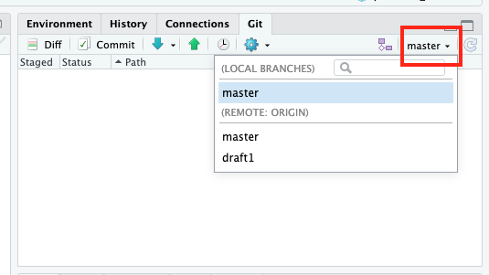

draft1を選ぶと以下のような画面が出てくると思います。リポジトリから伸びた枝（branch）が
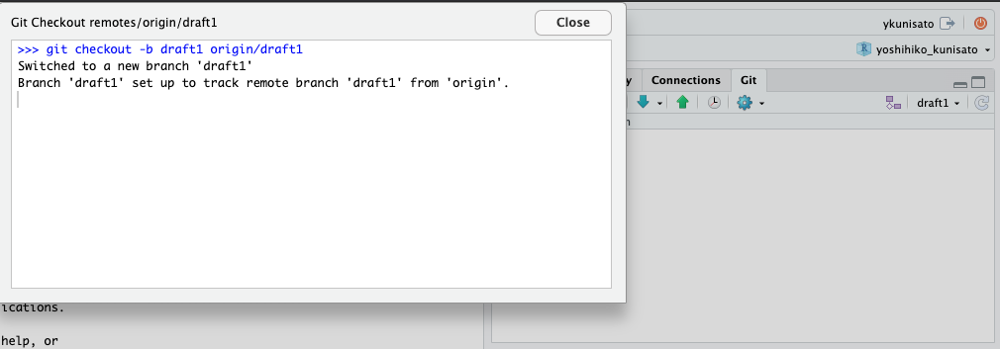

国里が用意したGitHubリポジトリは，thesisフォルダとexerciseフォルダから構成されます。thesisフォルダには卒論や修論に関するものをいれて，exerciseフォルダにはこのあと行うjsPsychの演習やRの解析練習をいれます。今回は，卒論や修論にかんすることをやりますので，RstudioのSession → Set Working Directory → Choose Directoryを選択して，みなさんに用意したGitHubリポジトリ内のthesisフォルダをカレントディレレクトリーに選んでください（つまり，このページの以降の操作は，thesisフォルダ内で行います）。

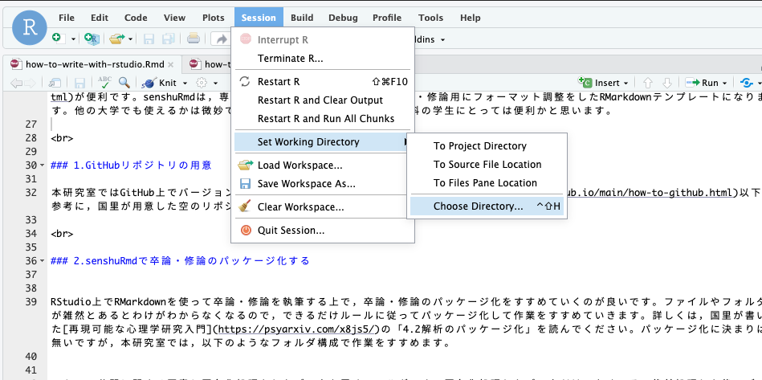

<br>


### 2.senshuRmdで卒論・修論のパッケージ化する


RStudio上でRMarkdownを使って卒論・修論を執筆する上で，卒論・修論のパッケージ化をすすめていくのが良いです。ファイルやフォルダが雑然とあるとわけがわからなくなるので，できるだけルールに従ってパッケージ化して作業をすすめていきます。詳しくは，国里が書いた[再現可能な心理学研究入門](https://psyarxiv.com/x8js5/)の「4.2解析のパッケージ化」を読んでください。パッケージ化に決まりは無いですが，本研究室では，以下のようなフォルダ構成で作業をすすめます。

- data　公開に関する同意と匿名化処理をしたデータを置くフォルダです。匿名化処理したデータだけでなく，その後前処理した後のデータ，長くかかる推定結果（その後さらに処理する予定のあるもの）もここにおきます。それぞれがどういうデータかわかるように名前をつけましょう（anonymized_data.csv，anonimized_preprocessed_data.csv，estimated_parameter.csvなど）。
- thesis(or氏名)　卒論・修論の本体のRmdファイルを置くフォルダです。
- analysis　統計解析で使うRmdファイルやRファイルを置くフォルダです。行う解析の順番がわかるようにファイル名をつけましょう(analysis_01.Rmd,analysis_02.Rmdなど)。なお，解析結果の図表を作るうえで必要なデータや出力は，上記のthesis(or氏名)フォルダに出力されるように設定しましょう(出力されたものをthesisフォルダ内のRmdファイルが読み込んで使う)。
- function　analysisフォルダには，卒論・修論で行う解析を順番に行えるように本筋の解析コードをおきますが，このfunctionフォルダには，analysisフォルダに書くには煩雑だったり，繰り返し使うような関数をおいておきます。これによって，analysisフォルダのコードが読みやすくなります。
- materials　研究で用いた材料（調査票，実験課題）をおくフォルダです。
- README.md　これらのフォルダについて第三者（そして未来の自分）が見て，わかるように説明をREADMEに書いてください。


<br>
このフォルダ構成で作業をしてもらいますが，各自が設定するは面倒ですので，これらを設定するRのパッケージ(senshuRmd)を国里が自作しています。早速使ってみましょう。まず，Rコンソール上でlibrary()を使って，senshuRmdを読み込みます。読み込まれない場合は，install_github()でインストールしてください。

```
library(senshuRmd)
# もしインストールされてない場合は，以下のコマンドでインストールする
# install.packages("devtools")
# devtools::install_github("ykunisato/senshuRmd")
```

次にset_rc_ccp()を使って，現在のワーキングディレクトリに上記の構成のフォルダと卒論・修論用のRmdテンプレートを作成します。なお，set_rc_ccp()だけでも動きますが，以下のように，"ローマ字の自分の名_ローマ字の自分の姓"を引数にいれておくと，上記のthesisフォルダが自分の名前になります。この方が分かりやすいので，こだわりがなければ，自分の名前をいれるようにしてください。

```
set_rc_ccp("yoshihiko_kunisato")
```
以下のような感じでフォルダができます。簡単にフォルダ構成ができますね。

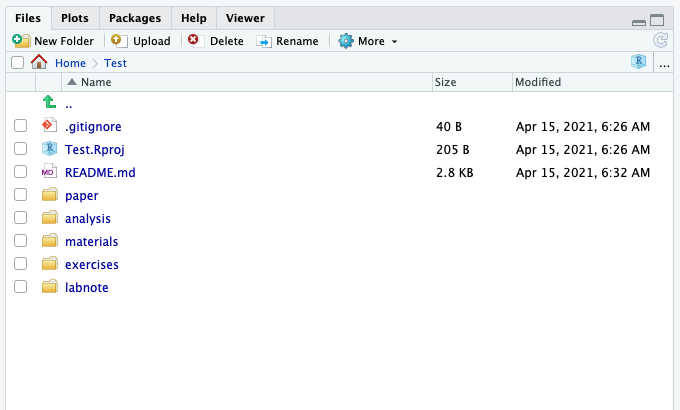

<br>

### 3.senshuRmdで卒論・修論を執筆する

それでは，senshuRmdの卒論・修論用Rmdテンプレートを使ってみましょう。thesis(本研究室では名_姓)フォルダを開くと，thesis(本研究室では名_姓).Rmdというファイルがあるので，それを開きます。以下のような感じで，"タイトル"，"学籍番号:氏名"とあるので，まず自分の卒論タイトル（仮）と学籍番号氏名を書きましょう。以降，緑色の字で色々と注意事項が書いてあります。この注意事項は，最終的な卒論ファイルには反映されませんので，邪魔でなければそのままおいておいてください。注意事項は，卒論をすすめる上で必要となる情報が結構はいっているので，必ず読んでください。

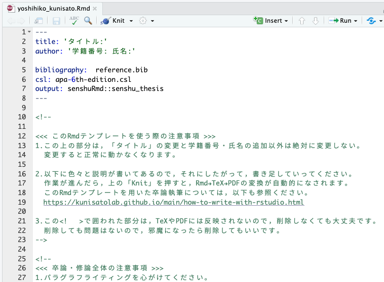

まず，練習でKnitボタンをクリックしてみましょう！しばらくRStudio上で処理がされて，PDFファイルが出力されたら成功です。PDFファイルが提出用卒論と同じフォーマットになっているか確認をしてください。

<br>

PDFファイルが出力されずにエラーがでる場合，なぜかうまく行かないことがあります。その場合は，以下のコマンドでtinytexをインストールください（大体うまくいきます）。tinytexのインストールでもうまくいかない場合は，```tinytex::tlmgr_install(‘ipaex’)```で日本語出力用フォントをインストールしてください。

```
tinytex::install_tinytex()
```

<br>

### 4.GitHubを使ったバージョン管理法について


実際は，国里が作った各学生用のリポジトリで作業用ブランチを作って作業をします。作業に応じて，CommitとPushを繰り返していきます。そして，国里の卒論・修論チェックのタイミングでPull requestsをしてもらって，国里がチェックをします。詳細は，ゼミの時に説明をします。


### 引用文献に関する補足

卒論・修論の引用文献は，ご自身で手動で打ち込むこともできます。RMarkdownでは，```*```で文字を挟むと*イタリック*，```**```で文字を挟むと**ボールド体**になりますので，これらを活用すると，[日本心理学会の執筆・投稿の手びき](https://psych.or.jp/manual/)に合わせて作成できると思います。

ただ，手動で打ち込むと，引用しているのに引用文献リストから向けていたり，引用をやめたのに引用文献リストに残っていたりと修正に伴う変更が反映されないということも起こります。なんらかの文献管理法を使う必要があります。本格的な文献管理は，[Paperpile](https://paperpile.com/)や[Zotero](https://www.zotero.org/)などがありますので，自分の趣味にあったものを活用ください。以下では，bibtexファイルを直接作成する方式で説明をします（PaperpileやZoteroで管理して，bibtex形式で出力させて使うということもできます）。

senshuRmdのテンプレートをknitしてPDFを出力させると以下のような感じになります。

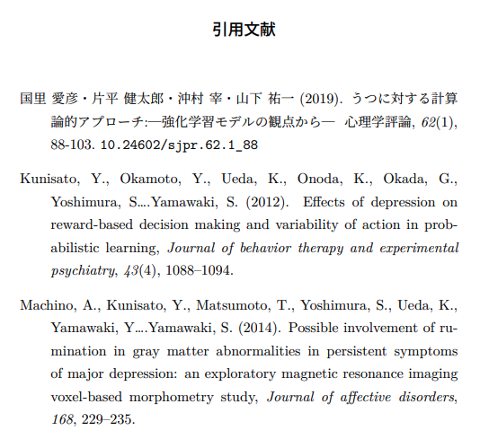

senshuRmdのテンプレートにはreference.bibというファイルが含まれており，そこにいくつか文献の情報が保存されています。RMarkdownで卒論・修論を書いている時に，文献を引用する場合は，reference.bibファイルを参照して，そこから引用します。引用の仕方としては，Kunisato2012という名前の引用キーの文献の場合（bibtexでは文献の引用が簡単になるように，文献に引用キーがあり，それを使って引用できる），```@Kunisato2012```と引用すると，```Kunisato et al.(2012)```というように文頭で引用する形式になります。一方，```[@Kunisato2012]```のように[]でくくると，```(Kunisato et al., 2012)```というように文末引用の形式になります（複数ある場合は，```[@Kunisato2012; @Machino2014]```のようにします）。bibファイルを使って文献管理をすれば，本文中の引用も引用文献リストもAPA形式で自動的に作ってくれます(APA形式にするために，"apa-6th-edition.csl"を使います)。


このように便利なbibファイルを作る方法について説明します。bibファイルを開くと以下のように文献情報が含まれています。そして，この形式で文献情報をbibファイルに保存していきます。
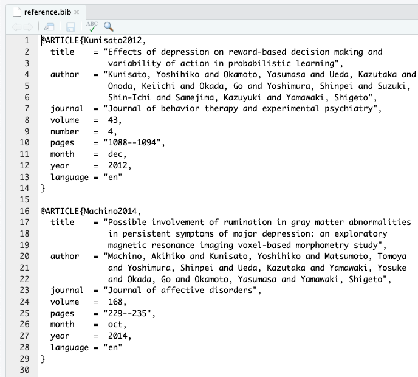

<br>

論文が掲載されている雑誌でも書誌情報がbibtex形式で出力できることも多いですが，簡単なのは，Google scholarで検索して，文献の右端にある"Import into BibTeX"をクリックすれば良いです。クリックするとBibTeX形式で表示されますので，それをコピーして，自分のbibファイルにペーストすればいいです。


<br>

上記の検索結果の上から２つ目の文献をBibTeX形式で表示すると以下のようになります。このまま登録してもいいのですが，一番最初の引用キー（本文での引用で使うキーです）は，kunisato2011personalityとなっており，ちょっと長いです。bibファイル内に，kunisato2011が他にないようであれば，引用キーはkunisato2011で良いです。

```
@article{kunisato2011personality,
  title={Personality traits and the amplitude of spontaneous low-frequency oscillations during resting state},
  author={Kunisato, Yoshihiko and Okamoto, Yasumasa and Okada, Go and Aoyama, Shiori and Nishiyama, Yoshiko and Onoda, Keiichi and Yamawaki, Shigeto},
  journal={Neuroscience Letters},
  volume={492},
  number={2},
  pages={109--113},
  year={2011},
  publisher={Elsevier}
}
```

<br>

日本語文献も同様に，CiNiiで検索して，引用したい論文の右側の方を見ると"BibTeXで表示"とあるので，そちらをクリックするとBibTeX形式で表示されます。これをGoogle Scholarと同様にコピー＆ペーストすればいいです。

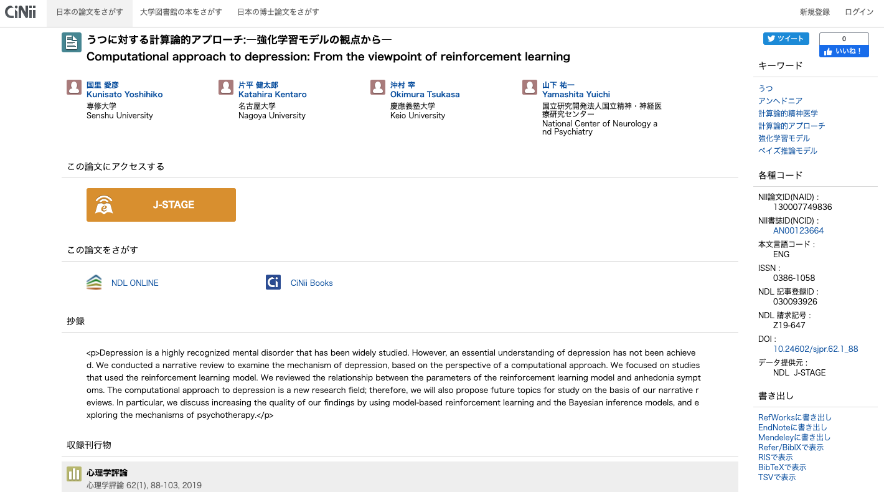

<br>

CiNiiの場合，引用キーがあまり意味のない記号の羅列のこともあるので，自分で分かりやすいものを設定することをオススメします。以下の場合だと，引用キーが130007749836になっているので，kunisato2019などに変更して登録しておくと良いかと思います。また，日本語だと"国里, 愛彦 and 片平, 健太郎 and 沖村, 宰 and 山下, 祐一"のまま登録するとちょっとめんどくさいことになるので，"国里愛彦・片平健太郎・沖村宰・山下祐一"という感じで姓と名の間のカンマをとって，著者をナカグロでつないでおいて，登録しておくと良いです。

```
@article{130007749836,
author="国里, 愛彦 and 片平, 健太郎 and 沖村, 宰 and 山下, 祐一",
title="うつに対する計算論的アプローチ:―強化学習モデルの観点から―",
journal="心理学評論",
ISSN="0386-1058",
publisher="心理学評論刊行会",
year="2019",
month="",
volume="62",
number="1",
pages="88-103",
URL="https://ci.nii.ac.jp/naid/130007749836/",
DOI="10.24602/sjpr.62.1_88",
}
```

<br>

このように，自分の引用したい文献のBibTeX形式の情報をbibファイルにどんどん追加していきつつ，本文で引用していくと，自動的に本文中に引用され，最後の引用文献リストにも反映されます(そして，本文での引用をやめると，引用文献リストから削除される)。なかなか便利なのですが，そのままで完璧に日本語文献が扱えるかと言うとかなり難しいです。そこで，以下のように工夫をします。

- 日本語文献をbibファイルへ登録する際に"第1著者氏名・第2著者氏名"のように，姓と名の間を詰めて，著者はナカグロでつなげる（こうすると全著者が人まとまりにして登録される）。
- 文献の引用に関する最終調整は，texファイルに手を加えて行う。

上記の用にbibファイルを登録すると引用文献リストは良い感じになるが，本文の引用などは調整が必要になる。また，英語文献はアルファベット順になるが，日本語文献はそうはならないので，引用文献リストを並び替える必要がある。これは，RMarkdownをknitした際に出力されるtexファルに手を加えて行う。以下のように，senshuRmdのRMarkdownテンプレートをknitすると，"yoshihiko_kunisato.tex"のように，texファイルが自動的に出力されます。

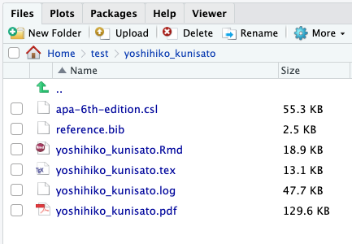

<br>
texファイルを開いたら，修正したい箇所まで移動します。以下の場合，日本語文献のDOIと順番を変更したいとします。まず，259行目を削除してDOIを削除します。次に，255行目から258行目を246行目のところに移動させます(Kunisato 2012, 国里　2019，Machino 2014の順番に変える)。こういう感じでTexファイルを修正することで細かい調整ができます。なお，修正したtexファイルは名前を変更して保存しておくと良いです。

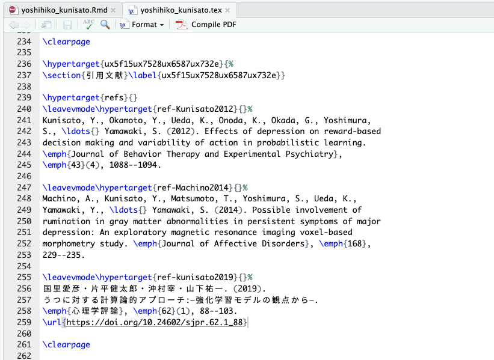

<br>
texファイルの修正ができたら，tinytexパッケージのxelatex関数を使って，修正したtexファイルからPDFファイルを作成します。

```
xelatex("yoshihiko_kunisato_edited.tex")
```

<br>
上記の手続きで，以下のように修正できました。ちょっとした手間がかかりますが，このようにすれば，日本語文献が上手く扱えます。

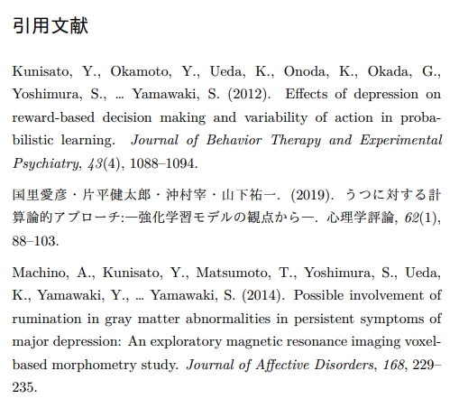

卒論・修論をRStudio上でRMarkdownを使って執筆することは，少し面倒くさそうに思えるかもしれませんが，卒論・修論でのフォーマット調整にかかる時間を短くすることができますし，解析と文章との距離が近くできるので，ミスもすくなる可能性が高いので，是非とも試してもらえると嬉しく思います。
