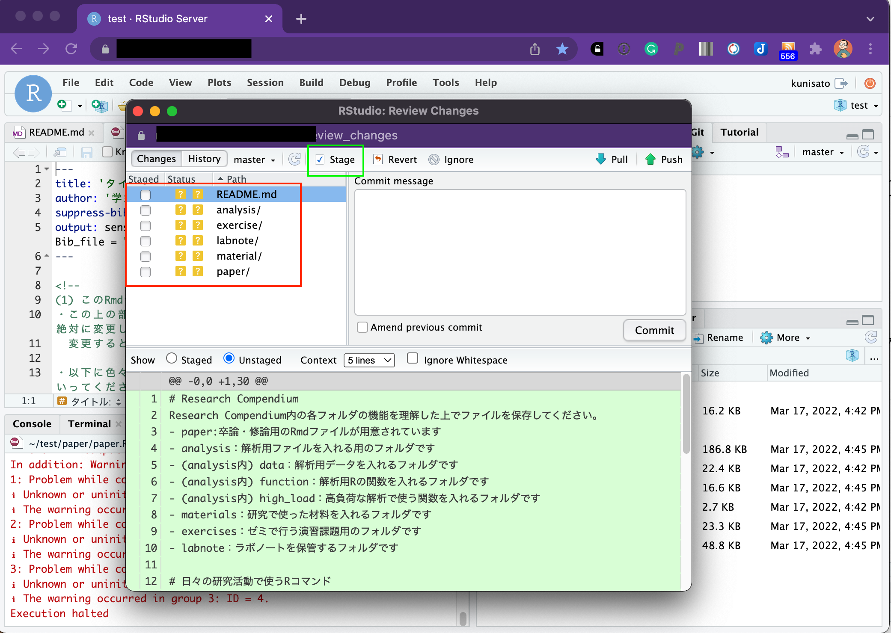

国里のゼミでは，卒論・修論に関わる作業は，基本的にRStudioサーバー上で行います（データの収集のための認知課題・質問紙の作成，データ解析，論文執筆）。理由としては，(1)RやRStudioは卒業・終了後も使えるオープンソースソフトである,(2)サーバーなのでゼミ生が自宅からでもアクセスして作業できる（パソコンのスペックも選ばない），(3)解析と執筆をつなげることで再現性を高めることができる，解析結果のコピペミスなどのエラーを避けることができる,(4)国里が指導したり，トラブル対処がしやすいなどがあります。最初は面倒そうに思うかもですが，慣れるとかなり楽になるかとおもいます。

<br>

## psyinfrパッケージを使ってみよう！

<a href="https://github.com/ykunisato/psyinfr" target="_blank">psyinfr</a>は，心理学のインフラ整備に使えるRパッケージとして，国里が作成したものです。psyinfrには，(1)卒論・修論用のフォルダ作成機能，(2)卒論・修論執筆用テンプレート，(3)jsPsychを用いた認知課題・質問紙作成用機能，(4)ラボノート(兼GitHub連携)機能，(5)高負荷計算機能（オマケ）があります。ゼミ生のみなさんは，(1)から(4)を使って，たまに(5)を使う人もいるという感じかと思います。


psyinfrを使うにあたって，まず，<a href="https://kunisatolab.github.io/main/how-to-github.html" target="_blank">GitHubの準備</a>をして，RStudioに作業用のGitHubリポジトリを用意をしましょう。 psyinfrは以下でRにインストールできますが，ゼミ生の場合はサーバーにインストール済みです。

```{r eval=FALSE, include=TRUE}
remotes::install_github("ykunisato/psyinfr")
```


<br>

### 1.Research Compendiumを準備しよう！（研究のパッケージ化をしよう！）

卒論・修論をやっているとたくさんファイルができちゃって混乱しますので，できるだけルールに従って卒論・修論をパッケージ化して作業をすすめていきます。(詳しくは，国里の<a href="https://senshu-u.repo.nii.ac.jp/?action=pages_view_main&active_action=repository_view_main_item_detail&item_id=11028&item_no=1&page_id=13&block_id=21" target="_blank">再現可能な心理学研究入門</a>の「4.2解析のパッケージ化」に書いてあるので，どこかで読んでおいてください)。フォルダ構成を決めた上で研究実施のパッケージ化をすることをResearch Compendiumと言います。本研究室では，以下のような，フォルダ構成のResearch Compendiumを使います。

- paper:卒論・修論用のRmdファイルが用意されています。
- analysis：解析用ファイルを入れる用のフォルダです。解析を実施する順番がわかるようにファイル名をつけましょう(analysis_01.Rmd,analysis_02.Rmdなど)。
- (analysis内) data：データ共有に関する同意と匿名化処理をした解析データを置くフォルダです。データだけでなく，その後前処理した後のデータ，長くかかる推定結果もここにおきます。どういうデータかわかるように名前をつけましょう（anonymized_data.csv，anonimized_preprocessed_data.csv，estimated_parameter.csvなど）。
- (analysis内) function：解析用Rの関数を入れるフォルダです。analysisフォルダ内のRmd内に書くには煩雑だったり，繰り返し使うような関数をおいておきます。これによって，analysisフォルダのコードが読みやすくなります。
- (analysis内) high_load：高負荷な解析で使う関数を入れるフォルダです。そのままサーバーで実行するとサーバー負荷が大きい解析は（MCMC,ネットワーク解析でのブートストラップ，マルチコアを使うシミュレーションなど），別途ワークステーションなどを使います。その際に，このフォルダ内に設定したファイルを使います。
- materials：研究で使った材料（調査票，実験課題）を入れるフォルダです。
- exercises：ゼミで行う演習課題用のフォルダです。
- labnote：ラボノートを保管するフォルダです。

<br>
上記の設定を手動でするのは面倒なので，psyinfrが自動でやってくれます。**RstudioのConsoleに以下のコードをコピペして実行してみましょう。**

```{r eval=FALSE, include=TRUE}
psyinfr::set_rc()
```

以下のような感じでフォルダができます。ゼミでは，このフォルダ構成を維持しつつ作業を行います。


<br>
<br>

### 2.RMarkdownで卒論・修論を執筆しよう！

set_rc()を実行すると，README.mdとpaper.RmdとAnalysis01.Rmdファイルが開くと思います。README.mdは結構便利で，最小限の情報が書かれています。それでは，senshuRmdの卒論・修論用Rmdテンプレートを使ってみましょう。既に開いてあるpaper.Rmdファイル(これはpaperフォルダ内にあります）を見ましょう。以下のような感じで，**"タイトル"，"学籍番号:氏名"とあるので，まず自分の卒論タイトル（仮）と学籍番号氏名を書きましょう。**以降，緑色の字で色々と注意事項が書いてあります。この注意事項は，最終的な卒論ファイルには反映されませんので，邪魔でなければそのままおいておいてください。注意事項は，卒論をすすめる上で必要となる情報が結構はいっているので，必ず読んでください。**"タイトル"，"学籍番号:氏名"を自分のものに書き換えられたら，以下で赤く囲われたKnitボタンをクリックしてみましょう！**しばらくRStudio上で処理がされます（初回はめちゃくちゃかかります）。


<br>

しばらくすると，左下のようにConsoleに赤字のエラーがでてきますが，Paperフォルダ内にpaper.pdfが出来ていたら，成功です。


<br>

paper.pdfをクリックするとタブが開いて確認をできます。はい。すでに，卒論・修論書けちゃいましたね。その都度，大学のガイダンスを確認する必要がありますが，専修大学心理学科の卒論・修論で必要な様式を満たしたものになっているかと思います。


<br>

PDFファイルが出力されずにエラーがでる場合，なぜかうまく行かないことがあります。その場合は，以下のコマンドでtinytexをインストールください（大体うまくいきます）。tinytexのインストールでもうまくいかない場合は，```tinytex::tlmgr_install(‘ipaex’)```で日本語出力用フォントをインストールしてください。

```
tinytex::install_tinytex()
```

<br>
<br>

### 3.GitHubを使ってバージョン管理しよう！

ゼミでは，Githubを使ったバージョン管理を行っています。上記の作業をすると，Rstudioのgitというタブが以下のような感じになっていると思います。赤で囲われたCommitをクリックしてください。


<br>

すると以下のようなウィンドウが開きます。左の赤で囲った部分をすべて選択します。そして，緑で囲った「Stage」をクリックします。



<br>

赤で囲った部分のようになるかと思います。Commitする準備が整いました。


<br>

なんでも良いのですが，今回のファイル変更を説明するメッセージを書いてみましょう。以下では，「初めてのコミット！」としていますが，なんでもいいいです。メッセージを書いたら，右下の「commit」をクリックしましょう。


<br>
<br>

何か処理をするのですが，それが終わったら，「close」をクリックしてください。


<br>

以下のような感じになったら，赤で囲われた「Push」をクリックして，GitHubに変更をアップしましょう。


<br>

以下のような感じになったら，終わりです。「Close」をクリックして，閉じてください。


<br>

Rstudio serverでの作業内容がGithubにコミット＆プッシュできていたら，以下のようにGitタブからファイルがなくなります。


<br>

Githubでリポジトリを確認すると以下のような感じになっているかと思います。確認をしてみてください。


<br>

Gitの作業をまとめると以下のような感じです。少し面倒にも感じるかもしれませんが，作業しているファイルのバージョンを管理していくことは，今後，重要になりますので，卒論・修論でぜひとも身につけてください。

- **作業開始時にGitタブのPull（下向きの矢印）をクリック**(Rstudio serverのファイルを最新にする)
- Rstudio serverで作業する
- **GitタブのCommitをクリック**
- **出てきたウィンドウでファイルを選んで，Stageをクリック**
- **Commit messageに作業内容を書く**（日本語でかまいません。「卒論の図を追加」とか分かりやすいものを追加ください）
- **その日の作業終了時にウィンドウの右上のPushをクリック**して，GitHubリポジトリに反映させる

<br>


### 4.引用文献に関する補足

卒論・修論の引用文献は，ご自身で手動で打ち込むこともできます。ただ，手動で打ち込むと，引用しているのに引用文献リストから向けていたり，引用をやめたのに引用文献リストに残っていたりと修正に伴う変更が反映されないということも起こります。


psyinfrのRMarkdownテンプレートでは，bibtexを使って引用文献処理を自動化しています。psyinfrのRMarkdownテンプレートにはreference.bibというファイルが含まれており（paperフォルダ内にあります），そこに文献の情報が保存されています。reference.bibを開いてみましょう。RMarkdownで卒論・修論を書いている時に，文献を引用する場合は，reference.bibファイルにある引用キーを使って引用します（引用キーは＠ARTICLE{の後ろに書いてあるものです）。引用の仕方としては，Kunisato2012という名前の引用キーの文献の場合，```@Kunisato2012```と引用すると，```Kunisato et al.(2012)```というように文頭で引用する形式になります。一方，```[@Kunisato2012]```のように[]でくくると，```(Kunisato et al., 2012)```というように文末引用の形式になります（複数ある場合は，```[@Kunisato2012; @Machino2014]```のようにします）。この引用文献処理はjpaRmdという私が作ったRパッケージを使うのですが，文献処理については心理学科の小杉先生がコードを書いてくださいました。とても完成度が高くて，自動で美しい引用文献リストを出力してくれます。


<br>

このように便利なbibファイルを作る方法について説明します。bibファイルを開くと以下のように文献情報が含まれています。そして，この形式で文献情報をbibファイルに保存していきます。


<br>

論文が掲載されている雑誌でも書誌情報がbibtex形式で出力できることも多いですが，簡単なのは，Google scholarで検索して，文献の右端にある"Import into BibTeX"をクリックすれば良いです。クリックするとBibTeX形式で表示されますので，それをコピーして，reference.bibにペーストすれば良いです。


<br>

上記の検索結果の上から２つ目の文献をBibTeX形式で表示すると以下のようになります。このまま登録してもいいのですが，一番最初の引用キー（本文での引用で使うキーです）は，kunisato2011personalityとなっており，ちょっと長いです。引用キーはbibファイル内の他の引用文献と重ならなければ良いので，kunisato2011aとかにしても良いです。

```
@article{kunisato2011personality,
  title={Personality traits and the amplitude of spontaneous low-frequency oscillations during resting state},
  author={Kunisato, Yoshihiko and Okamoto, Yasumasa and Okada, Go and Aoyama, Shiori and Nishiyama, Yoshiko and Onoda, Keiichi and Yamawaki, Shigeto},
  journal={Neuroscience Letters},
  volume={492},
  number={2},
  pages={109--113},
  year={2011},
  publisher={Elsevier}
}
```

<br>

日本語文献も同様に，CiNiiで検索して，引用したい論文の右側の方を見ると"BibTeXで表示"とあるので，そちらをクリックするとBibTeX形式で表示されます。これをGoogle Scholarと同様にコピー＆ペーストすれば良いです。


<br>


国里の論文を適当に選んで，右の方にある「BibTeXで表示」をクリックすると以下のような内容が表示されるので，reference.bibにコピペします。

```
@article{130007749836,
author="国里, 愛彦 and 片平, 健太郎 and 沖村, 宰 and 山下, 祐一",
title="うつに対する計算論的アプローチ:―強化学習モデルの観点から―",
journal="心理学評論",
ISSN="0386-1058",
publisher="心理学評論刊行会",
year="2019",
month="",
volume="62",
number="1",
pages="88-103",
URL="https://ci.nii.ac.jp/naid/130007749836/",
DOI="10.24602/sjpr.62.1_88",
}
```


ただし，CiNiiの場合，引用キーがあまり意味のない記号の羅列のこともあるので，自分で分かりやすいものを設定してもよいです（bibファイル内で重複しないようにしてください）。上の場合だと，引用キーが130007749836になっているので，kunisato2019aなどに変更して登録しておくと良いかと思います。

**日本語文献の場合の注意：yomiを入れる**

日本語文献と英語文献とをアルファベット順で並べる場合に，日本語著者名をアルファベットにした並び替える必要があります。そこで，authorだけでなく，yomi=""を追加します。例えば，上記の例だと，yomi = "Kunisato, Yoshihiko, kentaro, katahira, tsukasa, okimura, yuichi, yamashita"となります。

上記の例に引用キーの変更とyomiの追加をすると以下のようになります。

```
@article{kunisato2019a,
author="国里, 愛彦 and 片平, 健太郎 and 沖村, 宰 and 山下, 祐一",
yomi = "Kunisato, Yoshihiko, kentaro, katahira, tsukasa, okimura, yuichi, yamashita",
title="うつに対する計算論的アプローチ:―強化学習モデルの観点から―",
journal="心理学評論",
ISSN="0386-1058",
publisher="心理学評論刊行会",
year="2019",
month="",
volume="62",
number="1",
pages="88-103",
URL="https://ci.nii.ac.jp/naid/130007749836/",
DOI="10.24602/sjpr.62.1_88",
}
```

<br>

このように，自分の引用したい文献のBibTeX形式の情報をbibファイルにどんどん追加していきつつ，本文で引用していくと，自動的に本文中に引用され，最後の引用文献リストにも反映されます(そして，本文での引用をやめると，引用文献リストから削除される)。

卒論・修論をRStudio上でRMarkdownを使って執筆することは，少し面倒くさそうに思えるかもしれませんが，卒論・修論でのフォーマット調整にかかる時間を短くすることができますし，解析と文章との距離が近くできるので，ミスもすくなる可能性が高いので，是非とも試してもらえると嬉しく思います。
