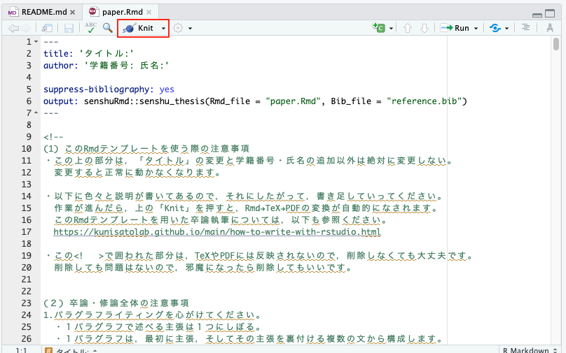
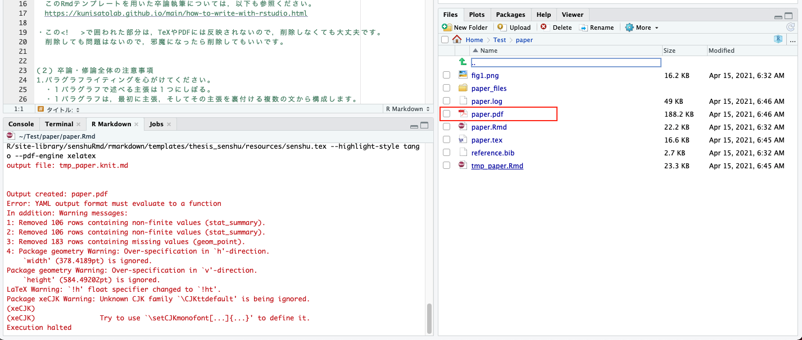
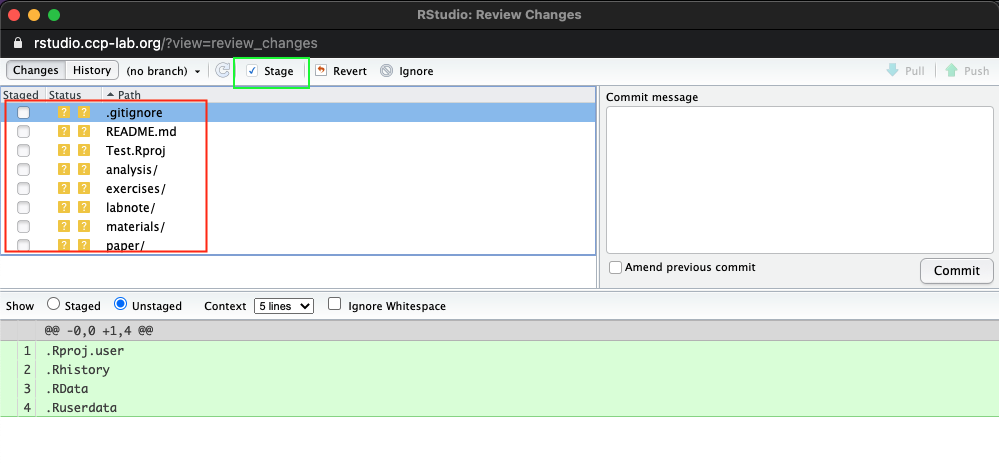

## 卒論・修論をRStudio上で執筆する理由

- SPSSなどの解析結果をWordやExcelにコピー＆ペーストするやり方だとどこかでミスが生じることがあります（間違った数値をコピペしてしまうなど）。R Markdown上で解析も執筆も一緒にやってしまえば，このようなミスはなくなります。
- 解析に修正が必要になった時に，R Markdown上で解析も執筆も一緒にやっておけば，すぐに修正が反映されて，ミスが減ります。
- 国里が作成した<a href="https://github.com/ykunisato/senshuRmd" target="_blank">senshuRmd</a>パッケージを使えば，最終的なフォーマット調整も引用文献処理も自動的にやってくれるので楽です。
- 研究指導でも，データやコードをいじりつつ検討ができて，有意義な研究指導が期待できます。
- GitHubでのバージョン管理もRStudio上で簡単にできます。
- 透明性の高い研究実践や仕事のやり方が身につきます

<br>

## senshuRmdパッケージを使ってみよう！

<a href="https://github.com/ykunisato/senshuRmd" target="_blank">senshuRmd</a>は，専修大学人間科学部心理学科での卒論・修論用にフォーマット調整をしたRMarkdownテンプレートになります。以下では，senshuRmdを既にインストールし(国里ゼミのRstudio serverには最初からインストールされています)，<a href="https://kunisatolab.github.io/main/how-to-github.html" target="_blank">GitHubの準備</a>もできているという前提ですすめます。


<br>

### 1.senshuRmdで卒論・修論のパッケージ化する

卒論・修論をやっているとたくさんファイルができちゃって混乱しますので，できるだけルールに従って卒論・修論をパッケージ化して作業をすすめていきます。(詳しくは，国里の<a href="https://psyarxiv.com/x8js5/" target="_blank">再現可能な心理学研究入門</a>の「4.2解析のパッケージ化」に書いてあるので，どこかで読んでおいてください)。フォルダ構成を決めた上で研究実施のパッケージ化をすることをResearch Compendiumと言います。本研究室では，以下のような，Research Compendiumを使います。

**研究室用Research Compendium**

- paper:卒論・修論用のRmdファイルが用意されています。
- analysis：解析用ファイルを入れる用のフォルダです。解析を実施する順番がわかるようにファイル名をつけましょう(analysis_01.Rmd,analysis_02.Rmdなど)。
- (analysis内) data：データ共有に関する同意と匿名化処理をした解析データを置くフォルダです。データだけでなく，その後前処理した後のデータ，長くかかる推定結果もここにおきます。どういうデータかわかるように名前をつけましょう（anonymized_data.csv，anonimized_preprocessed_data.csv，estimated_parameter.csvなど）。
- (analysis内) function：解析用Rの関数を入れるフォルダです。analysisフォルダ内のRmd内に書くには煩雑だったり，繰り返し使うような関数をおいておきます。これによって，analysisフォルダのコードが読みやすくなります。
- materials：研究で使った材料（調査票，実験課題）を入れるフォルダです。
- exercises：ゼミで行う演習課題用のフォルダです。
- labnote：ラボノートを保管するフォルダです。

<br>
上記の設定を手動でするは面倒なので，senshuRmdが自動でやってくれます。**RstudioのConsoleに以下のコードをコピペして実行してみましょう。**

```
senshuRmd::set_rc_ccp()
```

以下のような感じでフォルダができます。ゼミでは，このフォルダ構成を維持しつつ作業を行います。なんかいじっちゃってよくわからなくなったら，上記の研究室用Research Compendiumを確認ください。


<br>
<br>

### 2.senshuRmdで卒論・修論を執筆する

set_rc_ccp()を実行すると，README.mdとpaper.Rmdファイルが開くと思います。このREADME.mdは結構便利で，ここから色々なゼミで使う関数が実行できたりします。次にpaper.Rmdファイルをみると，謎のオレンジの波線がついています。これは，英語のスペルチェックが日本語にかかってしまっているので，英語のスペルチェックをとります。**Tools →　Global Options → SpellingのUse real time spell-checkingのチェックをとります。**これで日本語も問題なく使えます。


<br>

それでは，senshuRmdの卒論・修論用Rmdテンプレートを使ってみましょう。既に開いてあるpaper.Rmdファイル(これはpaperフォルダ内にあります）を見ましょう。**以下のような感じで，"タイトル"，"学籍番号:氏名"とあるので，まず自分の卒論タイトル（仮）と学籍番号氏名を書きましょう。**以降，緑色の字で色々と注意事項が書いてあります。この注意事項は，最終的な卒論ファイルには反映されませんので，邪魔でなければそのままおいておいてください。注意事項は，卒論をすすめる上で必要となる情報が結構はいっているので，必ず読んでください。


**"タイトル"，"学籍番号:氏名"を自分のものに書き換えられたら，以下で赤く囲われたKnitボタンをクリックしてみましょう！**しばらくRStudio上で処理がされます（初回はめちゃくちゃかかります）。



<br>

以下の右側の赤で囲ったように，paperフォルダ内にPDFファイルが出力されたら，成功です（左側のConsoleには，なんか赤字のエラー出ますが，問題ないです）。pape.pdfを開いてみてください。卒論・修論っぽいものができていると思います。以降は，このpaper.Rmdに書き込んでいって卒論・修論を完成させてください。



<br>
<br>

PDFファイルが出力されずにエラーがでる場合，なぜかうまく行かないことがあります。その場合は，以下のコマンドでtinytexをインストールください（大体うまくいきます）。tinytexのインストールでもうまくいかない場合は，```tinytex::tlmgr_install(‘ipaex’)```で日本語出力用フォントをインストールしてください。

```
tinytex::install_tinytex()
```

<br>

### 3.GitHubを使ったバージョン管理法について

ゼミでは，Githubを使ったバージョン管理を行っています。上記の作業をすると，Rstudioのgitというタブが以下のような感じになっていると思います。赤で囲われたCommitをクリックしてください。


<br>

以下のようなウィンドウが開かれたと思います。左側の赤で囲われたファイルやフォルダを全て選択してください。そのうえで，緑で囲われたStageをクリックします。


<br>

以下のような感じになったら，赤で囲われた場所にcommit messageを書いて，commitをしてください。


<br>

上手くいって，左側にファイルやフォルダがなくなったら，以下の赤で囲われた場所のPushをクリックします。適切にGithubの設定ができていたら，以下のような画面になるかと思います。これで，Rstudio serverでの作業内容がGithubにコミット＆プッシュできました。


<br>

Githubでリポジトリを確認すると以下のような感じになっているかと思います。確認をしてみてください。


<br>

Gitの作業をまとめると以下のような感じです。少し面倒にも感じるかもしれませんが，作業しているファイルのバージョンを管理して，いつでも戻れるように作業をすすめること，複数人で作業をするめるためのファイル管理法を学ぶことは，今後も重要になりますので，卒論・修論でぜひとも身につけてください。

- **作業開始時にGitタブのPull（下向きの矢印）をクリック**(Rstudio serverのファイルを最新にする)
- Rstudio serverで作業する
- **GitタブのCommitをクリック**
- **出てきたウィンドウでファイルを選んで，Stageをクリック**
- **Commit messageに作業内容を書く**（日本語でかまいません。「卒論の図を追加」とか分かりやすいものを追加ください）
- **その日の作業終了時にウィンドウの右上のPushをクリック**して，GitHubリポジトリに反映させる

<br>


### 4.引用文献に関する補足

卒論・修論の引用文献は，ご自身で手動で打ち込むこともできます。ただ，手動で打ち込むと，引用しているのに引用文献リストから向けていたり，引用をやめたのに引用文献リストに残っていたりと修正に伴う変更が反映されないということも起こります。


senshuRmdでは，bibtexを使って引用文献処理を自動化しています。senshuRmdのテンプレートにはreference.bibというファイルが含まれており（paperフォルダ内にあります），そこに文献の情報が保存されています。reference.bibを開いてみましょう。RMarkdownで卒論・修論を書いている時に，文献を引用する場合は，reference.bibファイルにある引用キーを使って引用します（引用キーは＠ARTICLE{の後ろに書いてあるものです）。引用の仕方としては，Kunisato2012という名前の引用キーの文献の場合，```@Kunisato2012```と引用すると，```Kunisato et al.(2012)```というように文頭で引用する形式になります。一方，```[@Kunisato2012]```のように[]でくくると，```(Kunisato et al., 2012)```というように文末引用の形式になります（複数ある場合は，```[@Kunisato2012; @Machino2014]```のようにします）。bibファイルを使って文献管理をすれば，本文中の引用も引用文献リストもAPA形式で自動的に作ってくれます(APA形式にするために，"apa-6th-edition.csl"を使います)。このように本文中に引用キーをいれておくと，本文中に自動的に引用情報をいれて，さらに，以下のように引用文献リストも出力してくれます。


<br>

このように便利なbibファイルを作る方法について説明します。bibファイルを開くと以下のように文献情報が含まれています。そして，この形式で文献情報をbibファイルに保存していきます。


<br>

論文が掲載されている雑誌でも書誌情報がbibtex形式で出力できることも多いですが，簡単なのは，Google scholarで検索して，文献の右端にある"Import into BibTeX"をクリックすれば良いです。クリックするとBibTeX形式で表示されますので，それをコピーして，reference.bibにペーストすればいいです。


<br>

上記の検索結果の上から２つ目の文献をBibTeX形式で表示すると以下のようになります。このまま登録してもいいのですが，一番最初の引用キー（本文での引用で使うキーです）は，kunisato2011personalityとなっており，ちょっと長いです。引用キーはbibファイル内の他の引用文献と重ならなければ良いので，kunisato2011aとかにしても良いです。

```
@article{kunisato2011personality,
  title={Personality traits and the amplitude of spontaneous low-frequency oscillations during resting state},
  author={Kunisato, Yoshihiko and Okamoto, Yasumasa and Okada, Go and Aoyama, Shiori and Nishiyama, Yoshiko and Onoda, Keiichi and Yamawaki, Shigeto},
  journal={Neuroscience Letters},
  volume={492},
  number={2},
  pages={109--113},
  year={2011},
  publisher={Elsevier}
}
```

<br>

日本語文献も同様に，CiNiiで検索して，引用したい論文の右側の方を見ると"BibTeXで表示"とあるので，そちらをクリックするとBibTeX形式で表示されます。これをGoogle Scholarと同様にコピー＆ペーストすればいいです。


<br>


国里の論文を適当に選んで，右の方にある「BibTeXで表示」をクリックすると以下のような内容が表示されるので，reference.bibにコピペします。

```
@article{130007749836,
author="国里, 愛彦 and 片平, 健太郎 and 沖村, 宰 and 山下, 祐一",
title="うつに対する計算論的アプローチ:―強化学習モデルの観点から―",
journal="心理学評論",
ISSN="0386-1058",
publisher="心理学評論刊行会",
year="2019",
month="",
volume="62",
number="1",
pages="88-103",
URL="https://ci.nii.ac.jp/naid/130007749836/",
DOI="10.24602/sjpr.62.1_88",
}
```


ただし，CiNiiの場合，引用キーがあまり意味のない記号の羅列のこともあるので，自分で分かりやすいものを設定してもよいです（bibファイル内で重複しないようにしてください）。上の場合だと，引用キーが130007749836になっているので，kunisato2019aなどに変更して登録しておくと良いかと思います。

**日本語文献の場合の注意：yomiを入れる**

日本語文献と英語文献とをアルファベット順で並べる場合に，日本語著者名をアルファベットにした並び替える必要があります。そこで，authorだけでなく，yomi=""を追加します。例えば，上記の例だと，yomi = "Kunisato, Yoshihiko, kentaro, katahira, tsukasa, okimura, yuichi, yamashita"となります。

上記の例に引用キーの変更とyomiの追加をすると以下のようになります。

```
@article{kunisato2019a,
author="国里, 愛彦 and 片平, 健太郎 and 沖村, 宰 and 山下, 祐一",
yomi = "Kunisato, Yoshihiko, kentaro, katahira, tsukasa, okimura, yuichi, yamashita",
title="うつに対する計算論的アプローチ:―強化学習モデルの観点から―",
journal="心理学評論",
ISSN="0386-1058",
publisher="心理学評論刊行会",
year="2019",
month="",
volume="62",
number="1",
pages="88-103",
URL="https://ci.nii.ac.jp/naid/130007749836/",
DOI="10.24602/sjpr.62.1_88",
}
```

<br>

このように，自分の引用したい文献のBibTeX形式の情報をbibファイルにどんどん追加していきつつ，本文で引用していくと，自動的に本文中に引用され，最後の引用文献リストにも反映されます(そして，本文での引用をやめると，引用文献リストから削除される)。

卒論・修論をRStudio上でRMarkdownを使って執筆することは，少し面倒くさそうに思えるかもしれませんが，卒論・修論でのフォーマット調整にかかる時間を短くすることができますし，解析と文章との距離が近くできるので，ミスもすくなる可能性が高いので，是非とも試してもらえると嬉しく思います。
