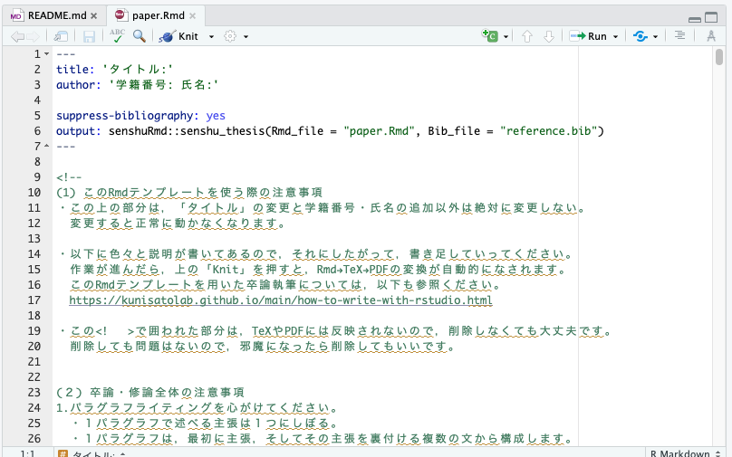

## なぜ卒論・修論をRStudio上で執筆するのか？

本研究室では，以下の理由から卒論・修論をRStudio上でRMarkdownを使って執筆することを推奨しています。

- SPSSやRで解析した結果を卒論のWordやExcelにコピー＆ペーストして整形するスタイルが多いと思います。しかし，そのコピー＆ペーストは100%合っていますか？その自信がない場合は，RMarkdown上で解析も執筆も一緒にやったほうが安心です（コピー＆ペーストが不要で，解析コードに間違いがあってもすぐに修正が反映されます）。

- 国里が作成したRMarkdownパッケージを使えば，最終的なフォーマット調整を自動的にやってくれる（表紙，目次，ページ番号などは自動ではいる，日本語文献以外は自動で文献も綺麗にしてくれる）。

- 国里が研究指導する場合もデータやコードをいじりつつ検討ができて，有意義な研究指導が期待できる。

- GitHubでのバージョン管理もRStudio上で簡単にできる。

- 透明性の高い研究実践や仕事のやり方が身につく

- 楽しい


<br>

## senshuRmdパッケージを使ってみよう！

卒論・修論をRStudio上でRMarkdownを使って執筆する上で，国里が作成した[senshuRmd](https://ykunisato.github.io/senshuRmd/index.html)が便利です。senshuRmdは，専修大学人間科学部心理学科での卒論・修論用にフォーマット調整をしたRMarkdownテンプレートになります。他の大学でも使えるかは微妙ですが，専修大学人間科学部心理学科の学生にとっては便利かと思います。

<br>

### 1.GitHubリポジトリの用意

本研究室ではGitHub上でバージョン管理をします。詳しくは，[こちら](https://kunisatolab.github.io/main/how-to-github.html)以下を参考に，国里が用意した空のリポジトリを自分の手元にもってきてください。[^1]

<br>

### 2.senshuRmdで卒論・修論のパッケージ化する


RStudio上でRMarkdownを使って卒論・修論を執筆する上で，卒論・修論のパッケージ化をすすめていくのが良いです。ファイルやフォルダが雑然とあるとわけがわからなくなるので，できるだけルールに従ってパッケージ化して作業をすすめていきます。詳しくは，国里が書いた[再現可能な心理学研究入門](https://psyarxiv.com/x8js5/)の特に「4.2解析のパッケージ化」を読んでください。パッケージ化に決まりは無いですが，本研究室では，以下のようなフォルダ構成で作業をすすめます。


- data　公開に関する同意と匿名化処理をしたデータを置くフォルダです。匿名化処理したデータだけでなく，その後前処理した後のデータ，長くかかる推定結果（その後さらに処理する予定のあるもの）もここにおきます。それぞれがどういうデータかわかるように名前をつけましょう（anonymized_data.csv，anonimized_preprocessed_data.csv，estimated_parameter.csvなど）。
- thesis(or氏名)　卒論・修論の本体のRmdファイルを置くフォルダです。
- analysis　統計解析で使うRmdファイルやRファイルを置くフォルダです。行う解析の順番がわかるようにファイル名をつけましょう(analysis_01.Rmd,analysis_02.Rmdなど)。なお，解析結果の図表を作るうえで必要なデータや出力は，上記のthesis(or氏名)フォルダに出力されるように設定しましょう(出力されたものをthesisフォルダ内のRmdファイルが読み込んで使う)。
- function　analysisフォルダには，卒論・修論で行う解析を順番に行えるように本筋の解析コードをおきますが，このfunctionフォルダには，analysisフォルダに書くには煩雑だったり，繰り返し使うような関数をおいておきます。これによって，analysisフォルダのコードが読みやすくなります。
- materials　研究で用いた材料（調査票，実験課題）をおくフォルダです。
- README.md　これらのフォルダについて第三者（そして未来の自分）が見て，わかるように説明をREADMEに書いてください。


<br>
では，早速使ってみましょう。まず，Rコンソール上でsenshuRmdを読み込みます。読み込まれない場合は，install_github()でインストールしてください。

```
library(senshuRmd)
# もしインストールされてない場合は，以下のコマンドでインストールする
# install.packages("devtools")
# devtools::install_github("ykunisato/senshuRmd")
```
次にset_rc_ccp()を使って，現在のワーキングディレクトリに上記の構成のフォルダと卒論・修論用のRmdテンプレートを作成します。なお，set_rc_ccp()だけでも動きますが，以下のように，"ローマ字の自分の名_ローマ字の自分の姓"を引数にいれておくと，上記のthesisフォルダが自分の名前になります。この方が分かりやすいので，こだわりがなければ，自分の名前をいれるようにしてください。

```
set_rc_ccp("yoshihiko_kunisato")
```
以下のような感じでフォルダができます。簡単にフォルダ構成ができますね。


<br>

### 3.senshuRmdで卒論・修論を執筆する

それでは，senshuRmdの卒論・修論用Rmdテンプレートを使ってみましょう。thesis(本研究室では名_姓)フォルダを開くと，thesis(本研究室では名_姓).Rmdというファイルがあるので，それを開きます。以下のような感じで，"タイトル"，"学籍番号:氏名"とあるので，まず自分の卒論タイトル（仮）と学籍番号氏名を書きましょう。以降，緑色の字で色々と注意事項が書いてあります。この注意事項は，最終的な卒論ファイルには反映されませんので，邪魔でなければそのままおいておいてください。注意事項は，卒論をすすめる上で必要となる情報が結構はいっているので，必ず読んでください。



まず，練習でKnitボタンをクリックしてみましょう！しばらくRStudio上で処理がされて，PDFファイルが出力されたら成功です。PDFファイルが提出用卒論と同じフォーマットになっているか確認をしてください[^2]。それでは，RStudioで楽しみながら，卒論・修論に取り組んでいきましょう！


[^1]:実際は，国里が作った各学生用のリポジトリで作業用ブランチを作って作業をします。作業に応じて，CommitとPushを繰り返していきます。そして，国里の卒論・修論チェックのタイミングでPull requestsをしてもらって，国里がチェックをします。詳細は，ゼミの時に説明をします。

[^2]:なお，senshuRmdはtinytexを使います。最新のtinytexが入っているか確認し，```tinytex::tlmgr_install(‘ipaex’)```で日本語出力用フォントをインストールしてください。

