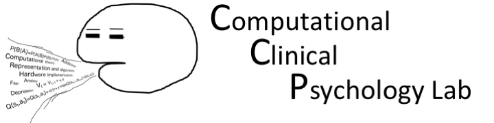

 

### 計算論的臨床心理学研究室へようこそ
計算論的臨床心理学研究室では，気分・不安障害のメカニズムに関する基礎研究，実証に基づく臨床心理実践のための研究，認知行動療法の効果をより高めるための研究を行っています。

 

2013年に専修大学に着任してから，「計算論的臨床心理学」を標榜してきましたが，もう少し関心を整理すると，計算論的個性記述心理学(computational idiographic psychology)になるのではないかと思っています(2024年)

 

### 大学院生・日本学術振興会特別研究員(PD)の募集
本研究室では，大学院進学に関する研究室訪問を積極的に受け入れています（詳細は[こちら](education.html)）。

また，日本学術振興会特別研究員(PD)の受け入れも積極的に行っています。ご自身の研究課題を，計算論的アプローチの観点からさらに深めてみたいとお考えの方は気軽にご連絡ください（過去の申請実績やどういうことができるのかなど，以下のメールフォームから気軽にお問い合わせください）。

 

### 連絡先
#### 〒214-8580 神奈川県川崎市多摩区東三田2-1-1
#### 専修大学人間科学部心理学科　 国里愛彦
#### [メールフォーム](https://docs.google.com/forms/d/e/1FAIpQLSeVb0_ti9flHyGcRQcLESQO7Tzl3eH5hbCqXyzcGh7RWLQexA/viewform)

