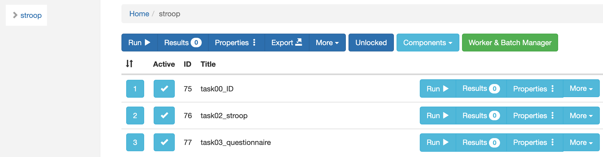

- 注意：以下の解説は，jsPsych6.1に基づいて書いています。後日7.1に対応させます。

JATOSはコンポーネントを組み合わせて１つの課題を作ることができます。以下のように，ID入力，Stroop課題，質問紙のようにコンポーネントに分けたうえで，１つの課題として実施ができます。具体的には，左上の「Run」を押すと，上から順番に実行されます（ウェブ実験でURLのリンクを配布する場合も同じです）。独立したコンポーネントを用意しておけば，あとは組み合わせでいろいろなバリエーションの課題を行うことができます。また，[jsPsychとlab.jsをまぜてJATOSで動かす](https://kunisatolab.github.io/main/how-to-labjs-jspsych-jatos.html)ことも可能です。



ただ，複数のコンポーネントを統合して課題を行った場合には少し工夫も必要です。以下の赤で囲った部分のResultsにjsPsychで設定した情報がJSON形式で保存され，出力して解析に利用できます。ただし，出力されたファイル内には，JATOS側で指定するWorker IDなどは含まれません（JATOS上では確認できますが，それが出力はされない）。また，jsPsych内で設定をしないかぎりはタスク名などの情報も含まれないので，Rなどで一括処理する際に若干不便です。さらに，匿名の参加者によるオンライン実験の場合は良いのですが，対面実験などでID入力をしてIDで対応づけをしたい場合もあるかと思います。その場合，以下のtask00_IDでIDを入力しても，それが次のtask02_stroopには入らないのでちょっと不便です。


そこで，JATOSで複数コンポーネントからなる課題を行う場合は，JATOSが用意している関数を用いてコンポーネント間でIDの対応づけをします。なお，JATOSの関数については，[JATOSのサイトのリファレンス](https://www.jatos.org/jatos.js-Reference.html)に詳しいです。思ったよりいろいろな関数が用意されていて，使いこなすと課題の幅が広がりそうです。


さて，具体的な関数について説明します。以下のように，survey-textを使って，参加者からID入力を求めるとします（対面実験で研究者が入力することもあるかと思います）。その際に，on_finishでJATOSの関数を用いてJATOS側のWorker IDや課題名を追加し，さらに入力したIDを他のコンポーネントでも使えるようにします。


```
var id = {
  type: 'survey-text',
  questions: [
    {prompt: '参加IDを記入して，「登録」を押してください', columns: 50, name: 'ID'}
  ],
  button_label: "登録",
  on_finish: function(data){
    var worker_ID = jatos.workerId;
    jsPsych.data.addProperties({workerID: worker_ID});
    var task_name = jatos.componentProperties.title;
    jsPsych.data.addProperties({taskName: task_name});
    var responses = JSON.parse(data.responses);
    subjectID = responses.ID;
    jsPsych.data.addProperties({participantCode: subjectID});
    jatos.studySessionData = subjectID;
  }
}
```

以下，それぞれ説明します。

まず，JATOS側で自動的に生成される参加者固有IDのWorkerIDをjsPsychのdataにいれます。jatos.workerIdでWorkerIDが取得できるので，それをJSON形式にしてjsPsych.data.addPropertieで保存します。
```
var worker_ID = jatos.workerId;
jsPsych.data.addProperties({workerID: worker_ID});
```

次に，JATOSで課題設定時につけたコンポーネント名をjsPsychのdataにいれます。jatos.componentProperties.titleでコンポーネント名が取得できるので，それをJSON形式にしてjsPsych.data.addPropertieで保存します。私はWorkerIDとコンポーネント名で解析の前処理ができたので良いのですが，他にもJATOS側から情報をもってくることができます。

```
var task_name = jatos.componentProperties.title;
jsPsych.data.addProperties({taskName: task_name});
```

最後に，今度は，参加者から得た反応をresponseにいれて，そこからIDを抽出してsubjectIDにいれて保存します。そして，そのsubjectIDをjatos.studySessionDataにいれることで，これ以降に実行されるコンポーネントでsubjectIDを受け取って利用できるようにします。

```
var responses = JSON.parse(data.responses);
subjectID = responses.ID;
jsPsych.data.addProperties({participantCode: subjectID});
jatos.studySessionData = subjectID;
```

その後に実行されてるコンポーネントでも，同様にWorkerIdとコンポーネント名を保存します。そして，jatos.studySessionDataの受け取りは，jatos.studySessionDataをinput_idにいれて，それをjsPsych側で保存しています。簡単ですね。

```
on_finish: function(data){
  var worker_ID = jatos.workerId;
  jsPsych.data.addProperties({workerID: worker_ID});
  var task_name = jatos.componentProperties.title;
  jsPsych.data.addProperties({taskName: task_name});
  var input_id = jatos.studySessionData; 
  jsPsych.data.addProperties({inputID: input_id});
}
```

ちょっと面倒な気もしなくもないですが，このような一手間をかけておくと，あとでJATOSから出力される結果をRで処理する際の処理が随分と楽になるかと思います。特にウェブ実験で参加者が多い場合には，とても楽になるかと思います。